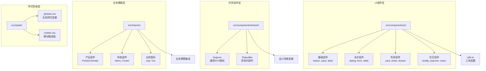
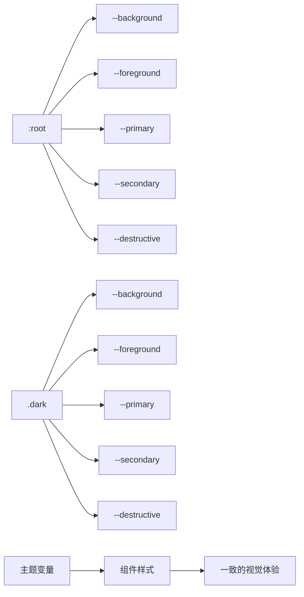
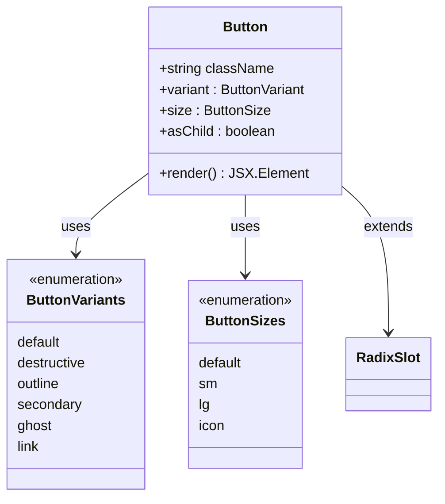
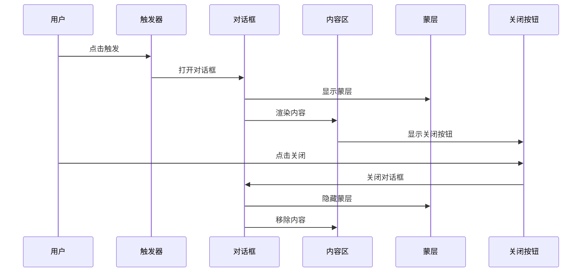
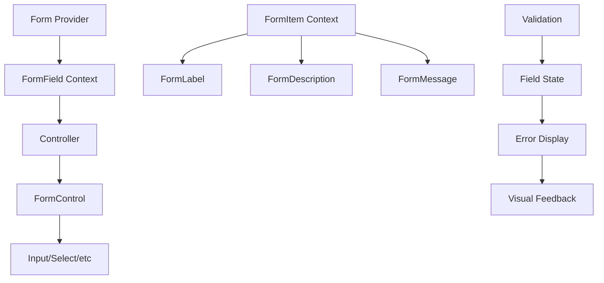
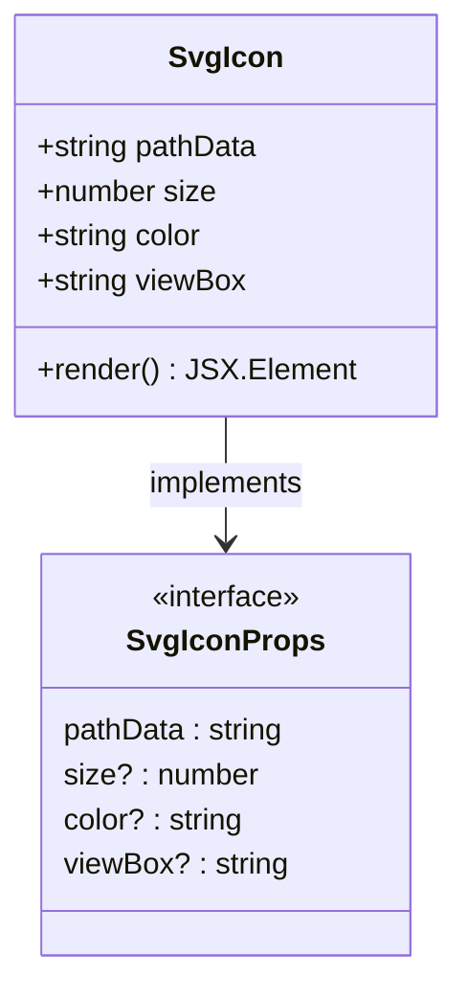
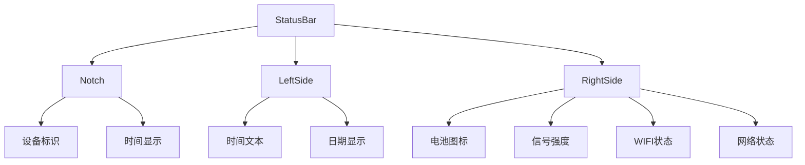
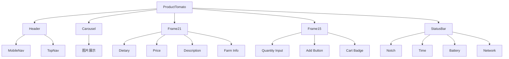
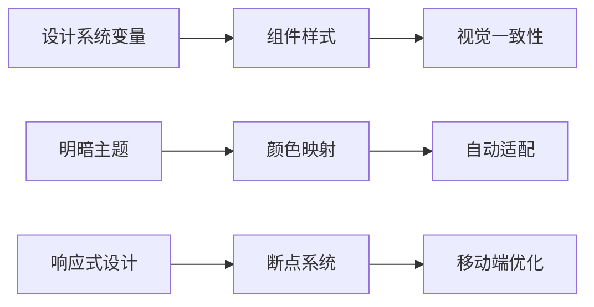

# UI组件库

<cite>
**本文档引用的文件**
- [src/components/ui/button.tsx](file://src/components/ui/button.tsx)
- [src/components/ui/dialog.tsx](file://src/components/ui/dialog.tsx)
- [src/components/ui/form.tsx](file://src/components/ui/form.tsx)
- [src/components/ui/utils.ts](file://src/components/ui/utils.ts)
- [src/components/shared/SvgIcon.tsx](file://src/components/shared/SvgIcon.tsx)
- [src/components/shared/StatusBar.tsx](file://src/components/shared/StatusBar.tsx)
- [src/imports/ProductTomato.tsx](file://src/imports/ProductTomato.tsx)
- [src/styles/globals.css](file://src/styles/globals.css)
- [package.json](file://package.json)
</cite>

## 目录
1. [简介](#简介)
2. [项目结构](#项目结构)
3. [核心组件体系](#核心组件体系)
4. [设计系统架构](#设计系统架构)
5. [详细组件分析](#详细组件分析)
6. [共享组件](#共享组件)
7. [业务图标与模板](#业务图标与模板)
8. [主题与样式系统](#主题与样式系统)
9. [使用指南](#使用指南)
10. [最佳实践](#最佳实践)

## 简介

本项目构建了一个基于React和TypeScript的现代化UI组件库，采用Radix UI作为基础组件库，结合Tailwind CSS实现高度可定制的设计系统。该组件库专为购物应用设计，提供了完整的用户界面解决方案，包括基础控件、表单组件、对话框、导航组件等。

组件库的核心设计理念是：
- **可复用性**：所有组件都设计为可在不同页面和场景中重复使用
- **无障碍支持**：严格遵循Web无障碍标准，确保所有用户都能正常使用
- **主题一致性**：通过统一的设计系统变量保证视觉风格的一致性
- **类型安全**：完整的TypeScript支持，提供编译时类型检查
- **性能优化**：基于React 18的新特性，优化渲染性能

## 项目结构

UI组件库采用模块化的组织结构，主要分为以下几个层次：



**图表来源**
- [src/components/ui/button.tsx](file://src/components/ui/button.tsx#L1-L59)
- [src/components/shared/SvgIcon.tsx](file://src/components/shared/SvgIcon.tsx#L1-L30)
- [src/imports/ProductTomato.tsx](file://src/imports/ProductTomato.tsx#L1-L715)

## 核心组件体系

### 基础组件

基础组件是最小的可复用单元，提供基本的UI元素功能：

- **按钮组件** (`button.tsx`)：支持多种变体和尺寸，具有无障碍特性
- **输入框组件** (`input.tsx`)：标准化的文本输入体验
- **标签组件** (`label.tsx`)：与表单控件关联的标签
- **复选框组件** (`checkbox.tsx`)：多选和单选功能
- **开关组件** (`switch.tsx`)：二进制状态切换

### 复合组件

复合组件由多个基础组件组合而成，提供更复杂的功能：

- **对话框组件** (`dialog.tsx`)：模态窗口容器，支持标题、描述、操作按钮
- **表单组件** (`form.tsx`)：基于react-hook-form的表单管理
- **卡片组件** (`card.tsx`)：内容容器，支持头部、主体、底部
- **表格组件** (`table.tsx`)：数据展示和交互

### 布局组件

布局组件负责页面的整体结构和空间分配：

- **抽屉组件** (`drawer.tsx`)：侧边栏或弹出式内容区域
- **工作表组件** (`sheet.tsx`)：移动端友好的滑动面板
- **滚动区域** (`scroll-area.tsx`)：自定义滚动条的容器
- **分隔器** (`resizable.tsx`)：可调整大小的分割面板

### 交互组件

交互组件提供用户与界面的动态交互：

- **工具提示** (`tooltip.tsx`)：悬停显示的辅助信息
- **气泡框** (`popover.tsx`)：弹出式内容容器
- **上下文菜单** (`context-menu.tsx`)：右键菜单
- **导航菜单** (`navigation-menu.tsx`)：主导航结构

**章节来源**
- [src/components/ui/button.tsx](file://src/components/ui/button.tsx#L1-L59)
- [src/components/ui/dialog.tsx](file://src/components/ui/dialog.tsx#L1-L136)
- [src/components/ui/form.tsx](file://src/components/ui/form.tsx#L1-L169)

## 设计系统架构

### 主题变量系统

设计系统基于CSS自定义属性实现主题切换，支持明暗两种模式：



**图表来源**
- [src/styles/globals.css](file://src/styles/globals.css#L1-L185)

### 颜色系统

系统定义了完整的色彩语义体系：

- **主色调** (`--primary`)：品牌主色，用于主要操作按钮
- **强调色** (`--secondary`)：次要操作，用于辅助按钮
- **危险色** (`--destructive`)：删除、取消等危险操作
- **背景色** (`--background`)：页面背景
- **前景色** (`--foreground`)：文字和主要元素

### 字体系统

采用现代字体系统，支持响应式字体大小：

- **默认字体**：14px，基于OKLCH色彩空间
- **字体权重**：中等(500)和正常(400)
- **响应式排版**：基于根元素字体大小自动调整

### 间距系统

基于圆角值(`--radius: 0.625rem`)建立的间距系统：

- **微调**：`calc(var(--radius) - 4px)`
- **小型**：`calc(var(--radius) - 2px)`
- **中型**：`var(--radius)` (1rem)
- **大型**：`calc(var(--radius) + 4px)`

**章节来源**
- [src/styles/globals.css](file://src/styles/globals.css#L1-L185)

## 详细组件分析

### 按钮组件分析

按钮组件是UI系统中最常用的组件之一，采用了class-variance-authority库实现变体系统：



**图表来源**
- [src/components/ui/button.tsx](file://src/components/ui/button.tsx#L8-L30)

#### 变体系统设计

按钮组件支持六种不同的视觉变体：

1. **默认变体** (`default`)：主色调背景，白色文字
2. **破坏性变体** (`destructive`)：红色背景，用于危险操作
3. **轮廓变体** (`outline`)：透明背景，带边框
4. **次要变体** (`secondary`)：次要色调背景
5. **幽灵变体** (`ghost`)：透明背景，仅在悬停时显示效果
6. **链接变体** (`link`)：无背景，带下划线

#### 尺寸系统

支持四种尺寸配置：

- **默认**：标准尺寸，适合大多数场景
- **小型**：紧凑尺寸，节省空间
- **大型**：扩展尺寸，突出重要操作
- **图标**：仅包含图标的紧凑尺寸

#### 无障碍特性

- **焦点状态**：清晰的键盘导航焦点指示
- **禁用状态**：适当的视觉反馈和交互限制
- **ARIA属性**：正确的角色和状态声明
- **SVG支持**：内嵌SVG图标自动处理

**章节来源**
- [src/components/ui/button.tsx](file://src/components/ui/button.tsx#L1-L59)

### 对话框组件分析

对话框组件是一个复杂的复合组件，展示了组件库的高级设计模式：



**图表来源**
- [src/components/ui/dialog.tsx](file://src/components/ui/dialog.tsx#L1-L136)

#### 组件层次结构

对话框组件由多个子组件组成：

1. **根组件** (`Dialog`)：控制整体状态
2. **触发器** (`DialogTrigger`)：打开对话框的入口
3. **门户组件** (`DialogPortal`)：确保在DOM顶层渲染
4. **蒙层组件** (`DialogOverlay`)：半透明背景遮罩
5. **内容组件** (`DialogContent`)：实际对话框内容
6. **标题组件** (`DialogTitle`)：对话框标题
7. **描述组件** (`DialogDescription`)：辅助说明文字
8. **页脚组件** (`DialogFooter`)：操作按钮区域

#### 动画系统

使用CSS动画实现流畅的进入和退出效果：

- **淡入淡出**：蒙层的透明度变化
- **缩放动画**：对话框的尺寸过渡
- **延迟效果**：按顺序显示各个元素

#### 无障碍支持

- **焦点管理**：自动聚焦到第一个可交互元素
- **ESC键关闭**：按下ESC键关闭对话框
- **Tab键循环**：在对话框内循环焦点
- **屏幕阅读器**：正确的语义标记和描述

**章节来源**
- [src/components/ui/dialog.tsx](file://src/components/ui/dialog.tsx#L1-L136)

### 表单组件分析

表单组件系统基于react-hook-form实现，提供了完整的表单管理解决方案：



**图表来源**
- [src/components/ui/form.tsx](file://src/components/ui/form.tsx#L1-L169)

#### 上下文系统

表单组件使用React Context实现数据共享：

1. **FormFieldContext**：存储字段名称
2. **FormItemContext**：存储唯一ID
3. **FormContext**：整个表单的状态

#### 错误处理机制

- **实时验证**：输入时即时验证
- **错误消息**：清晰的错误提示信息
- **视觉反馈**：错误状态的颜色变化
- **ARIA属性**：错误状态的无障碍支持

#### 自动化功能

- **ID生成**：自动生成唯一的表单元素ID
- **标签绑定**：自动将标签与输入框关联
- **描述绑定**：辅助文本的正确关联
- **错误绑定**：错误消息的无障碍访问

**章节来源**
- [src/components/ui/form.tsx](file://src/components/ui/form.tsx#L1-L169)

## 共享组件

### SVG图标组件

SvgIcon组件提供了一个简单而强大的SVG图标解决方案：



**图表来源**
- [src/components/shared/SvgIcon.tsx](file://src/components/shared/SvgIcon.tsx#L1-L30)

#### 特性与优势

- **参数化设计**：支持动态尺寸、颜色和视窗设置
- **类型安全**：完整的TypeScript接口定义
- **性能优化**：静态SVG路径，避免运行时计算
- **可复用性**：可在任何需要图标的地方使用

#### 使用示例

```typescript
// 基本使用
<SvgIcon pathData="M10 10L20 20" />

// 自定义尺寸和颜色
<SvgIcon 
  pathData="M10 10L20 20" 
  size={24} 
  color="#ff0000" 
/>
```

**章节来源**
- [src/components/shared/SvgIcon.tsx](file://src/components/shared/SvgIcon.tsx#L1-L30)

### 状态栏组件

StatusBar组件模拟iOS设备的状态栏，提供完整的系统UI体验：



**图表来源**
- [src/components/shared/StatusBar.tsx](file://src/components/shared/StatusBar.tsx#L1-L91)

#### 技术实现

- **SVG路径**：使用预定义的SVG路径数据
- **CSS定位**：精确的绝对定位控制布局
- **响应式设计**：适应不同屏幕尺寸
- **主题适配**：根据系统主题自动调整颜色

#### 组件结构

1. **Notch组件**：设备的刘海部分
2. **LeftSide组件**：左侧的时间和日期信息
3. **RightSide组件**：右侧的电池、信号和网络状态

**章节来源**
- [src/components/shared/StatusBar.tsx](file://src/components/shared/StatusBar.tsx#L1-L91)

## 业务图标与模板

### 产品组件系统

业务图标和模板组件专门针对特定业务场景设计，以产品详情页为例：



**图表来源**
- [src/imports/ProductTomato.tsx](file://src/imports/ProductTomato.tsx#L1-L715)

#### 组件设计原则

1. **业务导向**：紧密贴合具体业务需求
2. **模块化**：独立的功能模块便于复用
3. **可定制**：支持参数化配置
4. **类型安全**：完整的TypeScript支持

#### 技术特色

- **SVG路径管理**：集中管理复杂的SVG路径数据
- **CSS类名系统**：基于命名约定的样式管理
- **组件组合**：通过组合实现复杂界面
- **响应式布局**：适应不同设备尺寸

**章节来源**
- [src/imports/ProductTomato.tsx](file://src/imports/ProductTomato.tsx#L1-L715)

## 主题与样式系统

### CSS自定义属性系统

设计系统基于CSS自定义属性实现主题切换，支持明暗两种模式：



**图表来源**
- [src/styles/globals.css](file://src/styles/globals.css#L1-L185)

#### 变量定义

系统定义了超过20个核心设计变量：

- **颜色变量**：背景、文字、主色、强调色等
- **尺寸变量**：字体大小、圆角、间距等
- **状态变量**：悬停、激活、禁用等状态样式
- **图表变量**：图表颜色系列

#### 主题切换机制

- **CSS选择器**：`.dark`类控制主题切换
- **变量覆盖**：暗色主题覆盖对应的颜色变量
- **渐进增强**：不支持CSS变量的浏览器降级处理
- **JavaScript控制**：通过JavaScript动态切换主题

#### Tailwind CSS集成

- **自定义变体**：支持暗色主题的自定义变体
- **设计令牌**：将CSS变量映射为Tailwind类
- **实用优先**：结合Tailwind的实用类使用
- **性能优化**：Tree-shaking移除未使用的样式

**章节来源**
- [src/styles/globals.css](file://src/styles/globals.css#L1-L185)

## 使用指南

### 基本使用方法

#### 安装依赖

```bash
npm install @radix-ui/react-dialog @radix-ui/react-form react-hook-form
```

#### 引入组件

```typescript
// 单个组件引入
import { Button } from "@/components/ui/button";
import { Dialog, DialogContent } from "@/components/ui/dialog";

// 批量引入
import * as UI from "@/components/ui";
```

#### 基本使用示例

```typescript
// 按钮使用
<Button variant="default" size="lg">
  点击我
</Button>

// 对话框使用
<Dialog>
  <DialogTrigger>打开对话框</DialogTrigger>
  <DialogContent>
    <DialogTitle>标题</DialogTitle>
    <DialogDescription>描述信息</DialogDescription>
    <DialogFooter>
      <Button>确认</Button>
      <Button variant="outline">取消</Button>
    </DialogFooter>
  </DialogContent>
</Dialog>
```

### Props接口说明

#### Button组件

```typescript
interface ButtonProps {
  variant?: "default" | "destructive" | "outline" | "secondary" | "ghost" | "link";
  size?: "default" | "sm" | "lg" | "icon";
  asChild?: boolean;
  className?: string;
  // ...其他原生button属性
}
```

#### Dialog组件

```typescript
interface DialogProps {
  open?: boolean;
  onOpenChange?: (open: boolean) => void;
  defaultOpen?: boolean;
}

interface DialogContentProps {
  className?: string;
  children?: React.ReactNode;
  // ...其他原生div属性
}
```

#### Form组件

```typescript
interface FormProps {
  resolver?: any;
  defaultValues?: any;
  values?: any;
  onValuesChange?: (values: any) => void;
  onDirtyChange?: (isDirty: boolean) => void;
  disabled?: boolean;
  submitFocusError?: boolean;
  shouldFocusError?: boolean;
}
```

### 定制方法

#### 修改组件外观

```typescript
// 使用className覆盖样式
<Button className="rounded-full shadow-lg">
  圆角按钮
</Button>

// 使用Tailwind类
<Button className="bg-blue-500 hover:bg-blue-600">
  蓝色按钮
</Button>
```

#### 创建自定义组件

```typescript
// 基于现有组件创建
import { Button, buttonVariants } from "@/components/ui/button";

const CustomButton = ({ children, ...props }) => (
  <button className={buttonVariants({
    variant: "default",
    size: "lg",
    className: "custom-class",
    ...props
  })}>
    {children}
  </button>
);
```

#### 主题定制

```typescript
// 在globals.css中修改变量
:root {
  --background: #f0f0f0;
  --foreground: #333333;
  --primary: #0066cc;
  --radius: 0.5rem;
}
```

## 最佳实践

### 组件使用规范

#### 1. 优先使用官方组件

```typescript
// ✅ 推荐：使用官方组件
import { Button } from "@/components/ui/button";

// ❌ 不推荐：自己实现
const CustomButton = ({ children, ...props }) => (
  <button className="btn btn-primary" {...props}>{children}</button>
);
```

#### 2. 正确使用变体系统

```typescript
// ✅ 推荐：明确指定变体
<Button variant="destructive">删除</Button>
<Button variant="outline">取消</Button>

// ❌ 不推荐：使用CSS类
<Button className="!bg-red-500">删除</Button>
```

#### 3. 合理使用尺寸

```typescript
// ✅ 推荐：根据场景选择尺寸
<Button size="icon"><Icon /></Button>
<Button size="sm">小按钮</Button>
<Button size="lg">大按钮</Button>

// ❌ 不推荐：随意使用尺寸
<Button size="xl">超大按钮</Button>
```

### 性能优化建议

#### 1. 懒加载非关键组件

```typescript
// 使用React.lazy实现懒加载
const LazyDialog = lazy(() => import('@/components/ui/dialog'));

const Component = () => (
  <Suspense fallback={<div>加载中...</div>}>
    <LazyDialog />
  </Suspense>
);
```

#### 2. 避免不必要的重新渲染

```typescript
// ✅ 推荐：使用useMemo和useCallback
const memoizedValue = useMemo(() => expensiveCalculation(), [deps]);
const memoizedCallback = useCallback(() => handleClick(), [deps]);

// ❌ 不推荐：每次渲染都重新计算
const value = expensiveCalculation();
const callback = () => handleClick();
```

#### 3. 合理使用CSS-in-JS

```typescript
// ✅ 推荐：使用Tailwind CSS
<div className="text-lg font-bold text-primary">

// ❌ 不推荐：大量使用styled-components
const StyledDiv = styled.div`
  font-size: 1.25rem;
  font-weight: bold;
  color: var(--primary);
`;
```

### 无障碍设计指南

#### 1. 确保键盘导航

```typescript
// ✅ 推荐：支持Tab键导航
<Button tabIndex={0}>可聚焦按钮</Button>

// ❌ 不推荐：阻止键盘事件
<Button onKeyDown={(e) => e.preventDefault()}>
```

#### 2. 提供足够的对比度

```typescript
// ✅ 推荐：使用高对比度颜色
<Button className="bg-blue-600 text-white">

// ❌ 不推荐：低对比度颜色
<Button className="bg-gray-100 text-gray-300">
```

#### 3. 添加ARIA属性

```typescript
// ✅ 推荐：添加必要的ARIA属性
<Button 
  aria-label="删除项目"
  aria-describedby="delete-help"
>
  删除
</Button>
<p id="delete-help">这将永久删除该项目</p>
```

### 测试策略

#### 1. 单元测试

```typescript
// 测试组件渲染
test('Button renders correctly', () => {
  render(<Button>Click me</Button>);
  expect(screen.getByText('Click me')).toBeInTheDocument();
});

// 测试交互行为
test('Button click triggers callback', () => {
  const handleClick = jest.fn();
  render(<Button onClick={handleClick}>Click me</Button>);
  
  fireEvent.click(screen.getByText('Click me'));
  expect(handleClick).toHaveBeenCalledTimes(1);
});
```

#### 2. 辅助功能测试

```typescript
// 测试键盘导航
test('Button receives keyboard focus', () => {
  render(<Button>Focusable</Button>);
  const button = screen.getByRole('button');
  
  fireEvent.keyDown(button, { key: 'Tab' });
  expect(button).toHaveFocus();
});
```

#### 3. 可访问性测试

```typescript
// 使用axe-core进行可访问性测试
test('Button meets accessibility standards', () => {
  const { container } = render(<Button>Accessible</Button>);
  const results = axe(container);
  expect(results).toHaveNoViolations();
});
```

### 维护与更新

#### 1. 版本管理

```typescript
// 在package.json中锁定版本
{
  "dependencies": {
    "@radix-ui/react-dialog": "^1.1.6",
    "@radix-ui/react-button": "^1.1.6"
  }
}
```

#### 2. 文档维护

```markdown
# Button组件文档

## 基本用法
```typescript
<Button variant="default">默认按钮</Button>
```

## 属性列表
- `variant`: 按钮变体
- `size`: 按钮尺寸
- `disabled`: 是否禁用
```

#### 3. 代码审查

- **类型检查**：确保所有组件都有正确的TypeScript类型
- **样式一致性**：检查CSS类名和样式是否符合规范
- **无障碍性**：验证组件是否满足无障碍标准
- **性能影响**：评估组件对整体性能的影响

通过遵循这些最佳实践，可以确保UI组件库的高质量、可维护性和用户体验。组件库不仅提供了丰富的功能，更重要的是建立了统一的设计语言和开发规范，为团队协作和项目长期发展奠定了坚实的基础。