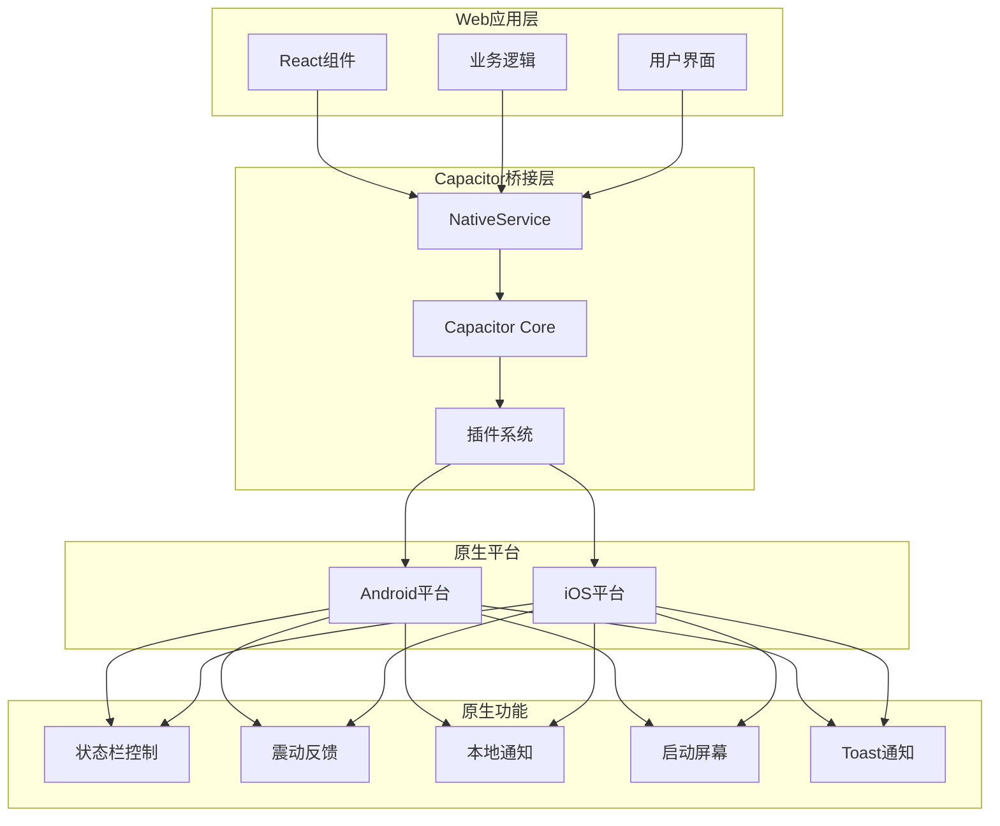
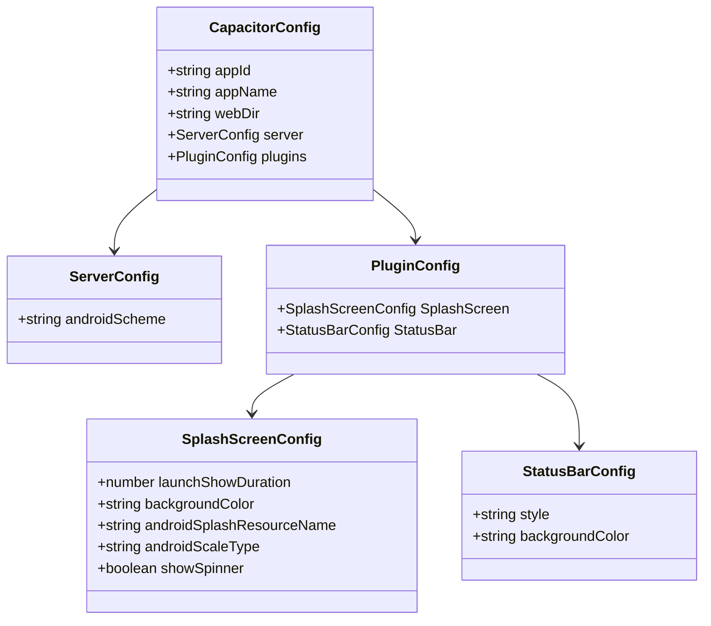
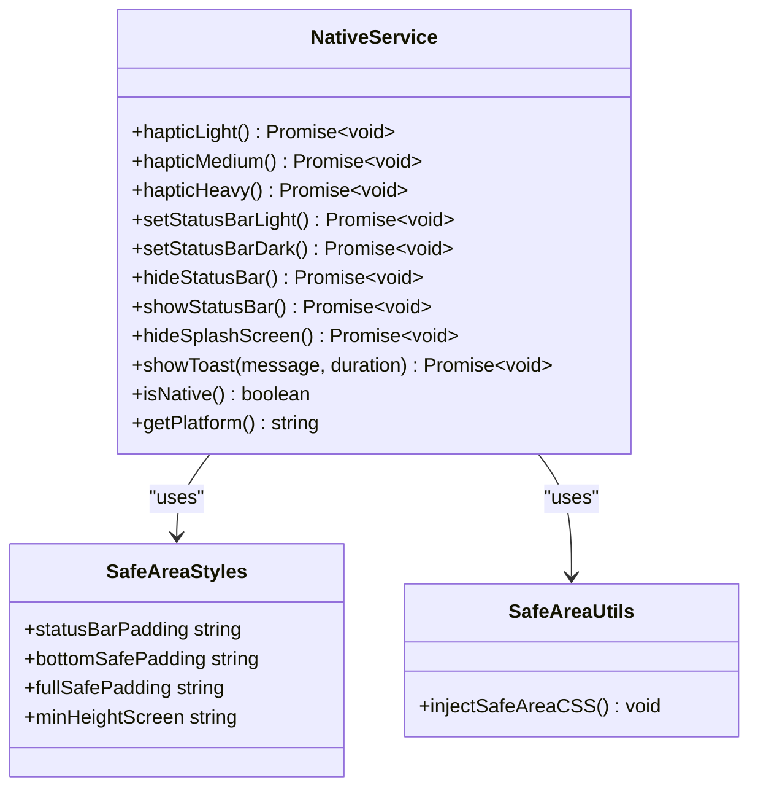
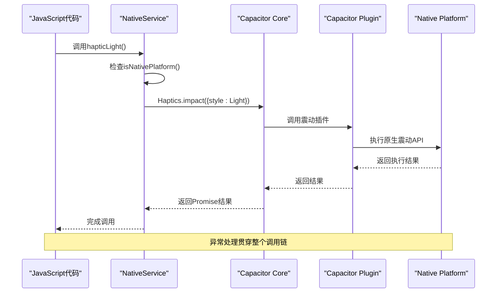

# 原生功能集成

<cite>
**本文档引用的文件**
- [capacitor.config.json](file://capacitor.config.json)
- [android/app/src/main/AndroidManifest.xml](file://android/app/src/main/AndroidManifest.xml)
- [src/utils/nativeService.ts](file://src/utils/nativeService.ts)
- [src/components/TodayPage.tsx](file://src/components/TodayPage.tsx)
- [android/app/src/main/assets/capacitor.plugins.json](file://android/app/src/main/assets/capacitor.plugins.json)
- [android/app/src/main/assets/capacitor.config.json](file://android/app/src/main/assets/capacitor.config.json)
- [CAPACITOR_SUMMARY.md](file://CAPACITOR_SUMMARY.md)
- [android/app/src/main/assets/public/assets/web-0MT92ySo.js](file://android/app/src/main/assets/public/assets/web-0MT92ySo.js)
</cite>

## 目录
1. [简介](#简介)
2. [项目结构概览](#项目结构概览)
3. [Capacitor配置分析](#capacitor配置分析)
4. [原生服务封装](#原生服务封装)
5. [权限管理](#权限管理)
6. [调用链分析](#调用链分析)
7. [实际使用示例](#实际使用示例)
8. [混合架构优势与限制](#混合架构优势与限制)
9. [扩展开发指南](#扩展开发指南)
10. [故障排除](#故障排除)

## 简介

本项目展示了如何通过Capacitor框架实现Web应用与原生平台的深度集成。项目采用React技术栈，通过Capacitor提供了丰富的原生功能支持，包括状态栏控制、震动反馈、本地通知、启动屏幕管理等核心功能。

Capacitor作为现代混合应用开发框架，允许开发者使用Web技术构建跨平台应用，同时能够访问原生设备功能。本项目通过精心设计的原生服务封装层，实现了从JavaScript调用到原生执行的完整流程。

## 项目结构概览



**图表来源**
- [src/utils/nativeService.ts](file://src/utils/nativeService.ts#L1-L180)
- [capacitor.config.json](file://capacitor.config.json#L1-L22)

## Capacitor配置分析

### 核心配置文件

项目的核心配置位于两个位置：根目录的`capacitor.config.json`和Android资产目录中的配置文件。这两个配置文件保持同步，确保配置的一致性。



**图表来源**
- [capacitor.config.json](file://capacitor.config.json#L1-L22)
- [android/app/src/main/assets/capacitor.config.json](file://android/app/src/main/assets/capacitor.config.json#L1-L22)

### 插件配置详解

项目配置了多个核心插件，每个插件都针对特定的原生功能：

1. **启动屏幕插件**：控制应用启动时的显示效果
   - 显示时长：2000毫秒
   - 背景色：白色
   - Android资源名称：splash
   - 缩放类型：CENTER_CROP
   - 不显示旋转指示器

2. **状态栏插件**：管理应用状态栏的外观
   - 初始样式：DARK（深色）
   - 背景色：白色

**章节来源**
- [capacitor.config.json](file://capacitor.config.json#L1-L22)
- [android/app/src/main/assets/capacitor.config.json](file://android/app/src/main/assets/capacitor.config.json#L1-L22)

## 原生服务封装

### NativeService类架构

NativeService是项目中负责封装所有原生功能的核心类，它提供了统一的接口来访问Capacitor的各种原生插件。



**图表来源**
- [src/utils/nativeService.ts](file://src/utils/nativeService.ts#L7-L180)

### 核心功能实现

#### 震动反馈系统

项目实现了三种级别的震动反馈，每种都有不同的强度和应用场景：

```typescript
// 轻度震动 - 适用于普通操作反馈
static async hapticLight() {
  if (Capacitor.isNativePlatform()) {
    try {
      await Haptics.impact({ style: ImpactStyle.Light });
    } catch (error) {
      console.warn('Haptic feedback not available:', error);
    }
  }
}

// 中度震动 - 适用于重要操作确认
static async hapticMedium() {
  if (Capacitor.isNativePlatform()) {
    try {
      await Haptics.impact({ style: ImpactStyle.Medium });
    } catch (error) {
      console.warn('Haptic feedback not available:', error);
    }
  }
}

// 重度震动 - 适用于紧急或重要操作
static async hapticHeavy() {
  if (Capacitor.isNativePlatform()) {
    try {
      await Haptics.impact({ style: ImpactStyle.Heavy });
    } catch (error) {
      console.warn('Haptic feedback not available:', error);
    }
  }
}
```

#### 状态栏控制

状态栏控制功能允许动态调整应用的状态栏外观：

```typescript
// 设置浅色状态栏
static async setStatusBarLight() {
  if (Capacitor.isNativePlatform()) {
    try {
      await StatusBar.setStyle({ style: Style.Light });
    } catch (error) {
      console.warn('Status bar control not available:', error);
    }
  }
}

// 设置深色状态栏
static async setStatusBarDark() {
  if (Capacitor.isNativePlatform()) {
    try {
      await StatusBar.setStyle({ style: Style.Dark });
    } catch (error) {
      console.warn('Status bar control not available:', error);
    }
  }
}
```

#### 安全区域适配

项目还实现了完整的安全区域适配系统，支持各种现代移动设备的屏幕类型：

```typescript
export const SafeAreaStyles = {
  // 为状态栏留出空间
  statusBarPadding: Capacitor.isNativePlatform() ? 'pt-safe-top' : 'pt-0',
  
  // 为底部导航栏/Home指示器留出空间
  bottomSafePadding: Capacitor.isNativePlatform() ? 'pb-safe-bottom' : 'pb-0',
  
  // 完整的安全区域内边距
  fullSafePadding: Capacitor.isNativePlatform() ? 'pt-safe-top pb-safe-bottom' : '',
  
  // 最小高度（考虑安全区域）
  minHeightScreen: Capacitor.isNativePlatform() ? 'min-h-screen-safe' : 'min-h-screen',
};
```

**章节来源**
- [src/utils/nativeService.ts](file://src/utils/nativeService.ts#L7-L180)

## 权限管理

### Android权限配置

项目在`AndroidManifest.xml`中声明了必要的权限，这些权限是原生功能正常工作的基础：

```xml
<!-- 网络访问权限 -->
<uses-permission android:name="android.permission.INTERNET" />

<!-- 震动反馈权限 -->
<uses-permission android:name="android.permission.VIBRATE" />

<!-- 推送通知权限 -->
<uses-permission android:name="android.permission.POST_NOTIFICATIONS" />

<!-- 保持应用活跃 -->
<uses-permission android:name="android.permission.WAKE_LOCK" />

<!-- 网络状态检查 -->
<uses-permission android:name="android.permission.ACCESS_NETWORK_STATE" />
```

### 权限作用说明

1. **INTERNET权限**：确保应用能够进行网络通信，这对于大多数原生功能（如推送通知）都是必需的
2. **VIBRATE权限**：启用震动反馈功能，这是用户体验的重要组成部分
3. **POST_NOTIFICATIONS权限**：允许应用发送本地通知，需要在Android 13+上显式请求
4. **WAKE_LOCK权限**：保持CPU运行，防止应用在后台被系统休眠
5. **ACCESS_NETWORK_STATE权限**：监控网络连接状态，优化应用行为

**章节来源**
- [android/app/src/main/AndroidManifest.xml](file://android/app/src/main/AndroidManifest.xml#L37-L44)

## 调用链分析

### JavaScript到原生的完整调用链



**图表来源**
- [src/utils/nativeService.ts](file://src/utils/nativeService.ts#L10-L25)
- [android/app/src/main/assets/public/assets/web-0MT92ySo.js](file://android/app/src/main/assets/public/assets/web-0MT92ySo.js#L1-L10)

### 插件注册机制

Capacitor通过`capacitor.plugins.json`文件管理已安装的插件及其对应的Java类：

```json
[
  {
    "pkg": "@capacitor/haptics",
    "classpath": "com.capacitorjs.plugins.haptics.HapticsPlugin"
  },
  {
    "pkg": "@capacitor/local-notifications",
    "classpath": "com.capacitorjs.plugins.localnotifications.LocalNotificationsPlugin"
  },
  {
    "pkg": "@capacitor/status-bar",
    "classpath": "com.capacitorjs.plugins.statusbar.StatusBarPlugin"
  }
]
```

**章节来源**
- [android/app/src/main/assets/capacitor.plugins.json](file://android/app/src/main/assets/capacitor.plugins.json#L1-L27)

## 实际使用示例

### 任务完成时的震动反馈

在`TodayPage.tsx`组件中，项目展示了如何在用户完成任务时触发震动反馈：

```typescript
// 在任务完成按钮点击时触发轻度震动
<motion.button
  onClick={async (e) => {
    e.stopPropagation();
    await NativeService.hapticLight();  // 触发震动反馈
    onToggleCompletion(task.id);
  }}
  className={`w-5 h-5 rounded-full border-2 flex items-center justify-center`}
  whileTap={{ scale: 0.9 }}
>
  <Check className="h-3 w-3" />
</motion.button>
```

### 重要性切换时的震动反馈

```typescript
// 在切换任务重要性时触发轻度震动
<motion.button
  onClick={async (e) => {
    e.stopPropagation();
    await NativeService.hapticLight();  // 触发震动反馈
    onToggleImportance(task.id);
  }}
  className={`p-1.5 rounded-full ${task.important ? 'text-yellow-500' : 'text-gray-400 hover:text-yellow-500'}`}
  whileTap={{ scale: 0.9 }}
>
  <Star className={`h-5 w-5 ${task.important ? 'fill-current' : ''}`} />
</motion.button>
```

### 任务固定时的中度震动

```typescript
// 在长按固定任务时触发中度震动
const handleTaskLongPress = async (task: Task) => {
  // 标记长按已激活
  isLongPressActivated.current = true;
  
  // 触发原生震动反馈
  await NativeService.hapticMedium();  // 触发中度震动
  
  onToggleFixed(task.id);
  setPressingTaskId(null);
};
```

### 状态栏动态控制

```typescript
// 在应用启动时设置深色状态栏
useEffect(() => {
  const initNativeFeatures = async () => {
    if (NativeService.isNative()) {
      await NativeService.setStatusBarDark();
      await NativeService.hideSplashScreen();
    }
  };
  
  initNativeFeatures();
}, []);
```

**章节来源**
- [src/components/TodayPage.tsx](file://src/components/TodayPage.tsx#L350-L370)
- [src/components/TodayPage.tsx](file://src/components/TodayPage.tsx#L370-L390)
- [src/components/TodayPage.tsx](file://src/components/TodayPage.tsx#L120-L140)

## 混合架构优势与限制

### 优势分析

1. **开发效率提升**
   - 使用熟悉的Web技术栈（React、TypeScript）
   - 快速迭代和热重载开发体验
   - 单一代码库维护多个平台

2. **原生功能丰富**
   - 访问设备硬件功能（震动、传感器等）
   - 利用平台特定的UI组件
   - 支持推送通知和后台任务

3. **性能表现良好**
   - 原生渲染性能优于纯Web应用
   - 减少JavaScript运行时开销
   - 更好的电池续航

4. **生态系统完善**
   - 丰富的第三方插件支持
   - 活跃的社区和持续更新
   - 完善的文档和教程资源

### 限制与挑战

1. **平台差异处理**
   - 不同平台的API行为可能有细微差异
   - 需要额外的条件判断和适配代码
   - 测试成本较高

2. **调试复杂度**
   - 需要理解JavaScript和原生代码的交互
   - 调试工具链相对复杂
   - 性能问题定位困难

3. **更新维护成本**
   - 需要同步管理Web和原生两套代码
   - 版本兼容性问题
   - 第三方依赖的版本锁定

4. **功能限制**
   - 某些原生功能可能无法完全映射到Web
   - 性能受限于WebView的实现
   - 内存占用相对较高

## 扩展开发指南

### 添加新Capacitor插件

1. **安装插件**
```bash
npm install @capacitor/plugin-name
npx cap sync
```

2. **更新配置文件**
编辑`capacitor.config.json`添加插件配置：
```json
{
  "plugins": {
    "NewPlugin": {
      "configKey": "configValue"
    }
  }
}
```

3. **创建服务封装**
```typescript
export class NewPluginService {
  static async newFeature(param: string) {
    if (Capacitor.isNativePlatform()) {
      try {
        await NewPlugin.newFeature({ param });
      } catch (error) {
        console.warn('New plugin feature not available:', error);
      }
    }
  }
}
```

### 编写自定义原生代码

1. **创建原生插件**
```java
@CapacitorPlugin(
    name = "CustomPlugin",
    permissions = {
        @Permission(strings = { Manifest.permission.CAMERA }, alias = "camera")
    }
)
public class CustomPlugin extends Plugin {
    @PluginMethod
    public void customMethod(PluginCall call) {
        String param = call.getString("param");
        // 实现原生逻辑
        call.resolve();
    }
}
```

2. **注册插件**
在`capacitor.plugins.json`中添加：
```json
{
  "pkg": "custom-plugin",
  "classpath": "com.example.CustomPlugin"
}
```

### 最佳实践建议

1. **错误处理**
```typescript
static async safeCall<T>(
  operation: () => Promise<T>,
  fallback: T = undefined
): Promise<T> {
  if (!Capacitor.isNativePlatform()) {
    return fallback;
  }
  
  try {
    return await operation();
  } catch (error) {
    console.warn('Native operation failed:', error);
    return fallback;
  }
}
```

2. **平台检测**
```typescript
static isIOS(): boolean {
  return Capacitor.getPlatform() === 'ios';
}

static isAndroid(): boolean {
  return Capacitor.getPlatform() === 'android';
}
```

3. **异步操作管理**
```typescript
static async batchOperations(operations: (() => Promise<void>)[]) {
  if (!Capacitor.isNativePlatform()) {
    return;
  }
  
  const promises = operations.map(op => op().catch(console.error));
  await Promise.all(promises);
}
```

## 故障排除

### 常见问题及解决方案

1. **插件未找到错误**
```
Error: Plugin "PluginName" not found
```
**解决方案**：
- 确保插件已正确安装
- 运行`npx cap sync`
- 检查`capacitor.plugins.json`配置

2. **权限拒绝**
```
Error: Permission denied
```
**解决方案**：
- 检查AndroidManifest.xml中的权限声明
- 对于Android 6.0+，需要运行时请求权限
- 确保应用具有相应的权限

3. **震动功能失效**
**解决方案**：
- 检查VIBRATE权限是否正确声明
- 确认设备支持震动功能
- 验证震动模式参数的有效性

4. **状态栏控制无效**
**解决方案**：
- 确认StatusBar插件已正确安装
- 检查状态栏样式参数
- 验证应用的主题配置

### 调试技巧

1. **启用详细日志**
```typescript
console.log('Native platform:', Capacitor.isNativePlatform());
console.log('Current platform:', Capacitor.getPlatform());
```

2. **检查插件可用性**
```typescript
try {
  await StatusBar.setStyle({ style: Style.Light });
  console.log('Status bar control successful');
} catch (error) {
  console.error('Status bar control failed:', error);
}
```

3. **平台特定调试**
```typescript
if (Capacitor.getPlatform() === 'android') {
  // Android特定调试代码
} else if (Capacitor.getPlatform() === 'ios') {
  // iOS特定调试代码
}
```

通过本文档的详细分析，开发者可以全面了解项目如何通过Capacitor实现Web应用与原生平台的深度集成。从配置管理到具体功能实现，从调用链分析到最佳实践指导，为后续的功能扩展和维护提供了完整的参考框架。