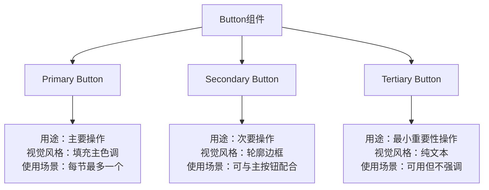
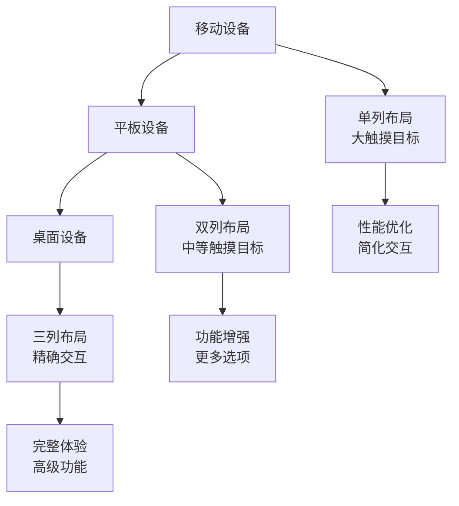
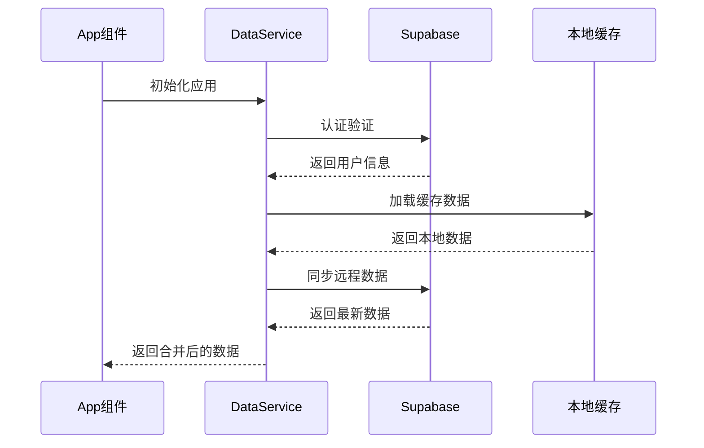
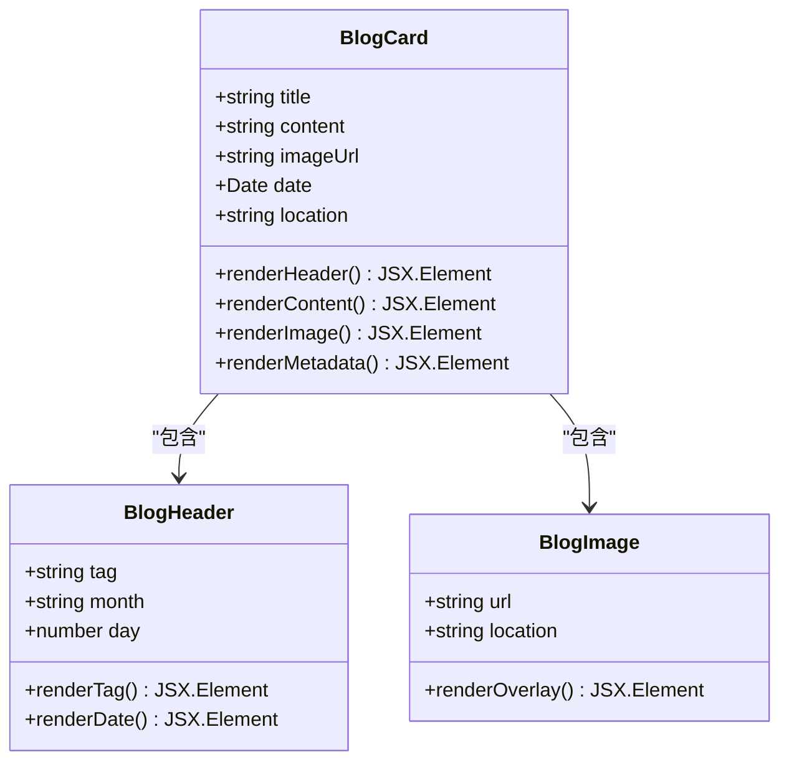
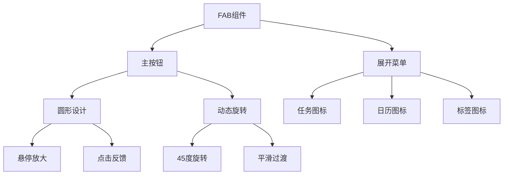

# 开发指南

<cite>
**本文档引用的文件**
- [Guidelines.md](file://src/guidelines/Guidelines.md)
- [blog_view.md](file://src/guidelines/blog_view.md)
- [fab2_view.md](file://src/guidelines/fab2_view.md)
- [rule.md](file://rule.md)
- [App.tsx](file://src/App.tsx)
- [dataService.tsx](file://src/utils/dataService.tsx)
- [BlogDetailPage.tsx](file://src/components/BlogDetailPage.tsx)
- [FloatingActionButton.tsx](file://src/components/FloatingActionButton.tsx)
- [TodayPage.tsx](file://src/components/TodayPage.tsx)
- [button.tsx](file://src/components/ui/button.tsx)
</cite>

## 目录
1. [项目概述](#项目概述)
2. [设计系统规范](#设计系统规范)
3. [页面布局原则](#页面布局原则)
4. [状态管理实践](#状态管理实践)
5. [TypeScript类型使用规范](#typescript类型使用规范)
6. [代码组织约定](#代码组织约定)
7. [特定视图设计模式](#特定视图设计模式)
8. [项目特定规则](#项目特定规则)
9. [编码最佳实践](#编码最佳实践)
10. [代码审查清单](#代码审查清单)
11. [性能优化建议](#性能优化建议)
12. [故障排除指南](#故障排除指南)

## 项目概述

本项目是一个现代化的Todo应用程序，采用React + TypeScript技术栈，集成了Supabase作为后端服务。项目遵循严格的开发规范，确保代码质量和用户体验的一致性。

### 核心特性
- **响应式设计**：完全适配移动设备和桌面浏览器
- **离线支持**：智能缓存机制确保离线可用性
- **实时同步**：通过Supabase实现数据实时同步
- **现代化UI**：基于Tailwind CSS和Radix UI组件库

## 设计系统规范

### 基础设计原则

项目严格遵循以下设计系统原则：

#### 字体规范
- **基础字体大小**：14px
- **标题字体**：使用系统UI字体或Inter、Manrope等现代无衬线字体
- **字重规范**：
  - 正常文本：`font-weight: 400`
  - 中等粗细：`font-weight: 500`
  - 粗体：`font-weight: 700`

#### 颜色系统
- **主色调**：Indigo Blue (#5D5FEF)
- **辅助颜色**：根据功能定义的颜色方案
- **状态颜色**：
  - 成功：绿色 (#10B981)
  - 警告：橙色 (#F59E0B)
  - 错误：红色 (#EF4444)
  - 信息：蓝色 (#3B82F6)

#### 组件变体


**图表来源**
- [Guidelines.md](file://src/guidelines/Guidelines.md#L40-L62)

### 布局规范

#### 页面容器
- **最大宽度**：1200px
- **内边距**：16px（移动端）/ 24px（桌面端）
- **间距系统**：基于8px网格系统

#### 导航元素
- **底部工具栏**：最多4个图标项
- **浮动操作按钮**：避免与底部工具栏同时使用
- **面包屑导航**：简洁明了，不超过3层

## 页面布局原则

### 响应式设计策略

项目采用移动优先的响应式设计方法：



### 布局组件

#### 卡片组件
项目广泛使用卡片组件来展示内容：

```typescript
// 卡片组件的基本结构
interface CardProps {
  variant?: 'default' | 'outline' | 'shadow';
  className?: string;
  children: React.ReactNode;
}

// 现代博客卡片示例
const ModernBlogCard = () => (
  <div className="bg-white rounded-[28px] p-6 shadow-[0_12px_24px_-4px_rgba(0,0,0,0.1)]">
    {/* 卡片内容 */}
  </div>
);
```

**章节来源**
- [blog_view.md](file://src/guidelines/blog_view.md#L1-L88)

## 状态管理实践

### 全局状态管理

项目采用React Hooks进行状态管理，结合自定义的数据服务：



**图表来源**
- [App.tsx](file://src/App.tsx#L100-L200)
- [dataService.tsx](file://src/utils/dataService.tsx#L1-L100)

### 状态管理模式

#### 1. 组件内部状态
```typescript
// 使用useState管理简单状态
const [isExpanded, setIsExpanded] = useState(false);
const [searchTerm, setSearchTerm] = useState("");
```

#### 2. 上下文状态
```typescript
// 使用useContext管理共享状态
const { user, tasks, dispatch } = useAppState();
```

#### 3. 数据服务状态
```typescript
// 通过DataService管理复杂状态
const dataService = new DataService();

// 异步数据获取
const tasks = await dataService.getTasks();
```

**章节来源**
- [App.tsx](file://src/App.tsx#L150-L300)
- [dataService.tsx](file://src/utils/dataService.tsx#L200-L400)

## TypeScript类型使用规范

### 类型定义原则

#### 1. 接口命名规范
- 使用PascalCase命名接口
- 描述性名称，避免缩写
- 明确类型范围

```typescript
interface Task {
  id: number | string;
  title: string;
  description: string;
  listId: number;
  dueDate: Date;
  startTime: string;
  duration: number;
  isFixed: boolean;
  completed: boolean;
  important: boolean;
  isMyDay: boolean;
  notes: string;
  subtasks?: Array<{
    id: number;
    title: string;
    completed: boolean;
  }>;
}
```

#### 2. 类型别名使用
```typescript
// 定义联合类型
type ViewMode = "today" | "lists" | "calendar" | "review" | "checkin";

// 定义可选属性
interface User {
  id: string;
  email: string;
  name: string;
  onboarding_completed: boolean;
  created_at?: string;
  updated_at?: string;
}
```

#### 3. 泛型使用
```typescript
// 使用泛型提高组件复用性
interface Props<T> {
  items: T[];
  renderItem: (item: T) => React.ReactNode;
}

const ListView = <T extends { id: string }>({ items, renderItem }: Props<T>) => {
  return (
    <div>
      {items.map(item => renderItem(item))}
    </div>
  );
};
```

**章节来源**
- [dataService.tsx](file://src/utils/dataService.tsx#L10-L50)
- [App.tsx](file://src/App.tsx#L50-L100)

## 代码组织约定

### 文件结构规范

```
src/
├── components/           # 可复用组件
│   ├── ui/             # UI组件库
│   ├── shared/         # 共享组件
│   └── [功能模块]/     # 功能特定组件
├── utils/              # 工具函数
├── types/              # 类型定义
├── styles/             # 样式文件
└── guidelines/         # 设计规范
```

### 组件命名规范

#### 1. 组件文件命名
- 使用PascalCase命名
- 描述性名称，体现功能
- 避免通用名称如"Utils.tsx"

#### 2. 组件导出规范
```typescript
// 默认导出组件
export default function MyComponent() { /* ... */ }

// 命名导出辅助函数
export const helperFunction = () => { /* ... */ };
```

#### 3. 组件结构规范
```typescript
// 1. 导入声明
import React, { useState } from "react";
import { Button } from "./ui/button";

// 2. 接口定义
interface MyComponentProps {
  title: string;
  onClick: () => void;
}

// 3. 组件实现
export default function MyComponent({ title, onClick }: MyComponentProps) {
  const [count, setCount] = useState(0);
  
  return (
    <div>
      <h1>{title}</h1>
      <button onClick={onClick}>Click me</button>
    </div>
  );
}
```

**章节来源**
- [TodayPage.tsx](file://src/components/TodayPage.tsx#L1-L50)
- [button.tsx](file://src/components/ui/button.tsx#L1-L59)

## 特定视图设计模式

### 现代博客卡片模式

项目实现了参考blog_view.md设计的现代博客卡片组件：



**图表来源**
- [BlogDetailPage.tsx](file://src/components/BlogDetailPage.tsx#L100-L200)

#### 博客卡片特性
- **圆角设计**：28px的大圆角营造柔和外观
- **阴影效果**：微妙的垂直阴影提升层次感
- **内边距**：24px的宽松内边距
- **分层结构**：清晰的头部、内容、图片、元数据层次

### 浮动操作按钮模式

基于fab2_view.md设计的扩展浮动操作按钮：



**图表来源**
- [FloatingActionButton.tsx](file://src/components/FloatingActionButton.tsx#L1-L88)

#### FAB设计特点
- **形状组合**：圆形基底+垂直矩形菜单
- **统一色彩**：鲜艳靛蓝(#5D5FEF)
- **软阴影**：明显的浮动效果
- **图标风格**：线条艺术，圆角处理

**章节来源**
- [FloatingActionButton.tsx](file://src/components/FloatingActionButton.tsx#L1-L88)

## 项目特定规则

### 代码风格规则

#### 1. 代码格式化
- 使用Prettier进行代码格式化
- Tab宽度：2空格
- 行尾：LF换行符
- 最大行长度：120字符

#### 2. 导入顺序
```typescript
// 1. React核心
import React, { useState, useEffect } from "react";

// 2. 第三方库
import { motion } from "framer-motion";
import { toast } from "sonner";

// 3. 本地组件
import { Button } from "./ui/button";
import { Badge } from "./ui/badge";

// 4. 工具函数
import { formatDate } from "../utils/format";

// 5. 类型定义
import { Task } from "../types/task";
```

#### 3. 命名约定
- **变量**：camelCase
- **常量**：UPPER_SNAKE_CASE
- **组件**：PascalCase
- **文件**：PascalCase

### UI/UX规则

#### 1. 动画规范
- 使用`framer-motion`进行所有动画
- 动画持续时间：0.2-0.5秒
- 缓动函数：`anticipate`或`easeInOut`
- 有意义的动画：避免无目的的动画

#### 2. 响应式设计
- 移动优先：首先设计移动端体验
- 断点：375px、768px、1024px、1440px
- 触摸目标：最小44px×44px
- 内边距：至少16px

#### 3. 可访问性
- 使用ARIA属性
- 支持键盘导航
- 颜色对比度：至少4.5:1
- 屏幕阅读器友好

**章节来源**
- [rule.md](file://rule.md#L1-L72)

## 编码最佳实践

### 避免直接操作DOM

项目严格避免直接操作DOM，使用React的声明式编程范式：

```typescript
// ❌ 避免：直接操作DOM
document.getElementById("myElement").style.display = "none";

// ✅ 推荐：使用React状态
const [isVisible, setIsVisible] = useState(true);

return (
  <div style={{ display: isVisible ? "block" : "none" }}>
    我的内容
  </div>
);
```

### 合理使用React Hooks

#### 1. Hook使用原则
- 钩子必须在组件顶层调用
- 避免在循环、条件或嵌套函数中调用钩子
- 保持Hook调用顺序一致

```typescript
// ✅ 正确的Hook使用
export default function MyComponent() {
  const [count, setCount] = useState(0);
  const [loading, setLoading] = useState(true);
  
  useEffect(() => {
    loadData();
  }, []);
  
  return <div>{count}</div>;
}
```

#### 2. 自定义Hook封装
```typescript
// 自定义Hook封装复杂逻辑
function useLocalStorage<T>(key: string, initialValue: T): [T, (value: T) => void] {
  const readValue = useCallback(() => {
    const item = window.localStorage.getItem(key);
    return item ? JSON.parse(item) : initialValue;
  }, [key]);

  const setValue = useCallback((value: T) => {
    window.localStorage.setItem(key, JSON.stringify(value));
  }, [key]);

  return [readValue(), setValue];
}
```

### 处理异步操作

#### 1. 错误处理
```typescript
// 使用try-catch处理异步操作
const fetchData = async () => {
  try {
    const data = await api.getData();
    setData(data);
  } catch (error) {
    setError(error.message);
    console.error("数据加载失败:", error);
  }
};
```

#### 2. 加载状态管理
```typescript
// 明确的加载状态
const [isLoading, setIsLoading] = useState(true);
const [error, setError] = useState<string | null>(null);

const loadData = async () => {
  setIsLoading(true);
  setError(null);
  
  try {
    const data = await api.getData();
    setData(data);
  } catch (error) {
    setError("加载失败");
  } finally {
    setIsLoading(false);
  }
};
```

#### 3. 并发控制
```typescript
// 防止竞态条件
let cancel = false;

const fetchData = async () => {
  cancel = false;
  
  try {
    const data = await api.getData();
    if (!cancel) {
      setData(data);
    }
  } catch (error) {
    if (!cancel) {
      setError(error.message);
    }
  }
};

// 组件卸载时取消请求
useEffect(() => {
  return () => {
    cancel = true;
  };
}, []);
```

**章节来源**
- [dataService.tsx](file://src/utils/dataService.tsx#L300-L500)
- [App.tsx](file://src/App.tsx#L200-L400)

## 代码审查清单

### 代码质量检查

#### 1. 类型安全
- [ ] 所有组件都有正确的类型定义
- [ ] 接口字段完整且准确
- [ ] 避免使用any类型
- [ ] 正确使用Optional Chaining

#### 2. 性能优化
- [ ] 避免不必要的re-render
- [ ] 合理使用useMemo和useCallback
- [ ] 防抖和节流的正确使用
- [ ] 图片懒加载的实现

#### 3. 错误处理
- [ ] 所有异步操作都有错误处理
- [ ] 用户友好的错误提示
- [ ] 控制台错误的适当处理
- [ ] 网络错误的优雅降级

#### 4. 可访问性
- [ ] ARIA属性的正确使用
- [ ] 键盘导航支持
- [ ] 屏幕阅读器兼容性
- [ ] 颜色对比度检查

### 代码风格检查

#### 1. 语法规范
- [ ] 导入语句排序
- [ ] 分号使用一致性
- [ ] 字符串引号使用
- [ ] 空格和缩进

#### 2. 命名规范
- [ ] 变量和函数命名清晰
- [ ] 常量命名符合规范
- [ ] 组件命名描述性强
- [ ] 文件命名一致性

#### 3. 文档注释
- [ ] 复杂函数有JSDoc注释
- [ ] 组件有使用说明
- [ ] 接口有字段说明
- [ ] 枚举有用途描述

## 性能优化建议

### 1. 组件优化

#### 使用React.memo
```typescript
// 对于纯组件使用memo
const OptimizedComponent = memo(({ data }: Props) => {
  return <div>{data}</div>;
});
```

#### 使用useMemo和useCallback
```typescript
// 缓存计算结果
const expensiveValue = useMemo(() => {
  return computeExpensiveValue(props.data);
}, [props.data]);

// 缓存回调函数
const handleClick = useCallback(() => {
  doSomething();
}, [dependencies]);
```

### 2. 数据加载优化

#### 实现智能缓存
```typescript
// 缓存策略示例
const useCachedData = (key: string, fetcher: () => Promise<any>) => {
  const [data, setData] = useState<any>(null);
  const [loading, setLoading] = useState(true);
  
  useEffect(() => {
    const cached = localStorage.getItem(key);
    if (cached) {
      setData(JSON.parse(cached));
      setLoading(false);
    }
    
    fetcher().then(result => {
      localStorage.setItem(key, JSON.stringify(result));
      setData(result);
      setLoading(false);
    });
  }, [key, fetcher]);
  
  return { data, loading };
};
```

### 3. 渲染优化

#### 虚拟滚动
```typescript
// 对于大量数据使用虚拟滚动
const VirtualizedList = ({ items }: { items: Item[] }) => {
  return (
    <VirtualList
      itemCount={items.length}
      itemSize={50}
      overscanCount={5}
    >
      {({ index, style }) => (
        <div style={style}>
          {items[index]}
        </div>
      )}
    </VirtualList>
  );
};
```

## 故障排除指南

### 常见问题及解决方案

#### 1. 状态不同步问题
**问题**：组件状态与实际数据不一致
**解决方案**：
- 检查数据服务的同步逻辑
- 确保正确的错误处理
- 验证网络连接状态

```typescript
// 检查数据同步状态
const checkSyncStatus = async () => {
  const isOnline = navigator.onLine;
  const lastSync = dataService.getLastSyncTime();
  
  if (!isOnline) {
    console.warn("离线状态，数据可能不同步");
  }
  
  if (lastSync) {
    const age = Date.now() - lastSync.getTime();
    if (age > 5 * 60 * 1000) { // 5分钟
      console.warn("数据同步超过5分钟，可能存在延迟");
    }
  }
};
```

#### 2. 性能问题
**问题**：组件渲染缓慢或卡顿
**解决方案**：
- 使用React DevTools Profiler分析
- 检查不必要的re-render
- 优化大型列表渲染

#### 3. 离线功能问题
**问题**：离线状态下功能异常
**解决方案**：
- 检查本地存储权限
- 验证缓存数据完整性
- 测试网络切换场景

```typescript
// 离线功能测试
const testOfflineMode = () => {
  // 模拟离线状态
  window.dispatchEvent(new Event('offline'));
  
  // 验证功能正常
  expect(isFeatureAvailable()).toBe(true);
  
  // 模拟在线状态
  window.dispatchEvent(new Event('online'));
};
```

#### 4. 认证问题
**问题**：用户认证状态异常
**解决方案**：
- 检查Supabase配置
- 验证token有效性
- 重置认证状态

```typescript
// 认证状态诊断
const diagnoseAuth = async () => {
  const session = await supabase.auth.getSession();
  const user = supabase.auth.user();
  
  console.log("Session:", session);
  console.log("User:", user);
  
  if (!session || !user) {
    console.error("认证状态异常");
    return false;
  }
  
  return true;
};
```

### 调试工具和技巧

#### 1. 开发者工具
- 使用React DevTools检查组件树
- 利用Redux DevTools调试状态
- 使用Network面板监控API请求

#### 2. 日志记录
```typescript
// 结构化日志记录
const log = {
  debug: (message: string, data?: any) => {
    console.debug(`[${new Date().toISOString()}] DEBUG: ${message}`, data);
  },
  error: (message: string, error?: any) => {
    console.error(`[${new Date().toISOString()}] ERROR: ${message}`, error);
  }
};
```

#### 3. 性能监控
```typescript
// 性能指标收集
const measurePerformance = (operation: string, fn: () => any) => {
  const start = performance.now();
  const result = fn();
  const end = performance.now();
  
  console.log(`${operation} took ${end - start} milliseconds`);
  return result;
};
```

通过遵循这些开发指南和最佳实践，团队可以确保代码质量、用户体验和项目可持续性。定期回顾和更新这些规范，以适应项目的发展和技术的进步。