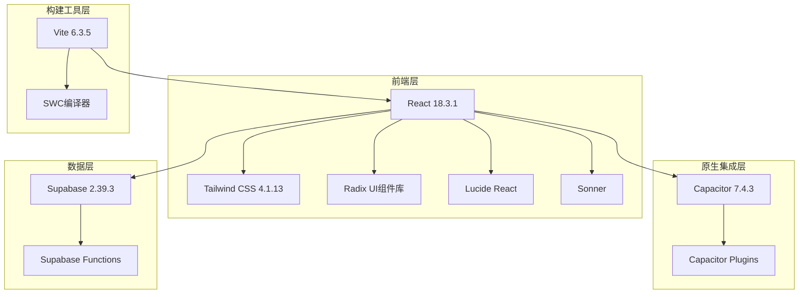
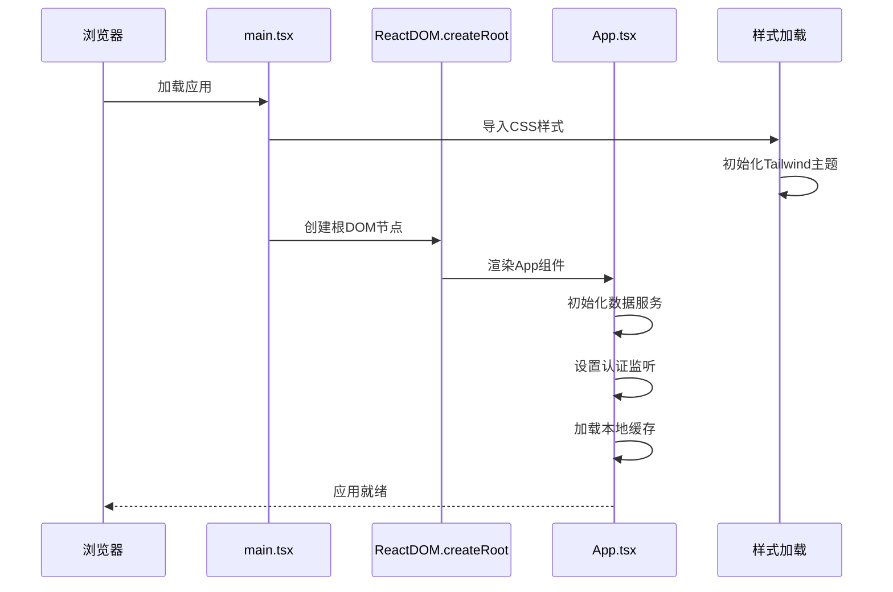
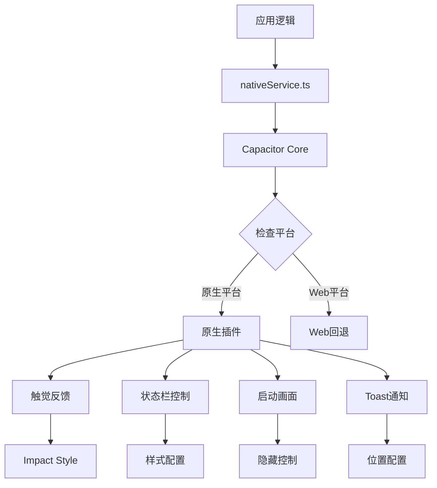
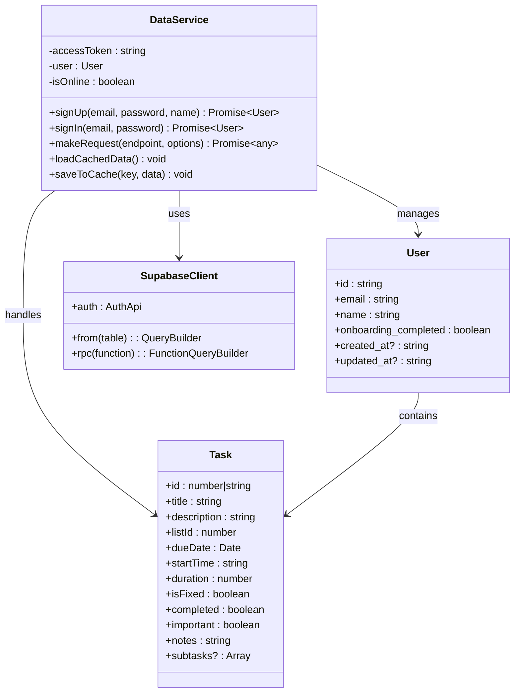

# 技术栈与依赖

<cite>
**本文档引用的文件**
- [package.json](file://package.json)
- [src/main.tsx](file://src/main.tsx)
- [src/index.css](file://src/index.css)
- [capacitor.config.json](file://capacitor.config.json)
- [android/app/src/main/assets/capacitor.config.json](file://android/app/src/main/assets/capacitor.config.json)
- [src/utils/supabase/client.ts](file://src/utils/supabase/client.ts)
- [src/utils/supabase/info.tsx](file://src/utils/supabase/info.tsx)
- [src/App.tsx](file://src/App.tsx)
- [src/utils/dataService.tsx](file://src/utils/dataService.tsx)
- [src/utils/nativeService.ts](file://src/utils/nativeService.ts)
- [vite.config.mts](file://vite.config.mts)
- [README.md](file://README.md)
</cite>

## 目录
1. [项目概述](#项目概述)
2. [核心技术栈](#核心技术栈)
3. [依赖关系分析](#依赖关系分析)
4. [架构设计](#架构设计)
5. [技术选型合理性](#技术选型合理性)
6. [版本兼容性与升级路径](#版本兼容性与升级路径)
7. [性能优化策略](#性能优化策略)
8. [故障排除指南](#故障排除指南)
9. [总结](#总结)

## 项目概述

本项目是一个现代化的跨平台任务管理应用，采用React 18+构建用户界面，结合Capacitor实现原生应用功能，并通过Supabase提供云端数据存储和认证服务。项目遵循移动优先的设计理念，注重简洁优雅的UI/UX体验，同时具备强大的原生功能集成能力。

## 核心技术栈

### React生态系统
- **React 18.3.1**: 主框架，提供声明式UI渲染和组件化架构
- **React DOM 18.3.1**: 浏览器DOM操作接口
- **React Hook Form 7.55.0**: 高性能表单管理解决方案
- **Framer Motion 12.23.22**: 强大的动画库，提供流畅的用户体验

### 样式与UI框架
- **Tailwind CSS 4.1.13**: 实用优先的CSS框架，支持原子类和主题系统
- **Radix UI组件库**: 提供无障碍、可访问的基础UI组件
- **Lucide React 0.487.0**: 现代化的图标库
- **Sonner 2.0.3**: 现代化的Toast通知组件

### 原生功能集成
- **Capacitor 7.4.3**: 跨平台原生桥接框架
- **Capacitor Plugins**: 包括Haptics、StatusBar、SplashScreen、Toast等原生功能模块

### 后端服务
- **Supabase 2.39.3**: 开源Firebase替代方案，提供实时数据库和认证服务
- **Supabase Functions**: 无服务器函数支持

### 构建工具
- **Vite 6.3.5**: 现代化构建工具，提供快速热重载和优化打包
- **SWC**: Rust加速的JavaScript/TypeScript编译器



**图表来源**
- [package.json](file://package.json#L4-L40)
- [vite.config.mts](file://vite.config.mts#L6-L7)

**章节来源**
- [package.json](file://package.json#L1-L81)
- [vite.config.mts](file://vite.config.mts#L1-L68)

## 依赖关系分析

### 核心依赖层次结构

```mermaid
graph TD
App[App.tsx] --> React[React 18.3.1]
App --> Services[dataService.tsx]
App --> UI[UI Components]
Services --> Supabase[supabase-js]
Services --> Native[nativeService.ts]
UI --> RadixUI[Radix UI Components]
UI --> Tailwind[Tailwind CSS]
UI --> Motion[Framer Motion]
Native --> Capacitor[Capacitor Core]
Native --> Plugins[Capacitor Plugins]
Plugins --> Haptics[@capacitor/haptics]
Plugins --> StatusBar[@capacitor/status-bar]
Plugins --> SplashScreen[@capacitor/splash-screen]
Plugins --> Toast[@capacitor/toast]
Supabase --> Auth[Supabase Auth]
Supabase --> Realtime[Realtime Database]
Supabase --> Storage[Storage API]
```

**图表来源**
- [src/App.tsx](file://src/App.tsx#L1-L20)
- [src/utils/dataService.tsx](file://src/utils/dataService.tsx#L1-L10)
- [src/utils/nativeService.ts](file://src/utils/nativeService.ts#L1-L10)

### 关键依赖关系

1. **应用入口依赖链**
   - `main.tsx` → `App.tsx` → 所有页面组件 → UI组件 → Radix UI
   - `main.tsx` → `index.css` → Tailwind CSS → 原子类样式

2. **数据流依赖**
   - `dataService.tsx` → `supabase-js` → Supabase后端服务
   - `nativeService.ts` → `@capacitor/core` → 原生平台功能

3. **构建时依赖**
   - `vite.config.mts` → `@vitejs/plugin-react-swc` → React组件编译
   - `vite.config.mts` → `@tailwindcss/vite` → CSS处理

**章节来源**
- [src/main.tsx](file://src/main.tsx#L1-L8)
- [src/App.tsx](file://src/App.tsx#L1-L30)
- [src/utils/dataService.tsx](file://src/utils/dataService.tsx#L1-L20)
- [src/utils/nativeService.ts](file://src/utils/nativeService.ts#L1-L20)

## 架构设计

### 应用启动流程



**图表来源**
- [src/main.tsx](file://src/main.tsx#L1-L8)
- [src/index.css](file://src/index.css#L1-L20)

### 原生功能集成架构



**图表来源**
- [src/utils/nativeService.ts](file://src/utils/nativeService.ts#L1-L50)
- [capacitor.config.json](file://capacitor.config.json#L1-L22)

### 数据管理架构



**图表来源**
- [src/utils/dataService.tsx](file://src/utils/dataService.tsx#L1-L50)
- [src/utils/supabase/client.ts](file://src/utils/supabase/client.ts#L1-L12)

**章节来源**
- [src/main.tsx](file://src/main.tsx#L1-L8)
- [src/utils/nativeService.ts](file://src/utils/nativeService.ts#L1-L180)
- [src/utils/dataService.tsx](file://src/utils/dataService.tsx#L1-L100)

## 技术选型合理性

### React 18+的优势

1. **并发渲染**: 提升大型应用的性能表现
2. **自动批处理**: 减少不必要的重新渲染
3. **新的Hooks**: 更好的状态管理和生命周期控制
4. **渐进式升级**: 兼容现有React生态系统的平滑迁移

### Tailwind CSS的选择理由

1. **开发效率**: 原子类直接写在HTML中，无需额外CSS文件
2. **主题一致性**: 内置颜色系统和响应式断点
3. **性能优化**: 只打包实际使用的样式类
4. **团队协作**: 统一的设计系统和命名规范

### Capacitor相比Cordova的优势

1. **现代架构**: 基于WebKit的WebView，更好的性能
2. **原生优先**: 从原生应用开发角度设计
3. **插件生态**: 更丰富的原生功能支持
4. **维护活跃**: 社区更新频繁，bug修复及时

### Supabase在实时数据库和认证方面的便利性

1. **开箱即用**: 无需搭建复杂的后端基础设施
2. **实时同步**: WebSocket连接实现数据实时更新
3. **认证系统**: 支持多种认证方式和会话管理
4. **存储服务**: 提供对象存储和CDN加速
5. **函数支持**: 无服务器函数处理复杂业务逻辑

**章节来源**
- [package.json](file://package.json#L4-L40)
- [README.md](file://README.md#L1-L20)

## 版本兼容性与升级路径

### 当前版本状态

- **React生态系统**: React 18.3.1 + 相关生态组件
- **Capacitor**: 7.4.3 (最新稳定版)
- **Supabase**: 2.39.3 (兼容最新功能)
- **Tailwind CSS**: 4.1.13 (最新版本)
- **Vite**: 6.3.5 (高性能构建工具)

### 升级策略建议

#### React生态系统升级
```typescript
// 推荐升级路径
// v18.x -> v19.x (需评估新特性兼容性)
// React Hook Form: 保持7.x系列稳定性
// Framer Motion: 逐步升级到12.x
```

#### Capacitor升级注意事项
```typescript
// 升级到Capacitor 8.x
// 1. 检查Android/iOS SDK要求
// 2. 更新插件版本兼容性
// 3. WebView性能优化
```

#### Supabase版本管理
```typescript
// 版本锁定策略
// @supabase/supabase-js: ^2.39.3 (保持稳定)
// @jsr/supabase__supabase-js: ^2.49.8 (JSR包)
// 定期检查安全更新和新功能
```

### 兼容性矩阵

| 技术栈 | 当前版本 | 推荐版本 | 兼容性风险 |
|--------|----------|----------|------------|
| React | 18.3.1 | 18.x | 低 |
| Capacitor | 7.4.3 | 7.x | 低 |
| Supabase | 2.39.3 | 2.x | 低 |
| Tailwind CSS | 4.1.13 | 4.x | 低 |
| Vite | 6.3.5 | 6.x | 低 |

**章节来源**
- [package.json](file://package.json#L1-L81)
- [vite.config.mts](file://vite.config.mts#L1-L68)

## 性能优化策略

### 构建时优化

1. **Tree Shaking**: Vite自动移除未使用的代码
2. **代码分割**: 按路由和组件进行懒加载
3. **资源压缩**: 自动压缩JavaScript和CSS文件
4. **图片优化**: 自动生成响应式图片格式

### 运行时优化

1. **虚拟滚动**: 大列表使用虚拟化技术
2. **防抖节流**: 表单输入和搜索功能优化
3. **缓存策略**: 本地存储和内存缓存结合
4. **网络优化**: 离线模式和智能重试机制

### 原生性能优化

1. **触觉反馈**: 仅在需要时触发，避免过度使用
2. **状态栏控制**: 动态调整以适应不同页面需求
3. **启动优化**: Splash Screen配置减少白屏时间
4. **内存管理**: 及时清理不需要的原生资源

## 故障排除指南

### 常见问题与解决方案

#### Capacitor相关问题
```typescript
// 检查原生平台检测
console.log(Capacitor.isNativePlatform());

// 插件初始化检查
try {
  await Haptics.impact({ style: ImpactStyle.Light });
} catch (error) {
  console.warn('Haptic feedback not available:', error);
}
```

#### Supabase连接问题
```typescript
// 检查网络状态
if (!navigator.onLine) {
  throw new Error('You are offline. Please check your connection.');
}

// 认证状态监控
supabase.auth.onAuthStateChange((event, session) => {
  console.log('Auth state changed:', event, session);
});
```

#### 样式加载问题
```css
/* 确保Tailwind配置正确 */
@import "tailwindcss";

@theme {
  --color-primary: var(--primary);
  --color-background: var(--background);
}
```

**章节来源**
- [src/utils/nativeService.ts](file://src/utils/nativeService.ts#L1-L180)
- [src/utils/dataService.tsx](file://src/utils/dataService.tsx#L1-L100)
- [src/index.css](file://src/index.css#L1-L82)

## 总结

本项目采用了现代化的技术栈组合，形成了一个功能完整、性能优异的跨平台任务管理应用。通过合理的技术选型和架构设计，实现了以下关键目标：

1. **技术先进性**: 采用React 18+、Tailwind CSS 4.x、Capacitor 7.x等最新技术
2. **开发效率**: 借助Vite构建工具和丰富的UI组件库提升开发速度
3. **用户体验**: 结合原生功能和Web技术提供优秀的跨平台体验
4. **可维护性**: 清晰的架构分层和模块化设计便于长期维护
5. **扩展性**: 灵活的插件系统和API设计支持功能扩展

这种技术栈组合不仅满足了当前的功能需求，也为未来的功能扩展和技术升级奠定了坚实基础。开发者可以基于这套技术栈继续构建更加强大和创新的应用功能。