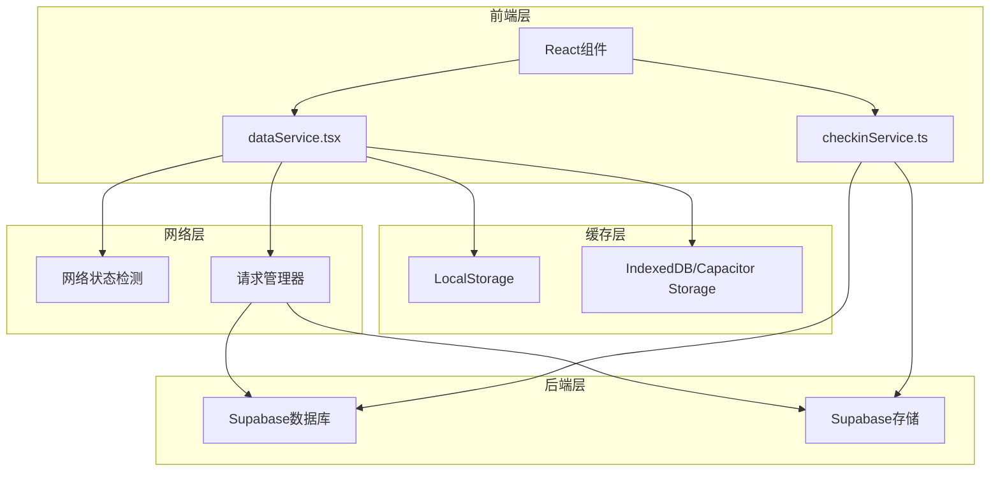
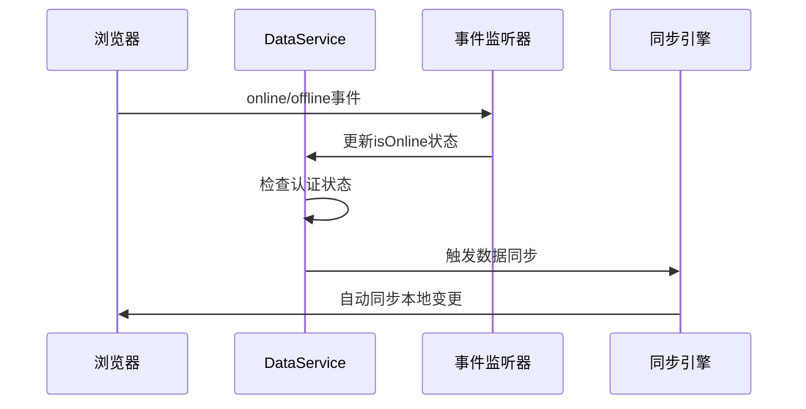
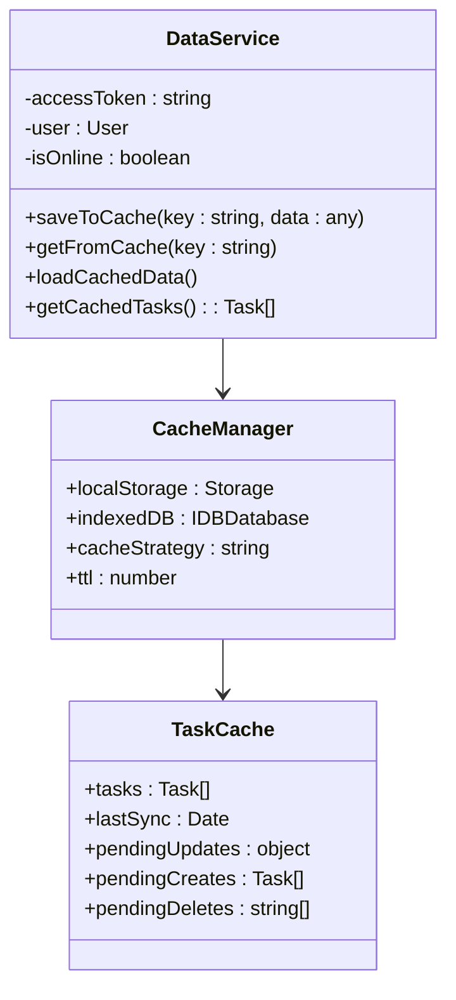
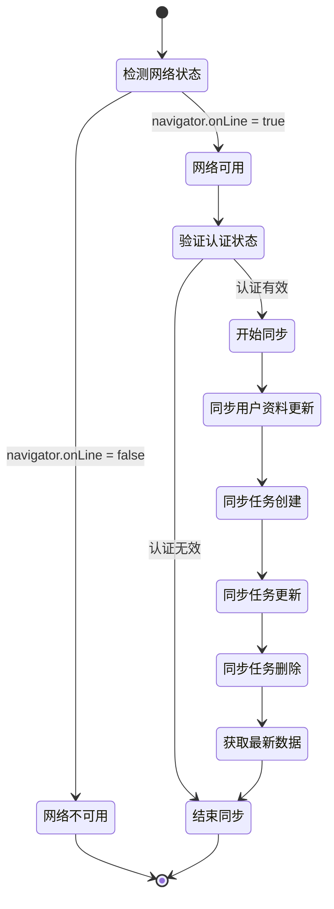
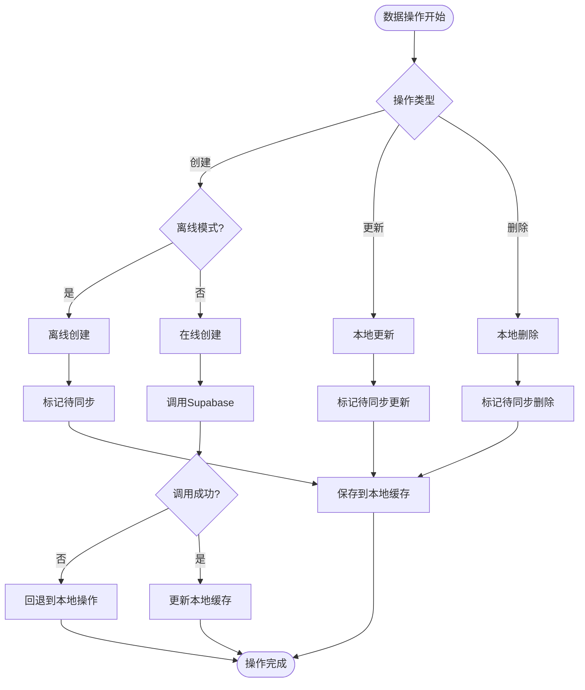
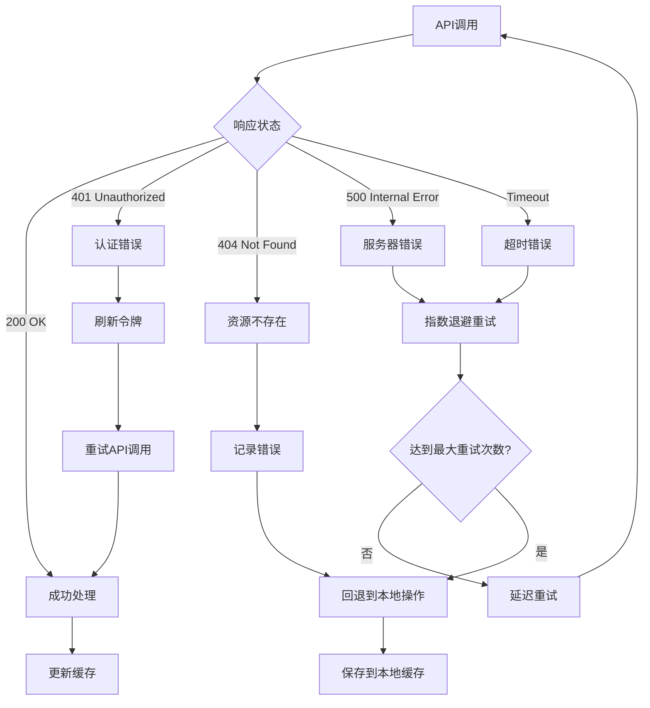
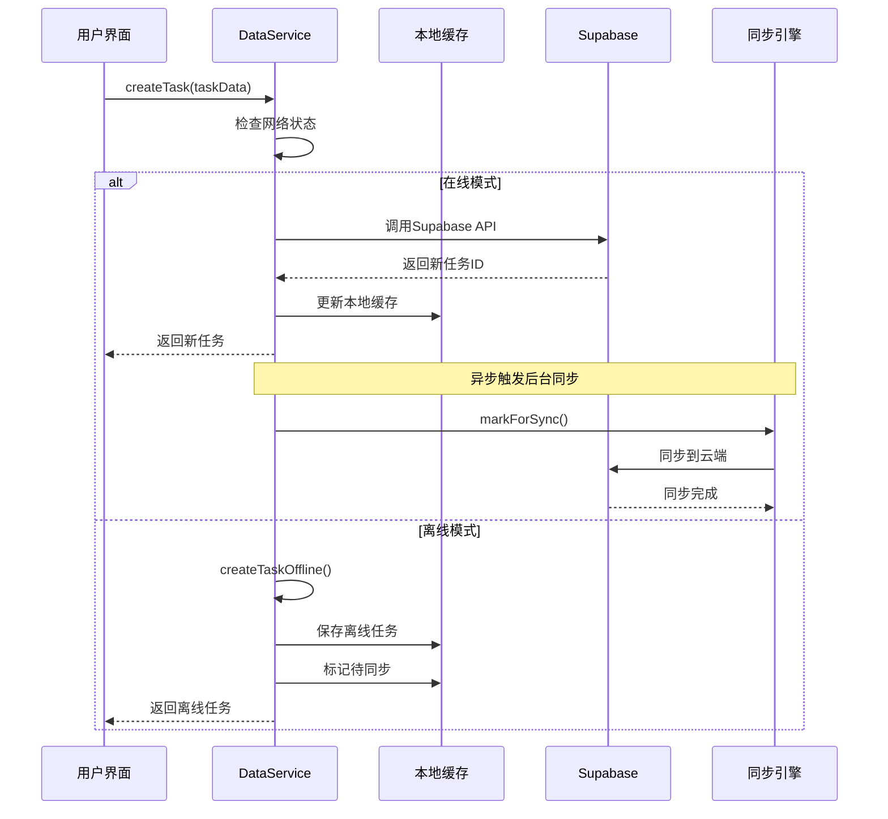

# 数据同步机制

<cite>
**本文档引用的文件**
- [src/utils/dataService.tsx](file://src/utils/dataService.tsx)
- [src/utils/checkinService.ts](file://src/utils/checkinService.ts)
- [src/utils/supabase/client.ts](file://src/utils/supabase/client.ts)
- [src/utils/supabase/info.tsx](file://src/utils/supabase/info.tsx)
- [src/types/checkin.ts](file://src/types/checkin.ts)
- [src/App.tsx](file://src/App.tsx)
- [src/components/AddTaskDrawer.tsx](file://src/components/AddTaskDrawer.tsx)
- [src/components/TaskDetailDrawer.tsx](file://src/components/TaskDetailDrawer.tsx)
</cite>

## 目录
1. [简介](#简介)
2. [项目架构概览](#项目架构概览)
3. [离线优先策略](#离线优先策略)
4. [网络状态检测](#网络状态检测)
5. [本地缓存机制](#本地缓存机制)
6. [数据同步流程](#数据同步流程)
7. [变更追踪与冲突解决](#变更追踪与冲突解决)
8. [错误处理与重试机制](#错误处理与重试机制)
9. [Supabase客户端封装](#supabase客户端封装)
10. [完整生命周期示例](#完整生命周期示例)
11. [调试工具与性能优化](#调试工具与性能优化)
12. [总结](#总结)

## 简介

本项目采用先进的离线优先（Offline-First）数据同步策略，确保用户在任何网络环境下都能流畅使用应用。系统通过智能的本地缓存机制、实时的网络状态检测和可靠的云端同步，实现了无缝的用户体验。

## 项目架构概览



**图表来源**
- [src/utils/dataService.tsx](file://src/utils/dataService.tsx#L1-L50)
- [src/utils/checkinService.ts](file://src/utils/checkinService.ts#L1-L50)

## 离线优先策略

项目的核心设计理念是"离线优先"，这意味着所有数据操作都首先在本地进行，然后在联网时自动同步到云端。

### 核心原则

1. **本地优先**：所有数据操作首先在本地缓存中执行
2. **异步同步**：联网时自动将本地变更同步到云端
3. **智能合并**：服务器数据与本地变更智能合并，避免数据丢失
4. **冲突解决**：内置冲突检测和解决机制

### 技术实现

```typescript
// 网络状态检测
private isOnline: boolean = navigator.onLine;

constructor() {
  // 监听在线/离线事件
  window.addEventListener('online', () => {
    this.isOnline = true;
    this.syncData();
  });
  
  window.addEventListener('offline', () => {
    this.isOnline = false;
  });
}
```

**章节来源**
- [src/utils/dataService.tsx](file://src/utils/dataService.tsx#L45-L60)

## 网络状态检测

系统通过原生浏览器API和自定义逻辑实现全面的网络状态检测。

### 实时网络监控



**图表来源**
- [src/utils/dataService.tsx](file://src/utils/dataService.tsx#L45-L60)

### 网络状态判断

```typescript
// 网络状态检测
async validateAuth(): Promise<boolean> {
  try {
    const session = await this.getCurrentSession();
    return session !== null && session.expires_at 
      ? new Date(session.expires_at * 1000) > new Date() 
      : false;
  } catch (error) {
    console.error('Error validating auth:', error);
    return false;
  }
}
```

**章节来源**
- [src/utils/dataService.tsx](file://src/utils/dataService.tsx#L180-L195)

## 本地缓存机制

系统采用多层缓存策略，结合LocalStorage和IndexedDB实现高效的数据持久化。

### 缓存架构



**图表来源**
- [src/utils/dataService.tsx](file://src/utils/dataService.tsx#L70-L120)

### 缓存策略

```typescript
// 缓存操作
private saveToCache(key: string, data: any) {
  try {
    localStorage.setItem(key, JSON.stringify(data));
  } catch (error) {
    console.error('Error saving to cache:', error);
  }
}

private getFromCache(key: string) {
  try {
    const cached = localStorage.getItem(key);
    return cached ? JSON.parse(cached) : null;
  } catch (error) {
    console.error('Error reading from cache:', error);
    return null;
  }
}
```

**章节来源**
- [src/utils/dataService.tsx](file://src/utils/dataService.tsx#L80-L110)

## 数据同步流程

系统实现了完整的数据同步生命周期，包括增量同步、批量处理和状态管理。

### 同步状态机



**图表来源**
- [src/utils/dataService.tsx](file://src/utils/dataService.tsx#L720-L790)

### 同步方法实现

```typescript
async syncData(): Promise<void> {
  if (!this.isOnline || !this.isAuthenticated()) {
    return;
  }

  try {
    // 同步用户资料更新
    const pendingProfileUpdates = this.getFromCache('taskmaster_pending_profile_updates');
    if (pendingProfileUpdates) {
      await this.makeRequest('/user/profile', {
        method: 'PUT',
        body: JSON.stringify(pendingProfileUpdates),
      });
      localStorage.removeItem('taskmaster_pending_profile_updates');
    }

    // 同步任务创建
    const pendingCreates = this.getFromCache('taskmaster_pending_creates') || [];
    for (const task of pendingCreates) {
      try {
        await this.makeRequest('/tasks', {
          method: 'POST',
          body: JSON.stringify({
            ...task,
            dueDate: task.dueDate.toISOString(),
          }),
        });
      } catch (error) {
        console.error('Error syncing task creation:', error);
      }
    }
    if (pendingCreates.length > 0) {
      localStorage.removeItem('taskmaster_pending_creates');
    }

    // 同步任务更新、删除等...
  } catch (error) {
    console.error('Error syncing data:', error);
  }
}
```

**章节来源**
- [src/utils/dataService.tsx](file://src/utils/dataService.tsx#L720-L790)

## 变更追踪与冲突解决

系统实现了智能的变更追踪机制，能够识别和处理各种类型的冲突。

### 变更追踪机制



**图表来源**
- [src/utils/dataService.tsx](file://src/utils/dataService.tsx#L500-L600)

### 冲突检测与解决

```typescript
// 智能合并服务器数据和本地离线更改
private mergeTasksWithOfflineChanges(serverTasks: Task[]): Task[] {
  const cachedTasks = this.getCachedTasks();
  const pendingUpdates = this.getFromCache('taskmaster_pending_updates') || {};
  const pendingCreates = this.getFromCache('taskmaster_pending_creates') || [];
  
  console.log('mergeTasksWithOfflineChanges: Merging data...');
  console.log('- Server tasks:', serverTasks.length);
  console.log('- Pending updates:', Object.keys(pendingUpdates).length);
  console.log('- Pending creates:', pendingCreates.length);
  
  // 从服务器任务开始
  let mergedTasks = [...serverTasks];
  
  // 应用本地待同步的更新
  Object.entries(pendingUpdates).forEach(([taskId, updates]) => {
    const index = mergedTasks.findIndex(task => task.id.toString() === taskId);
    if (index !== -1 && updates && typeof updates === 'object') {
      console.log(`mergeTasksWithOfflineChanges: Applying local update to task ${taskId}`);
      mergedTasks[index] = {
        ...mergedTasks[index],
        ...(updates as Partial<Task>),
        updatedAt: new Date().toISOString() // 标记为本地更新
      };
    }
  });
  
  // 添加本地创建的离线任务
  pendingCreates.forEach((offlineTask: Task) => {
    console.log(`mergeTasksWithOfflineChanges: Adding offline task ${offlineTask.id}`);
    mergedTasks.push(offlineTask);
  });
  
  return mergedTasks;
}
```

**章节来源**
- [src/utils/dataService.tsx](file://src/utils/dataService.tsx#L400-L450)

## 错误处理与重试机制

系统实现了完善的错误处理和重试机制，确保数据操作的可靠性。

### 错误处理策略



**图表来源**
- [src/utils/dataService.tsx](file://src/utils/dataService.tsx#L120-L180)

### 超时保护机制

```typescript
// 查询超时保护 - 2秒超时，提供更快的用户体验
const timeoutPromise = new Promise((_, reject) => {
  setTimeout(() => reject(new Error('getTasks timeout after 2 seconds')), 2000);
});

const queryPromise = supabase
  .from('tasks')
  .select('*')
  .order('created_at', { ascending: false });

const result = await Promise.race([queryPromise, timeoutPromise]);
```

**章节来源**
- [src/utils/dataService.tsx](file://src/utils/dataService.tsx#L320-L340)

## Supabase客户端封装

系统对Supabase客户端进行了封装，提供了统一的访问接口和会话管理。

### 客户端配置

```typescript
// Supabase客户端封装
import { createClient } from '@supabase/supabase-js'
import { projectId, publicAnonKey } from './info'

const supabaseUrl = `https://${projectId}.supabase.co`

export const supabase = createClient(supabaseUrl, publicAnonKey, {
  auth: {
    autoRefreshToken: true,
    persistSession: true,
    detectSessionInUrl: false
  }
})
```

**章节来源**
- [src/utils/supabase/client.ts](file://src/utils/supabase/client.ts#L1-L12)

### 会话状态管理

```typescript
// 监听Supabase认证状态变化
supabase.auth.onAuthStateChange((event, session) => {
  console.log('Auth state changed:', event, session);
  
  if (session) {
    this.accessToken = session.access_token;
    this.user = {
      id: session.user.id,
      email: session.user.email || '',
      name: session.user.user_metadata?.name || session.user.email || '',
      onboarding_completed: session.user.user_metadata?.onboarding_completed || false
    };
    
    // 保存到缓存
    this.saveToCache('taskmaster_user', this.user);
    this.saveToCache('taskmaster_token', this.accessToken);
  } else {
    this.accessToken = null;
    this.user = null;
    // 清理缓存
    localStorage.removeItem('taskmaster_user');
    localStorage.removeItem('taskmaster_token');
  }
});
```

**章节来源**
- [src/utils/dataService.tsx](file://src/utils/dataService.tsx#L60-L80)

## 完整生命周期示例

让我们通过一个具体的任务创建操作来展示数据同步的完整生命周期。

### 任务创建流程



**图表来源**
- [src/utils/dataService.tsx](file://src/utils/dataService.tsx#L500-L550)

### 代码示例

```typescript
// 任务创建 - 在线模式
async createTask(task: Omit<Task, 'id' | 'userId' | 'createdAt' | 'updatedAt'>): Promise<Task> {
  console.log('createTask: Starting task creation with Supabase...', task.title);
  
  try {
    const { data, error } = await supabase
      .from('tasks')
      .insert({
        title: task.title,
        description: task.description || '',
        list_id: task.listId,
        due_date: task.dueDate.toISOString(),
        start_time: task.startTime || '',
        start_date: task.startDate ? task.startDate.toISOString() : null,
        duration: task.duration,
        is_fixed: task.isFixed,
        completed: task.completed,
        important: task.important,
        is_my_day: task.isMyDay || false,
        added_to_my_day_at: task.addedToMyDayAt ? task.addedToMyDayAt.toISOString() : null,
        notes: task.notes || '',
        subtasks: task.subtasks || [],
        user_id: this.user?.id
      })
      .select()
      .single();
    
    if (error) {
      console.error('createTask: Supabase error:', error);
      throw error;
    }
    
    // 处理成功结果...
    
  } catch (error) {
    console.error('createTask: Error with Supabase:', error);
    // 回退到离线创建
    return this.createTaskOffline(task);
  }
}

// 任务创建 - 离线模式
private createTaskOffline(task: Omit<Task, 'id' | 'userId' | 'createdAt' | 'updatedAt'>): Task {
  const newTask: Task = {
    ...task,
    id: `offline_${Date.now()}`,
    userId: this.user?.id,
    createdAt: new Date().toISOString(),
    updatedAt: new Date().toISOString(),
  };

  const cachedTasks = this.getCachedTasks();
  cachedTasks.push(newTask);
  this.saveToCache('taskmaster_tasks', cachedTasks);
  
  // Mark for sync when online
  const pendingCreates = this.getFromCache('taskmaster_pending_creates') || [];
  pendingCreates.push(newTask);
  this.saveToCache('taskmaster_pending_creates', pendingCreates);
  
  return newTask;
}
```

**章节来源**
- [src/utils/dataService.tsx](file://src/utils/dataService.tsx#L500-L580)

## 调试工具与性能优化

### 同步状态指示器

```typescript
// 同步状态指示器
{dataService.hasPendingChanges() && (
  <div className="absolute top-4 left-4 bg-yellow-100 text-yellow-800 px-2 py-1 rounded-full text-xs font-medium">
    Sync pending
  </div>
)}
```

### 性能优化技巧

1. **查询超时保护**：设置合理的查询超时时间，避免长时间等待
2. **增量同步**：只同步变更的数据，减少网络传输
3. **批量操作**：将多个小操作合并为批量操作
4. **智能缓存**：根据数据访问模式优化缓存策略

### 调试工具建议

```typescript
// 调试辅助方法
getLastSyncTime(): Date | null {
  const lastSync = this.getFromCache('taskmaster_last_sync');
  return lastSync ? new Date(lastSync) : null;
}

clearCache(): void {
  this.cache = {
    checkinItems: [],
    checkinRecords: [],
    blogs: [],
    lastSyncTime: null
  };
}

// 检查是否有待同步的数据
hasPendingChanges(): boolean {
  const pendingCreates = this.getFromCache('taskmaster_pending_creates') || [];
  const pendingUpdates = this.getFromCache('taskmaster_pending_updates') || {};
  const pendingDeletes = this.getFromCache('taskmaster_pending_deletes') || [];
  
  return pendingCreates.length > 0 || 
         Object.keys(pendingUpdates).length > 0 || 
         pendingDeletes.length > 0;
}
```

**章节来源**
- [src/utils/dataService.tsx](file://src/utils/dataService.tsx#L820-L850)
- [src/App.tsx](file://src/App.tsx#L880-L890)

## 总结

本项目实现了一个完整的离线优先数据同步系统，具有以下核心特性：

1. **全面的离线支持**：所有主要功能都可以在离线状态下正常工作
2. **智能同步机制**：自动检测网络状态，按需同步数据
3. **可靠的冲突解决**：内置的合并算法确保数据一致性
4. **优秀的用户体验**：快速响应和渐进式加载
5. **强大的错误处理**：完善的异常处理和恢复机制

这套数据同步机制为移动应用提供了卓越的离线体验，同时保证了数据的一致性和可靠性。开发者可以通过本文档深入了解系统的实现细节，并根据具体需求进行定制和扩展。