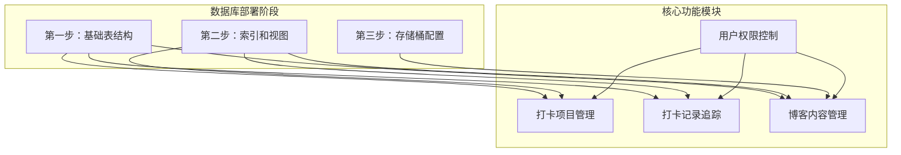
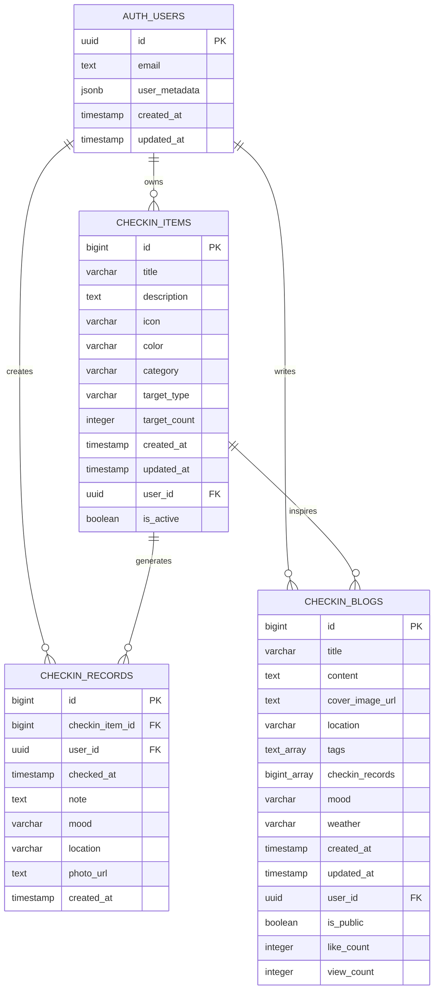
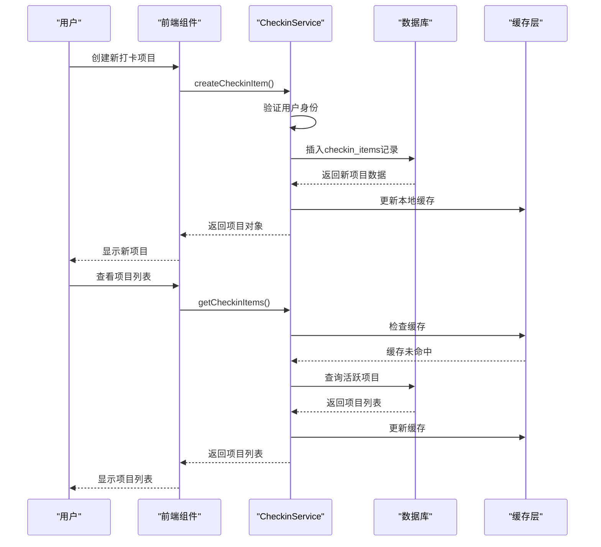
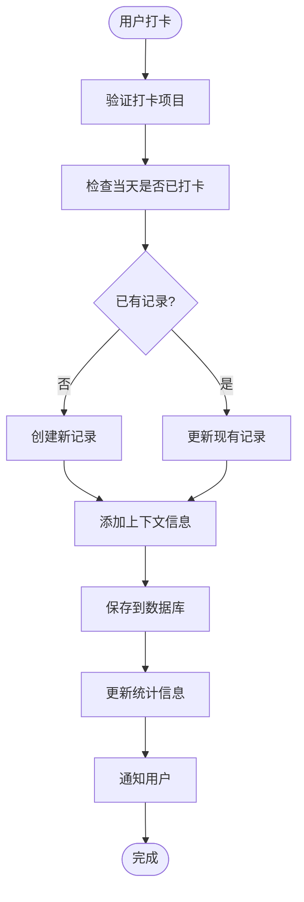
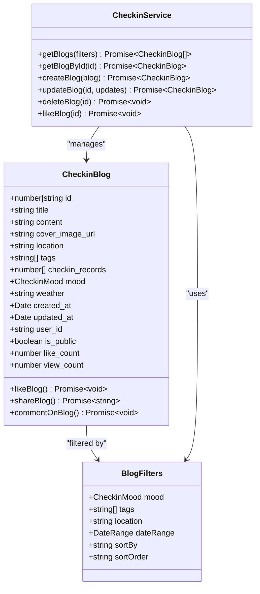
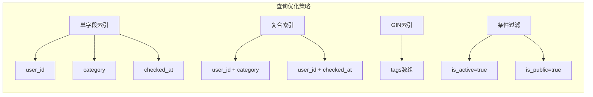
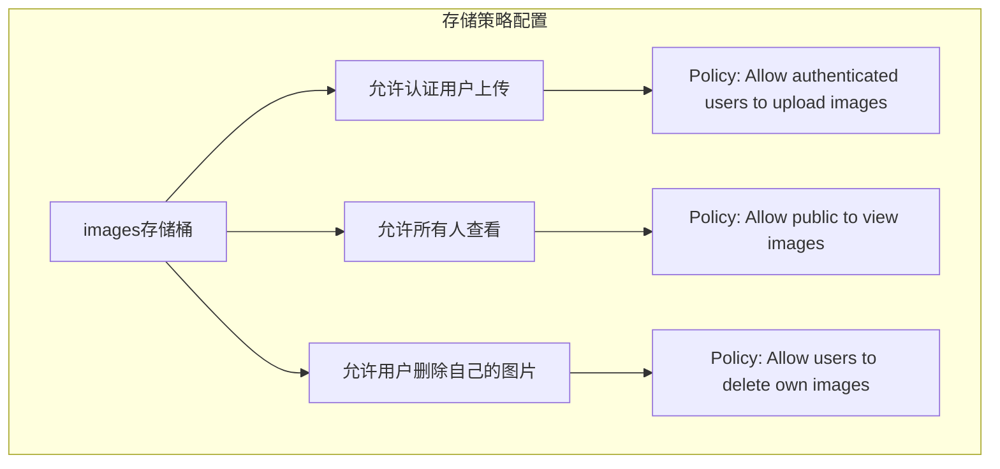

# 数据库设计文档

<cite>
**本文档中引用的文件**
- [supabase_step1_tables.sql](file://supabase_step1_tables.sql)
- [supabase_checkin_tables.sql](file://supabase_checkin_tables.sql)
- [supabase_step2_indexes.sql](file://supabase_step2_indexes.sql)
- [supabase_storage_setup.sql](file://supabase_storage_setup.sql)
- [src/types/checkin.ts](file://src/types/checkin.ts)
- [src/utils/checkinService.ts](file://src/utils/checkinService.ts)
- [src/utils/dataService.tsx](file://src/utils/dataService.tsx)
- [src/components/CheckinPage.tsx](file://src/components/CheckinPage.tsx)
</cite>

## 目录
1. [简介](#简介)
2. [项目结构概述](#项目结构概述)
3. [核心数据表设计](#核心数据表设计)
4. [数据库架构概览](#数据库架构概览)
5. [详细组件分析](#详细组件分析)
6. [索引优化策略](#索引优化策略)
7. [行级安全策略](#行级安全策略)
8. [存储桶配置](#存储桶配置)
9. [前后端数据模型一致性](#前后端数据模型一致性)
10. [性能考虑](#性能考虑)
11. [故障排除指南](#故障排除指南)
12. [结论](#结论)

## 简介

本文档基于Focus.do应用程序的数据库设计，详细描述了Supabase数据库的完整架构。该系统采用PostgreSQL作为底层数据库，结合Supabase平台提供的功能，构建了一个完整的打卡（Check-in）功能生态系统。数据库设计遵循现代化的NoSQL和SQL混合架构理念，通过精心设计的数据表结构、索引策略和安全策略，为用户提供高效、安全的打卡体验。

## 项目结构概述

Focus.do应用程序采用了模块化的数据库设计，主要分为以下几个阶段：



**图表来源**
- [supabase_step1_tables.sql](file://supabase_step1_tables.sql#L1-L62)
- [supabase_checkin_tables.sql](file://supabase_checkin_tables.sql#L1-L284)

**章节来源**
- [supabase_step1_tables.sql](file://supabase_step1_tables.sql#L1-L62)
- [supabase_checkin_tables.sql](file://supabase_checkin_tables.sql#L1-L284)

## 核心数据表设计

### 打卡项目表 (checkin_items)

打卡项目表是整个系统的核心，负责存储用户创建的各种打卡项目信息。

```sql
CREATE TABLE IF NOT EXISTS checkin_items (
  id BIGSERIAL PRIMARY KEY,
  title VARCHAR(255) NOT NULL,
  description TEXT,
  icon VARCHAR(10) DEFAULT '📝',
  color VARCHAR(7) DEFAULT '#6B7280',
  category VARCHAR(20) NOT NULL DEFAULT 'other',
  target_type VARCHAR(10) NOT NULL DEFAULT 'daily',
  target_count INTEGER DEFAULT 1,
  created_at TIMESTAMP WITH TIME ZONE DEFAULT NOW(),
  updated_at TIMESTAMP WITH TIME ZONE DEFAULT NOW(),
  user_id UUID REFERENCES auth.users(id) ON DELETE CASCADE,
  is_active BOOLEAN DEFAULT true,
  
  CONSTRAINT valid_category CHECK (category IN ('health', 'fitness', 'learning', 'habit', 'work', 'hobby', 'social', 'other')),
  CONSTRAINT valid_target_type CHECK (target_type IN ('daily', 'weekly', 'custom')),
  CONSTRAINT valid_target_count CHECK (target_count > 0)
);
```

**关键特性：**
- **唯一标识符**：使用BIGSERIAL自增主键确保每个项目的唯一性
- **分类系统**：支持8种预定义分类，便于用户组织和查找
- **目标设定**：支持每日、每周或自定义目标类型
- **视觉定制**：允许用户自定义图标和颜色主题
- **软删除**：通过is_active字段实现逻辑删除而非物理删除

### 打卡记录表 (checkin_records)

打卡记录表跟踪用户的实际打卡行为，是系统的核心数据存储。

```sql
CREATE TABLE IF NOT EXISTS checkin_records (
  id BIGSERIAL PRIMARY KEY,
  checkin_item_id BIGINT REFERENCES checkin_items(id) ON DELETE CASCADE,
  user_id UUID REFERENCES auth.users(id) ON DELETE CASCADE,
  checked_at TIMESTAMP WITH TIME ZONE DEFAULT NOW(),
  note TEXT,
  mood VARCHAR(20),
  location VARCHAR(255),
  photo_url TEXT,
  created_at TIMESTAMP WITH TIME ZONE DEFAULT NOW(),
  
  CONSTRAINT valid_mood CHECK (mood IN ('excellent', 'good', 'neutral', 'tired', 'stressed') OR mood IS NULL)
);
```

**关键特性：**
- **关联关系**：与checkin_items建立外键关系，确保数据完整性
- **多维度记录**：支持备注、心情、位置和照片等多种记录形式
- **时间戳管理**：自动记录创建时间和打卡时间
- **灵活的心情系统**：支持5种预定义心情状态

### 博客表 (checkin_blogs)

博客表为用户提供了一个分享打卡体验的空间，支持富文本内容和多媒体展示。

```sql
CREATE TABLE IF NOT EXISTS checkin_blogs (
  id BIGSERIAL PRIMARY KEY,
  title VARCHAR(255) NOT NULL,
  content TEXT NOT NULL,
  cover_image_url TEXT,
  location VARCHAR(255),
  tags TEXT[] DEFAULT '{}',
  checkin_records BIGINT[] DEFAULT '{}',
  mood VARCHAR(20) NOT NULL DEFAULT 'neutral',
  weather VARCHAR(100),
  created_at TIMESTAMP WITH TIME ZONE DEFAULT NOW(),
  updated_at TIMESTAMP WITH TIME ZONE DEFAULT NOW(),
  user_id UUID REFERENCES auth.users(id) ON DELETE CASCADE,
  is_public BOOLEAN DEFAULT false,
  like_count INTEGER DEFAULT 0,
  view_count INTEGER DEFAULT 0,
  
  CONSTRAINT valid_mood CHECK (mood IN ('excellent', 'good', 'neutral', 'tired', 'stressed')),
  CONSTRAINT valid_like_count CHECK (like_count >= 0),
  CONSTRAINT valid_view_count CHECK (view_count >= 0)
);
```

**关键特性：**
- **数组字段**：tags和checkin_records使用PostgreSQL数组类型，提高查询效率
- **多媒体支持**：支持封面图片和关联的打卡记录
- **社交功能**：内置点赞和浏览计数功能
- **隐私控制**：通过is_public字段控制内容可见性

**章节来源**
- [supabase_step1_tables.sql](file://supabase_step1_tables.sql#L1-L62)
- [supabase_checkin_tables.sql](file://supabase_checkin_tables.sql#L1-L284)

## 数据库架构概览



**图表来源**
- [supabase_step1_tables.sql](file://supabase_step1_tables.sql#L1-L62)
- [supabase_checkin_tables.sql](file://supabase_checkin_tables.sql#L1-L284)

## 详细组件分析

### 打卡项目管理组件

打卡项目管理是系统的核心功能之一，负责处理用户的所有打卡项目生命周期。



**图表来源**
- [src/utils/checkinService.ts](file://src/utils/checkinService.ts#L1-L199)
- [src/components/CheckinPage.tsx](file://src/components/CheckinPage.tsx#L1-L199)

### 打卡记录追踪组件

打卡记录追踪系统负责记录用户的实际打卡行为，并提供丰富的上下文信息。



**图表来源**
- [src/utils/checkinService.ts](file://src/utils/checkinService.ts#L174-L219)

### 博客管理系统

博客系统为用户提供了一个分享打卡体验的平台，支持多种内容形式和社交互动。



**图表来源**
- [src/types/checkin.ts](file://src/types/checkin.ts#L1-L284)
- [src/utils/checkinService.ts](file://src/utils/checkinService.ts#L1-L199)

**章节来源**
- [src/utils/checkinService.ts](file://src/utils/checkinService.ts#L1-L199)
- [src/types/checkin.ts](file://src/types/checkin.ts#L1-L284)

## 索引优化策略

为了确保系统的高性能，数据库设计中包含了精心设计的索引策略。

### 主要索引结构

```sql
-- 打卡项目索引
CREATE INDEX IF NOT EXISTS idx_checkin_items_user_id ON checkin_items(user_id);
CREATE INDEX IF NOT EXISTS idx_checkin_items_category ON checkin_items(category);
CREATE INDEX IF NOT EXISTS idx_checkin_items_active ON checkin_items(is_active);

-- 打卡记录索引
CREATE INDEX IF NOT EXISTS idx_checkin_records_user_id ON checkin_records(user_id);
CREATE INDEX IF NOT EXISTS idx_checkin_records_item_id ON checkin_records(checkin_item_id);
CREATE INDEX IF NOT EXISTS idx_checkin_records_checked_at ON checkin_records(checked_at);
CREATE INDEX IF NOT EXISTS idx_checkin_records_mood ON checkin_records(mood);

-- Blog索引
CREATE INDEX IF NOT EXISTS idx_checkin_blogs_user_id ON checkin_blogs(user_id);
CREATE INDEX IF NOT EXISTS idx_checkin_blogs_created_at ON checkin_blogs(created_at);
CREATE INDEX IF NOT EXISTS idx_checkin_blogs_mood ON checkin_blogs(mood);
CREATE INDEX IF NOT EXISTS idx_checkin_blogs_tags ON checkin_blogs USING GIN(tags);
CREATE INDEX IF NOT EXISTS idx_checkin_blogs_public ON checkin_blogs(is_public);
```

### 索引优化原理



**图表来源**
- [supabase_step2_indexes.sql](file://supabase_step2_indexes.sql#L1-L54)

**章节来源**
- [supabase_step2_indexes.sql](file://supabase_step2_indexes.sql#L1-L54)

## 行级安全策略

Supabase的行级安全（RLS）策略确保了数据的安全性和隐私保护。

### 打卡项目RLS策略

```sql
-- 用户可以查看自己的打卡项目
CREATE POLICY "Users can view their own checkin items" 
  ON checkin_items FOR SELECT 
  USING (auth.uid() = user_id);

-- 用户可以插入自己的打卡项目
CREATE POLICY "Users can insert their own checkin items" 
  ON checkin_items FOR INSERT 
  WITH CHECK (auth.uid() = user_id);

-- 用户可以更新自己的打卡项目
CREATE POLICY "Users can update their own checkin items" 
  ON checkin_items FOR UPDATE 
  USING (auth.uid() = user_id);

-- 用户可以删除自己的打卡项目
CREATE POLICY "Users can delete their own checkin items" 
  ON checkin_items FOR DELETE 
  USING (auth.uid() = user_id);
```

### 博客RLS策略

```sql
-- 用户可以查看自己的博客和公开的博客
CREATE POLICY "Users can view their own blogs and public blogs" 
  ON checkin_blogs FOR SELECT 
  USING (auth.uid() = user_id OR is_public = true);

-- 用户可以插入自己的博客
CREATE POLICY "Users can insert their own blogs" 
  ON checkin_blogs FOR INSERT 
  WITH CHECK (auth.uid() = user_id);

-- 用户可以更新自己的博客
CREATE POLICY "Users can update their own blogs" 
  ON checkin_blogs FOR UPDATE 
  USING (auth.uid() = user_id);

-- 用户可以删除自己的博客
CREATE POLICY "Users can delete their own blogs" 
  ON checkin_blogs FOR DELETE 
  USING (auth.uid() = user_id);
```

**章节来源**
- [supabase_checkin_tables.sql](file://supabase_checkin_tables.sql#L130-L200)

## 存储桶配置

### 图片存储桶设置

```sql
-- 插入images存储桶
INSERT INTO storage.buckets (id, name, public)
VALUES ('images', 'images', true)
ON CONFLICT (id) DO UPDATE SET
  name = EXCLUDED.name,
  public = EXCLUDED.public;
```

### 存储策略配置



**图表来源**
- [supabase_storage_setup.sql](file://supabase_storage_setup.sql#L1-L42)

**章节来源**
- [supabase_storage_setup.sql](file://supabase_storage_setup.sql#L1-L42)

## 前后端数据模型一致性

### TypeScript接口定义

系统采用了强类型的TypeScript接口来确保前后端数据模型的一致性。

```typescript
// 打卡项目类型
export interface CheckinItem {
  id: number | string;
  title: string;
  description?: string;
  icon: string;
  color: string;
  category: CheckinCategory;
  target_type: 'daily' | 'weekly' | 'custom';
  target_count: number;
  created_at: Date;
  updated_at: Date;
  user_id: string;
  is_active: boolean;
}

// 心情状态枚举
export type CheckinMood = 
  | 'excellent'   // 😄
  | 'good'        // 😊
  | 'neutral'     // 😐
  | 'tired'       // 😴
  | 'stressed';   // 😰

// 博客文章接口
export interface CheckinBlog {
  id: number | string;
  title: string;
  content: string;
  cover_image_url?: string;
  location?: string;
  tags: string[];
  checkin_records: number[];
  mood: CheckinMood;
  weather?: string;
  created_at: Date;
  updated_at: Date;
  user_id: string;
  is_public: boolean;
  like_count: number;
  view_count: number;
}
```

### 数据转换映射

```mermaid
flowchart LR
subgraph "数据库字段"
A[id] --> A1[bigint]
B[title] --> B1[varchar]
C[content] --> C1[text]
D[tags] --> D1[text_array]
end
subgraph "TypeScript接口"
E[id] --> E1[number|string]
F[title] --> F1[string]
G[content] --> G1[string]
H[tags] --> H1[string[]]
end
A1 -.-> E1
B1 -.-> F1
C1 -.-> G1
D1 -.-> H1
```

**图表来源**
- [src/types/checkin.ts](file://src/types/checkin.ts#L1-L284)

**章节来源**
- [src/types/checkin.ts](file://src/types/checkin.ts#L1-L284)

## 性能考虑

### 缓存策略

系统实现了多层次的缓存机制来提升性能：

```typescript
private cache = {
  checkinItems: [] as CheckinItem[],
  checkinRecords: [] as CheckinRecord[],
  blogs: [] as CheckinBlog[],
  lastSyncTime: null as Date | null
};
```

### 查询优化技巧

1. **批量查询**：使用Promise.allSettled并行加载多个数据源
2. **条件查询**：根据用户输入动态构建查询条件
3. **分页处理**：对大量数据进行分页处理
4. **索引利用**：充分利用数据库索引加速查询

### 数据库连接优化

```typescript
// 自动刷新令牌
auth: {
  autoRefreshToken: true,
  persistSession: true,
  detectSessionInUrl: false
}
```

## 故障排除指南

### 常见问题及解决方案

1. **存储桶不存在**
   - 错误信息：`Storage bucket "images" not found`
   - 解决方案：手动创建images存储桶或执行存储桶设置脚本

2. **权限不足**
   - 错误信息：`401 Unauthorized`
   - 解决方案：检查用户认证状态和RLS策略配置

3. **索引缺失**
   - 性能问题：查询响应缓慢
   - 解决方案：执行索引创建脚本

4. **数据类型不匹配**
   - 类型错误：数据库字段与TypeScript接口不一致
   - 解决方案：同步修改数据库结构和TypeScript定义

### 调试工具

```typescript
// 启用详细日志
console.log('CheckinDataService initialized successfully');
console.error('Failed to fetch checkin items:', error);
```

**章节来源**
- [src/utils/checkinService.ts](file://src/utils/checkinService.ts#L1-L199)
- [src/utils/dataService.tsx](file://src/utils/dataService.tsx#L1-L199)

## 结论

Focus.do应用程序的数据库设计展现了现代Web应用的最佳实践。通过精心设计的数据表结构、完善的索引策略、严格的安全控制和高效的缓存机制，系统能够为用户提供稳定、快速、安全的服务体验。

### 设计亮点

1. **模块化架构**：清晰的功能分离和数据流设计
2. **性能优化**：多层次的索引和缓存策略
3. **安全性保障**：完善的RLS策略和权限控制
4. **扩展性设计**：支持未来功能扩展的灵活架构
5. **开发友好**：强类型接口和详细的文档说明

### 未来优化方向

1. **分区策略**：对于大规模数据，考虑使用表分区
2. **读写分离**：实现数据库读写分离以提升并发能力
3. **监控告警**：建立完善的数据库监控和告警机制
4. **备份恢复**：制定定期备份和灾难恢复计划

这套数据库设计方案不仅满足了当前的功能需求，也为未来的业务增长和技术演进奠定了坚实的基础。