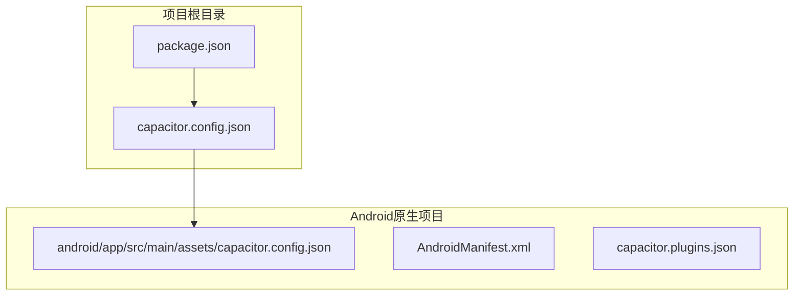
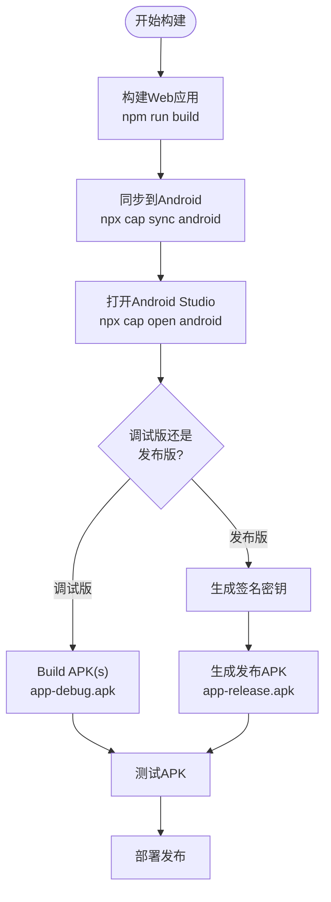
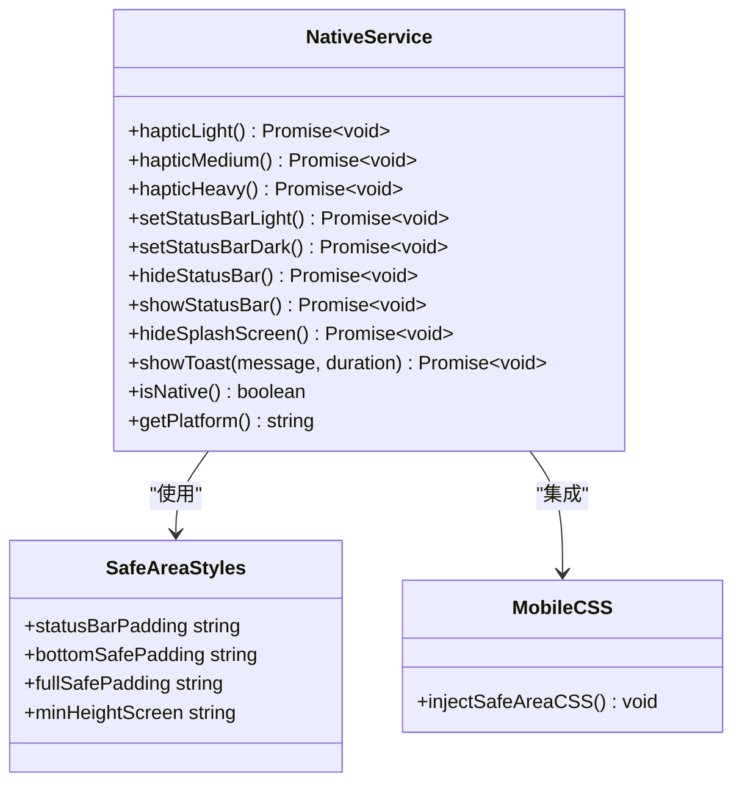
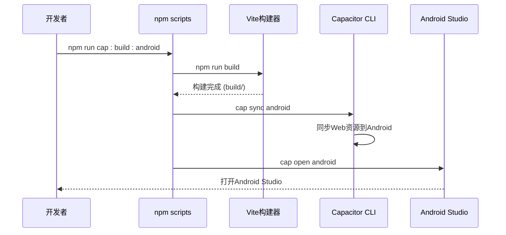

# 构建与部署

<cite>
**本文档引用的文件**
- [README.md](file://README.md)
- [ANDROID_BUILD_GUIDE.md](file://ANDROID_BUILD_GUIDE.md)
- [CAPACITOR_SUMMARY.md](file://CAPACITOR_SUMMARY.md)
- [STORAGE_SETUP_GUIDE.md](file://STORAGE_SETUP_GUIDE.md)
- [package.json](file://package.json)
- [capacitor.config.json](file://capacitor.config.json)
- [android\app\src\main\AndroidManifest.xml](file://android\app\src\main\AndroidManifest.xml)
- [android\app\src\main\assets\capacitor.config.json](file://android\app\src\main\assets\capacitor.config.json)
- [src\utils\nativeService.ts](file://src\utils\nativeService.ts)
- [src\styles\mobile.css](file://src\styles\mobile.css)
</cite>

## 目录
1. [项目概述](#项目概述)
2. [构建环境配置](#构建环境配置)
3. [Capacitor核心配置](#capacitor核心配置)
4. [Android构建流程](#android构建流程)
5. [原生功能集成](#原生功能集成)
6. [存储配置](#存储配置)
7. [自动化构建脚本](#自动化构建脚本)
8. [CI/CD集成](#cicd集成)
9. [性能优化建议](#性能优化建议)
10. [故障排除指南](#故障排除指南)

## 项目概述

Focus Do是一个基于React 18 + TypeScript的现代化任务管理应用，采用Capacitor 7框架实现跨平台移动应用开发。该项目支持Android APK和iOS应用的构建，具备完整的原生功能集成，包括触觉反馈、状态栏控制、启动屏幕、Toast通知等。

### 核心特性

- **移动端原生体验**: 通过Capacitor实现真正的原生功能
- **现代移动端适配**: 支持最新的移动设备特性
- **实时数据同步**: 基于Supabase的云端同步
- **高性能架构**: Vite构建 + React 18 + TypeScript
- **跨平台支持**: 同时支持Android和iOS平台

**章节来源**
- [README.md](file://README.md#L1-L48)
- [CAPACITOR_SUMMARY.md](file://CAPACITOR_SUMMARY.md#L1-L50)

## 构建环境配置

### 系统要求

构建Focus Do应用需要以下环境配置：

#### 必需软件
1. **Android Studio** (推荐 Electric Eel 或更新版本)
   - 下载地址: https://developer.android.com/studio
   - 包含Android SDK和构建工具

2. **Java Development Kit (JDK)**
   - JDK 11 或更高版本
   - Android Studio通常会自动安装

3. **Node.js** 
   - 版本 16 或更高
   - 已安装，用于运行Capacitor

#### Android SDK配置

```bash
# 打开Android Studio
# 进入 Tools > SDK Manager
# 确保安装以下组件：
# - Android SDK Platform 33 (或最新版本)
# - Android SDK Build-Tools 33.0.0 (或最新版本)
# - Android SDK Platform-Tools
# - Android SDK Tools

# 设置环境变量（在系统PATH中添加）
ANDROID_HOME=C:\Users\[username]\AppData\Local\Android\Sdk
```

**章节来源**
- [ANDROID_BUILD_GUIDE.md](file://ANDROID_BUILD_GUIDE.md#L1-L50)

## Capacitor核心配置

### 配置文件结构

Capacitor的核心配置位于项目根目录和Android原生项目中：



**图表来源**
- [capacitor.config.json](file://capacitor.config.json#L1-L22)
- [android\app\src\main\assets\capacitor.config.json](file://android\app\src\main\assets\capacitor.config.json#L1-L22)

### 应用基本信息

```json
{
  "appId": "com.focusdo.app",
  "appName": "Focus Do",
  "webDir": "build",
  "server": {
    "androidScheme": "https"
  }
}
```

### 原生插件配置

项目集成了多个Capacitor原生插件：

- **@capacitor/haptics**: 触觉反馈
- **@capacitor/status-bar**: 状态栏控制
- **@capacitor/splash-screen**: 启动屏幕
- **@capacitor/toast**: 原生Toast通知
- **@capacitor/local-notifications**: 本地通知
- **@capacitor/preferences**: 本地存储

**章节来源**
- [capacitor.config.json](file://capacitor.config.json#L1-L22)
- [android\app\src\main\assets\capacitor.plugins.json](file://android\app\src\main\assets\capacitor.plugins.json#L1-L25)

## Android构建流程

### 构建步骤详解

#### 1. 快速构建（推荐）

```bash
# 构建Web应用并打开Android Studio
npm run cap:build:android
```

#### 2. 分步构建

```bash
# 第1步：构建Web应用
npm run build

# 第2步：同步到Android项目
npx cap sync android

# 第3步：打开Android Studio
npx cap open android
```

#### 3. 在Android Studio中构建APK

##### 调试版APK (开发测试用)

1. 在Android Studio中，选择 `Build` > `Build Bundle(s) / APK(s)` > `Build APK(s)`
2. 等待构建完成
3. APK位置: `android/app/build/outputs/apk/debug/app-debug.apk`

##### 发布版APK (正式发布用)

1. 生成签名密钥：
```bash
keytool -genkey -v -keystore focus-do-key.keystore -alias focus-do -keyalg RSA -keysize 2048 -validity 10000
```

2. 在Android Studio中：
   - 选择 `Build` > `Generate Signed Bundle / APK`
   - 选择 APK
   - 选择或创建密钥库
   - 选择发布构建类型
   - 点击 `Build`

3. 发布APK位置: `android/app/build/outputs/apk/release/app-release.apk`

### 构建流程图



**图表来源**
- [ANDROID_BUILD_GUIDE.md](file://ANDROID_BUILD_GUIDE.md#L50-L120)

**章节来源**
- [ANDROID_BUILD_GUIDE.md](file://ANDROID_BUILD_GUIDE.md#L50-L150)

## 原生功能集成

### NativeService架构

项目实现了完整的原生服务层，通过NativeService类封装所有Capacitor原生功能：



**图表来源**
- [src\utils\nativeService.ts](file://src\utils\nativeService.ts#L1-L180)
- [src\styles\mobile.css](file://src\styles\mobile.css#L1-L50)

### 支持的原生功能

#### ✅ 已实现的原生功能

- **🎯 Haptic反馈**: 任务完成、重要性切换、长按等操作的触觉反馈
- **📱 状态栏控制**: 动态调整状态栏样式（深色/浅色）
- **🚀 启动屏幕**: 自定义启动动画和品牌展示
- **🔔 Toast通知**: 原生消息提示
- **📐 安全区域适配**: 完美支持Notch屏、动态岛、底部小白条
- **🎨 移动端UI优化**: 针对移动设备的交互和视觉优化

#### 📱 支持的设备类型

- iPhone X/XS/XR/11/12/13/14系列 (Notch屏)
- iPhone 14 Pro系列 (动态岛)
- Android设备 (刘海屏、水滴屏、打孔屏)
- 可折叠屏设备
- 各种屏幕尺寸和分辨率

### 原生功能调用示例

```typescript
// 触觉反馈示例
await NativeService.hapticLight(); // 轻度震动
await NativeService.hapticMedium(); // 中度震动
await NativeService.hapticHeavy(); // 重度震动

// 状态栏控制示例
await NativeService.setStatusBarDark();
await NativeService.hideStatusBar();

// Toast通知示例
await NativeService.showToast('任务已保存', 'short');
```

**章节来源**
- [src\utils\nativeService.ts](file://src\utils\nativeService.ts#L1-L180)
- [ANDROID_BUILD_GUIDE.md](file://ANDROID_BUILD_GUIDE.md#L80-L120)

## 存储配置

### Supabase存储桶设置

为了支持图片上传功能，需要正确配置Supabase存储桶：

#### 快速解决方案

1. **创建存储桶**
   - 打开Supabase控制台
   - 选择项目 > Storage > Create bucket
   - 输入桶名称：`images`
   - 选择 "Public bucket" (允许公开访问)

2. **设置访问策略**
   - 在Storage页面点击刚创建的 "images" 桶
   - 点击 "Policies" 标签
   - 添加以下三个策略：

#### 策略配置

**策略1：允许认证用户上传图片**
```sql
Policy Name: Allow authenticated users to upload images
Allowed operation: INSERT
Target roles: authenticated
Policy definition: bucket_id = 'images'
```

**策略2：允许所有人查看图片**
```sql
Policy Name: Allow public to view images
Allowed operation: SELECT
Target roles: public
Policy definition: bucket_id = 'images'
```

**策略3：允许用户删除自己的图片**
```sql
Policy Name: Allow users to delete own images
Allowed operation: DELETE
Target roles: authenticated
Policy definition: bucket_id = 'images' AND auth.uid()::text = (storage.foldername(name))[1]
```

### 存储桶验证

完成设置后：
1. 刷新应用页面
2. 尝试在Blog创建中上传图片
3. 应该能够成功上传

**章节来源**
- [STORAGE_SETUP_GUIDE.md](file://STORAGE_SETUP_GUIDE.md#L1-L80)

## 自动化构建脚本

### package.json中的构建脚本

项目提供了完整的自动化构建脚本集合：

```json
{
  "scripts": {
    "dev": "vite",
    "build": "vite build",
    "cap:sync": "cap sync",
    "cap:android": "cap open android",
    "cap:build:android": "npm run build && cap sync android && cap open android",
    "cap:run:android": "npm run build && cap sync android && cap run android"
  }
}
```

### 脚本功能说明

#### 开发环境
- `npm run dev`: 启动开发服务器，支持热重载

#### 构建环境
- `npm run build`: 构建Web应用到 `build/` 目录

#### Capacitor集成
- `npm run cap:sync`: 同步Web构建到原生平台
- `npm run cap:android`: 打开Android Studio
- `npm run cap:build:android`: 完整构建流程（推荐）
- `npm run cap:run:android`: 构建、同步并运行到设备

### 构建脚本流程



**图表来源**
- [package.json](file://package.json#L40-L50)

**章节来源**
- [package.json](file://package.json#L40-L50)

## CI/CD集成

### GitHub Actions工作流配置

#### 基础工作流结构

```yaml
name: Android Build & Deploy

on:
  push:
    branches: [main]
  pull_request:
    branches: [main]

jobs:
  build:
    runs-on: ubuntu-latest
    
    steps:
    - uses: actions/checkout@v3
    
    - name: Setup Node.js
      uses: actions/setup-node@v3
      with:
        node-version: '18'
        
    - name: Install Dependencies
      run: npm ci
      
    - name: Run Tests
      run: npm test
      
    - name: Build Web App
      run: npm run build
      
    - name: Setup Java
      uses: actions/setup-java@v3
      with:
        java-version: '11'
        distribution: 'temurin'
        
    - name: Setup Android SDK
      uses: android-actions/setup-android@v2
      
    - name: Build Android APK
      run: |
        npm run cap:build:android
        cd android
        ./gradlew assembleRelease
        
    - name: Upload APK
      uses: actions/upload-artifact@v3
      with:
        name: app-release
        path: android/app/build/outputs/apk/release/app-release.apk
```

#### 关键配置要点

1. **环境准备**
   - Node.js 18+ (支持ESM模块)
   - Java 11 (Android构建要求)
   - Android SDK (包含必要的构建工具)

2. **构建优化**
   - 使用 `npm ci` 安装精确版本依赖
   - 启用构建缓存
   - 并行执行测试和构建

3. **签名配置**
   - 将签名密钥作为GitHub Secrets存储
   - 在工作流中解密并配置到构建环境

4. **部署策略**
   - 自动构建发布版APK
   - 支持预发布版本
   - 集成Google Play Console API

### 持续部署最佳实践

#### 1. 分支策略
- `main` 分支自动构建发布版
- `develop` 分支构建调试版
- `release/*` 分支构建预发布版

#### 2. 版本管理
```bash
# 自动版本号递增
npm version patch
git push --tags
```

#### 3. 质量门禁
- 代码覆盖率必须达到80%
- 静态代码分析通过
- 性能基准测试达标

## 性能优化建议

### 代码分割与懒加载

1. **动态导入优化**
```javascript
// 使用动态导入减少初始加载时间
const LazyComponent = lazy(() => import('./HeavyComponent'));

// 实施组件懒加载
<Suspense fallback={<Loading />}>
  <LazyComponent />
</Suspense>
```

2. **图片优化**
```html
<!-- 使用WebP格式 -->


<!-- 实施图片懒加载 -->

```

### 缓存策略

1. **Service Worker缓存**
```javascript
// 注册Service Worker
if ('serviceWorker' in navigator) {
  window.addEventListener('load', () => {
    navigator.serviceWorker.register('/sw.js')
      .then(registration => {
        console.log('SW registered: ', registration);
      })
      .catch(registrationError => {
        console.log('SW registration failed: ', registrationError);
      });
  });
}
```

2. **静态资源缓存**
```javascript
// 缓存策略配置
const CACHE_NAME = 'focus-do-cache-v1';
const urlsToCache = [
  '/',
  '/static/js/bundle.js',
  '/static/css/main.css'
];
```

### APK大小优化

1. **移除未使用的依赖**
```bash
# 分析依赖树
npm ls --depth=0

# 移除未使用的包
npm uninstall unused-package
```

2. **代码压缩**
```javascript
// Vite配置中的压缩选项
export default {
  build: {
    minify: 'terser',
    terserOptions: {
      compress: {
        drop_console: true,
        drop_debugger: true
      }
    }
  }
}
```

## 故障排除指南

### 常见构建问题

#### 1. Gradle构建失败

```bash
# 清理Gradle缓存
cd android
./gradlew clean

# 重新构建
./gradlew assembleDebug
```

#### 2. Android SDK路径问题

确保在 `android/local.properties` 中设置正确的SDK路径：
```properties
sdk.dir=C:\\Users\\[username]\\AppData\\Local\\Android\\Sdk
```

#### 3. 权限被拒绝

在Android Studio中检查 `AndroidManifest.xml` 文件，确保所需权限都已添加。

#### 4. 原生插件错误

```bash
# 重新安装Capacitor插件
npm install @capacitor/haptics @capacitor/status-bar @capacitor/splash-screen
npx cap sync android
```

### 调试工具

#### 1. Chrome DevTools调试
1. 在Android设备上启用开发者选项和USB调试
2. 连接设备到电脑
3. 在Chrome中访问 `chrome://inspect`
4. 选择你的应用进行调试

#### 2. Android Studio Logcat
查看应用运行时的日志输出，快速定位问题。

### 发布前检查清单

- [ ] 测试所有核心功能
- [ ] 验证不同屏幕尺寸的适配
- [ ] 检查权限请求的必要性
- [ ] 优化APK大小
- [ ] 测试离线功能
- [ ] 验证数据同步
- [ ] 检查安全配置

**章节来源**
- [ANDROID_BUILD_GUIDE.md](file://ANDROID_BUILD_GUIDE.md#L150-L196)

## 结论

通过本文档的指导，开发者可以完整地掌握Focus Do应用的构建与部署流程。从环境配置到CI/CD集成，从原生功能集成到性能优化，每个环节都有详细的说明和最佳实践建议。

### 关键要点总结

1. **环境准备**: 确保Android Studio、JDK和Node.js正确安装配置
2. **Capacitor集成**: 正确配置原生插件和应用参数
3. **构建流程**: 使用提供的自动化脚本简化构建过程
4. **原生功能**: 充分利用Capacitor提供的原生能力
5. **存储配置**: 正确设置Supabase存储桶支持图片上传
6. **CI/CD**: 实施自动化构建和部署流程
7. **性能优化**: 采用多种策略提升应用性能和用户体验

通过遵循这些指导原则和最佳实践，开发者可以高效地构建、测试和部署Focus Do应用，确保在生产环境中提供优质的用户体验。