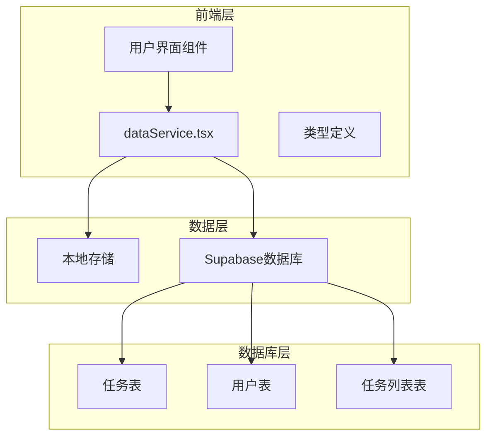
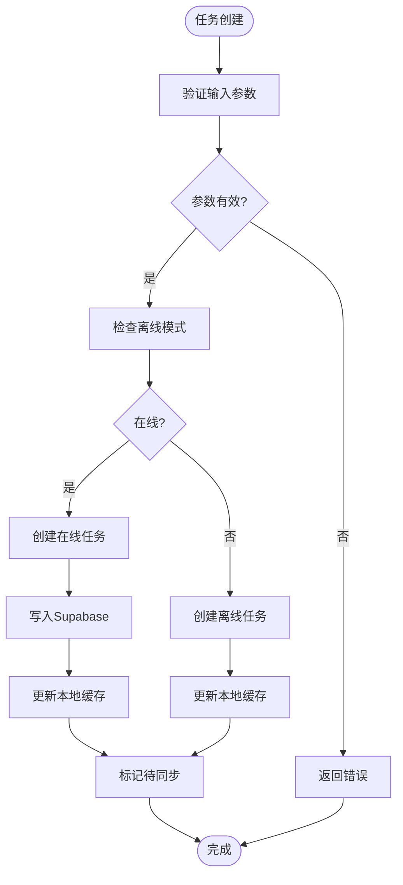
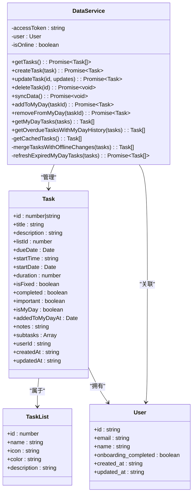
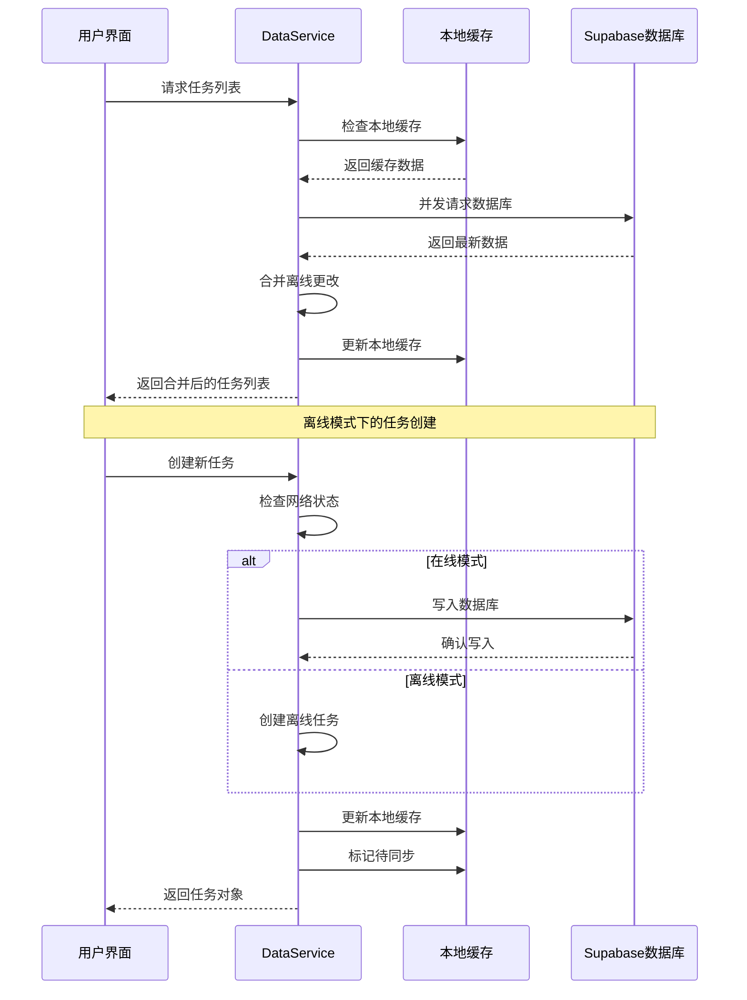
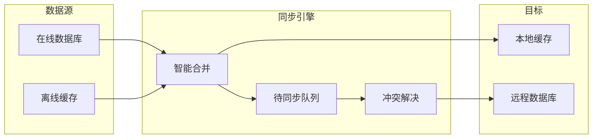
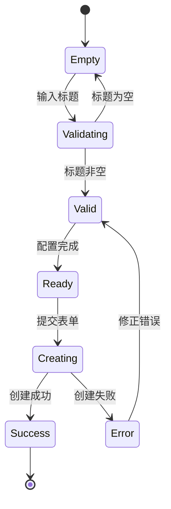
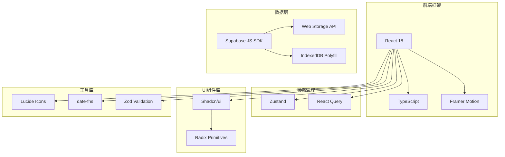
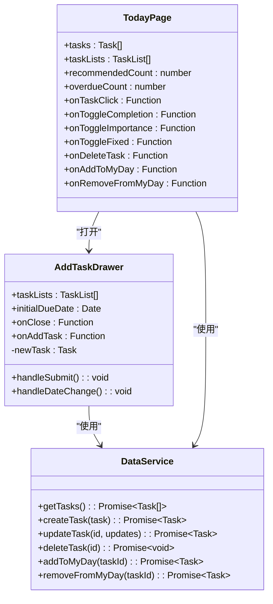
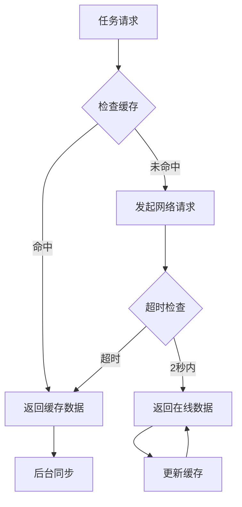

# 任务数据模型

<cite>
**本文档引用的文件**
- [dataService.tsx](file://src/utils/dataService.tsx)
- [AddTaskDrawer.tsx](file://src/components/AddTaskDrawer.tsx)
- [TodayPage.tsx](file://src/components/TodayPage.tsx)
- [checkin.ts](file://src/types/checkin.ts)
- [rule.md](file://rule.md)
- [supabase_step1_tables.sql](file://supabase_step1_tables.sql)
- [client.ts](file://src/utils/supabase/client.ts)
</cite>

## 目录
1. [简介](#简介)
2. [项目结构概览](#项目结构概览)
3. [核心数据模型](#核心数据模型)
4. [架构概览](#架构概览)
5. [详细组件分析](#详细组件分析)
6. [依赖关系分析](#依赖关系分析)
7. [性能考虑](#性能考虑)
8. [故障排除指南](#故障排除指南)
9. [结论](#结论)

## 简介

Focus应用的任务数据模型是一个复杂而完整的任务管理系统，设计用于支持现代任务管理的核心需求。该系统采用React + TypeScript + Supabase的技术栈，提供了强大的离线支持、实时同步和智能数据管理功能。

任务数据模型不仅包含了基本的任务属性（标题、描述、截止日期等），还引入了创新的概念如"My Day"功能，允许用户将特定任务标记为当天的重点任务。系统通过本地缓存机制确保离线可用性，并通过智能同步策略保证数据一致性。

## 项目结构概览



**图表来源**
- [dataService.tsx](file://src/utils/dataService.tsx#L1-L50)
- [client.ts](file://src/utils/supabase/client.ts#L1-L12)

**章节来源**
- [dataService.tsx](file://src/utils/dataService.tsx#L1-L879)
- [client.ts](file://src/utils/supabase/client.ts#L1-L12)

## 核心数据模型

### Task接口定义

Task接口是整个系统的核心数据结构，包含了任务的所有必要属性：

```typescript
export interface Task {
  id: number | string;                    // 唯一标识符，支持数字和字符串
  title: string;                          // 任务标题
  description: string;                    // 任务描述
  listId: number;                         // 关联的任务列表ID
  dueDate: Date;                          // 截止日期
  startTime: string;                      // 开始时间 (HH:mm格式)
  startDate?: Date;                       // 开始日期 (可选)
  duration: number;                       // 持续时间（分钟）
  isFixed: boolean;                       // 是否为固定时间任务
  completed: boolean;                     // 完成状态
  important: boolean;                     // 重要性标记
  isMyDay: boolean;                       // 是否在MyDay中
  addedToMyDayAt?: Date;                 // 添加到MyDay的时间戳
  notes: string;                          // 备注信息
  subtasks?: Array<{                    // 子任务数组
    id: number;
    title: string;
    completed: boolean;
  }>;
  userId?: string;                       // 用户ID
  createdAt?: string;                    // 创建时间
  updatedAt?: string;                    // 更新时间
}
```

### 数据类型约束

系统对各种数据类型实施严格的约束：

- **ID类型**: 支持数字和字符串，字符串ID以"offline_"前缀标识离线任务
- **日期时间**: 使用JavaScript Date对象，确保时区正确处理
- **布尔值**: 所有状态字段都有明确的默认值
- **字符串长度**: 标题和描述字段没有硬性长度限制，但建议保持合理长度
- **数值范围**: 持续时间最小为1分钟，最大为合理的工作时段

### 业务规则和约束



**图表来源**
- [dataService.tsx](file://src/utils/dataService.tsx#L542-L581)
- [dataService.tsx](file://src/utils/dataService.tsx#L583-L595)

**章节来源**
- [dataService.tsx](file://src/utils/dataService.tsx#L15-L35)
- [rule.md](file://rule.md#L26-L65)

## 架构概览

### 整体架构设计



**图表来源**
- [dataService.tsx](file://src/utils/dataService.tsx#L37-L879)
- [dataService.tsx](file://src/utils/dataService.tsx#L15-L35)

### 数据流架构



**图表来源**
- [dataService.tsx](file://src/utils/dataService.tsx#L300-L350)
- [dataService.tsx](file://src/utils/dataService.tsx#L542-L581)

**章节来源**
- [dataService.tsx](file://src/utils/dataService.tsx#L37-L879)

## 详细组件分析

### 数据服务组件

DataService类是整个任务管理系统的核心控制器，负责协调数据的获取、更新和同步：

#### 核心功能模块

1. **任务生命周期管理**
   - 创建任务（支持在线和离线模式）
   - 更新任务状态和属性
   - 删除任务（软删除机制）
   - 查询任务列表

2. **离线支持机制**
   - 本地缓存管理
   - 待同步队列处理
   - 网络状态检测
   - 智能数据合并

3. **MyDay功能实现**
   - MyDay任务筛选
   - 过期任务自动刷新
   - MyDay任务排序算法

#### 数据同步策略



**图表来源**
- [dataService.tsx](file://src/utils/dataService.tsx#L400-L450)
- [dataService.tsx](file://src/utils/dataService.tsx#L750-L800)

### 任务列表组件

AddTaskDrawer组件提供了完整的任务创建界面，支持复杂的任务配置：

#### 功能特性

- **多维度任务配置**: 支持固定时间和浮动时间任务
- **子任务管理**: 可添加多个子任务
- **列表选择**: 支持将任务分配到不同列表
- **视觉反馈**: 重要任务有醒目的黄色星标
- **日期时间选择**: 提供直观的日期和时间选择器

#### 表单验证机制



**图表来源**
- [AddTaskDrawer.tsx](file://src/components/AddTaskDrawer.tsx#L50-L80)
- [AddTaskDrawer.tsx](file://src/components/AddTaskDrawer.tsx#L200-L250)

### 今日页面组件

TodayPage组件展示了MyDay任务的主界面，实现了丰富的交互功能：

#### 交互功能

1. **手势操作**
   - 长按切换固定时间
   - 左滑删除任务
   - 右滑移除MyDay

2. **视觉反馈**
   - 完成状态的视觉变化
   - 固定任务的蓝色高亮
   - 重要任务的星标效果

3. **智能排序**
   - 按时间顺序排列
   - 固定任务优先
   - 重要性排序

#### 排序算法实现

```typescript
// MyDay任务排序算法
getMyDayTasks(allTasks: Task[]): Task[] {
  return allTasks
    .filter(task => task.isMyDay && !task.completed)
    .sort((a, b) => {
      // 先按时间排序
      if (a.startTime && b.startTime) {
        const timeA = a.startTime.split(":").map(Number);
        const timeB = b.startTime.split(":").map(Number);
        const minutesA = timeA[0] * 60 + timeA[1];
        const minutesB = timeB[0] * 60 + timeB[1];
        return minutesA - minutesB;
      }
      // Fixed任务优先
      if (a.isFixed && a.startTime && (!b.isFixed || !b.startTime)) {
        return -1;
      }
      if (b.isFixed && b.startTime && (!a.isFixed || !a.startTime)) {
        return 1;
      }
      // 然后按重要性
      if (a.important !== b.important) {
        return b.important ? 1 : -1;
      }
      return 0;
    });
}
```

**章节来源**
- [dataService.tsx](file://src/utils/dataService.tsx#L828-L878)
- [AddTaskDrawer.tsx](file://src/components/AddTaskDrawer.tsx#L1-L339)
- [TodayPage.tsx](file://src/components/TodayPage.tsx#L1-L535)

## 依赖关系分析

### 技术栈依赖



**图表来源**
- [package.json](file://package.json#L1-L50)
- [dataService.tsx](file://src/utils/dataService.tsx#L1-L10)

### 组件间依赖关系



**图表来源**
- [AddTaskDrawer.tsx](file://src/components/AddTaskDrawer.tsx#L30-L50)
- [TodayPage.tsx](file://src/components/TodayPage.tsx#L35-L65)
- [dataService.tsx](file://src/utils/dataService.tsx#L37-L879)

**章节来源**
- [AddTaskDrawer.tsx](file://src/components/AddTaskDrawer.tsx#L1-L339)
- [TodayPage.tsx](file://src/components/TodayPage.tsx#L1-L535)

## 性能考虑

### 缓存策略优化

系统采用了多层次的缓存策略来提升性能：

1. **本地存储缓存**
   - 任务列表缓存：减少数据库查询
   - 用户会话缓存：避免重复认证
   - 待同步队列缓存：保证数据持久性

2. **智能数据合并**
   - 优先保留本地离线更改
   - 避免不必要的网络请求
   - 批量处理待同步操作

3. **内存优化**
   - 任务列表分页加载
   - 虚拟滚动支持大量任务
   - 懒加载子任务数据

### 网络优化



**图表来源**
- [dataService.tsx](file://src/utils/dataService.tsx#L300-L350)

## 故障排除指南

### 常见问题及解决方案

1. **离线任务无法同步**
   - 检查网络连接状态
   - 验证用户认证状态
   - 查看待同步队列内容

2. **MyDay任务显示异常**
   - 检查任务的isMyDay标志
   - 验证addedToMyDayAt时间戳
   - 确认任务未被标记为完成

3. **任务创建失败**
   - 验证必需字段完整性
   - 检查数据库连接状态
   - 查看控制台错误日志

### 调试工具

系统提供了丰富的调试功能：

```typescript
// 启用调试模式
console.log('DataService: Current state', {
  isOnline: this.isOnline,
  user: this.user,
  pendingChanges: this.hasPendingChanges(),
  lastSync: this.getLastSyncTime()
});
```

**章节来源**
- [dataService.tsx](file://src/utils/dataService.tsx#L800-L820)

## 结论

Focus应用的任务数据模型展现了现代任务管理系统的最佳实践。通过精心设计的数据结构、智能的缓存策略和强大的离线支持，系统能够为用户提供流畅、可靠的任务管理体验。

### 主要优势

1. **数据一致性**: 通过智能合并算法确保本地和远程数据的一致性
2. **离线可用性**: 完整的离线支持确保随时随地的任务管理
3. **实时同步**: 实时的数据同步机制保证多设备间的数据一致性
4. **扩展性**: 模块化的设计便于功能扩展和维护

### 未来发展方向

1. **性能优化**: 进一步优化大数据量场景下的渲染性能
2. **功能增强**: 添加更多高级任务管理功能
3. **用户体验**: 改进手势操作和视觉反馈
4. **数据分析**: 集成任务完成率和效率分析功能

这个任务数据模型不仅满足了当前的功能需求，还为未来的扩展奠定了坚实的基础。通过持续的优化和改进，它将继续为用户提供卓越的任务管理体验。