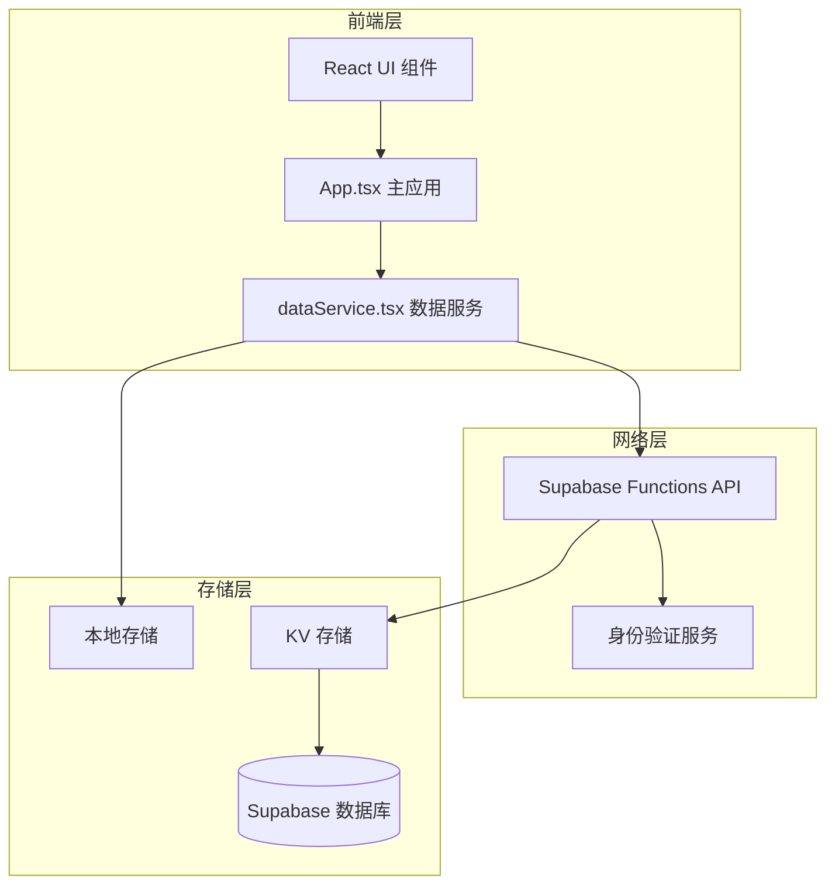
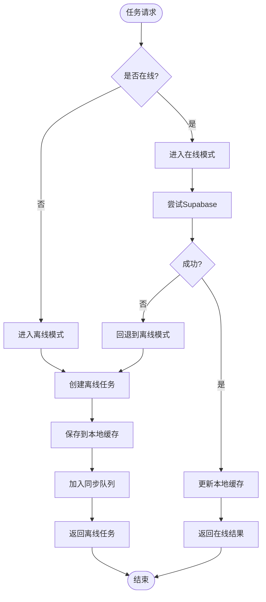
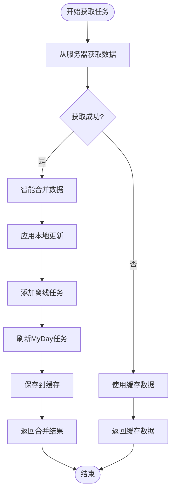
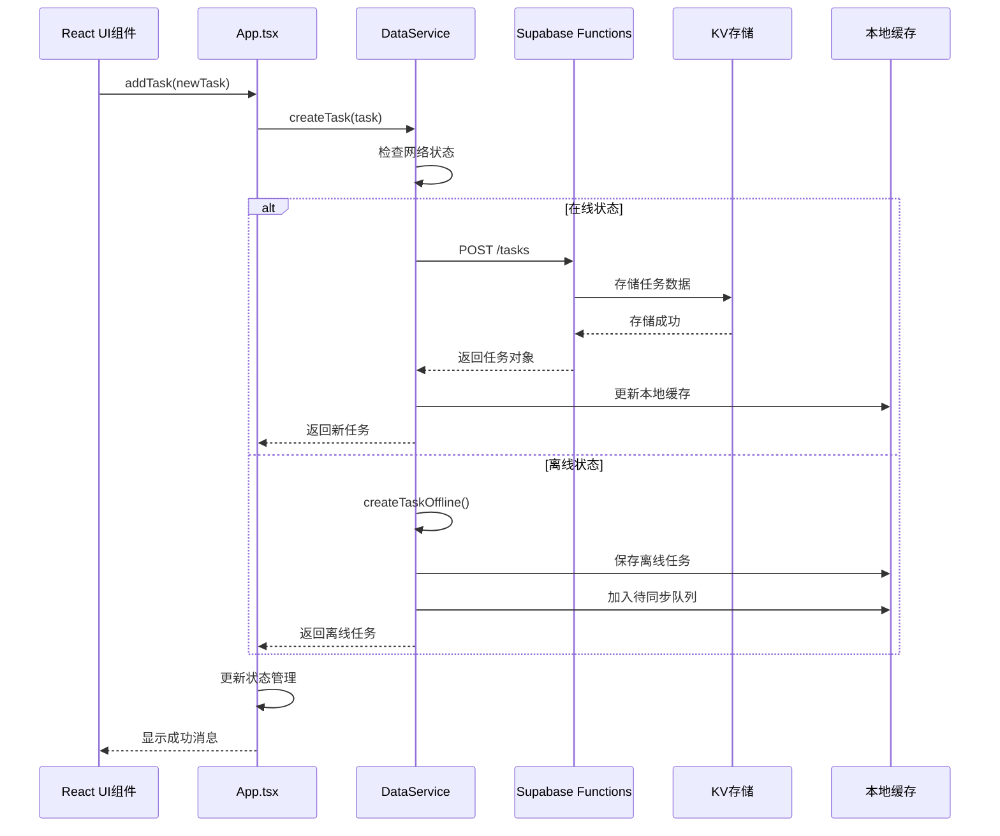
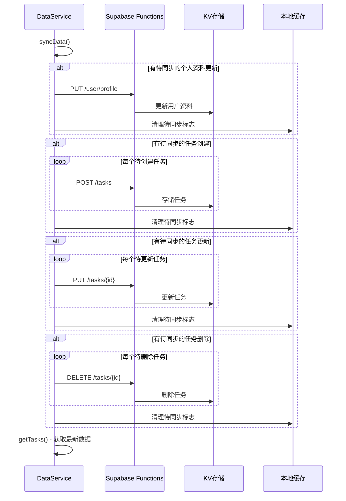

# 任务服务接口详细文档

<cite>
**本文档引用的文件**
- [dataService.tsx](file://src/utils/dataService.tsx)
- [App.tsx](file://src/App.tsx)
- [index.tsx](file://src/supabase/functions/server/index.tsx)
- [kv_store.tsx](file://src/supabase/functions/server/kv_store.tsx)
- [client.ts](file://src/utils/supabase/client.ts)
- [info.tsx](file://src/utils/supabase/info.tsx)
</cite>

## 目录
1. [简介](#简介)
2. [项目架构概览](#项目架构概览)
3. [核心数据结构](#核心数据结构)
4. [离线优先策略](#离线优先策略)
5. [任务服务接口详解](#任务服务接口详解)
6. [调用序列图](#调用序列图)
7. [错误处理机制](#错误处理机制)
8. [性能优化考虑](#性能优化考虑)
9. [常见使用场景](#常见使用场景)
10. [故障排除指南](#故障排除指南)
11. [总结](#总结)

## 简介

本文档深入分析Focus应用的任务服务接口系统，重点关注dataService.tsx中提供的核心功能：createTask、updateTask、deleteTask、fetchTasks等方法的实现细节。该系统采用离线优先策略，确保用户在任何网络状态下都能正常工作，并通过智能同步机制保证数据一致性。

## 项目架构概览



**图表来源**
- [dataService.tsx](file://src/utils/dataService.tsx#L1-L50)
- [App.tsx](file://src/App.tsx#L500-L600)
- [index.tsx](file://src/supabase/functions/server/index.tsx#L1-L50)

## 核心数据结构

### Task 接口定义

```typescript
interface Task {
  id: number | string;
  title: string;
  description: string;
  listId: number;
  dueDate: Date;
  startTime: string;
  startDate?: Date;
  duration: number;
  isFixed: boolean;
  completed: boolean;
  important: boolean;
  isMyDay: boolean;
  addedToMyDayAt?: Date;
  notes: string;
  subtasks?: Array<{
    id: number;
    title: string;
    completed: boolean;
  }>;
  userId?: string;
  createdAt?: string;
  updatedAt?: string;
}
```

### TaskList 接口定义

```typescript
interface TaskList {
  id: number;
  name: string;
  icon: string;
  color: string;
  description: string;
}
```

### User 接口定义

```typescript
interface User {
  id: string;
  email: string;
  name: string;
  onboarding_completed: boolean;
  created_at?: string;
  updated_at?: string;
}
```

**章节来源**
- [dataService.tsx](file://src/utils/dataService.tsx#L10-L45)

## 离线优先策略

### 离线状态检测

系统通过以下方式检测网络状态：

```typescript
private isOnline: boolean = navigator.onLine;

constructor() {
  // 监听在线/离线事件
  window.addEventListener('online', () => {
    this.isOnline = true;
    this.syncData();
  });
  
  window.addEventListener('offline', () => {
    this.isOnline = false;
  });
}
```

### 本地缓存机制

系统使用localStorage进行本地数据持久化：

```typescript
// 缓存键命名规范
taskmaster_tasks          // 任务列表缓存
taskmaster_user           // 用户信息缓存
taskmaster_token          // 认证令牌缓存
taskmaster_pending_creates // 待创建任务队列
taskmaster_pending_updates // 待更新任务队列
taskmaster_pending_deletes // 待删除任务队列
taskmaster_last_sync      // 最后同步时间
```

### 离线任务处理流程



**图表来源**
- [dataService.tsx](file://src/utils/dataService.tsx#L575-L612)
- [dataService.tsx](file://src/utils/dataService.tsx#L615-L670)

**章节来源**
- [dataService.tsx](file://src/utils/dataService.tsx#L50-L80)
- [dataService.tsx](file://src/utils/dataService.tsx#L575-L612)

## 任务服务接口详解

### createTask 方法

#### 输入参数
- `task: Omit<Task, 'id' | 'userId' | 'createdAt' | 'updatedAt'>` - 要创建的任务对象，不包含id、userId等自动生成字段

#### 返回值
- `Promise<Task>` - 创建成功的任务对象

#### 实现细节

```typescript
async createTask(task: Omit<Task, 'id' | 'userId' | 'createdAt' | 'updatedAt'>): Promise<Task> {
  try {
    // 尝试使用Supabase创建
    const { data, error } = await supabase
      .from('tasks')
      .insert({
        title: task.title,
        description: task.description || '',
        list_id: task.listId,
        due_date: task.dueDate.toISOString(),
        start_time: task.startTime || '',
        start_date: task.startDate ? task.startDate.toISOString() : null,
        duration: task.duration,
        is_fixed: task.isFixed,
        completed: task.completed,
        important: task.important,
        is_my_day: task.isMyDay || false,
        added_to_my_day_at: task.addedToMyDayAt ? task.addedToMyDayAt.toISOString() : null,
        notes: task.notes || '',
        subtasks: task.subtasks || [],
        user_id: this.user?.id
      })
      .select()
      .single();
    
    if (error) {
      throw error;
    }
    
    // 处理成功结果
    const newTask: Task = {
      id: data.id,
      title: data.title,
      description: data.description || '',
      listId: data.list_id,
      dueDate: new Date(data.due_date),
      startTime: data.start_time || '',
      startDate: data.start_date ? new Date(data.start_date) : undefined,
      duration: data.duration,
      isFixed: data.is_fixed,
      completed: data.completed,
      important: data.important,
      isMyDay: data.is_my_day || false,
      addedToMyDayAt: data.added_to_my_day_at ? new Date(data.added_to_my_day_at) : undefined,
      notes: data.notes || '',
      subtasks: data.subtasks || [],
      userId: data.user_id,
      createdAt: data.created_at,
      updatedAt: data.updated_at
    };
    
    // 更新本地缓存
    const cachedTasks = this.getCachedTasks();
    cachedTasks.push(newTask);
    this.saveToCache('taskmaster_tasks', cachedTasks);
    
    return newTask;
  } catch (error) {
    // 回退到离线创建
    return this.createTaskOffline(task);
  }
}
```

#### 错误处理机制
- **网络错误**：当Supabase调用失败时，自动回退到离线模式
- **数据验证错误**：由Supabase数据库约束处理
- **权限错误**：401错误会被特别处理并抛出

### updateTask 方法

#### 输入参数
- `id: string | number` - 要更新的任务ID
- `updates: Partial<Task>` - 要更新的任务字段

#### 返回值
- `Promise<Task>` - 更新后的任务对象

#### 实现特点
- 支持部分字段更新
- 自动区分在线和离线任务
- 智能合并本地和远程数据

### deleteTask 方法

#### 输入参数
- `id: string | number` - 要删除的任务ID

#### 返回值
- `Promise<void>` - 无返回值

#### 同步策略
- 在线时立即删除并同步到服务器
- 离线时仅从本地缓存移除，标记待同步

### fetchTasks 方法

#### 功能特性
- 智能合并服务器数据和本地离线更改
- MyDay任务过期检查和自动刷新
- 超时保护机制
- RLS策略兼容性处理

#### 合并算法



**图表来源**
- [dataService.tsx](file://src/utils/dataService.tsx#L340-L435)

**章节来源**
- [dataService.tsx](file://src/utils/dataService.tsx#L540-L580)
- [dataService.tsx](file://src/utils/dataService.tsx#L615-L670)
- [dataService.tsx](file://src/utils/dataService.tsx#L671-L715)

## 调用序列图

### 创建任务完整调用链



**图表来源**
- [App.tsx](file://src/App.tsx#L580-L595)
- [dataService.tsx](file://src/utils/dataService.tsx#L540-L580)

### 同步数据完整流程



**图表来源**
- [dataService.tsx](file://src/utils/dataService.tsx#L730-L810)

## 错误处理机制

### 网络错误处理

```typescript
try {
  const response = await fetch(url, { ...options, headers });
  
  if (!response.ok) {
    const errorData = await response.json().catch(() => ({}));
    
    // 特别处理401错误
    if (response.status === 401) {
      console.warn(`401 Unauthorized for ${endpoint}: Token may be invalid or expired`);
      throw new Error(`HTTP 401 - Unauthorized (${errorData.error || 'Token invalid'})`);
    }
    
    throw new Error(errorData.error || `HTTP ${response.status}`);
  }
  
  return await response.json();
} catch (error) {
  if (!this.isOnline) {
    throw new Error('You are offline. Please check your connection.');
  }
  throw error;
}
```

### MyDay任务过期处理

系统自动检测并处理MyDay任务过期情况：

```typescript
private async refreshExpiredMyDayTasks(tasks: Task[]): Promise<Task[]> {
  const today = new Date();
  today.setHours(0, 0, 0, 0);
  
  const expiredMyDayTasks: Task[] = [];
  const refreshedTasks: Task[] = [];
  
  for (const task of tasks) {
    if (task.isMyDay && task.addedToMyDayAt) {
      const addedDate = new Date(task.addedToMyDayAt);
      addedDate.setHours(0, 0, 0, 0);
      
      // 如果添加日期在今天之前且任务未完成，则认为过期
      if (addedDate < today && !task.completed) {
        const expiredTask = {
          ...task,
          isMyDay: false,
          addedToMyDayAt: undefined
        };
        
        expiredMyDayTasks.push(expiredTask);
        refreshedTasks.push(expiredTask);
      } else {
        refreshedTasks.push(task);
      }
    } else {
      refreshedTasks.push(task);
    }
  }
  
  // 批量更新过期任务
  if (expiredMyDayTasks.length > 0) {
    for (const expiredTask of expiredMyDayTasks) {
      await supabase
        .from('tasks')
        .update({
          is_my_day: false,
          added_to_my_day_at: null
        })
        .eq('id', expiredTask.id);
    }
  }
  
  return refreshedTasks;
}
```

**章节来源**
- [dataService.tsx](file://src/utils/dataService.tsx#L120-L150)
- [dataService.tsx](file://src/utils/dataService.tsx#L467-L520)

## 性能优化考虑

### 超时保护机制

```typescript
// 获取任务时的超时保护 - 2秒超时
const timeoutPromise = new Promise((_, reject) => {
  setTimeout(() => reject(new Error('getTasks timeout after 2 seconds')), 2000);
});

const queryPromise = supabase
  .from('tasks')
  .select('*')
  .order('created_at', { ascending: false });

const result = await Promise.race([queryPromise, timeoutPromise]);
```

### 批量同步优化

- **批量更新**：将多个待同步操作合并为单次网络请求
- **异步处理**：同步过程不会阻塞主线程
- **错误隔离**：单个操作失败不影响其他操作

### 内存管理

- **智能缓存**：只缓存必要的数据
- **定期清理**：清理过期的离线数据
- **内存泄漏防护**：及时清理事件监听器

## 常见使用场景

### 场景1：快速添加任务

```typescript
// 快速添加任务到默认列表
const addQuickTask = async (title: string) => {
  const newTask = {
    title,
    description: "",
    listId: DEFAULT_LIST_ID,
    dueDate: new Date(),
    startTime: "",
    duration: 60,
    isFixed: false,
    completed: false,
    important: false,
    isMyDay: false,
    notes: ""
  };
  
  try {
    const task = await dataService.createTask(newTask);
    setTasks(prev => [...prev, task]);
    toast.success("任务已添加");
  } catch (error) {
    toast.error("添加任务失败");
  }
};
```

### 场景2：编辑任务属性

```typescript
// 切换任务重要性
const toggleImportant = async (taskId: string) => {
  try {
    const task = tasks.find(t => t.id === taskId);
    if (!task) return;
    
    const updatedTask = await dataService.updateTask(taskId, {
      important: !task.important
    });
    
    setTasks(prev => prev.map(t => 
      t.id === taskId ? updatedTask : t
    ));
  } catch (error) {
    toast.error("更新任务失败");
  }
};
```

### 场景3：批量操作

```typescript
// 批量完成任务
const completeMultipleTasks = async (taskIds: string[]) => {
  const promises = taskIds.map(taskId => 
    dataService.updateTask(taskId, { completed: true })
  );
  
  try {
    const results = await Promise.all(promises);
    setTasks(prev => prev.map(task => 
      taskIds.includes(task.id.toString()) 
        ? { ...task, completed: true } 
        : task
    ));
    toast.success("批量完成任务成功");
  } catch (error) {
    toast.error("批量完成任务失败");
  }
};
```

### 场景4：离线工作流

```typescript
// 离线添加任务并等待同步
const addOfflineTask = async (taskData: Omit<Task, 'id'>) => {
  try {
    // 立即显示在界面上
    const offlineTask = await dataService.createTask(taskData);
    setTasks(prev => [...prev, offlineTask]);
    
    // 等待自动同步
    const syncStatus = await waitForSync();
    
    if (syncStatus.success) {
      toast.success("任务已同步到云端");
    } else {
      toast.warning("任务将在网络恢复时同步");
    }
  } catch (error) {
    toast.error("离线任务添加失败");
  }
};
```

## 故障排除指南

### 常见问题及解决方案

#### 1. 网络连接问题

**症状**：任务操作超时或失败
**解决方案**：
- 检查网络连接状态
- 验证Supabase URL和API密钥
- 查看浏览器控制台错误信息

#### 2. 认证失败

**症状**：401 Unauthorized错误
**解决方案**：
- 检查用户会话是否有效
- 重新登录验证
- 清理本地缓存的认证信息

#### 3. 数据同步冲突

**症状**：本地数据与服务器数据不一致
**解决方案**：
- 执行手动同步操作
- 检查待同步队列状态
- 重置本地缓存

#### 4. MyDay任务异常

**症状**：MyDay任务显示异常或过期
**解决方案**：
- 系统会自动检测并修复过期任务
- 手动刷新任务列表
- 检查任务添加时间戳

### 调试工具

```typescript
// 获取调试信息
const getDebugInfo = () => {
  return {
    isOnline: dataService.isOnline,
    isAuthenticated: dataService.isAuthenticated(),
    pendingChanges: dataService.hasPendingChanges(),
    lastSync: dataService.getLastSyncTime(),
    cachedTasksCount: dataService.getCachedTasks().length,
    user: dataService.getCurrentUser()
  };
};

// 强制同步
const forceSync = async () => {
  try {
    await dataService.syncData();
    toast.success("数据同步完成");
  } catch (error) {
    toast.error("同步失败：" + error.message);
  }
};
```

**章节来源**
- [dataService.tsx](file://src/utils/dataService.tsx#L790-L820)

## 总结

Focus应用的任务服务接口系统通过精心设计的离线优先策略，为用户提供了无缝的使用体验。主要特点包括：

### 核心优势

1. **离线优先**：确保在任何网络状态下都能正常工作
2. **智能同步**：自动处理数据冲突和同步问题
3. **高性能**：超时保护和批量操作优化
4. **可靠性**：完善的错误处理和故障恢复机制

### 技术亮点

- **多层缓存策略**：结合本地存储和待同步队列
- **智能合并算法**：保护本地离线更改的同时保持数据一致性
- **MyDay自动管理**：智能检测和处理过期任务
- **渐进式增强**：从基础功能逐步扩展高级特性

### 最佳实践建议

1. **错误处理**：始终包装API调用在try-catch块中
2. **状态管理**：及时更新本地状态以提升用户体验
3. **性能监控**：定期检查同步状态和缓存大小
4. **用户教育**：向用户解释离线工作原理和同步机制

该系统为现代移动应用提供了优秀的离线数据管理解决方案，值得在类似项目中借鉴和应用。