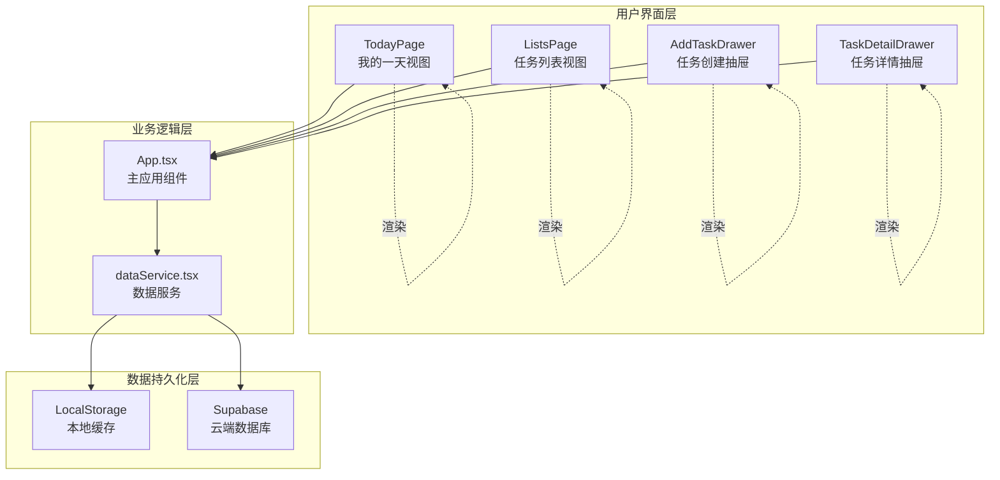

# 任务管理功能实现机制详解

<cite>
**本文档引用的文件**
- [TodayPage.tsx](file://src/components/TodayPage.tsx)
- [ListsPage.tsx](file://src/components/ListsPage.tsx)
- [AddTaskDrawer.tsx](file://src/components/AddTaskDrawer.tsx)
- [TaskDetailDrawer.tsx](file://src/components/TaskDetailDrawer.tsx)
- [dataService.tsx](file://src/utils/dataService.tsx)
- [App.tsx](file://src/App.tsx)
</cite>

## 目录
1. [简介](#简介)
2. [项目架构概览](#项目架构概览)
3. [核心组件分析](#核心组件分析)
4. [离线优先策略](#离线优先策略)
5. [任务状态流转](#任务状态流转)
6. [数据同步机制](#数据同步机制)
7. [用户认证集成](#用户认证集成)
8. [性能优化策略](#性能优化策略)
9. [故障排除指南](#故障排除指南)
10. [总结](#总结)

## 简介

本系统是一个现代化的任务管理应用，采用React + TypeScript技术栈，实现了完整的任务生命周期管理功能。系统的核心特色在于其离线优先的设计理念，确保用户在任何网络环境下都能流畅使用应用，并通过智能同步机制保证数据一致性。

## 项目架构概览



**图表来源**
- [App.tsx](file://src/App.tsx#L1-L50)
- [dataService.tsx](file://src/utils/dataService.tsx#L1-L50)

## 核心组件分析

### TodayPage.tsx - 我的一天视图

TodayPage是系统的核心视图组件，负责展示用户的今日任务。该组件实现了丰富的交互功能，包括任务长按、滑动操作、任务固定等功能。


**图表来源**
- [TodayPage.tsx](file://src/components/TodayPage.tsx#L1-L100)
- [dataService.tsx](file://src/utils/dataService.tsx#L20-L50)

#### 主要功能特性

1. **智能任务过滤**：根据MyDay状态、完成状态和重要性进行智能排序
2. **手势交互**：支持长按固定任务、左右滑动删除或移除MyDay
3. **实时状态更新**：任务状态变更即时反映在UI上
4. **视觉反馈**：通过动画效果提供良好的用户体验

**章节来源**
- [TodayPage.tsx](file://src/components/TodayPage.tsx#L1-L535)

### ListsPage.tsx - 任务列表组织

ListsPage提供了任务的分类视图，允许用户按列表查看和管理任务。


**图表来源**
- [ListsPage.tsx](file://src/components/ListsPage.tsx#L1-L200)
- [dataService.tsx](file://src/utils/dataService.tsx#L300-L400)

**章节来源**
- [ListsPage.tsx](file://src/components/ListsPage.tsx#L1-L679)

### AddTaskDrawer.tsx - 任务创建界面

AddTaskDrawer提供了完整的任务创建体验，支持多种任务属性配置。


**图表来源**
- [AddTaskDrawer.tsx](file://src/components/AddTaskDrawer.tsx#L1-L100)
- [dataService.tsx](file://src/utils/dataService.tsx#L450-L550)

**章节来源**
- [AddTaskDrawer.tsx](file://src/components/AddTaskDrawer.tsx#L1-L339)

### TaskDetailDrawer.tsx - 任务详情编辑

TaskDetailDrawer提供了任务的详细信息查看和编辑功能。

**章节来源**
- [TaskDetailDrawer.tsx](file://src/components/TaskDetailDrawer.tsx#L1-L458)

## 离线优先策略

系统采用了先进的离线优先设计，确保在网络不稳定的情况下仍能提供流畅的用户体验。

### 本地缓存架构


**图表来源**
- [dataService.tsx](file://src/utils/dataService.tsx#L100-L200)

### 离线任务处理流程

1. **任务创建**：当网络不可用时，任务会被标记为离线状态并保存到本地缓存
2. **状态跟踪**：系统会跟踪所有待同步的操作（创建、更新、删除）
3. **自动重试**：网络恢复后自动同步所有待处理的变更
4. **冲突解决**：智能合并本地和服务器端的数据差异

**章节来源**
- [dataService.tsx](file://src/utils/dataService.tsx#L450-L600)

## 任务状态流转

系统定义了完整任务生命周期的状态管理机制。


**图表来源**
- [dataService.tsx](file://src/utils/dataService.tsx#L600-L700)

### MyDay功能实现

MyDay是系统的核心功能之一，用于突出显示当天的重要任务。

```typescript
// MyDay任务获取逻辑
getMyDayTasks(allTasks: Task[]): Task[] {
  return allTasks
    .filter(task => task.isMyDay && !task.completed)
    .sort((a, b) => {
      // 先按时间排序
      if (a.startTime && b.startTime) {
        const timeA = a.startTime.split(":").map(Number);
        const timeB = b.startTime.split(":").map(Number);
        const minutesA = timeA[0] * 60 + timeA[1];
        const minutesB = timeB[0] * 60 + timeB[1];
        return minutesA - minutesB;
      }
      // Fixed任务优先
      if (a.isFixed && a.startTime && (!b.isFixed || !b.startTime)) {
        return -1;
      }
      if (b.isFixed && b.startTime && (!a.isFixed || !a.startTime)) {
        return 1;
      }
      // 然后按重要性
      if (a.important !== b.important) {
        return b.important ? 1 : -1;
      }
      return 0;
    });
}
```

**章节来源**
- [dataService.tsx](file://src/utils/dataService.tsx#L800-L878)

## 数据同步机制

系统实现了智能的数据同步机制，确保本地和云端数据的一致性。

### 同步策略


**图表来源**
- [dataService.tsx](file://src/utils/dataService.tsx#L750-L850)

### 冲突处理机制

系统采用乐观并发控制策略处理数据冲突：

1. **版本比较**：比较本地和服务器端的更新时间戳
2. **智能合并**：优先保留用户最近的修改
3. **冲突标记**：对无法自动解决的冲突进行标记
4. **用户介入**：提供用户手动解决冲突的界面

**章节来源**
- [dataService.tsx](file://src/utils/dataService.tsx#L750-L879)

## 用户认证集成

系统与Supabase认证服务深度集成，实现了完整的用户身份验证和授权机制。

### 认证流程


**图表来源**
- [App.tsx](file://src/App.tsx#L200-L300)
- [dataService.tsx](file://src/utils/dataService.tsx#L100-L200)

### 用户隔离机制

每个用户的数据完全隔离，确保隐私安全：

- **用户ID绑定**：所有任务都与特定用户ID关联
- **权限控制**：通过Supabase Row Level Security (RLS) 实现数据访问控制
- **会话管理**：自动处理token刷新和过期

**章节来源**
- [App.tsx](file://src/App.tsx#L200-L400)
- [dataService.tsx](file://src/utils/dataService.tsx#L100-L200)

## 性能优化策略

系统采用了多种性能优化技术提升用户体验。

### 渲染优化

1. **虚拟滚动**：对于大量任务列表使用虚拟滚动技术
2. **条件渲染**：仅渲染可见区域的内容
3. **防抖节流**：对频繁触发的操作进行防抖处理
4. **记忆化**：使用React.memo和useMemo优化组件重渲染

### 数据加载优化

1. **分页加载**：大数据集采用分页加载策略
2. **缓存策略**：智能缓存常用数据减少网络请求
3. **预加载**：预测用户行为提前加载可能需要的数据
4. **增量更新**：仅传输变更的数据而非全量数据

## 故障排除指南

### 常见问题及解决方案

#### 同步失败处理

当数据同步失败时，系统会采取以下措施：

1. **错误日志记录**：详细记录同步失败的原因
2. **重试机制**：自动尝试重新同步
3. **用户通知**：通过Toast消息告知用户同步状态
4. **降级处理**：使用本地缓存数据保证功能可用

```typescript
// 同步失败的错误处理示例
try {
  await dataService.syncData();
  toast.success("数据同步成功");
} catch (error) {
  console.error("同步失败:", error);
  toast.error("数据同步失败，请检查网络连接");
  
  // 提供手动重试选项
  setTimeout(() => {
    showRetryDialog();
  }, 2000);
}
```

#### 离线数据恢复

当设备长时间离线后重新联网，系统会执行数据恢复流程：

1. **检测离线时间**：判断离线持续时间
2. **增量同步**：仅同步离线期间的变化
3. **冲突解决**：处理可能的数据冲突
4. **状态验证**：确保数据完整性

#### MyDay过期处理

系统自动处理MyDay任务的过期情况：

```typescript
// MyDay过期检查逻辑
private async refreshExpiredMyDayTasks(tasks: Task[]): Promise<Task[]> {
  const today = new Date();
  today.setHours(0, 0, 0, 0);
  
  const expiredMyDayTasks: Task[] = [];
  
  for (const task of tasks) {
    if (task.isMyDay && task.addedToMyDayAt) {
      const addedDate = new Date(task.addedToMyDayAt);
      addedDate.setHours(0, 0, 0, 0);
      
      if (addedDate < today && !task.completed) {
        // 标记为过期
        expiredMyDayTasks.push({
          ...task,
          isMyDay: false,
          addedToMyDayAt: undefined
        });
      }
    }
  }
  
  // 批量更新过期任务
  if (expiredMyDayTasks.length > 0) {
    await this.batchUpdateExpiredTasks(expiredMyDayTasks);
  }
  
  return tasks;
}
```

**章节来源**
- [dataService.tsx](file://src/utils/dataService.tsx#L450-L550)

## 总结

本任务管理系统展现了现代Web应用开发的最佳实践，通过以下关键技术实现了卓越的用户体验：

### 核心优势

1. **离线优先设计**：确保在网络不稳定环境下的可用性
2. **智能同步机制**：自动处理数据冲突和网络异常
3. **响应式交互**：丰富的手势操作和动画效果
4. **用户隐私保护**：完善的认证和数据隔离机制
5. **性能优化**：多层次的性能优化策略

### 技术亮点

- **TypeScript强类型**：提供编译时错误检查和更好的开发体验
- **React Hooks**：充分利用现代React特性简化状态管理
- **Supabase集成**：快速构建可靠的后端服务
- **Material Design**：提供一致的用户体验设计语言

### 扩展建议

1. **多平台支持**：考虑添加PWA功能支持离线使用
2. **团队协作**：扩展任务共享和协作功能
3. **数据分析**：添加任务完成率和效率分析功能
4. **第三方集成**：支持与日历、邮件等工具的集成

这个任务管理系统不仅满足了基本的功能需求，更通过精心设计的架构和用户体验，为用户提供了高效、可靠的任务管理解决方案。其离线优先的设计理念和智能同步机制，使其能够在各种网络环境下稳定运行，真正实现了"随时随地管理任务"的目标。