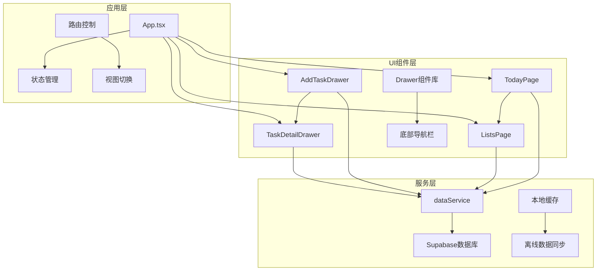
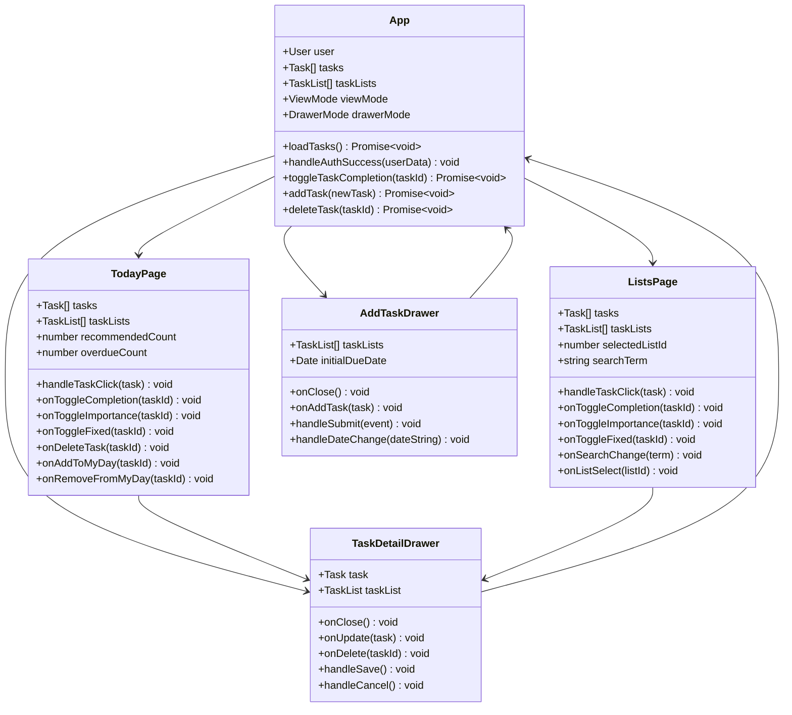
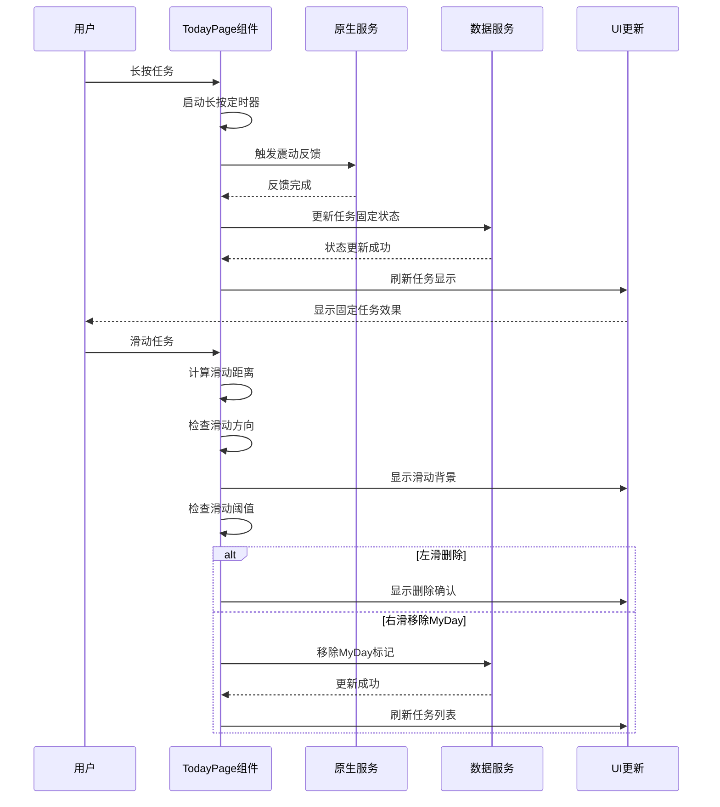
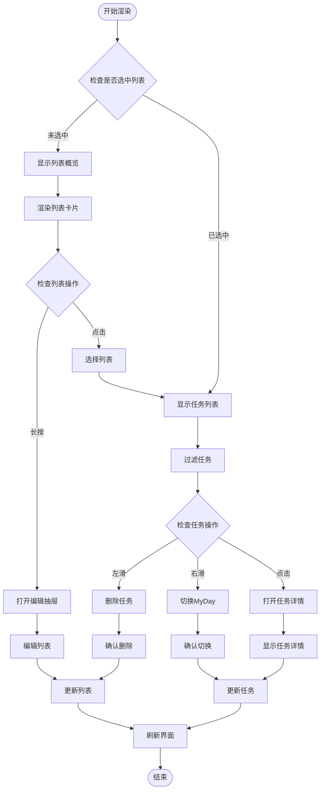
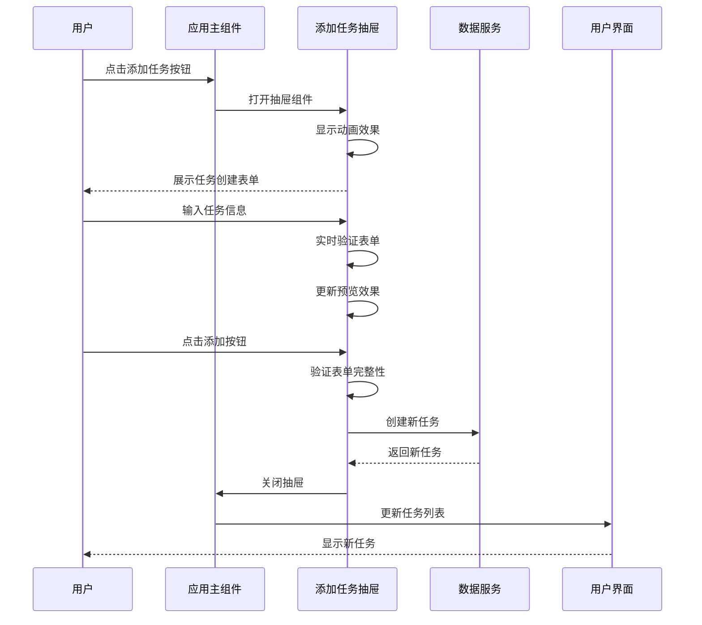
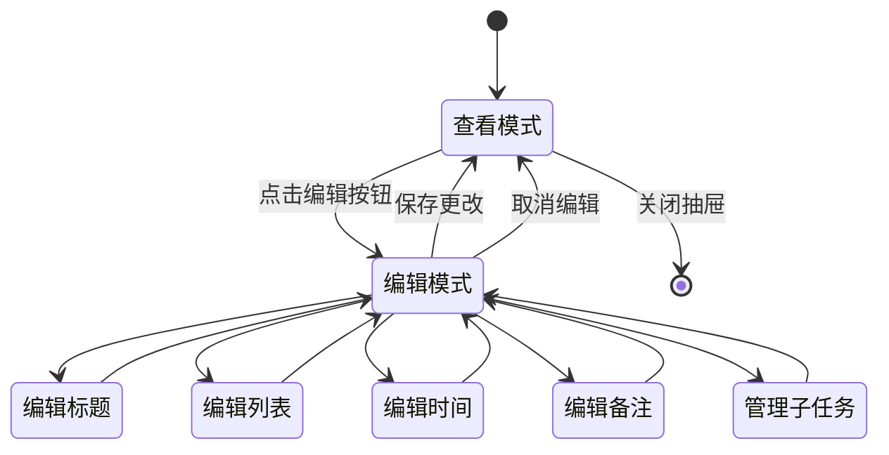
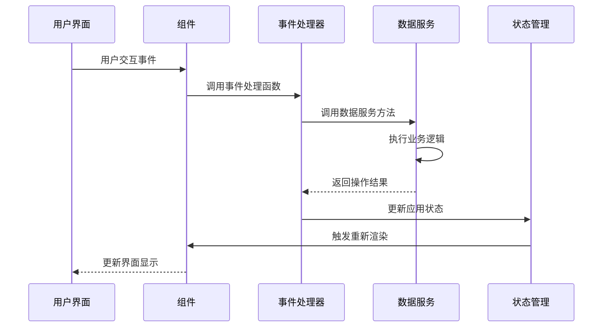

# 任务管理UI组件实现文档

<cite>
**本文档引用的文件**
- [TodayPage.tsx](file://src/components/TodayPage.tsx)
- [ListsPage.tsx](file://src/components/ListsPage.tsx)
- [AddTaskDrawer.tsx](file://src/components/AddTaskDrawer.tsx)
- [TaskDetailDrawer.tsx](file://src/components/TaskDetailDrawer.tsx)
- [dataService.tsx](file://src/utils/dataService.tsx)
- [drawer.tsx](file://src/components/ui/drawer.tsx)
- [App.tsx](file://src/App.tsx)
</cite>

## 目录
1. [简介](#简介)
2. [项目结构概览](#项目结构概览)
3. [核心组件架构](#核心组件架构)
4. [TodayPage组件详解](#todaypage组件详解)
5. [ListsPage组件详解](#listspage组件详解)
6. [AddTaskDrawer组件详解](#addtaskdrawer组件详解)
7. [TaskDetailDrawer组件详解](#taskdetaildrawer组件详解)
8. [状态管理与数据流](#状态管理与数据流)
9. [组件间通信机制](#组件间通信机制)
10. [性能优化策略](#性能优化策略)
11. [故障排除指南](#故障排除指南)
12. [总结](#总结)

## 简介

本文档详细介绍了FocusDo应用中任务管理UI组件的实现，包括TodayPage、ListsPage、AddTaskDrawer和TaskDetailDrawer四个核心组件。这些组件共同构成了一个完整的任务管理系统，支持任务创建、编辑、删除、拖拽排序等功能，并提供了丰富的用户交互体验。

系统采用React Hooks进行状态管理，使用Framer Motion实现动画效果，通过自定义Drawer组件提供模态交互界面，并通过dataService与后端API进行数据同步。

## 项目结构概览



**图表来源**
- [TodayPage.tsx](file://src/components/TodayPage.tsx#L1-L50)
- [ListsPage.tsx](file://src/components/ListsPage.tsx#L1-L50)
- [App.tsx](file://src/App.tsx#L1-L100)

## 核心组件架构

系统的核心组件采用分层架构设计，每个组件都有明确的职责分工：



**图表来源**
- [App.tsx](file://src/App.tsx#L100-L200)
- [TodayPage.tsx](file://src/components/TodayPage.tsx#L30-L80)
- [ListsPage.tsx](file://src/components/ListsPage.tsx#L30-L80)
- [AddTaskDrawer.tsx](file://src/components/AddTaskDrawer.tsx#L30-L60)
- [TaskDetailDrawer.tsx](file://src/components/TaskDetailDrawer.tsx#L30-L60)

## TodayPage组件详解

TodayPage是应用的主要视图之一，专门用于展示用户的"我的一天"任务列表。该组件实现了复杂的交互功能，包括长按固定任务、滑动删除、拖拽排序等。

### 组件特性

1. **任务列表渲染**：根据任务的开始时间和持续时间进行时间轴布局
2. **手势交互**：支持长按固定任务、左右滑动删除或移除MyDay
3. **实时状态更新**：支持任务完成状态、重要性标记的即时更新
4. **智能提醒**：显示推荐任务和过期任务的数量统计

### 核心实现逻辑

```typescript
// 任务长按处理逻辑
const handleTaskLongPress = async (task: Task) => {
  // 标记长按已激活
  isLongPressActivated.current = true;
  
  // 触发原生震动反馈
  await NativeService.hapticMedium();
  
  onToggleFixed(task.id);
  setPressingTaskId(null);
};

// 滑动处理函数
const handleSwipeStart = (task: Task, event: React.TouchEvent | React.MouseEvent) => {
  const clientX = 'touches' in event ? event.touches[0].clientX : event.clientX;
  const clientY = 'touches' in event ? event.touches[0].clientY : event.clientY;
  
  swipeStartX.current = clientX;
  swipeStartY.current = clientY;
  setSwipingTaskId(task.id);
  setSwipeX(0);
  setSwipeDirection(null);
  isSwipeActive.current = false;
};
```

### 交互流程图



**图表来源**
- [TodayPage.tsx](file://src/components/TodayPage.tsx#L100-L200)
- [TodayPage.tsx](file://src/components/TodayPage.tsx#L250-L350)

**章节来源**
- [TodayPage.tsx](file://src/components/TodayPage.tsx#L1-L535)

## ListsPage组件详解

ListsPage负责展示和管理多个任务列表，提供列表视图和任务详情视图的切换功能。该组件支持列表的长按编辑、任务的滑动操作以及搜索过滤功能。

### 组件特性

1. **列表管理**：支持添加、编辑、删除任务列表
2. **任务筛选**：基于列表ID和搜索词进行任务过滤
3. **进度可视化**：显示列表中任务的完成进度条
4. **响应式设计**：适配不同屏幕尺寸的显示效果

### 列表交互机制

```typescript
// 列表长按处理
const handleListLongPress = (list: TaskList) => {
  setEditingList(list);
  setIsEditListDrawerOpen(true);
  onListLongPress(list.id);
  setPressingListId(null);
};

// 任务长按处理
const handleTaskLongPress = (task: Task) => {
  // 标记长按已激活
  isLongPressActivated.current = true;
  
  // 触发震动反馈
  if (navigator.vibrate) {
    navigator.vibrate(50); // 50ms 震动
  }
  
  onToggleFixed(task.id);
  setPressingTaskId(null);
};
```

### 任务列表渲染流程



**图表来源**
- [ListsPage.tsx](file://src/components/ListsPage.tsx#L150-L250)
- [ListsPage.tsx](file://src/components/ListsPage.tsx#L300-L400)

**章节来源**
- [ListsPage.tsx](file://src/components/ListsPage.tsx#L1-L679)

## AddTaskDrawer组件详解

AddTaskDrawer是一个模态抽屉组件，提供任务创建表单界面。该组件支持复杂任务属性的输入，包括标题、列表选择、时间安排、备注和子任务管理。

### 表单设计特点

1. **动态表单字段**：根据任务类型动态显示相关字段
2. **日期时间选择**：提供直观的日期和时间选择器
3. **子任务管理**：支持动态添加和编辑子任务
4. **实时预览**：表单字段变更时实时更新预览效果

### 表单验证与提交

```typescript
const handleSubmit = (e: React.FormEvent) => {
  e.preventDefault();
  
  if (!newTask.title.trim()) return;
  
  onAddTask({
    ...newTask,
    title: newTask.title.trim(),
    description: "", // Remove description field
    notes: newTask.notes.trim(),
  });
  
  onClose();
};

// 表单字段验证
const validateForm = () => {
  return newTask.title.trim() !== "" &&
         newTask.dueDate instanceof Date &&
         newTask.duration > 0;
};
```

### 抽屉动画与交互



**图表来源**
- [AddTaskDrawer.tsx](file://src/components/AddTaskDrawer.tsx#L50-L100)
- [AddTaskDrawer.tsx](file://src/components/AddTaskDrawer.tsx#L200-L300)

### 子任务管理功能

AddTaskDrawer支持动态管理子任务，提供完整的CRUD操作：

```typescript
// 添加子任务
const addSubtask = () => {
  const newSubtask = {
    id: Date.now(),
    title: '',
    completed: false
  };
  setEditedTask(prev => ({
    ...prev,
    subtasks: [...(prev.subtasks || []), newSubtask]
  }));
};

// 编辑子任务标题
const updateSubtaskTitle = (subtaskId: number, title: string) => {
  setEditedTask(prev => ({
    ...prev,
    subtasks: prev.subtasks?.map(s =>
      s.id === subtaskId ? { ...s, title } : s
    ) || []
  }));
};

// 删除子任务
const removeSubtask = (subtaskId: number) => {
  setEditedTask(prev => ({
    ...prev,
    subtasks: prev.subtasks?.filter(s => s.id !== subtaskId) || []
  }));
};
```

**章节来源**
- [AddTaskDrawer.tsx](file://src/components/AddTaskDrawer.tsx#L1-L339)

## TaskDetailDrawer组件详解

TaskDetailDrawer提供任务的详细查看和编辑功能，支持任务信息的全面编辑、子任务管理以及任务删除操作。

### 编辑模式管理

```typescript
const [isEditing, setIsEditing] = useState(false);
const [editedTask, setEditedTask] = useState<Task>({
  ...task,
  subtasks: task.subtasks || []
});

const handleSave = () => {
  onUpdate(editedTask);
  setIsEditing(false);
};

const handleCancel = () => {
  setEditedTask({ ...task, subtasks: task.subtasks || [] });
  setIsEditing(false);
};
```

### 任务详情编辑流程



**图表来源**
- [TaskDetailDrawer.tsx](file://src/components/TaskDetailDrawer.tsx#L50-L100)
- [TaskDetailDrawer.tsx](file://src/components/TaskDetailDrawer.tsx#L150-L200)

### 子任务状态管理

TaskDetailDrawer实现了完整的子任务生命周期管理：

```typescript
const toggleSubtaskCompletion = (subtaskId: number) => {
  const updatedSubtasks = editedTask.subtasks?.map(subtask =>
    subtask.id === subtaskId
      ? { ...subtask, completed: !subtask.completed }
      : subtask
  ) || [];
  
  setEditedTask(prev => ({
    ...prev,
    subtasks: updatedSubtasks
  }));
  
  // 实时更新父任务
  if (!isEditing) {
    onUpdate({ ...task, subtasks: updatedSubtasks });
  }
};
```

### 删除确认机制

```typescript
const handleDelete = () => {
  if (window.confirm('Are you sure you want to delete this task?')) {
    onDelete(task.id);
    onClose();
  }
};
```

**章节来源**
- [TaskDetailDrawer.tsx](file://src/components/TaskDetailDrawer.tsx#L1-L458)

## 状态管理与数据流

系统采用集中式状态管理模式，通过App组件统一管理应用状态，并通过props向下传递给各个子组件。

### 状态层次结构

```mermaid
graph TD
subgraph "应用级状态"
A[user: User]
B[tasks: Task[]]
C[taskLists: TaskList[]]
D[viewMode: ViewMode]
E[drawerMode: DrawerMode]
end
subgraph "组件级状态"
F[TodayPage: 本地状态]
G[ListsPage: 本地状态]
H[AddTaskDrawer: 本地状态]
I[TaskDetailDrawer: 本地状态]
end
subgraph "服务层状态"
J[dataService: 缓存状态]
K[Supabase: 远程状态]
end
A --> F
A --> G
B --> F
B --> G
C --> F
C --> G
D --> F
D --> G
E --> H
E --> I
F --> J
G --> J
H --> J
I --> J
J --> K
```

**图表来源**
- [App.tsx](file://src/App.tsx#L150-L250)
- [dataService.tsx](file://src/utils/dataService.tsx#L1-L100)

### 数据同步机制

dataService实现了智能的数据同步策略：

```typescript
// 智能合并服务器数据和本地离线更改
private mergeTasksWithOfflineChanges(serverTasks: Task[]): Task[] {
  const cachedTasks = this.getCachedTasks();
  const pendingUpdates = this.getFromCache('taskmaster_pending_updates') || {};
  const pendingCreates = this.getFromCache('taskmaster_pending_creates') || [];
  
  // 从服务器任务开始
  let mergedTasks = [...serverTasks];
  
  // 应用本地待同步的更新
  Object.entries(pendingUpdates).forEach(([taskId, updates]) => {
    const index = mergedTasks.findIndex(task => task.id.toString() === taskId);
    if (index !== -1 && updates && typeof updates === 'object') {
      mergedTasks[index] = {
        ...mergedTasks[index],
        ...(updates as Partial<Task>),
        updatedAt: new Date().toISOString()
      };
    }
  });
  
  // 添加本地创建的离线任务
  pendingCreates.forEach((offlineTask: Task) => {
    const normalizedOfflineTask = {
      ...offlineTask,
      dueDate: new Date(offlineTask.dueDate),
      startDate: offlineTask.startDate ? new Date(offlineTask.startDate) : undefined,
      addedToMyDayAt: offlineTask.addedToMyDayAt ? new Date(offlineTask.addedToMyDayAt) : undefined,
    };
    mergedTasks.push(normalizedOfflineTask);
  });
  
  return mergedTasks;
}
```

**章节来源**
- [dataService.tsx](file://src/utils/dataService.tsx#L400-L500)

## 组件间通信机制

系统采用props-down-events-up的通信模式，确保组件间的松耦合和高内聚。

### 事件处理链路



**图表来源**
- [App.tsx](file://src/App.tsx#L600-L700)
- [TodayPage.tsx](file://src/components/TodayPage.tsx#L400-L500)

### Props接口设计

每个组件都定义了清晰的props接口：

```typescript
// TodayPage Props
interface TodayPageProps {
  tasks: Task[];
  taskLists: TaskList[];
  recommendedCount: number;
  overdueCount: number;
  onTaskClick: (task: Task) => void;
  onToggleCompletion: (taskId: number | string) => void;
  onToggleImportance: (taskId: number | string) => void;
  onToggleFixed: (taskId: number | string) => void;
  onOpenRecommended: () => void;
  onOpenOverdue: () => void;
  onDeleteTask: (taskId: number | string) => void;
  onAddToMyDay?: (taskId: number | string) => void;
  onRemoveFromMyDay?: (taskId: number | string) => void;
}

// AddTaskDrawer Props
interface AddTaskDrawerProps {
  taskLists: TaskList[];
  initialDueDate?: Date;
  onClose: () => void;
  onAddTask: (task: Omit<Task, 'id'>) => void;
}
```

**章节来源**
- [TodayPage.tsx](file://src/components/TodayPage.tsx#L30-L50)
- [AddTaskDrawer.tsx](file://src/components/AddTaskDrawer.tsx#L30-L40)

## 性能优化策略

系统采用了多种性能优化策略以提升用户体验：

### 1. 虚拟滚动
对于大量任务列表，使用虚拟滚动技术减少DOM节点数量。

### 2. 事件防抖
对频繁触发的事件进行防抖处理，减少不必要的计算：

```typescript
const debouncedSearch = debounce((term: string) => {
  onSearchChange(term);
}, 300);
```

### 3. 状态优化
使用React.memo和useMemo优化组件重渲染：

```typescript
const MemoizedTaskList = memo(({ tasks, onTaskClick }) => {
  return tasks.map(task => (
    <TaskItem key={task.id} task={task} onClick={onTaskClick} />
  ));
});
```

### 4. 图片懒加载
对图片资源进行懒加载处理，提升初始加载速度。

### 5. 代码分割
使用动态导入实现代码分割，按需加载组件：

```typescript
const LazyComponent = lazy(() => import('./HeavyComponent'));
```

## 故障排除指南

### 常见问题及解决方案

#### 1. 任务无法保存
**症状**：添加或编辑任务后数据未保存
**原因**：网络连接问题或权限不足
**解决方案**：
- 检查网络连接状态
- 验证用户认证状态
- 查看浏览器控制台错误信息

#### 2. 滑动操作失效
**症状**：任务列表无法滑动删除或固定
**原因**：触摸事件冲突或手势识别问题
**解决方案**：
- 确保设备支持触摸事件
- 检查CSS样式冲突
- 重启应用清除临时状态

#### 3. 离线数据同步失败
**症状**：离线模式下数据无法同步到云端
**原因**：缓存损坏或认证令牌过期
**解决方案**：
- 清除应用缓存
- 重新登录账户
- 检查Supabase配置

### 调试工具使用

```typescript
// 开启调试模式
console.log('Task state:', tasks);
console.log('Component props:', props);
console.log('Service status:', dataService.getStatus());
```

**章节来源**
- [dataService.tsx](file://src/utils/dataService.tsx#L700-L800)

## 总结

FocusDo的任务管理UI组件系统展现了现代React应用的最佳实践，通过精心设计的组件架构、完善的状态管理和高效的交互体验，为用户提供了优秀的任务管理体验。

### 主要优势

1. **模块化设计**：每个组件职责单一，易于维护和扩展
2. **响应式交互**：丰富的手势操作和动画效果提升用户体验
3. **离线支持**：完善的离线数据同步机制保证应用可用性
4. **类型安全**：完整的TypeScript类型定义确保代码质量
5. **性能优化**：多层次的性能优化策略保证流畅体验

### 技术亮点

- **自定义Drawer组件**：基于Vaul库实现的高性能模态抽屉
- **智能数据同步**：结合本地缓存和云端存储的混合策略
- **手势识别**：完整的触摸事件处理和手势识别系统
- **动画效果**：使用Framer Motion实现流畅的过渡动画

这套任务管理组件系统不仅满足了当前的功能需求，还为未来的功能扩展奠定了坚实的基础。通过持续的优化和改进，它将继续为用户提供更好的任务管理体验。