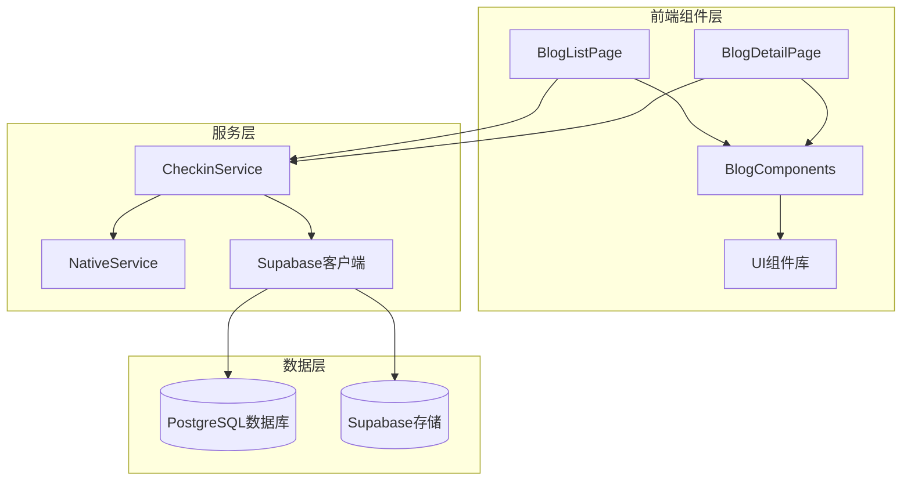
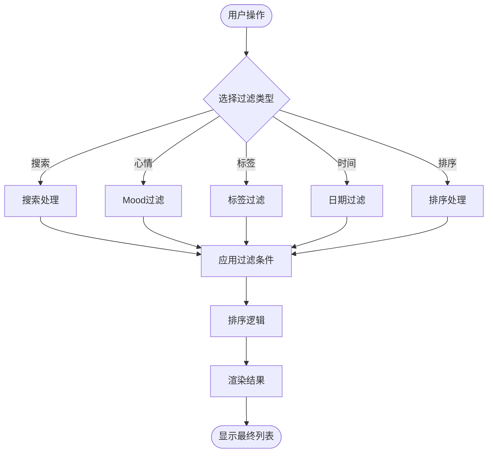
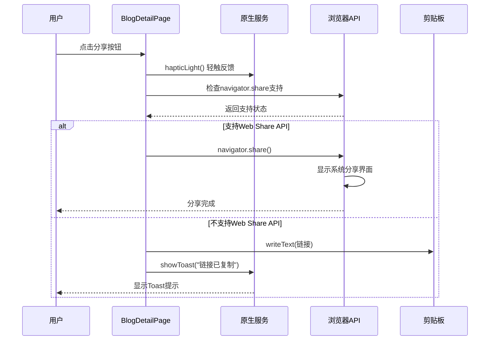
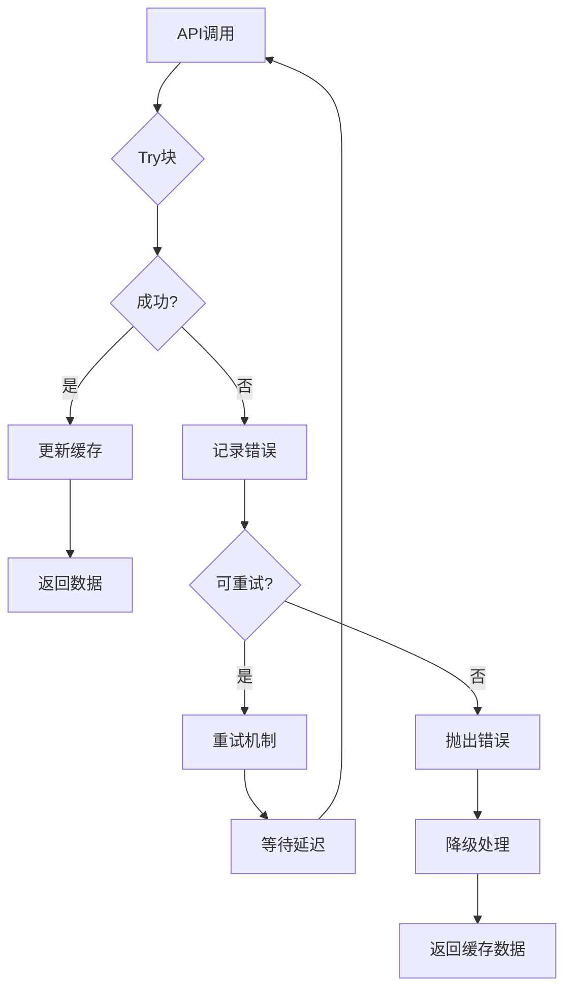
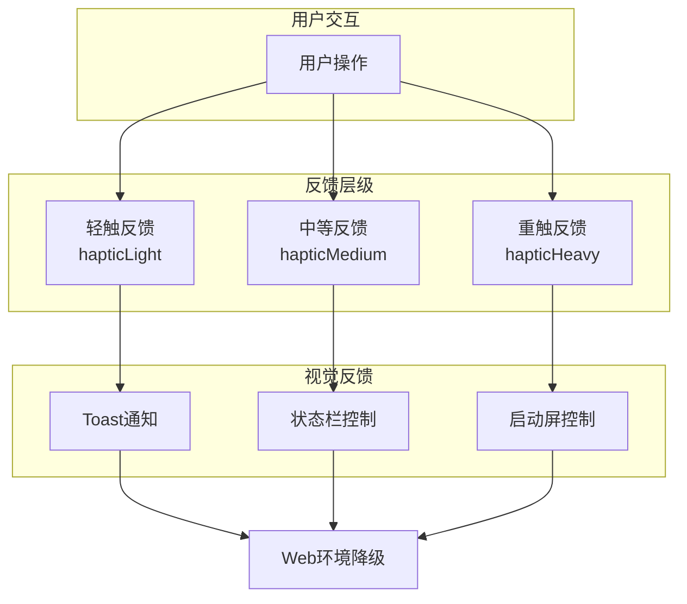

# 互动机制

<cite>
**本文档引用的文件**
- [BlogListPage.tsx](file://src/components/BlogListPage.tsx)
- [BlogDetailPage.tsx](file://src/components/BlogDetailPage.tsx)
- [checkinService.ts](file://src/utils/checkinService.ts)
- [nativeService.ts](file://src/utils/nativeService.ts)
- [checkin.ts](file://src/types/checkin.ts)
- [button.tsx](file://src/components/ui/button.tsx)
</cite>

## 目录
1. [简介](#简介)
2. [项目架构概览](#项目架构概览)
3. [BlogListPage 交互设计](#bloglistpage-交互设计)
4. [BlogDetailPage 交互设计](#blogdetailpage-交互设计)
5. [checkinService 服务层设计](#checkinservice-服务层设计)
6. [原生反馈系统](#原生反馈系统)
7. [性能优化与用户体验](#性能优化与用户体验)
8. [常见问题诊断](#常见问题诊断)
9. [总结](#总结)

## 简介

本文档深入分析Focus应用中博客功能的用户交互设计，重点关注BlogListPage和BlogDetailPage两个核心组件的互动机制。系统采用React + TypeScript架构，结合Capacitor原生插件，实现了完整的点赞、搜索、筛选、排序、无限滚动等交互功能，同时提供了丰富的原生反馈体验。

## 项目架构概览



**图表来源**
- [BlogListPage.tsx](file://src/components/BlogListPage.tsx#L1-L50)
- [BlogDetailPage.tsx](file://src/components/BlogDetailPage.tsx#L1-L50)
- [checkinService.ts](file://src/utils/checkinService.ts#L1-L50)

## BlogListPage 交互设计

### 核心交互功能

BlogListPage实现了完整的博客列表交互体验，包括以下核心功能：

#### 1. 搜索与筛选系统

```typescript
// 搜索状态管理
const [searchTerm, setSearchTerm] = useState("");
const [selectedMood, setSelectedMood] = useState<CheckinMood | 'all'>('all');
const [selectedTags, setSelectedTags] = useState<string[]>([]);
const [dateRange, setDateRange] = useState<'all' | 'week' | 'month' | 'year'>('all');
```

搜索功能采用实时过滤算法，支持多维度搜索：
- **标题搜索**：精确匹配博客标题
- **内容搜索**：模糊匹配博客内容
- **标签搜索**：支持多个标签组合搜索
- **地点搜索**：地理位置关键词匹配

#### 2. 视图模式切换

系统提供两种视图模式，通过状态管理实现平滑切换：

```typescript
const [viewMode, setViewMode] = useState<'grid' | 'list'>('grid');

// 渲染网格视图
const renderGridView = () => (
  <div className="grid grid-cols-2 gap-3 p-4">
    {filteredAndSortedBlogs.map((blog, index) => (
      <div key={blog.id}>
        <BlogCard blog={blog} onBlogClick={onBlogClick} />
      </div>
    ))}
  </div>
);

// 渲染列表视图
const renderListView = () => (
  <div className="p-4 space-y-3">
    {filteredAndSortedBlogs.map((blog, index) => (
      <motion.div
        key={blog.id}
        onClick={() => onBlogClick(blog)}
        className="bg-white rounded-xl p-4 border border-gray-100 shadow-sm hover:shadow-md"
      >
        {/* 列表布局内容 */}
      </motion.div>
    ))}
  </div>
);
```

#### 3. 排序与过滤机制



**图表来源**
- [BlogListPage.tsx](file://src/components/BlogListPage.tsx#L60-L120)

#### 4. 无限滚动实现

```typescript
// 无限滚动观察器
useEffect(() => {
  if (isLoading) return;

  if (observerRef.current) observerRef.current.disconnect();

  observerRef.current = new IntersectionObserver(entries => {
    if (entries[0].isIntersecting && hasMore && onLoadMore) {
      onLoadMore();
    }
  });

  if (lastBlogElementRef.current) {
    observerRef.current.observe(lastBlogElementRef.current);
  }

  return () => {
    if (observerRef.current) observerRef.current.disconnect();
  };
}, [isLoading, hasMore, onLoadMore]);
```

无限滚动采用IntersectionObserver API，确保性能优化和用户体验：

- **懒加载触发**：当最后一个元素进入视口时触发
- **加载状态管理**：防止重复加载和并发请求
- **内存清理**：组件卸载时自动断开观察器连接

#### 5. 原生反馈集成

```typescript
const handleToggleTag = async (tag: string) => {
  await NativeService.hapticLight(); // 轻触反馈
  setSelectedTags(prev => 
    prev.includes(tag) 
      ? prev.filter(t => t !== tag)
      : [...prev, tag]
  );
};
```

**章节来源**
- [BlogListPage.tsx](file://src/components/BlogListPage.tsx#L1-L571)

## BlogDetailPage 交互设计

### 点赞功能的防抖处理

```typescript
const [isLiking, setIsLiking] = useState(false);

const handleLike = async () => {
  if (isLiking) return; // 防止重复点击
  
  try {
    setIsLiking(true);
    await NativeService.hapticLight();
    onLike(blog.id);
  } catch (error) {
    console.error('Like failed:', error);
  } finally {
    setIsLiking(false);
  }
};
```

点赞功能实现了完整的防抖机制：

- **状态锁定**：使用`isLiking`状态防止重复提交
- **原生反馈**：每次点击都触发轻触反馈
- **错误处理**：捕获并记录点赞失败的情况
- **状态恢复**：无论成功还是失败都会重置状态

### Web Share API 集成

```typescript
const handleShare = async () => {
  try {
    await NativeService.hapticLight();
    
    if (navigator.share) {
      // 现代浏览器支持的Web Share API
      await navigator.share({
        title: blog.title,
        text: blog.content.substring(0, 200) + '...',
        url: window.location.href
      });
    } else {
      // 降级方案：复制链接到剪贴板
      await navigator.clipboard.writeText(window.location.href);
      await NativeService.showToast('链接已复制');
    }
  } catch (error) {
    console.error('Share failed:', error);
  }
};
```

分享功能采用渐进式增强策略：



**图表来源**
- [BlogDetailPage.tsx](file://src/components/BlogDetailPage.tsx#L80-L100)

### 编辑删除操作的确认流程

```typescript
// 更多操作面板
<Button 
  variant="ghost" 
  size="sm" 
  onClick={() => setShowMore(!showMore)}
>
  <MoreHorizontal className="h-4 w-4" />
</Button>

// 编辑删除按钮组
<div className="flex gap-2">
  <Button variant="outline" size="sm" onClick={() => onEdit(blog)}>
    <Edit className="h-4 w-4 mr-1" />
    编辑
  </Button>
  <Button 
    variant="outline" 
    size="sm" 
    onClick={() => onDelete(blog.id)}
    className="text-red-600 hover:text-red-700"
  >
    <Trash2 className="h-4 w-4 mr-1" />
    删除
  </Button>
</div>
```

编辑删除操作采用确认式设计：

- **隐藏式菜单**：通过"更多"按钮控制操作面板显示
- **视觉区分**：编辑和删除按钮采用不同样式
- **危险操作标记**：删除按钮使用红色强调
- **即时反馈**：操作后立即关闭更多菜单

### 交互状态的视觉反馈设计

```typescript
// 动画效果
<motion.div
  initial={{ opacity: 0, y: 20 }}
  animate={{ opacity: 1, y: 0 }}
  transition={{ delay: 0.1 }}
  className="bg-white rounded-xl p-6 shadow-sm mb-6"
>
  {/* 博客内容 */}
</motion.div>

// 按钮状态
<Button
  variant={isLiking ? "secondary" : "ghost"}
  size="sm"
  onClick={handleLike}
  disabled={isLiking}
  className="flex items-center gap-2"
>
  <Heart className={`h-4 w-4 ${isLiking ? 'text-red-500' : ''}`} />
  <span>{blog.like_count}</span>
</Button>
```

系统采用多层次的视觉反馈：

- **页面过渡动画**：使用Framer Motion实现流畅的页面切换
- **元素入场动画**：按延迟顺序显示不同部分的内容
- **按钮状态变化**：根据交互状态动态调整按钮外观
- **加载状态指示**：使用Spinner图标和文字提示

**章节来源**
- [BlogDetailPage.tsx](file://src/components/BlogDetailPage.tsx#L1-L417)

## checkinService 服务层设计

### 异步处理机制

```typescript
async likeBlog(id: number | string): Promise<void> {
  try {
    // 先获取当前点赞数
    const { data: blog, error: fetchError } = await supabase
      .from('checkin_blogs')
      .select('like_count')
      .eq('id', id)
      .single();

    if (fetchError) {
      console.error('Error fetching blog for like:', fetchError);
      throw fetchError;
    }

    // 增加点赞数
    const { error } = await supabase
      .from('checkin_blogs')
      .update({ like_count: blog.like_count + 1 })
      .eq('id', id);

    if (error) {
      console.error('Error liking blog:', error);
      throw error;
    }

    // 更新缓存
    const index = this.cache.blogs.findIndex(b => b.id === id);
    if (index !== -1) {
      this.cache.blogs[index].like_count += 1;
    }
  } catch (error) {
    console.error('Failed to like blog:', error);
    throw error;
  }
}
```

### 错误重试策略

```typescript
async getBlogById(id: number | string): Promise<CheckinBlog> {
  try {
    const { data, error } = await supabase
      .from('checkin_blogs')
      .select('*')
      .eq('id', id)
      .single();

    if (error) {
      console.error('Error fetching blog:', error);
      throw error;
    }

    // 增加浏览量
    await supabase
      .from('checkin_blogs')
      .update({ view_count: data.view_count + 1 })
      .eq('id', id);

    return {
      ...data,
      created_at: new Date(data.created_at),
      updated_at: new Date(data.updated_at),
      view_count: data.view_count + 1
    };
  } catch (error) {
    console.error('Failed to fetch blog by id:', error);
    throw error;
  }
}
```

服务层采用以下错误处理策略：



**图表来源**
- [checkinService.ts](file://src/utils/checkinService.ts#L600-L650)

### 数据缓存与同步

```typescript
private cache = {
  blogs: [] as CheckinBlog[],
  lastSyncTime: null as Date | null
};

async getBlogs(filters?: BlogFilters): Promise<CheckinBlog[]> {
  try {
    // ... 查询逻辑 ...
    
    if (!filters) {
      this.cache.blogs = blogs;
    }
    
    return blogs;
  } catch (error) {
    console.error('Failed to fetch blogs:', error);
    return filters ? [] : this.cache.blogs;
  }
}
```

服务层实现了智能缓存机制：

- **增量更新**：只在无筛选条件时更新完整缓存
- **降级策略**：网络错误时返回本地缓存数据
- **时间戳跟踪**：记录最后同步时间，便于过期检查
- **类型安全**：使用TypeScript确保数据类型正确性

**章节来源**
- [checkinService.ts](file://src/utils/checkinService.ts#L1-L736)

## 原生反馈系统

### hapticLight 集成方式

```typescript
export class NativeService {
  // Haptic反馈
  static async hapticLight() {
    if (Capacitor.isNativePlatform()) {
      try {
        await Haptics.impact({ style: ImpactStyle.Light });
      } catch (error) {
        console.warn('Haptic feedback not available:', error);
      }
    }
  }

  static async hapticMedium() {
    if (Capacitor.isNativePlatform()) {
      try {
        await Haptics.impact({ style: ImpactStyle.Medium });
      } catch (error) {
        console.warn('Haptic feedback not available:', error);
      }
    }
  }
}
```

### 多层次反馈体系



**图表来源**
- [nativeService.ts](file://src/utils/nativeService.ts#L1-L50)

### 平台适配策略

```typescript
static isNative(): boolean {
  return Capacitor.isNativePlatform();
}

static getPlatform(): string {
  return Capacitor.getPlatform();
}
```

原生服务采用平台检测机制：

- **平台识别**：自动检测是否运行在原生平台
- **功能降级**：Web环境下优雅降级到控制台日志
- **统一接口**：为不同平台提供一致的API调用方式
- **错误处理**：捕获并记录原生功能不可用的情况

**章节来源**
- [nativeService.ts](file://src/utils/nativeService.ts#L1-L180)

## 性能优化与用户体验

### 1. React.memo 和 useMemo 优化

```typescript
// 使用useMemo避免不必要的重新计算
const filteredAndSortedBlogs = React.useMemo(() => {
  // 复杂的过滤和排序逻辑
}, [blogs, searchTerm, selectedMood, selectedTags, dateRange, sortBy, sortOrder]);

// 使用React.memo避免组件重新渲染
export default React.memo(function BlogListPage(props: BlogListPageProps) {
  // 组件逻辑
});
```

### 2. IntersectionObserver 优化

```typescript
// 使用IntersectionObserver实现高效的无限滚动
useEffect(() => {
  if (observerRef.current) observerRef.current.disconnect();

  observerRef.current = new IntersectionObserver(entries => {
    if (entries[0].isIntersecting && hasMore && onLoadMore) {
      onLoadMore();
    }
  });

  if (lastBlogElementRef.current) {
    observerRef.current.observe(lastBlogElementRef.current);
  }

  return () => {
    if (observerRef.current) observerRef.current.disconnect();
  };
}, [isLoading, hasMore, onLoadMore]);
```

### 3. 动画性能优化

```typescript
// 使用transform代替布局属性进行动画
<motion.div
  initial={{ opacity: 0, y: 20 }}
  animate={{ opacity: 1, y: 0 }}
  exit={{ opacity: 0, y: -20 }}
  transition={{ type: "spring", damping: 30, stiffness: 300 }}
  className="bg-white rounded-xl p-4 border border-gray-100 shadow-sm hover:shadow-md"
>
  {/* 内容 */}
</motion.div>
```

### 4. 状态管理优化

```typescript
// 使用局部状态减少全局状态更新
const [isLiking, setIsLiking] = useState(false);
const [showMore, setShowMore] = useState(false);

// 使用useState替代Redux等复杂状态管理
const [searchTerm, setSearchTerm] = useState("");
const [viewMode, setViewMode] = useState<'grid' | 'list'>('grid');
```

## 常见问题诊断

### 1. 重复点赞问题

**问题描述**：用户可能快速多次点击点赞按钮导致重复提交

**诊断方法**：
```typescript
// 检查点赞状态
console.log('Current like state:', isLiking);
console.log('Last like timestamp:', lastLikeTimestamp);
```

**解决方案**：
```typescript
// 实现防抖机制
const handleLike = async () => {
  if (isLiking) return; // 防止重复点击
  
  try {
    setIsLiking(true);
    await NativeService.hapticLight();
    onLike(blog.id);
  } catch (error) {
    console.error('Like failed:', error);
  } finally {
    setIsLiking(false);
  }
};
```

### 2. 分享失败问题

**问题描述**：Web Share API在某些浏览器中不可用或失败

**诊断方法**：
```typescript
// 检查Web Share API支持
console.log('Web Share API supported:', !!navigator.share);
console.log('Clipboard API supported:', !!navigator.clipboard);
```

**解决方案**：
```typescript
const handleShare = async () => {
  try {
    await NativeService.hapticLight();
    
    if (navigator.share) {
      await navigator.share({
        title: blog.title,
        text: blog.content.substring(0, 200) + '...',
        url: window.location.href
      });
    } else {
      // 降级到剪贴板复制
      await navigator.clipboard.writeText(window.location.href);
      await NativeService.showToast('链接已复制');
    }
  } catch (error) {
    console.error('Share failed:', error);
    await NativeService.showToast('分享失败，请稍后重试');
  }
};
```

### 3. 无限滚动加载问题

**问题描述**：无限滚动可能触发过多请求或加载失败

**诊断方法**：
```typescript
// 检查加载状态
console.log('Is loading:', isLoading);
console.log('Has more data:', hasMore);
console.log('Observer connected:', !!observerRef.current);
```

**解决方案**：
```typescript
// 实现更严格的加载控制
useEffect(() => {
  if (isLoading || !hasMore) return;

  const observer = new IntersectionObserver(entries => {
    if (entries[0].isIntersecting && !isLoading && hasMore && onLoadMore) {
      onLoadMore();
    }
  }, { threshold: 0.1 });

  if (lastBlogElementRef.current) {
    observer.observe(lastBlogElementRef.current);
  }

  return () => observer.disconnect();
}, [isLoading, hasMore, onLoadMore]);
```

### 4. 缓存一致性问题

**问题描述**：本地缓存可能与服务器数据不一致

**诊断方法**：
```typescript
// 检查缓存时间戳
console.log('Cache last sync:', service.getLastSyncTime());
console.log('Cache size:', service.cache.blogs.length);
```

**解决方案**：
```typescript
// 实现缓存失效机制
async getBlogs(filters?: BlogFilters): Promise<CheckinBlog[]> {
  try {
    // ... 查询逻辑 ...
    
    if (!filters) {
      this.cache.blogs = blogs;
      this.cache.lastSyncTime = new Date();
    }
    
    return blogs;
  } catch (error) {
    console.error('Failed to fetch blogs:', error);
    // 只有在无筛选条件时才返回缓存
    return filters ? [] : this.cache.blogs;
  }
}
```

## 总结

Focus应用的博客功能展现了现代Web应用在移动端交互设计方面的最佳实践。通过BlogListPage和BlogDetailPage两个核心组件，系统实现了完整的用户交互生态：

### 核心优势

1. **完整的交互生命周期**：从搜索筛选到无限滚动，每个环节都有精心设计的用户体验
2. **原生反馈集成**：通过Capacitor插件实现真实的触觉反馈，提升移动设备上的沉浸感
3. **渐进式增强**：Web Share API的降级方案确保在各种环境下都能提供基本功能
4. **性能优化**：IntersectionObserver、React.memo、useMemo等技术的应用保证了良好的性能表现
5. **错误处理**：完善的错误捕获和降级策略确保系统的稳定性

### 技术亮点

- **TypeScript强类型**：确保代码质量和开发效率
- **React Hooks**：充分利用现代React特性实现复杂的状态管理
- **Framer Motion**：提供流畅的动画效果和转场体验
- **Capacitor生态**：无缝集成原生功能，实现跨平台兼容性

### 设计哲学

系统采用了以用户为中心的设计理念，通过以下原则实现优秀的用户体验：

- **即时反馈**：每个用户操作都有相应的视觉和触觉反馈
- **渐进式披露**：复杂的交互功能通过折叠面板等方式逐步展现
- **一致性**：在整个应用中保持统一的交互模式和视觉语言
- **可访问性**：考虑到不同设备和浏览器的兼容性

这种设计不仅提升了用户的使用体验，也为后续的功能扩展奠定了坚实的基础。通过模块化的架构设计和清晰的职责分离，开发者可以轻松地维护和扩展系统功能，同时保持代码的可读性和可维护性。