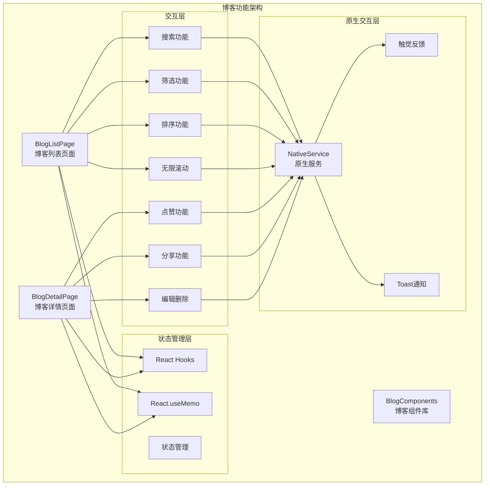
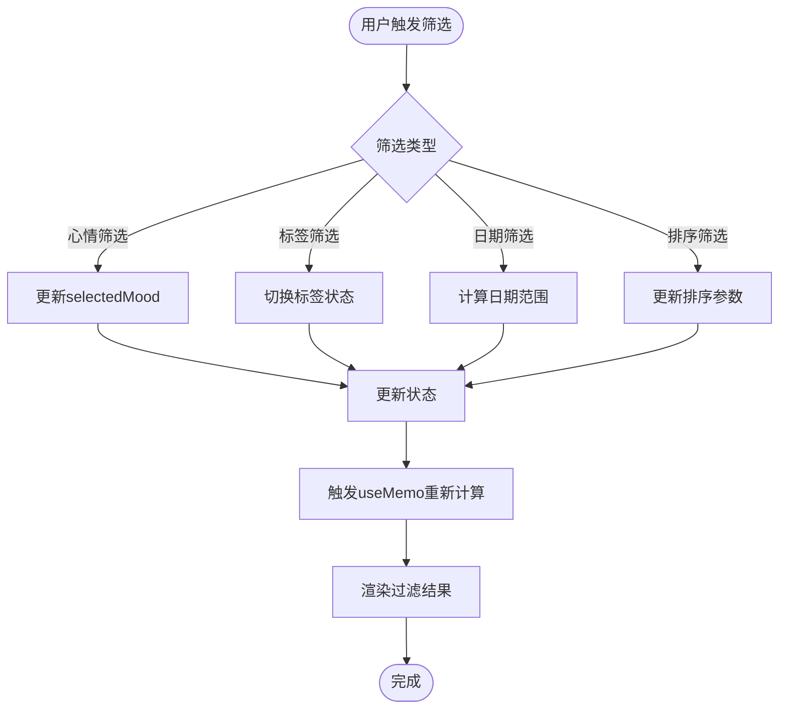
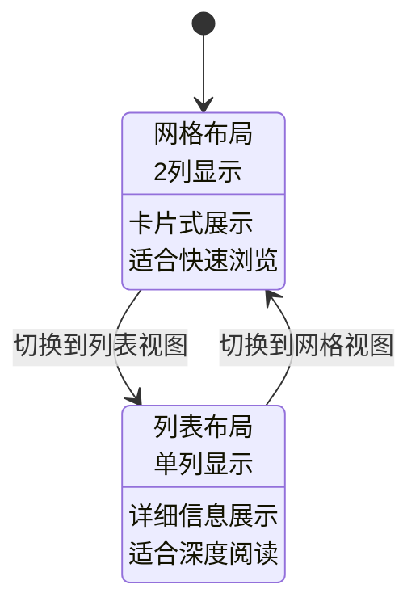
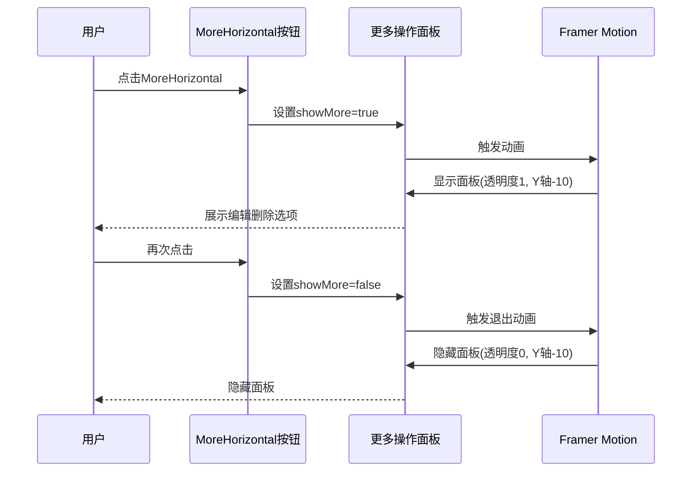
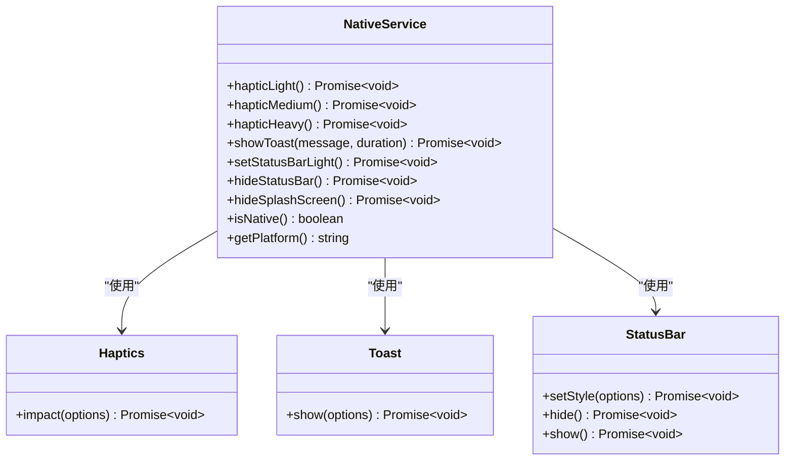
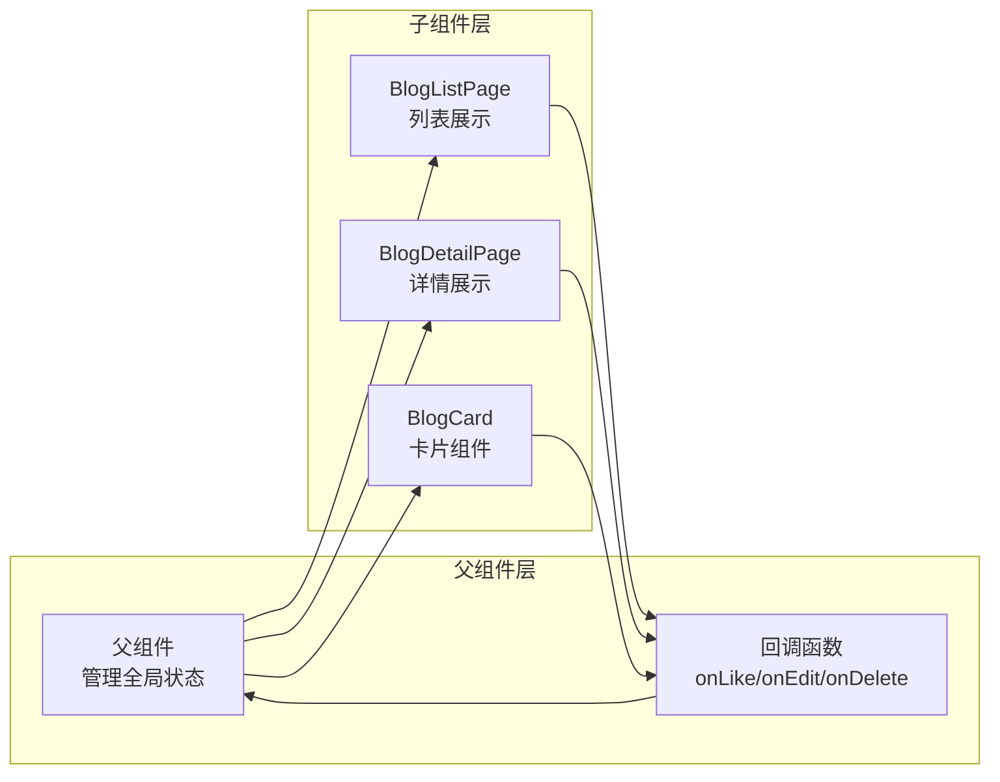

# 博客功能前端用户交互实现

<cite>
**本文档引用的文件**
- [BlogListPage.tsx](file://src/components/BlogListPage.tsx)
- [BlogDetailPage.tsx](file://src/components/BlogDetailPage.tsx)
- [nativeService.ts](file://src/utils/nativeService.ts)
- [checkin.ts](file://src/types/checkin.ts)
- [BlogComponents.tsx](file://src/components/BlogComponents.tsx)
</cite>

## 目录
1. [简介](#简介)
2. [项目架构概览](#项目架构概览)
3. [BlogListPage核心交互实现](#bloglistpage核心交互实现)
4. [BlogDetailPage核心交互实现](#blogdetailpage核心交互实现)
5. [原生反馈系统](#原生反馈系统)
6. [性能优化技术](#性能优化技术)
7. [交互模式与状态管理](#交互模式与状态管理)
8. [常见问题与解决方案](#常见问题与解决方案)
9. [总结](#总结)

## 简介

本文档深入分析Focus应用中博客功能的前端用户交互实现，重点阐述BlogListPage和BlogDetailPage两个核心页面的交互逻辑。通过React Hooks、IntersectionObserver、原生反馈系统等技术栈，实现了流畅的用户体验和高性能的交互效果。

博客功能包含两大核心页面：
- **BlogListPage**: 展示博客列表，支持搜索、筛选、排序、无限滚动等功能
- **BlogDetailPage**: 展示博客详情，包含点赞、分享、编辑删除等操作

## 项目架构概览



**图表来源**
- [BlogListPage.tsx](file://src/components/BlogListPage.tsx#L1-L571)
- [BlogDetailPage.tsx](file://src/components/BlogDetailPage.tsx#L1-L417)
- [nativeService.ts](file://src/utils/nativeService.ts#L1-L180)

## BlogListPage核心交互实现

### 搜索功能实现

BlogListPage实现了强大的搜索功能，支持多维度关键词匹配：

```typescript
const filteredAndSortedBlogs = React.useMemo(() => {
  let filtered = blogs;

  // 搜索筛选
  if (searchTerm.trim()) {
    const searchLower = searchTerm.toLowerCase();
    filtered = filtered.filter(blog => 
      blog.title.toLowerCase().includes(searchLower) ||
      blog.content.toLowerCase().includes(searchLower) ||
      blog.tags.some(tag => tag.toLowerCase().includes(searchLower)) ||
      (blog.location && blog.location.toLowerCase().includes(searchLower))
    );
  }
  
  // ... 其他筛选逻辑
}, [blogs, searchTerm, selectedMood, selectedTags, dateRange, sortBy, sortOrder]);
```

**关键特性：**
- **多维度搜索**: 支持标题、内容、标签、地点的模糊匹配
- **实时过滤**: 使用React.useMemo进行性能优化
- **搜索防抖**: 通过setPage(1)重置分页状态

### 筛选功能实现



**图表来源**
- [BlogListPage.tsx](file://src/components/BlogListPage.tsx#L45-L85)

### 无限滚动实现

BlogListPage使用IntersectionObserver实现高效的无限滚动：

```typescript
// 无限滚动观察器
useEffect(() => {
  if (isLoading) return;

  if (observerRef.current) observerRef.current.disconnect();

  observerRef.current = new IntersectionObserver(entries => {
    if (entries[0].isIntersecting && hasMore && onLoadMore) {
      onLoadMore();
    }
  });

  if (lastBlogElementRef.current) {
    observerRef.current.observe(lastBlogElementRef.current);
  }

  return () => {
    if (observerRef.current) observerRef.current.disconnect();
  };
}, [isLoading, hasMore, onLoadMore]);
```

**技术亮点：**
- **性能优化**: 使用IntersectionObserver替代传统的scroll事件监听
- **内存管理**: 在组件卸载时正确清理观察器
- **状态同步**: 结合isLoading状态防止重复加载

### 视图模式切换



**图表来源**
- [BlogListPage.tsx](file://src/components/BlogListPage.tsx#L200-L250)

**节段来源**
- [BlogListPage.tsx](file://src/components/BlogListPage.tsx#L45-L120)
- [BlogListPage.tsx](file://src/components/BlogListPage.tsx#L280-L350)

## BlogDetailPage核心交互实现

### 点赞功能的防抖处理

BlogDetailPage实现了智能的点赞防抖机制：

```typescript
const handleLike = async () => {
  if (isLiking) return;
  
  try {
    setIsLiking(true);
    await NativeService.hapticLight();
    onLike(blog.id);
  } catch (error) {
    console.error('Like failed:', error);
  } finally {
    setIsLiking(false);
  }
};
```

**防抖机制特点：**
- **状态控制**: 使用isLiking状态防止重复点击
- **用户体验**: 通过原生触觉反馈增强交互感知
- **异常处理**: 完善的错误捕获和恢复机制

### 分享功能的Web Share API集成

```typescript
const handleShare = async () => {
  try {
    await NativeService.hapticLight();
    
    if (navigator.share) {
      await navigator.share({
        title: blog.title,
        text: blog.content.substring(0, 200) + '...',
        url: window.location.href
      });
    } else {
      // 降级到复制链接
      await navigator.clipboard.writeText(window.location.href);
      await NativeService.showToast('链接已复制');
    }
  } catch (error) {
    console.error('Share failed:', error);
  }
};
```

**兼容性策略：**
- **现代API优先**: 优先使用Web Share API
- **优雅降级**: 不支持时自动切换到剪贴板复制
- **用户提示**: 明确告知用户操作结果

### MoreHorizontal下拉菜单的动画交互



**图表来源**
- [BlogDetailPage.tsx](file://src/components/BlogDetailPage.tsx#L80-L120)

### 编辑删除操作的确认流程

```typescript
// 编辑操作
<Button variant="outline" size="sm" onClick={() => onEdit(blog)}>
  <Edit className="h-4 w-4 mr-1" />
  编辑
</Button>

// 删除操作
<Button 
  variant="outline" 
  size="sm" 
  onClick={() => onDelete(blog.id)}
  className="text-red-600 hover:text-red-700"
>
  <Trash2 className="h-4 w-4 mr-1" />
  删除
</Button>
```

**设计原则：**
- **视觉区分**: 删除按钮使用红色强调危险操作
- **回调模式**: 通过onEdit和onDelete回调实现父组件控制
- **状态提升**: 将业务逻辑从UI组件中抽离

**节段来源**
- [BlogDetailPage.tsx](file://src/components/BlogDetailPage.tsx#L60-L90)
- [BlogDetailPage.tsx](file://src/components/BlogDetailPage.tsx#L150-L200)

## 原生反馈系统

### NativeService架构设计



**图表来源**
- [nativeService.ts](file://src/utils/nativeService.ts#L10-L50)

### 触觉反馈的调用时机

原生触觉反馈被精心设计在以下关键交互节点：

1. **标签切换**: `await NativeService.hapticLight();`
2. **筛选清除**: `await NativeService.hapticLight();`
3. **点赞操作**: `await NativeService.hapticLight();`
4. **分享操作**: `await NativeService.hapticLight();`

**用户体验优化策略：**
- **轻量反馈**: 使用Light级别触觉反馈，避免过度干扰
- **时机恰当**: 在用户操作后立即反馈，建立明确的因果关系
- **平台适配**: 仅在原生平台上启用，确保Web环境正常运行

### Toast通知系统

```typescript
static async showToast(message: string, duration: 'short' | 'long' = 'short') {
  if (Capacitor.isNativePlatform()) {
    try {
      await Toast.show({
        text: message,
        duration: duration,
        position: 'bottom'
      });
    } catch (error) {
      console.warn('Toast not available:', error);
    }
  } else {
    // Web环境下的fallback
    console.log('Toast (web fallback):', message);
  }
}
```

**节段来源**
- [nativeService.ts](file://src/utils/nativeService.ts#L1-L180)

## 性能优化技术

### React.useMemo优化性能

BlogListPage大量使用React.useMemo进行性能优化：

```typescript
const filteredAndSortedBlogs = React.useMemo(() => {
  // 复杂的筛选和排序逻辑
  // 只有依赖项变化时才重新计算
}, [blogs, searchTerm, selectedMood, selectedTags, dateRange, sortBy, sortOrder]);
```

**优化效果：**
- **减少不必要的计算**: 只在必要时重新计算过滤结果
- **提升响应速度**: 避免每次渲染都执行复杂逻辑
- **内存效率**: 防止重复创建相同的数据结构

### IntersectionObserver实现懒加载

```typescript
// 无限滚动观察器
const observerRef = useRef<IntersectionObserver>();
const lastBlogElementRef = useRef<HTMLDivElement>(null);

useEffect(() => {
  if (isLoading) return;
  
  observerRef.current = new IntersectionObserver(entries => {
    if (entries[0].isIntersecting && hasMore && onLoadMore) {
      onLoadMore();
    }
  });

  if (lastBlogElementRef.current) {
    observerRef.current.observe(lastBlogElementRef.current);
  }
}, [isLoading, hasMore, onLoadMore]);
```

**技术优势：**
- **性能友好**: 相比scroll事件监听，CPU占用更低
- **精确控制**: 准确判断元素是否进入可视区域
- **自动清理**: 组件卸载时自动断开观察连接

**节段来源**
- [BlogListPage.tsx](file://src/components/BlogListPage.tsx#L85-L120)
- [BlogListPage.tsx](file://src/components/BlogListPage.tsx#L130-L150)

## 交互模式与状态管理

### 状态提升模式

博客功能采用状态提升模式，将业务逻辑从UI组件中抽离：



**图表来源**
- [BlogListPage.tsx](file://src/components/BlogListPage.tsx#L25-L40)
- [BlogDetailPage.tsx](file://src/components/BlogDetailPage.tsx#L25-L35)

### Props传递关系

```typescript
// BlogListPage Props
interface BlogListPageProps {
  blogs: CheckinBlog[];
  onBlogClick: (blog: CheckinBlog) => void;
  onCreateBlog: () => void;
  onLikeBlog: (blogId: number | string) => void;
  onDeleteBlog: (blogId: number | string) => void;
  onLoadMore?: () => void;
  hasMore?: boolean;
  isLoading?: boolean;
}

// BlogDetailPage Props
interface BlogDetailPageProps {
  blog: CheckinBlog;
  onClose: () => void;
  onEdit: (blog: CheckinBlog) => void;
  onDelete: (blogId: number | string) => void;
  onLike: (blogId: number | string) => void;
  checkinRecords?: CheckinRecord[];
}
```

**设计原则：**
- **单一职责**: 每个组件只负责特定的功能领域
- **清晰接口**: 通过明确的Props定义建立组件契约
- **松耦合**: 组件间通过回调函数解耦，提高复用性

### 异步状态同步

```typescript
// 点赞操作的状态同步
const handleLike = async () => {
  if (isLiking) return; // 防止重复点击
  
  try {
    setIsLiking(true); // 开始加载状态
    await NativeService.hapticLight();
    onLike(blog.id); // 调用父组件回调
  } catch (error) {
    console.error('Like failed:', error);
  } finally {
    setIsLiking(false); // 恢复正常状态
  }
};
```

**节段来源**
- [BlogDetailPage.tsx](file://src/components/BlogDetailPage.tsx#L60-L80)

## 常见问题与解决方案

### 重复点击问题

**问题描述**: 用户可能快速多次点击点赞按钮导致重复提交

**解决方案**: 使用防抖状态控制

```typescript
const handleLike = async () => {
  if (isLiking) return; // 防止重复点击
  
  try {
    setIsLiking(true);
    await NativeService.hapticLight();
    onLike(blog.id);
  } catch (error) {
    console.error('Like failed:', error);
  } finally {
    setIsLiking(false); // 确保状态恢复
  }
};
```

**调试方法**:
1. 检查isLiking状态是否正确设置
2. 验证finally块是否被执行
3. 监控网络请求频率

### 异步状态不同步

**问题描述**: 点赞成功后UI状态未能及时更新

**解决方案**: 立即本地更新状态，同时发起异步请求

```typescript
// 父组件中的处理
const handleLike = async (blogId: number | string) => {
  // 立即更新本地状态
  setBlogs(prev => prev.map(blog => 
    blog.id === blogId ? {...blog, like_count: blog.like_count + 1} : blog
  ));
  
  // 异步更新服务器
  try {
    await api.likeBlog(blogId);
  } catch (error) {
    // 回滚状态
    setBlogs(prev => prev.map(blog => 
      blog.id === blogId ? {...blog, like_count: blog.like_count - 1} : blog
    ));
    throw error;
  }
};
```

### IntersectionObserver失效问题

**问题描述**: 在某些情况下IntersectionObserver无法正常工作

**解决方案**: 添加备用检测机制

```typescript
useEffect(() => {
  const observer = new IntersectionObserver(
    entries => {
      if (entries[0].isIntersecting && hasMore && onLoadMore) {
        onLoadMore();
      }
    },
    { threshold: 0.1 } // 设置较小的阈值
  );

  if (lastBlogElementRef.current) {
    observer.observe(lastBlogElementRef.current);
  }

  return () => observer.disconnect();
}, [isLoading, hasMore, onLoadMore]);

// 添加备用检测
useEffect(() => {
  if (!isLoading && hasMore && !observerRef.current) {
    // 手动检查最后一个元素是否可见
    const element = lastBlogElementRef.current;
    if (element) {
      const rect = element.getBoundingClientRect();
      if (rect.top < window.innerHeight) {
        onLoadMore();
      }
    }
  }
}, [blogs]);
```

### 内存泄漏问题

**问题描述**: 组件卸载后仍保留事件监听器

**解决方案**: 正确清理资源

```typescript
useEffect(() => {
  const observer = new IntersectionObserver(/* ... */);
  
  if (lastBlogElementRef.current) {
    observer.observe(lastBlogElementRef.current);
  }

  return () => {
    observer.disconnect(); // 必须清理
  };
}, []);

// 或者使用ref管理
useEffect(() => {
  if (observerRef.current) {
    observerRef.current.disconnect();
  }
  
  observerRef.current = new IntersectionObserver(/* ... */);
  
  return () => {
    if (observerRef.current) {
      observerRef.current.disconnect();
    }
  };
}, []);
```

## 总结

Focus应用的博客功能前端交互实现展现了现代React开发的最佳实践：

### 技术亮点

1. **性能优化**: 通过React.useMemo和IntersectionObserver实现高效渲染
2. **用户体验**: 原生触觉反馈和Toast通知提升交互感知
3. **状态管理**: 采用状态提升模式实现清晰的组件职责分离
4. **兼容性**: Web Share API的优雅降级策略
5. **错误处理**: 完善的异常捕获和用户反馈机制

### 设计原则

- **单一职责**: 每个组件专注于特定功能领域
- **状态提升**: 将业务逻辑从UI组件中抽离
- **性能优先**: 避免不必要的重新计算和DOM操作
- **用户导向**: 通过原生反馈和动画增强用户体验

### 最佳实践

1. **防抖处理**: 在异步操作前添加状态检查
2. **错误恢复**: 提供清晰的错误信息和回滚机制
3. **资源清理**: 及时清理事件监听器和定时器
4. **状态同步**: 确保UI状态与业务状态的一致性

这些实现不仅提供了优秀的用户体验，也为后续的功能扩展奠定了坚实的基础。通过合理的架构设计和性能优化，博客功能能够在各种设备上提供流畅的交互体验。