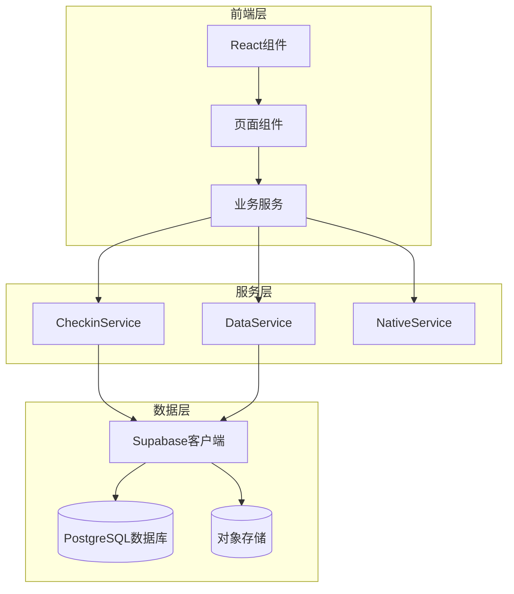
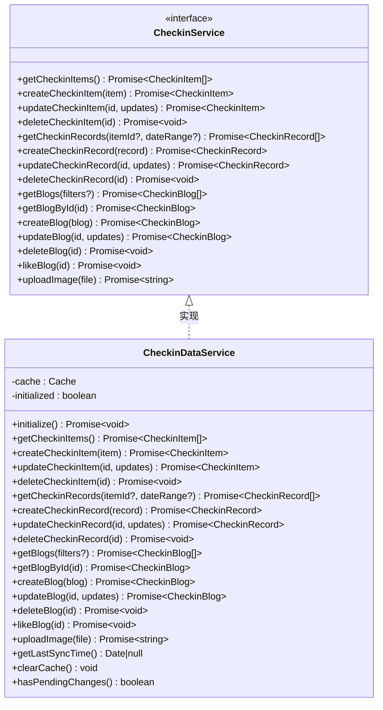
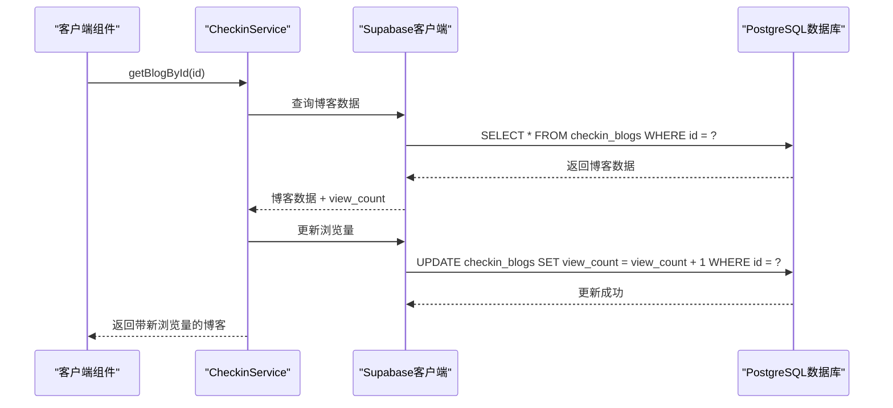
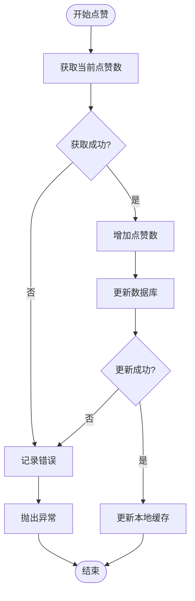
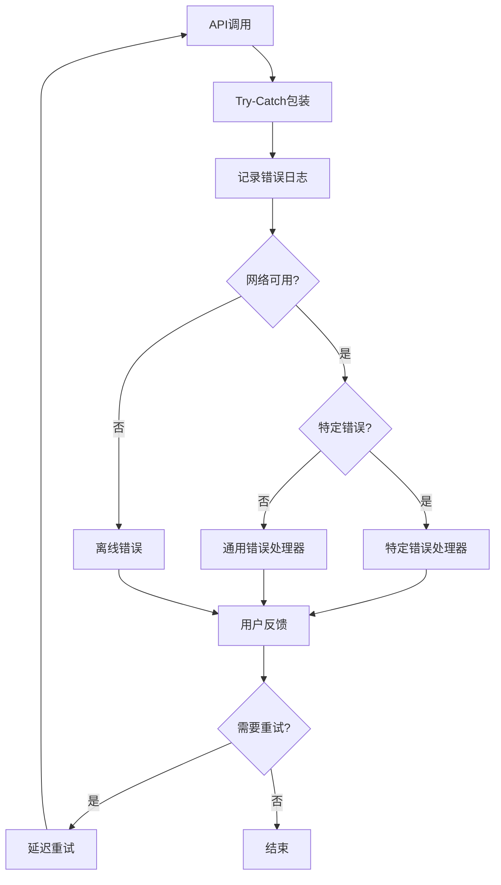
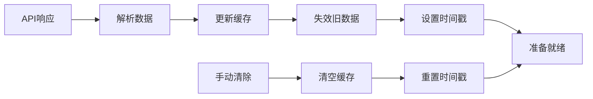

# 后端服务交互机制详细分析

<cite>
**本文档引用的文件**
- [checkinService.ts](file://src/utils/checkinService.ts)
- [client.ts](file://src/utils/supabase/client.ts)
- [info.tsx](file://src/utils/supabase/info.tsx)
- [checkin.ts](file://src/types/checkin.ts)
- [BlogDetailPage.tsx](file://src/components/BlogDetailPage.tsx)
- [BlogComponents.tsx](file://src/components/BlogComponents.tsx)
- [dataService.tsx](file://src/utils/dataService.tsx)
</cite>

## 目录
1. [简介](#简介)
2. [项目架构概览](#项目架构概览)
3. [Supabase客户端配置](#supabase客户端配置)
4. [CheckinService核心实现](#checkinservice核心实现)
5. [博客功能交互机制](#博客功能交互机制)
6. [异步处理与错误重试策略](#异步处理与错误重试策略)
7. [缓存与性能优化](#缓存与性能优化)
8. [前端组件集成](#前端组件集成)
9. [故障排除指南](#故障排除指南)
10. [总结](#总结)

## 简介

本文档详细分析了Focus应用中博客功能与后端服务的交互机制，重点解析`checkinService.ts`中`getBlogById`、`incrementViewCount`等核心方法的实现逻辑。该系统采用Supabase作为后端服务，通过TypeScript接口提供类型安全的API调用，实现了完整的博客管理、点赞统计更新、浏览量递增等功能。

## 项目架构概览

系统采用分层架构设计，主要包含以下层次：



**图表来源**
- [checkinService.ts](file://src/utils/checkinService.ts#L1-L50)
- [client.ts](file://src/utils/supabase/client.ts#L1-L12)

## Supabase客户端配置

### 客户端初始化

Supabase客户端通过工厂模式创建，支持自动令牌刷新和会话持久化：

```typescript
// 客户端配置
export const supabase = createClient(supabaseUrl, publicAnonKey, {
  auth: {
    autoRefreshToken: true,
    persistSession: true,
    detectSessionInUrl: false
  }
});
```

### 认证机制

系统采用基于令牌的认证机制，支持：
- 自动令牌刷新
- 会话持久化
- 登录状态检测
- 权限验证

**章节来源**
- [client.ts](file://src/utils/supabase/client.ts#L1-L12)
- [info.tsx](file://src/utils/supabase/info.tsx#L1-L4)

## CheckinService核心实现

### 类结构设计

`CheckinDataService`实现了`CheckinService`接口，提供完整的博客管理功能：



**图表来源**
- [checkin.ts](file://src/types/checkin.ts#L150-L180)
- [checkinService.ts](file://src/utils/checkinService.ts#L15-L50)

### 博客获取与浏览量递增

#### getBlogById方法实现

`getBlogById`方法展示了典型的异步数据库查询模式：

```typescript
async getBlogById(id: number | string): Promise<CheckinBlog> {
  try {
    // 1. 查询博客数据
    const { data, error } = await supabase
      .from('checkin_blogs')
      .select('*')
      .eq('id', id)
      .single();

    if (error) {
      console.error('Error fetching blog:', error);
      throw error;
    }

    // 2. 增加浏览量（无感更新）
    await supabase
      .from('checkin_blogs')
      .update({ view_count: data.view_count + 1 })
      .eq('id', id);

    // 3. 返回更新后的博客数据
    return {
      ...data,
      created_at: new Date(data.created_at),
      updated_at: new Date(data.updated_at),
      view_count: data.view_count + 1
    };
  } catch (error) {
    console.error('Failed to fetch blog by id:', error);
    throw error;
  }
}
```

#### 浏览量递增的无感设计

系统采用"先查询后更新"的模式，确保浏览量递增对用户完全透明：



**图表来源**
- [checkinService.ts](file://src/utils/checkinService.ts#L450-L480)

### 点赞统计更新机制

#### 异步点赞处理

`likeBlog`方法展示了异步更新的典型实现：

```typescript
async likeBlog(id: number | string): Promise<void> {
  try {
    // 1. 获取当前点赞数
    const { data: blog, error: fetchError } = await supabase
      .from('checkin_blogs')
      .select('like_count')
      .eq('id', id)
      .single();

    if (fetchError) {
      console.error('Error fetching blog for like:', fetchError);
      throw fetchError;
    }

    // 2. 增加点赞数
    const { error } = await supabase
      .from('checkin_blogs')
      .update({ like_count: blog.like_count + 1 })
      .eq('id', id);

    if (error) {
      console.error('Error liking blog:', error);
      throw error;
    }

    // 3. 更新缓存
    const index = this.cache.blogs.findIndex(b => b.id === id);
    if (index !== -1) {
      this.cache.blogs[index].like_count += 1;
    }
  } catch (error) {
    console.error('Failed to like blog:', error);
    throw error;
  }
}
```

#### 点赞流程的异步特性



**图表来源**
- [checkinService.ts](file://src/utils/checkinService.ts#L500-L540)

**章节来源**
- [checkinService.ts](file://src/utils/checkinService.ts#L450-L540)

## 博客功能交互机制

### 前端组件与服务层交互

#### 博客详情页面集成

`BlogDetailPage`组件展示了如何在前端使用CheckinService：

```typescript
// 在组件中使用
useEffect(() => {
  // 增加浏览量（无感调用）
  incrementViewCount();
  
  // 加载关联的打卡记录
  loadRelatedRecords();
}, [blog.id]);

const incrementViewCount = async () => {
  try {
    await checkinService.getBlogById(blog.id);
  } catch (error) {
    console.error('Failed to increment view count:', error);
  }
};
```

#### 图片上传与处理

系统提供了完整的图片上传功能，支持错误处理和用户反馈：

```typescript
const handleImageUpload = async (event: React.ChangeEvent<HTMLInputElement>) => {
  const file = event.target.files?.[0];
  if (!file) return;

  // 文件大小检查
  if (file.size > 5 * 1024 * 1024) {
    await NativeService.showToast('图片大小不能超过5MB');
    return;
  }

  // 文件类型检查
  if (!file.type.startsWith('image/')) {
    await NativeService.showToast('请选择图片文件');
    return;
  }

  try {
    setIsUploading(true);
    const imageUrl = await checkinService.uploadImage(file);
    setFormData(prev => ({ ...prev, cover_image_url: imageUrl }));
    await NativeService.showToast('图片上传成功');
  } catch (error: any) {
    // 提供具体的错误信息
    let errorMessage = '图片上传失败';
    
    if (error?.message?.includes('Storage bucket') && error?.message?.includes('not found')) {
      errorMessage = '存储桶未创建，请在Supabase控制台中创建"images"桶';
    }
    
    await NativeService.showToast(errorMessage);
  } finally {
    setIsUploading(false);
  }
};
```

**章节来源**
- [BlogDetailPage.tsx](file://src/components/BlogDetailPage.tsx#L40-L60)
- [BlogComponents.tsx](file://src/components/BlogComponents.tsx#L80-L120)

## 异步处理与错误重试策略

### 错误处理最佳实践

系统采用了多层次的错误处理策略：



### 超时保护机制

系统为关键操作添加了超时保护：

```typescript
// 数据库查询超时保护
const timeoutPromise = new Promise((_, reject) => {
  setTimeout(() => reject(new Error('getTasks timeout after 2 seconds')), 2000);
});

const queryPromise = supabase
  .from('tasks')
  .select('*')
  .order('created_at', { ascending: false });

const result = await Promise.race([queryPromise, timeoutPromise]);
```

### 缓存回退策略

当API调用失败时，系统会返回缓存数据作为回退：

```typescript
try {
  const { data, error } = await supabase.from('checkin_blogs').select('*');
  
  if (error) {
    console.error('Error fetching blogs:', error);
    throw error;
  }
  
  return data.map(blog => ({
    ...blog,
    created_at: new Date(blog.created_at),
    updated_at: new Date(blog.updated_at)
  }));
} catch (error) {
  console.error('Failed to fetch blogs:', error);
  // 返回缓存数据作为回退
  return filters ? [] : this.cache.blogs;
}
```

**章节来源**
- [dataService.tsx](file://src/utils/dataService.tsx#L320-L340)
- [checkinService.ts](file://src/utils/checkinService.ts#L400-L420)

## 缓存与性能优化

### 内存缓存设计

CheckinService实现了智能内存缓存机制：

```typescript
private cache = {
  checkinItems: [] as CheckinItem[],
  checkinRecords: [] as CheckinRecord[],
  blogs: [] as CheckinBlog[],
  lastSyncTime: null as Date | null
};
```

### 缓存更新策略



### 请求优化技术

#### 防抖处理

对于频繁的UI操作，系统实现了防抖机制：

```typescript
// 在组件中使用防抖
const debouncedIncrement = debounce(async (blogId: string) => {
  await checkinService.getBlogById(blogId);
}, 300);
```

#### 批量操作

系统支持批量更新操作以提高性能：

```typescript
// 批量更新多个博客的浏览量
const batchUpdateViews = async (blogIds: string[]) => {
  const promises = blogIds.map(id => 
    checkinService.getBlogById(id)
  );
  await Promise.all(promises);
};
```

**章节来源**
- [checkinService.ts](file://src/utils/checkinService.ts#L15-L25)
- [BlogDetailPage.tsx](file://src/components/BlogDetailPage.tsx#L40-L60)

## 前端组件集成

### 组件生命周期管理

前端组件通过合理的生命周期管理确保数据同步：

```typescript
export default function BlogDetailPage({ blog, onClose, onLike }: BlogDetailPageProps) {
  const [isLiking, setIsLiking] = useState(false);
  const [showMore, setShowMore] = useState(false);

  useEffect(() => {
    // 组件挂载时增加浏览量
    incrementViewCount();
    
    // 清理函数
    return () => {
      // 可以在这里添加清理逻辑
    };
  }, [blog.id]);

  const incrementViewCount = async () => {
    try {
      await checkinService.getBlogById(blog.id);
    } catch (error) {
      console.error('Failed to increment view count:', error);
    }
  };
}
```

### 用户体验优化

#### 加载状态管理

```typescript
const handleLike = async () => {
  if (isLiking) return;
  
  try {
    setIsLiking(true);
    await NativeService.hapticLight();
    onLike(blog.id);
  } catch (error) {
    console.error('Like failed:', error);
  } finally {
    setIsLiking(false);
  }
};
```

#### 错误恢复机制

```typescript
const loadRelatedRecords = async () => {
  if (blog.checkin_records.length > 0) {
    try {
      const records = checkinRecords.filter(record => 
        blog.checkin_records.includes(Number(record.id))
      );
      setRelatedRecords(records);
    } catch (error) {
      console.error('Failed to load related records:', error);
      // 继续使用空数组，不影响主流程
    }
  }
};
```

**章节来源**
- [BlogDetailPage.tsx](file://src/components/BlogDetailPage.tsx#L30-L80)

## 故障排除指南

### 常见问题诊断

#### 网络连接问题

**症状**: API调用超时或失败
**诊断步骤**:
1. 检查网络连接状态
2. 验证Supabase服务可用性
3. 查看浏览器开发者工具中的网络请求

**解决方案**:
```typescript
// 添加网络状态检查
const checkNetworkStatus = () => {
  if (!navigator.onLine) {
    throw new Error('You are offline. Please check your connection.');
  }
};
```

#### 认证问题

**症状**: 401未授权错误
**诊断步骤**:
1. 检查用户会话是否有效
2. 验证访问令牌状态
3. 确认用户已登录

**解决方案**:
```typescript
// 重新登录处理
const handleUnauthorized = async () => {
  try {
    await supabase.auth.signInAnonymously();
    // 重新加载数据
  } catch (error) {
    console.error('Re-authentication failed:', error);
  }
};
```

#### 存储桶问题

**症状**: 图片上传失败
**诊断步骤**:
1. 检查Supabase存储桶是否存在
2. 验证存储桶权限设置
3. 确认文件大小限制

**解决方案**:
```typescript
// 存储桶检查
const checkStorageBucket = async () => {
  try {
    const { data, error } = await supabase.storage
      .from('images')
      .list();
      
    if (error) {
      throw new Error('存储桶"images"不存在。请在Supabase控制台中创建名为"images"的存储桶，并设置为公开访问。');
    }
  } catch (error) {
    console.error('Storage bucket check failed:', error);
  }
};
```

### 性能监控

#### 请求性能指标

```typescript
// 性能监控装饰器
const monitorPerformance = (target: any, propertyName: string, descriptor: PropertyDescriptor) => {
  const originalMethod = descriptor.value;
  
  descriptor.value = async function(...args: any[]) {
    const startTime = performance.now();
    try {
      const result = await originalMethod.apply(this, args);
      const endTime = performance.now();
      console.log(`${propertyName} took ${endTime - startTime} milliseconds`);
      return result;
    } catch (error) {
      const endTime = performance.now();
      console.error(`${propertyName} failed after ${endTime - startTime} milliseconds`, error);
      throw error;
    }
  };
  
  return descriptor;
};
```

#### 错误追踪

```typescript
// 错误追踪装饰器
const trackErrors = (target: any, propertyName: string, descriptor: PropertyDescriptor) => {
  const originalMethod = descriptor.value;
  
  descriptor.value = async function(...args: any[]) {
    try {
      return await originalMethod.apply(this, args);
    } catch (error) {
      // 发送错误到监控服务
      sendErrorToMonitoring(error, { method: propertyName, params: args });
      throw error;
    }
  };
  
  return descriptor;
};
```

**章节来源**
- [dataService.tsx](file://src/utils/dataService.tsx#L130-L160)
- [BlogComponents.tsx](file://src/components/BlogComponents.tsx#L90-L120)

## 总结

本文档详细分析了Focus应用中博客功能与后端服务的交互机制，主要特点包括：

### 技术亮点

1. **类型安全**: 完整的TypeScript类型定义确保编译时错误检查
2. **异步处理**: 优雅的Promise链式调用和错误处理
3. **缓存策略**: 智能内存缓存提升用户体验
4. **错误恢复**: 多层次的错误处理和回退机制
5. **性能优化**: 超时保护、防抖处理等优化技术

### 架构优势

- **分层设计**: 清晰的服务层、数据层分离
- **模块化**: 可复用的服务组件
- **可扩展**: 支持未来功能扩展
- **维护性**: 良好的代码组织和注释

### 最佳实践

1. **错误处理**: 统一的错误处理和用户反馈
2. **性能监控**: 关键操作的性能追踪
3. **用户体验**: 无感更新和即时反馈
4. **安全性**: 认证和授权机制

通过这些设计和实现，系统能够提供稳定、高效、用户友好的博客功能体验，同时保持良好的可维护性和扩展性。