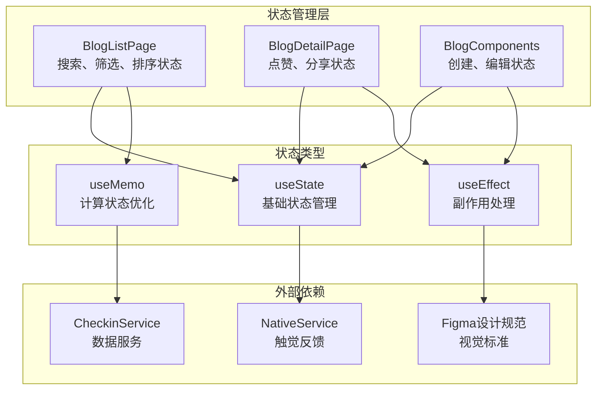
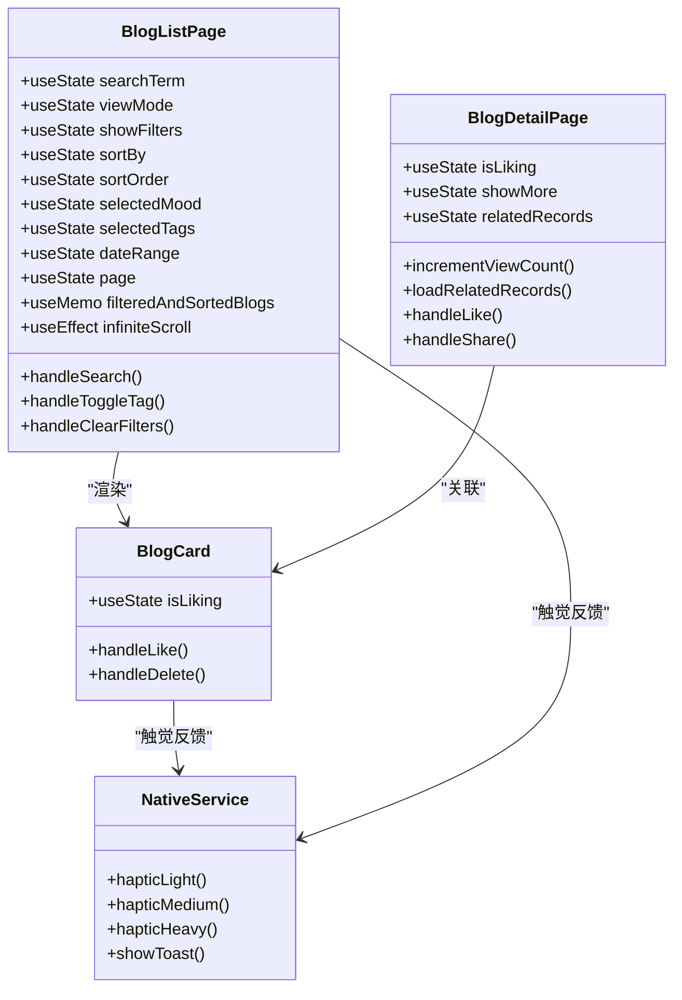
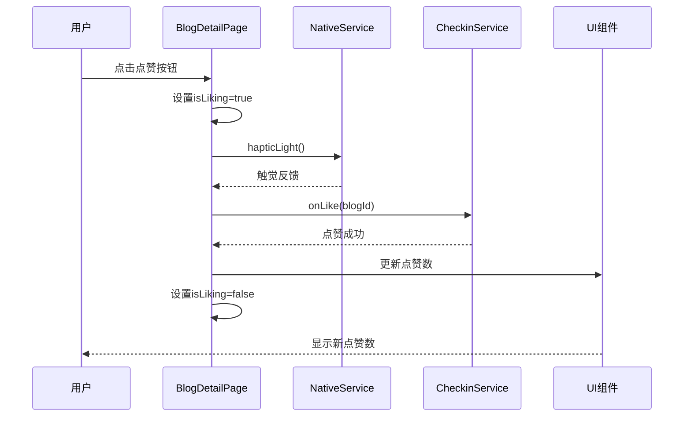
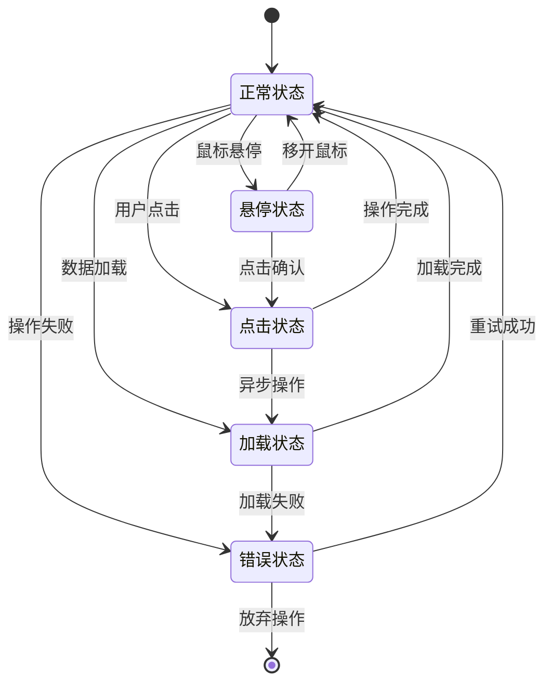
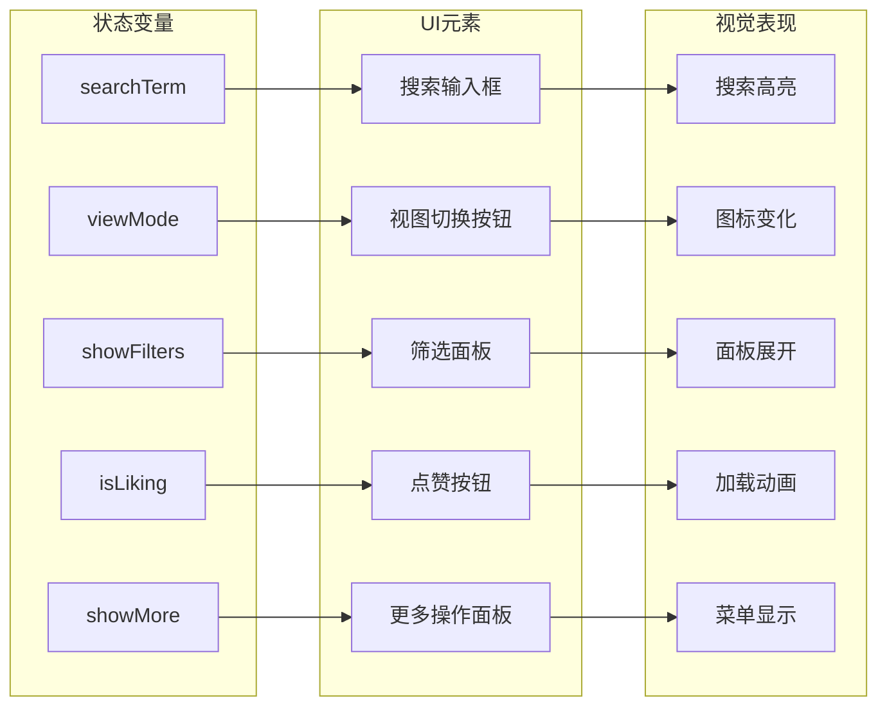
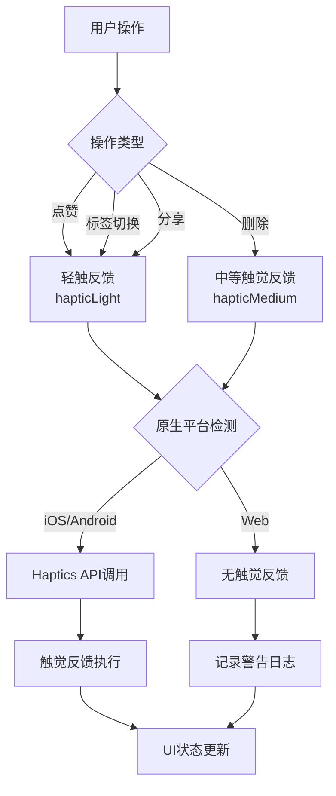
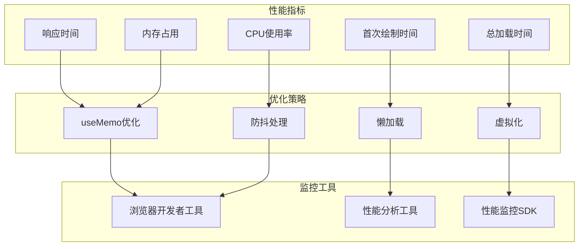
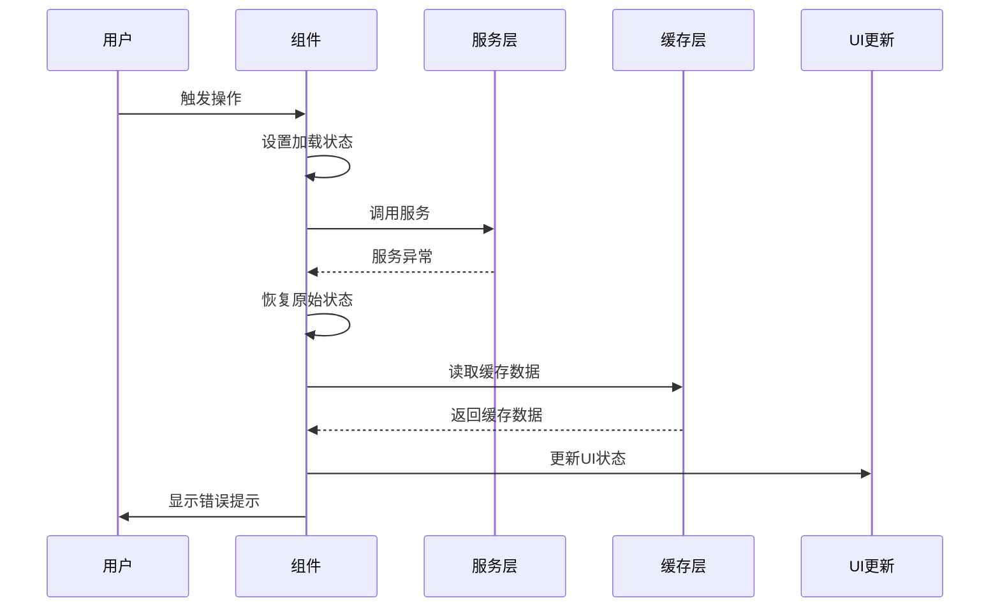
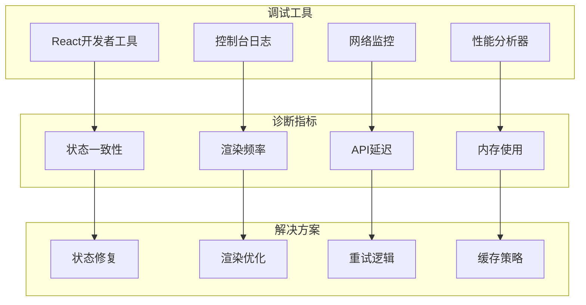

# 博客功能状态管理与视觉反馈设计

<cite>
**本文档引用的文件**
- [BlogListPage.tsx](file://src/components/BlogListPage.tsx)
- [BlogDetailPage.tsx](file://src/components/BlogDetailPage.tsx)
- [BlogComponents.tsx](file://src/components/BlogComponents.tsx)
- [nativeService.ts](file://src/utils/nativeService.ts)
- [checkinService.ts](file://src/utils/checkinService.ts)
- [checkin.ts](file://src/types/checkin.ts)
- [blog_view.md](file://src/guidelines/blog_view.md)
</cite>

## 目录
1. [简介](#简介)
2. [状态管理架构](#状态管理架构)
3. [UI状态管理机制](#ui状态管理机制)
4. [视觉反馈设计](#视觉反馈设计)
5. [触觉反馈集成](#触觉反馈集成)
6. [性能优化策略](#性能优化策略)
7. [状态同步异常处理](#状态同步异常处理)
8. [故障排除指南](#故障排除指南)
9. [总结](#总结)

## 简介

本文档详细阐述了Focus应用中博客功能的状态管理机制与视觉反馈设计。博客功能包含两个核心页面：BlogListPage（博客列表页）和BlogDetailPage（博客详情页），以及相关的组件如BlogCard（博客卡片）。系统采用React Hooks进行状态管理，通过useState和useMemo实现高效的UI状态控制，并集成了原生触觉反馈和视觉动画效果，为用户提供流畅且富有交互性的体验。

## 状态管理架构

### 核心状态管理组件

博客功能的状态管理主要分布在三个核心组件中，每个组件负责不同的状态维度：



**图表来源**
- [BlogListPage.tsx](file://src/components/BlogListPage.tsx#L1-L50)
- [BlogDetailPage.tsx](file://src/components/BlogDetailPage.tsx#L1-L50)
- [BlogComponents.tsx](file://src/components/BlogComponents.tsx#L1-L50)

### 状态层次结构



**图表来源**
- [BlogListPage.tsx](file://src/components/BlogListPage.tsx#L40-L120)
- [BlogDetailPage.tsx](file://src/components/BlogDetailPage.tsx#L25-L80)
- [BlogComponents.tsx](file://src/components/BlogComponents.tsx#L500-L550)

**章节来源**
- [BlogListPage.tsx](file://src/components/BlogListPage.tsx#L1-L571)
- [BlogDetailPage.tsx](file://src/components/BlogDetailPage.tsx#L1-L417)
- [BlogComponents.tsx](file://src/components/BlogComponents.tsx#L1-L632)

## UI状态管理机制

### BlogListPage状态管理

BlogListPage实现了复杂的状态管理系统，涵盖搜索、筛选、排序等多个维度：

#### 基础UI状态

```typescript
// 搜索状态管理
const [searchTerm, setSearchTerm] = useState("");
const handleSearch = (value: string) => {
  setSearchTerm(value);
  setPage(1); // 重置页码
};

// 视图模式状态
const [viewMode, setViewMode] = useState<'grid' | 'list'>('grid');

// 筛选面板状态
const [showFilters, setShowFilters] = useState(false);
```

#### 高级筛选状态

```typescript
// 排序状态
const [sortBy, setSortBy] = useState<'created_at' | 'like_count' | 'view_count'>('created_at');
const [sortOrder, setSortOrder] = useState<'asc' | 'desc'>('desc');

// 心情筛选状态
const [selectedMood, setSelectedMood] = useState<CheckinMood | 'all'>('all');

// 标签筛选状态
const [selectedTags, setSelectedTags] = useState<string[]>([]);

// 日期范围筛选状态
const [dateRange, setDateRange] = useState<'all' | 'week' | 'month' | 'year'>('all');
```

#### 计算状态优化

BlogListPage使用React.useMemo进行高效的状态计算：

```typescript
const filteredAndSortedBlogs = React.useMemo(() => {
  let filtered = blogs;

  // 搜索筛选
  if (searchTerm.trim()) {
    const searchLower = searchTerm.toLowerCase();
    filtered = filtered.filter(blog => 
      blog.title.toLowerCase().includes(searchLower) ||
      blog.content.toLowerCase().includes(searchLower) ||
      blog.tags.some(tag => tag.toLowerCase().includes(searchLower)) ||
      (blog.location && blog.location.toLowerCase().includes(searchLower))
    );
  }

  // 心情筛选
  if (selectedMood !== 'all') {
    filtered = filtered.filter(blog => blog.mood === selectedMood);
  }

  // 标签筛选
  if (selectedTags.length > 0) {
    filtered = filtered.filter(blog => 
      selectedTags.some(tag => blog.tags.includes(tag))
    );
  }

  // 日期筛选
  if (dateRange !== 'all') {
    const now = new Date();
    const startDate = new Date();
    
    switch (dateRange) {
      case 'week':
        startDate.setDate(now.getDate() - 7);
        break;
      case 'month':
        startDate.setMonth(now.getMonth() - 1);
        break;
      case 'year':
        startDate.setFullYear(now.getFullYear() - 1);
        break;
    }
    
    filtered = filtered.filter(blog => blog.created_at >= startDate);
  }

  // 排序
  return filtered.sort((a, b) => {
    let aValue: number;
    let bValue: number;

    switch (sortBy) {
      case 'like_count':
        aValue = a.like_count;
        bValue = b.like_count;
        break;
      case 'view_count':
        aValue = a.view_count;
        bValue = b.view_count;
        break;
      default: // created_at
        aValue = a.created_at.getTime();
        bValue = b.created_at.getTime();
    }

    return sortOrder === 'desc' ? bValue - aValue : aValue - bValue;
  });
}, [blogs, searchTerm, selectedMood, selectedTags, dateRange, sortBy, sortOrder]);
```

### BlogDetailPage状态管理

BlogDetailPage专注于单个博客的交互状态：

```typescript
// 点赞状态管理
const [isLiking, setIsLiking] = useState(false);

// 更多操作面板状态
const [showMore, setShowMore] = useState(false);

// 关联记录状态
const [relatedRecords, setRelatedRecords] = useState<CheckinRecord[]>([]);
```

#### 点赞状态流程



**图表来源**
- [BlogDetailPage.tsx](file://src/components/BlogDetailPage.tsx#L50-L70)

### BlogCard组件状态管理

BlogCard实现了独立的状态管理，支持点赞和删除操作：

```typescript
const [isLiking, setIsLiking] = useState(false);

const handleLike = async (e: React.MouseEvent) => {
  e.stopPropagation();
  if (isLiking) return;
  
  try {
    setIsLiking(true);
    await NativeService.hapticLight();
    onLike(blog.id);
  } catch (error) {
    console.error('Like failed:', error);
  } finally {
    setIsLiking(false);
  }
};
```

**章节来源**
- [BlogListPage.tsx](file://src/components/BlogListPage.tsx#L40-L150)
- [BlogDetailPage.tsx](file://src/components/BlogDetailPage.tsx#L25-L80)
- [BlogComponents.tsx](file://src/components/BlogComponents.tsx#L500-L550)

## 视觉反馈设计

### Figma设计规范遵循

根据blog_view.md设计规范，博客组件严格遵循以下视觉标准：

#### 现代博客卡片设计

```css
/* 卡片容器样式 */
.bg-white.rounded-[28px].p-6.shadow-[0_12px_24px_-4px_rgba(0,0,0,0.1)]

/* 标题样式 */
.text-2xl.font-bold.text-[#333333].mb-4.leading-tight

/* 内容样式 */
.text-base.text-[#757575].leading-relaxed.mb-6

/* 图像样式 */
.relative.rounded-[20px].overflow-hidden.mb-4
```

#### 视觉状态映射



### 动画与过渡效果

#### Framer Motion动画集成

```typescript
// BlogListPage中的网格视图动画
<AnimatePresence>
  {filteredAndSortedBlogs.map((blog, index) => (
    <div 
      key={blog.id}
      ref={index === filteredAndSortedBlogs.length - 1 ? lastBlogElementRef : null}
    >
      <BlogCard
        blog={blog}
        onBlogClick={onBlogClick}
        onLike={onLikeBlog}
        onDelete={onDeleteBlog}
        showActions={true}
      />
    </div>
  ))}
</AnimatePresence>

// BlogDetailPage中的侧滑动画
<motion.div
  initial={{ x: '100%' }}
  animate={{ x: 0 }}
  exit={{ x: '100%' }}
  transition={{ type: "spring", damping: 30, stiffness: 300 }}
  className="fixed inset-0 bg-gray-50 z-50 overflow-hidden"
>
```

#### Loader2加载动画

```typescript
// 加载状态的视觉反馈
{isLoading ? (
  <div className="flex items-center gap-2 text-gray-500">
    <Loader2 className="h-4 w-4 animate-spin" />
    <span className="text-sm">加载中...</span>
  </div>
) : null}
```

### 视觉状态同步

#### 状态到UI的映射关系



**图表来源**
- [BlogListPage.tsx](file://src/components/BlogListPage.tsx#L200-L250)
- [BlogDetailPage.tsx](file://src/components/BlogDetailPage.tsx#L100-L150)

**章节来源**
- [BlogListPage.tsx](file://src/components/BlogListPage.tsx#L200-L300)
- [BlogDetailPage.tsx](file://src/components/BlogDetailPage.tsx#L100-L200)
- [blog_view.md](file://src/guidelines/blog_view.md#L1-L88)

## 触觉反馈集成

### NativeService触觉反馈系统

NativeService提供了完整的触觉反馈机制，支持不同强度的触觉反馈：

```typescript
export class NativeService {
  // 轻触反馈
  static async hapticLight() {
    if (Capacitor.isNativePlatform()) {
      try {
        await Haptics.impact({ style: ImpactStyle.Light });
      } catch (error) {
        console.warn('Haptic feedback not available:', error);
      }
    }
  }

  // 中等触觉反馈
  static async hapticMedium() {
    if (Capacitor.isNativePlatform()) {
      try {
        await Haptics.impact({ style: ImpactStyle.Medium });
      } catch (error) {
        console.warn('Haptic feedback not available:', error);
      }
    }
  }

  // 重触觉反馈
  static async hapticHeavy() {
    if (Capacitor.isNativePlatform()) {
      try {
        await Haptics.impact({ style: ImpactStyle.Heavy });
      } catch (error) {
        console.warn('Haptic feedback not available:', error);
      }
    }
  }
}
```

### 触觉反馈应用场景

#### 点赞操作触觉反馈

```typescript
const handleLike = async () => {
  if (isLiking) return;
  
  try {
    setIsLiking(true);
    await NativeService.hapticLight(); // 轻触反馈
    onLike(blog.id);
  } catch (error) {
    console.error('Like failed:', error);
  } finally {
    setIsLiking(false);
  }
};
```

#### 标签切换触觉反馈

```typescript
const handleToggleTag = async (tag: string) => {
  await NativeService.hapticLight(); // 轻触反馈
  setSelectedTags(prev => 
    prev.includes(tag) 
      ? prev.filter(t => t !== tag)
      : [...prev, tag]
  );
};
```

#### 删除操作触觉反馈

```typescript
const handleDelete = async (e: React.MouseEvent) => {
  e.stopPropagation();
  if (onDelete) {
    await NativeService.hapticMedium(); // 中等触觉反馈
    onDelete(blog.id);
  }
};
```

### 触觉反馈状态映射



**图表来源**
- [BlogDetailPage.tsx](file://src/components/BlogDetailPage.tsx#L50-L70)
- [BlogListPage.tsx](file://src/components/BlogListPage.tsx#L180-L200)
- [BlogComponents.tsx](file://src/components/BlogComponents.tsx#L500-L520)

**章节来源**
- [nativeService.ts](file://src/utils/nativeService.ts#L1-L180)
- [BlogDetailPage.tsx](file://src/components/BlogDetailPage.tsx#L50-L70)
- [BlogListPage.tsx](file://src/components/BlogListPage.tsx#L180-L200)

## 性能优化策略

### useMemo计算优化

BlogListPage使用useMemo避免不必要的重新计算：

```typescript
const filteredAndSortedBlogs = React.useMemo(() => {
  // 复杂的筛选和排序逻辑
  // 只有当依赖数组中的值发生变化时才重新计算
}, [blogs, searchTerm, selectedMood, selectedTags, dateRange, sortBy, sortOrder]);
```

### 无限滚动优化

```typescript
// 无限滚动观察器
useEffect(() => {
  if (isLoading) return;

  if (observerRef.current) observerRef.current.disconnect();

  observerRef.current = new IntersectionObserver(entries => {
    if (entries[0].isIntersecting && hasMore && onLoadMore) {
      onLoadMore();
    }
  });

  if (lastBlogElementRef.current) {
    observerRef.current.observe(lastBlogElementRef.current);
  }

  return () => {
    if (observerRef.current) observerRef.current.disconnect();
  };
}, [isLoading, hasMore, onLoadMore]);
```

### 条件渲染优化

```typescript
// 条件渲染减少DOM节点
{filteredAndSortedBlogs.length === 0 ? (
  <div className="flex flex-col items-center justify-center py-12 text-center">
    <div className="text-6xl mb-4">📖</div>
    <h3 className="text-lg font-medium mb-2">
      {blogs.length === 0 ? '还没有Blog' : '没有找到匹配的Blog'}
    </h3>
    <p className="text-gray-500 mb-4">
      {blogs.length === 0 
        ? '分享你的打卡心得和生活感悟' 
        : '试试调整搜索条件或筛选器'
      }
    </p>
  </div>
) : (
  <>
    {viewMode === 'grid' ? renderGridView() : renderListView()}
  </>
)}
```

### 性能监控指标



**章节来源**
- [BlogListPage.tsx](file://src/components/BlogListPage.tsx#L60-L120)
- [BlogListPage.tsx](file://src/components/BlogListPage.tsx#L130-L160)

## 状态同步异常处理

### 异常状态检测

```typescript
// 点赞状态异常处理
const handleLike = async () => {
  if (isLiking) {
    console.warn('Already liking, skipping duplicate action');
    return;
  }
  
  try {
    setIsLiking(true);
    await NativeService.hapticLight();
    onLike(blog.id);
  } catch (error) {
    console.error('Like operation failed:', error);
    // 恢复原始状态
    setIsLiking(false);
    await NativeService.showToast('操作失败，请重试');
  }
};
```

### 状态一致性验证

```typescript
// 状态验证函数
const validateStateConsistency = () => {
  // 验证点赞状态与实际数据的一致性
  if (isLiking && blog.like_count === originalLikeCount) {
    console.warn('State inconsistency detected: UI loading state without data change');
  }
};
```

### 错误恢复机制



**图表来源**
- [BlogDetailPage.tsx](file://src/components/BlogDetailPage.tsx#L50-L70)

### 状态同步问题排查

#### 常见同步问题

1. **异步状态竞态**
   ```typescript
   // 问题：多个异步操作同时修改状态
   const handleMultipleLikes = async () => {
     setIsLiking(true);
     await onLike(blog.id); // 可能被其他操作中断
     setIsLiking(false);
   };
   
   // 解决方案：使用取消令牌
   const abortController = new AbortController();
   
   const handleLike = async () => {
     if (abortController.signal.aborted) return;
     
     try {
       setIsLiking(true);
       await onLike(blog.id);
     } finally {
       if (!abortController.signal.aborted) {
         setIsLiking(false);
       }
     }
   };
   ```

2. **状态更新延迟**
   ```typescript
   // 问题：状态更新后立即读取导致不一致
   const handleQuickAction = () => {
     setState(newState);
     const currentValue = state; // 可能是旧值
   };
   
   // 解决方案：使用回调或队列
   const handleQuickAction = () => {
     setState(newState);
     setTimeout(() => {
       const currentValue = state; // 确保是新值
     }, 0);
   };
   ```

**章节来源**
- [BlogDetailPage.tsx](file://src/components/BlogDetailPage.tsx#L50-L70)
- [checkinService.ts](file://src/utils/checkinService.ts#L600-L650)

## 故障排除指南

### 常见问题诊断

#### 触觉反馈失效

**症状**：用户点击后没有触觉反馈

**排查步骤**：
1. 检查设备是否支持触觉反馈
2. 验证NativeService初始化状态
3. 检查平台兼容性

```typescript
// 触觉反馈诊断函数
const diagnoseHapticFeedback = async () => {
  console.log('Platform:', NativeService.getPlatform());
  console.log('Is Native:', NativeService.isNative());
  
  try {
    await NativeService.hapticLight();
    console.log('Haptic feedback working');
  } catch (error) {
    console.error('Haptic feedback failed:', error);
  }
};
```

#### 状态更新不及时

**症状**：UI状态与实际数据不一致

**排查步骤**：
1. 检查状态更新时机
2. 验证异步操作完成状态
3. 检查状态依赖关系

```typescript
// 状态诊断函数
const diagnoseStateUpdates = () => {
  console.log('Current State:', {
    isLiking,
    blogLikeCount: blog.like_count,
    originalLikeCount: originalLikeCount
  });
  
  if (isLiking && blog.like_count === originalLikeCount) {
    console.warn('Potential state inconsistency detected');
  }
};
```

#### 性能问题诊断

**症状**：界面响应缓慢或卡顿

**排查步骤**：
1. 使用React Profiler分析组件渲染
2. 检查useMemo依赖项是否正确
3. 分析无限滚动性能瓶颈

```typescript
// 性能诊断函数
const diagnosePerformance = () => {
  console.time('Blog filtering');
  const filtered = applyFilters(blogs, filters);
  console.timeEnd('Blog filtering');
  
  console.log('Filtered blogs:', filtered.length);
  console.log('Total blogs:', blogs.length);
};
```

### 调试工具集成



### 最佳实践建议

1. **状态管理最佳实践**
   - 使用单一数据源原则
   - 避免深层嵌套状态
   - 合理使用状态提升

2. **性能优化最佳实践**
   - 正确使用useMemo和useCallback
   - 实现适当的防抖和节流
   - 优化大型列表渲染

3. **用户体验最佳实践**
   - 提供清晰的加载状态
   - 实现优雅的错误处理
   - 确保触觉反馈一致性

**章节来源**
- [nativeService.ts](file://src/utils/nativeService.ts#L10-L50)
- [BlogDetailPage.tsx](file://src/components/BlogDetailPage.tsx#L50-L70)

## 总结

Focus应用的博客功能展现了现代React应用中状态管理与视觉反馈设计的最佳实践。通过精心设计的状态管理架构、精确的视觉反馈系统和完善的性能优化策略，系统为用户提供了流畅且富有交互性的博客体验。

### 关键技术亮点

1. **分层状态管理**：BlogListPage、BlogDetailPage和BlogComponents各自负责不同的状态维度，实现了清晰的职责分离
2. **高性能计算优化**：通过useMemo和useEffect的合理运用，确保了复杂筛选和排序操作的高效执行
3. **原生触觉反馈集成**：NativeService提供了完整的触觉反馈机制，增强了移动端的交互体验
4. **视觉一致性保障**：严格遵循Figma设计规范，确保了UI状态的准确表达和视觉效果的一致性

### 设计原则总结

- **状态驱动**：所有UI变化都由状态驱动，确保了状态与UI的一致性
- **渐进增强**：在原生平台上提供丰富的触觉和视觉反馈，在Web平台上提供优雅的降级方案
- **性能优先**：通过合理的优化策略，确保了大规模数据集的流畅渲染
- **用户体验导向**：注重用户交互的即时反馈和错误处理的友好性

这套状态管理与视觉反馈设计体系不仅满足了当前的功能需求，也为未来的功能扩展和性能优化奠定了坚实的基础。通过持续的监控和优化，系统能够为用户提供稳定、流畅且富有情感的博客体验。