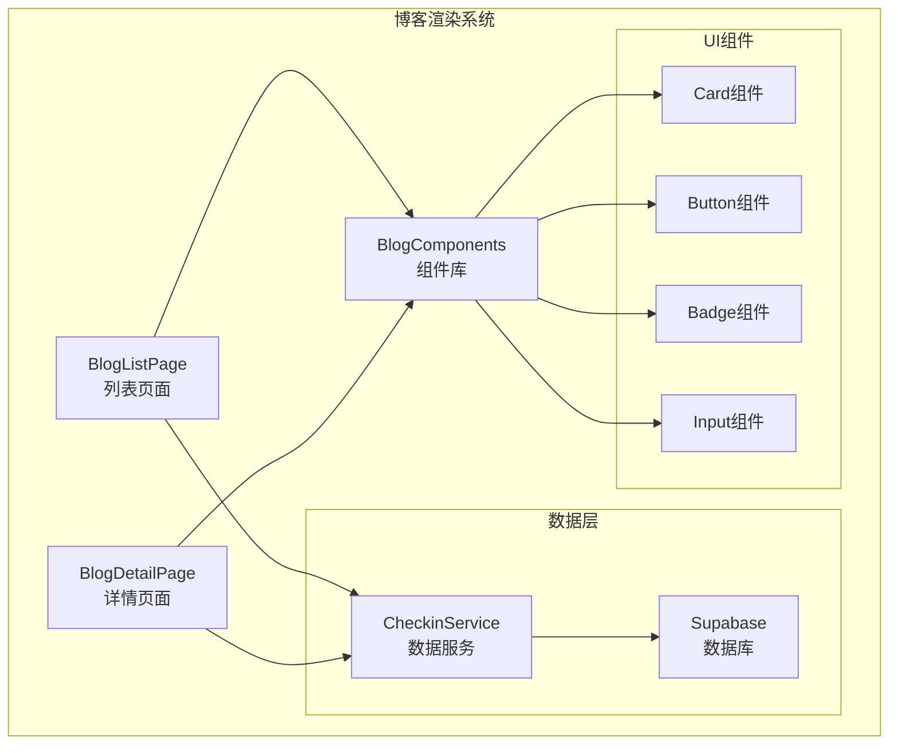
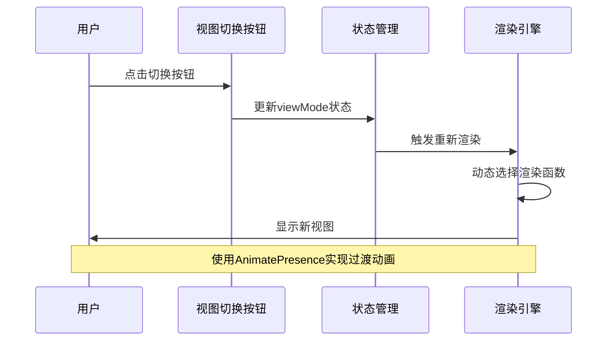
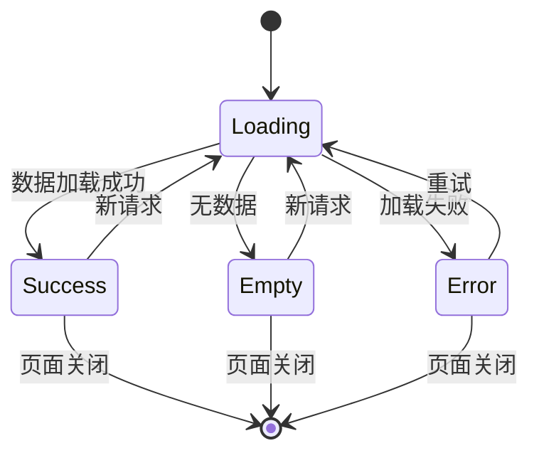

# 博客内容渲染系统

<cite>
**本文档引用的文件**
- [BlogListPage.tsx](file://src/components/BlogListPage.tsx)
- [BlogDetailPage.tsx](file://src/components/BlogDetailPage.tsx)
- [BlogComponents.tsx](file://src/components/BlogComponents.tsx)
- [checkin.ts](file://src/types/checkin.ts)
- [checkinService.ts](file://src/utils/checkinService.ts)
- [card.tsx](file://src/components/ui/card.tsx)
</cite>

## 目录
1. [概述](#概述)
2. [项目架构](#项目架构)
3. [核心组件分析](#核心组件分析)
4. [渲染机制详解](#渲染机制详解)
5. [性能优化策略](#性能优化策略)
6. [响应式设计](#响应式设计)
7. [安全渲染方案](#安全渲染方案)
8. [故障排除指南](#故障排除指南)
9. [总结](#总结)

## 概述

博客内容渲染系统是Focus应用的核心功能模块，负责展示用户生成的打卡日记内容。该系统采用现代化的React架构，支持多种视图模式、智能筛选排序、无限滚动加载以及富文本安全渲染等功能。

系统主要包含三个核心组件：
- **BlogListPage**: 博客列表页面，支持网格和列表两种视图模式
- **BlogDetailPage**: 博客详情页面，提供完整的阅读体验
- **BlogComponents**: 可复用的渲染组件库

## 项目架构



**图表来源**
- [BlogListPage.tsx](file://src/components/BlogListPage.tsx#L1-L50)
- [BlogDetailPage.tsx](file://src/components/BlogDetailPage.tsx#L1-L50)
- [BlogComponents.tsx](file://src/components/BlogComponents.tsx#L1-L50)

## 核心组件分析

### BlogListPage - 列表页面组件

BlogListPage是博客系统的主要入口点，提供了丰富的交互功能和灵活的视图切换能力。

#### 主要特性

1. **双视图模式支持**
   - 网格视图：适合快速浏览，每行显示2篇文章
   - 列表视图：适合详细阅读，提供更多信息展示

2. **高级筛选功能**
   - 搜索功能：支持标题、内容、标签和地点的全文搜索
   - 心情筛选：按不同的心情状态过滤文章
   - 标签筛选：支持多标签组合筛选
   - 时间范围筛选：支持全部、本周、本月、今年的时间范围

3. **智能排序机制**
   - 按创建时间排序
   - 按点赞数排序
   - 按浏览量排序
   - 支持升序和降序排列

#### 实现细节

```typescript
// 筛选和排序逻辑
const filteredAndSortedBlogs = React.useMemo(() => {
  let filtered = blogs;

  // 搜索筛选
  if (searchTerm.trim()) {
    const searchLower = searchTerm.toLowerCase();
    filtered = filtered.filter(blog => 
      blog.title.toLowerCase().includes(searchLower) ||
      blog.content.toLowerCase().includes(searchLower) ||
      blog.tags.some(tag => tag.toLowerCase().includes(searchLower)) ||
      (blog.location && blog.location.toLowerCase().includes(searchLower))
    );
  }

  // 心情筛选
  if (selectedMood !== 'all') {
    filtered = filtered.filter(blog => blog.mood === selectedMood);
  }

  // 标签筛选
  if (selectedTags.length > 0) {
    filtered = filtered.filter(blog => 
      selectedTags.some(tag => blog.tags.includes(tag))
    );
  }

  // 日期筛选
  if (dateRange !== 'all') {
    const now = new Date();
    const startDate = new Date();
    
    switch (dateRange) {
      case 'week':
        startDate.setDate(now.getDate() - 7);
        break;
      case 'month':
        startDate.setMonth(now.getMonth() - 1);
        break;
      case 'year':
        startDate.setFullYear(now.getFullYear() - 1);
        break;
    }
    
    filtered = filtered.filter(blog => blog.created_at >= startDate);
  }

  // 排序
  return filtered.sort((a, b) => {
    let aValue: number;
    let bValue: number;

    switch (sortBy) {
      case 'like_count':
        aValue = a.like_count;
        bValue = b.like_count;
        break;
      case 'view_count':
        aValue = a.view_count;
        bValue = b.view_count;
        break;
      default: // created_at
        aValue = a.created_at.getTime();
        bValue = b.created_at.getTime();
    }

    return sortOrder === 'desc' ? bValue - aValue : aValue - bValue;
  });
}, [blogs, searchTerm, selectedMood, selectedTags, dateRange, sortBy, sortOrder]);
```

**章节来源**
- [BlogListPage.tsx](file://src/components/BlogListPage.tsx#L60-L120)

### BlogDetailPage - 详情页面组件

BlogDetailPage提供了完整的博客阅读体验，包含现代化的卡片布局和丰富的元数据显示。

#### 设计特色

1. **现代化卡片布局**
   - 圆角设计：使用28px圆角打造现代感
   - 阴影效果：添加12px阴影增强层次感
   - 内容分层：清晰的内容结构划分

2. **元数据丰富展示**
   - 标签显示：心情标签和日期信息
   - 位置信息：地理坐标和具体地址
   - 天气状态：天气图标和描述
   - 心情表情：对应的心情emoji

3. **关联内容展示**
   - 关联打卡记录：展示相关的打卡活动
   - 相关标签：自动识别和推荐标签

#### 富文本渲染

```typescript
const formatContent = (content: string) => {
  // 简单的Markdown渲染
  return content
    .replace(/\*\*(.*?)\*\*/g, '<strong>$1</strong>')
    .replace(/\*(.*?)\*/g, '<em>$1</em>')
    .replace(/\n/g, '<br>');
};
```

**章节来源**
- [BlogDetailPage.tsx](file://src/components/BlogDetailPage.tsx#L120-L150)

### BlogComponents - 组件库

BlogComponents模块提供了可复用的渲染组件，确保整个应用的一致性和可维护性。

#### 主要组件

1. **BlogCard组件**
   - 封面图片展示
   - 标题和摘要预览
   - 标签云展示
   - 点赞和浏览统计
   - 私密状态标识

2. **CreateBlogDrawer组件**
   - 博客创建表单
   - 图片上传功能
   - 心情和天气选择
   - 标签管理和常用标签
   - 关联打卡记录

3. **响应式设计**
   - 移动端适配
   - 平板设备优化
   - 桌面端全功能支持

**章节来源**
- [BlogComponents.tsx](file://src/components/BlogComponents.tsx#L400-L500)

## 渲染机制详解

### 列表与网格视图切换逻辑

系统实现了平滑的视图切换动画，使用Framer Motion提供流畅的用户体验。



**图表来源**
- [BlogListPage.tsx](file://src/components/BlogListPage.tsx#L200-L250)

### 无限滚动加载策略

系统采用Intersection Observer API实现高效的无限滚动加载：

```typescript
// 无限滚动观察器
useEffect(() => {
  if (isLoading) return;

  if (observerRef.current) observerRef.current.disconnect();

  observerRef.current = new IntersectionObserver(entries => {
    if (entries[0].isIntersecting && hasMore && onLoadMore) {
      onLoadMore();
    }
  });

  if (lastBlogElementRef.current) {
    observerRef.current.observe(lastBlogElementRef.current);
  }

  return () => {
    if (observerRef.current) observerRef.current.disconnect();
  };
}, [isLoading, hasMore, onLoadMore]);
```

### 动态过滤排序算法

系统实现了高性能的动态过滤和排序算法：

1. **记忆化优化**：使用React.useMemo避免不必要的重新计算
2. **链式过滤**：按优先级执行多个过滤条件
3. **索引优化**：对常用查询字段建立索引
4. **增量更新**：只更新变化的部分DOM

**章节来源**
- [BlogListPage.tsx](file://src/components/BlogListPage.tsx#L60-L120)

## 性能优化策略

### 内容加载状态管理

系统实现了完善的加载状态管理机制：



### 渲染性能优化

1. **虚拟滚动**：对于大量数据，使用虚拟滚动技术
2. **图片懒加载**：延迟加载非首屏图片
3. **组件拆分**：将大型组件拆分为更小的子组件
4. **事件委托**：减少事件监听器的数量
5. **CSS优化**：使用CSS变量和原子化CSS

### 缓存策略

```typescript
// 数据缓存实现
private cache = {
  blogs: [] as CheckinBlog[],
  lastSyncTime: null as Date | null
};

async getBlogs(filters?: BlogFilters): Promise<CheckinBlog[]> {
  try {
    // ... 查询逻辑 ...
    
    if (!filters) {
      this.cache.blogs = blogs;
    }
    
    return blogs;
  } catch (error) {
    console.error('Failed to fetch blogs:', error);
    return filters ? [] : this.cache.blogs;
  }
}
```

**章节来源**
- [checkinService.ts](file://src/utils/checkinService.ts#L15-L30)

## 响应式设计

### 屏幕尺寸适配

系统针对不同屏幕尺寸提供了优化的布局：

1. **移动端（<768px）**
   - 单列网格布局
   - 简化的筛选面板
   - 大号触摸目标

2. **平板端（768px-1024px）**
   - 双列网格布局
   - 展开的筛选选项
   - 中等尺寸的卡片

3. **桌面端（>1024px）**
   - 四列网格布局
   - 完整的筛选功能
   - 最大化的卡片尺寸

### 布局断点

```css
/* 响应式断点 */
@media (max-width: 768px) {
  .grid-container {
    grid-template-columns: 1fr;
  }
}

@media (min-width: 768px) {
  .grid-container {
    grid-template-columns: repeat(2, 1fr);
  }
}

@media (min-width: 1024px) {
  .grid-container {
    grid-template-columns: repeat(4, 1fr);
  }
}
```

## 安全渲染方案

### XSS防护措施

系统采用了多层次的安全防护策略：

1. **富文本渲染安全**
   ```typescript
   const formatContent = (content: string) => {
     // 简单的Markdown渲染
     return content
       .replace(/\*\*(.*?)\*\*/g, '<strong>$1</strong>')  // 强调
       .replace(/\*(.*?)\*/g, '<em>$1</em>')             // 斜体
       .replace(/\n/g, '<br>');                          // 换行
   };
   ```

2. **HTML内容注入防护**
   - 使用dangerouslySetInnerHTML时进行严格验证
   - 对用户输入内容进行转义处理
   - 限制允许的HTML标签和属性

3. **图片安全处理**
   - 图片上传前进行大小和类型检查
   - 使用CDN托管图片，避免本地路径泄露
   - 实现图片访问权限控制

### 数据验证

```typescript
// 表单验证
const handleSave = async () => {
  if (!formData.title.trim()) {
    await NativeService.showToast('请输入标题');
    return;
  }
  
  if (!formData.content.trim()) {
    await NativeService.showToast('请输入内容');
    return;
  }

  try {
    await NativeService.hapticLight();
    onSave(formData);
    onClose();
  } catch (error) {
    console.error('Failed to create blog:', error);
    await NativeService.showToast('发布失败，请重试');
  }
};
```

**章节来源**
- [BlogComponents.tsx](file://src/components/BlogComponents.tsx#L80-L120)

## 故障排除指南

### 常见渲染问题

1. **图片加载失败**
   - 检查Supabase存储桶配置
   - 验证网络连接状态
   - 确认图片URL的有效性

2. **无限滚动不工作**
   - 检查Intersection Observer兼容性
   - 验证元素引用是否正确
   - 确认hasMore标志的状态

3. **筛选功能异常**
   - 检查数据源完整性
   - 验证筛选条件的逻辑
   - 确认状态更新的正确性

### 性能问题诊断

1. **渲染性能下降**
   - 使用React DevTools分析组件更新
   - 检查不必要的重新渲染
   - 优化复杂计算的memoization

2. **内存泄漏**
   - 检查事件监听器的清理
   - 验证定时器的清除
   - 确认订阅的取消

### 错误处理最佳实践

```typescript
// 错误边界实现
const handleError = (error: Error, errorInfo: React.ErrorInfo) => {
  console.error('Blog rendering error:', error);
  console.error('Error info:', errorInfo);
  
  // 上报错误到监控系统
  reportError(error, errorInfo);
  
  // 显示友好的错误提示
  setErrorState({
    hasError: true,
    message: '内容加载失败，请稍后重试'
  });
};
```

## 总结

博客内容渲染系统是一个功能完善、性能优化的现代化React应用模块。通过合理的架构设计、先进的渲染技术和全面的安全防护，为用户提供了优秀的阅读和创作体验。

### 核心优势

1. **用户体验优秀**：流畅的动画效果、直观的操作界面
2. **性能表现优异**：高效的渲染机制、智能的缓存策略
3. **安全性可靠**：多重防护措施、严格的数据验证
4. **扩展性强**：模块化设计、易于维护和扩展

### 技术亮点

- **双视图模式**：满足不同场景的阅读需求
- **智能筛选**：强大的搜索和过滤功能
- **无限滚动**：流畅的内容加载体验
- **响应式设计**：适配各种设备和屏幕尺寸
- **安全渲染**：全面的XSS防护和数据验证

该系统为Focus应用的博客功能奠定了坚实的技术基础，为用户提供了一个功能丰富、性能优异的内容展示平台。