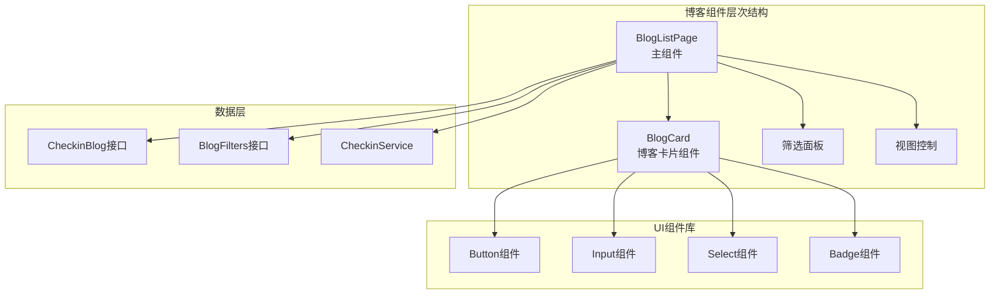
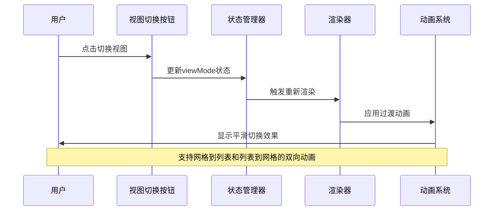
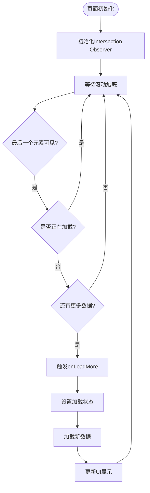
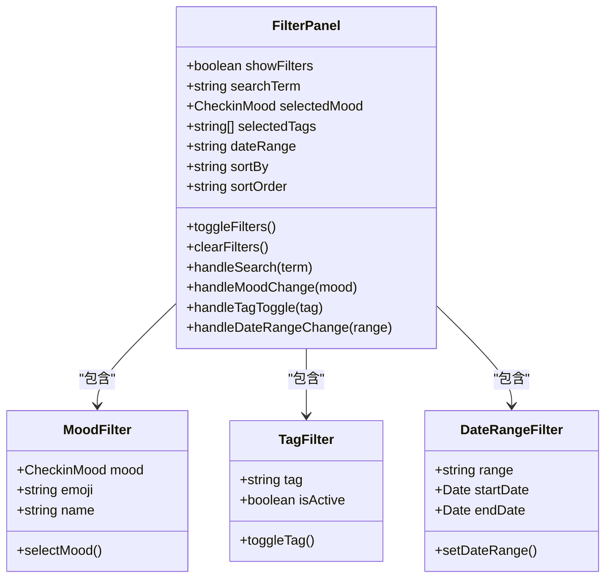
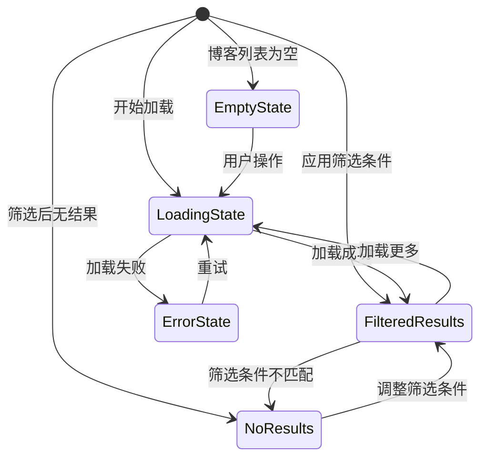

# 列表与网格视图渲染机制深度分析

<cite>
**本文档引用的文件**
- [BlogListPage.tsx](file://src/components/BlogListPage.tsx)
- [checkin.ts](file://src/types/checkin.ts)
- [BlogComponents.tsx](file://src/components/BlogComponents.tsx)
- [blog_view.md](file://src/guidelines/blog_view.md)
- [globals.css](file://src/styles/globals.css)
</cite>

## 目录
1. [简介](#简介)
2. [项目结构概览](#项目结构概览)
3. [核心组件架构](#核心组件架构)
4. [视图模式状态管理](#视图模式状态管理)
5. [无限滚动加载策略](#无限滚动加载策略)
6. [动态过滤与排序算法](#动态过滤与排序算法)
7. [UI状态处理流程](#ui状态处理流程)
8. [响应式布局适配](#响应式布局适配)
9. [性能优化分析](#性能优化分析)
10. [故障排除指南](#故障排除指南)
11. [总结](#总结)

## 简介

BlogListPage.tsx是本项目中负责博客列表展示的核心组件，实现了现代化的列表与网格视图切换机制。该组件不仅提供了丰富的用户交互功能，还采用了先进的无限滚动加载策略和智能的动态过滤排序算法，为用户提供流畅且高效的博客浏览体验。

本文档将深入分析该组件的技术实现细节，包括视图模式状态管理、无限滚动机制、过滤排序算法以及UI状态处理等方面的技术架构和实现原理。

## 项目结构概览



**图表来源**
- [BlogListPage.tsx](file://src/components/BlogListPage.tsx#L1-L50)
- [checkin.ts](file://src/types/checkin.ts#L30-L50)

**章节来源**
- [BlogListPage.tsx](file://src/components/BlogListPage.tsx#L1-L100)
- [checkin.ts](file://src/types/checkin.ts#L1-L50)

## 核心组件架构

BlogListPage组件采用函数式组件设计，利用React Hooks实现状态管理和副作用处理。组件的核心架构包含以下关键部分：

### 状态管理系统

```typescript
const [searchTerm, setSearchTerm] = useState("");
const [viewMode, setViewMode] = useState<'grid' | 'list'>('grid');
const [showFilters, setShowFilters] = useState(false);
const [sortBy, setSortBy] = useState<'created_at' | 'like_count' | 'view_count'>('created_at');
const [sortOrder, setSortOrder] = useState<'asc' | 'desc'>('desc');
const [selectedMood, setSelectedMood] = useState<CheckinMood | 'all'>('all');
const [selectedTags, setSelectedTags] = useState<string[]>([]);
const [dateRange, setDateRange] = useState<'all' | 'week' | 'month' | 'year'>('all');
```

### 数据处理管道

组件通过React.useMemo实现高效的计算缓存，确保只有在依赖项变化时才重新计算过滤和排序结果：

```typescript
const filteredAndSortedBlogs = React.useMemo(() => {
  let filtered = blogs;
  
  // 多维度筛选逻辑
  if (searchTerm.trim()) {
    // 搜索筛选
  }
  
  if (selectedMood !== 'all') {
    // 心情筛选
  }
  
  if (selectedTags.length > 0) {
    // 标签筛选
  }
  
  if (dateRange !== 'all') {
    // 日期筛选
  }
  
  // 排序处理
  return filtered.sort((a, b) => {
    // 排序逻辑
  });
}, [blogs, searchTerm, selectedMood, selectedTags, dateRange, sortBy, sortOrder]);
```

**章节来源**
- [BlogListPage.tsx](file://src/components/BlogListPage.tsx#L54-L128)

## 视图模式状态管理

### 视图模式切换机制

BlogListPage实现了灵活的视图模式切换功能，支持网格视图(grid)和列表视图(list)两种模式。视图模式的状态管理采用React状态钩子实现：

```typescript
const [viewMode, setViewMode] = useState<'grid' | 'list'>('grid');

// 视图切换逻辑
<Button
  variant="outline"
  size="sm"
  onClick={() => setViewMode(viewMode === 'grid' ? 'list' : 'grid')}
>
  {viewMode === 'grid' ? <List className="h-4 w-4" /> : <Grid className="h-4 w-4" />}
</Button>
```

### 网格视图实现

网格视图采用CSS Grid布局，每行显示两个博客卡片，具有以下特点：

```typescript
const renderGridView = () => (
  <div className="grid grid-cols-2 gap-3 p-4">
    <AnimatePresence>
      {filteredAndSortedBlogs.map((blog, index) => (
        <div 
          key={blog.id}
          ref={index === filteredAndSortedBlogs.length - 1 ? lastBlogElementRef : null}
        >
          <BlogCard
            blog={blog}
            onBlogClick={onBlogClick}
            onLike={onLikeBlog}
            onDelete={onDeleteBlog}
            showActions={true}
          />
        </div>
      ))}
    </AnimatePresence>
  </div>
);
```

### 列表视图实现

列表视图采用Flexbox布局，提供更详细的内容展示：

```typescript
const renderListView = () => (
  <div className="p-4 space-y-3">
    {filteredAndSortedBlogs.map((blog, index) => (
      <motion.div
        key={blog.id}
        ref={index === filteredAndSortedBlogs.length - 1 ? lastBlogElementRef : null}
        layout
        initial={{ opacity: 0, y: 20 }}
        animate={{ opacity: 1, y: 0 }}
        exit={{ opacity: 0, y: -20 }}
        className="bg-white rounded-xl p-4 border border-gray-100 shadow-sm hover:shadow-md transition-all duration-200 cursor-pointer"
        onClick={() => onBlogClick(blog)}
      >
        {/* 列表视图内容结构 */}
      </motion.div>
    ))}
  </div>
);
```

### 动画效果集成

组件集成了Framer Motion动画库，为视图切换提供平滑的过渡效果：



**图表来源**
- [BlogListPage.tsx](file://src/components/BlogListPage.tsx#L254-L321)

**章节来源**
- [BlogListPage.tsx](file://src/components/BlogListPage.tsx#L254-L321)

## 无限滚动加载策略

### Intersection Observer实现

BlogListPage采用现代的Intersection Observer API实现无限滚动功能，避免了传统的滚动事件监听带来的性能问题：

```typescript
// 无限滚动观察器
useEffect(() => {
  if (isLoading) return;

  if (observerRef.current) observerRef.current.disconnect();

  observerRef.current = new IntersectionObserver(entries => {
    if (entries[0].isIntersecting && hasMore && onLoadMore) {
      onLoadMore();
    }
  });

  if (lastBlogElementRef.current) {
    observerRef.current.observe(lastBlogElementRef.current);
  }

  return () => {
    if (observerRef.current) observerRef.current.disconnect();
  };
}, [isLoading, hasMore, onLoadMore]);
```

### 节流处理机制

为了防止频繁触发加载，组件实现了智能的节流处理：

```typescript
// 节流处理逻辑
const observerRef = useRef<IntersectionObserver>();
const lastBlogElementRef = useRef<HTMLDivElement>(null);

// 在useEffect中设置观察器
observerRef.current = new IntersectionObserver(entries => {
  if (entries[0].isIntersecting && hasMore && onLoadMore) {
    onLoadMore(); // 触发加载更多
  }
});
```

### 分页参数管理

组件维护内部页码状态，配合外部的hasMore和onLoadMore回调实现完整的分页机制：

```typescript
const [page, setPage] = useState(1);

// 搜索重置页码
const handleSearch = (value: string) => {
  setSearchTerm(value);
  setPage(1); // 重置页码
};
```

### 数据追加逻辑

当观察到最后一个元素进入视口时，自动触发数据加载：



**图表来源**
- [BlogListPage.tsx](file://src/components/BlogListPage.tsx#L130-L150)

**章节来源**
- [BlogListPage.tsx](file://src/components/BlogListPage.tsx#L130-L150)

## 动态过滤与排序算法

### 多维度筛选架构

BlogListPage实现了强大的多维度筛选功能，支持搜索、心情、标签、日期范围等多种筛选条件：

```typescript
// 筛选和排序Blog
const filteredAndSortedBlogs = React.useMemo(() => {
  let filtered = blogs;

  // 搜索筛选
  if (searchTerm.trim()) {
    const searchLower = searchTerm.toLowerCase();
    filtered = filtered.filter(blog => 
      blog.title.toLowerCase().includes(searchLower) ||
      blog.content.toLowerCase().includes(searchLower) ||
      blog.tags.some(tag => tag.toLowerCase().includes(searchLower)) ||
      (blog.location && blog.location.toLowerCase().includes(searchLower))
    );
  }

  // 心情筛选
  if (selectedMood !== 'all') {
    filtered = filtered.filter(blog => blog.mood === selectedMood);
  }

  // 标签筛选
  if (selectedTags.length > 0) {
    filtered = filtered.filter(blog => 
      selectedTags.some(tag => blog.tags.includes(tag))
    );
  }

  // 日期筛选
  if (dateRange !== 'all') {
    const now = new Date();
    const startDate = new Date();
    
    switch (dateRange) {
      case 'week':
        startDate.setDate(now.getDate() - 7);
        break;
      case 'month':
        startDate.setMonth(now.getMonth() - 1);
        break;
      case 'year':
        startDate.setFullYear(now.getFullYear() - 1);
        break;
    }
    
    filtered = filtered.filter(blog => blog.created_at >= startDate);
  }

  // 排序处理
  return filtered.sort((a, b) => {
    // 排序逻辑
  });
}, [blogs, searchTerm, selectedMood, selectedTags, dateRange, sortBy, sortOrder]);
```

### 排序算法实现

组件支持三种主要的排序方式，每种都有升序和降序选项：

```typescript
// 排序处理逻辑
return filtered.sort((a, b) => {
  let aValue: number;
  let bValue: number;

  switch (sortBy) {
    case 'like_count':
      aValue = a.like_count;
      bValue = b.like_count;
      break;
    case 'view_count':
      aValue = a.view_count;
      bValue = b.view_count;
      break;
    default: // created_at
      aValue = a.created_at.getTime();
      bValue = b.created_at.getTime();
  }

  return sortOrder === 'desc' ? bValue - aValue : aValue - bValue;
});
```

### 筛选状态统计

组件提供了实时的筛选状态统计功能：

```typescript
const getActiveFiltersCount = () => {
  let count = 0;
  if (searchTerm.trim()) count++;
  if (selectedMood !== 'all') count++;
  if (selectedTags.length > 0) count++;
  if (dateRange !== 'all') count++;
  return count;
};
```

### 筛选面板交互



**图表来源**
- [BlogListPage.tsx](file://src/components/BlogListPage.tsx#L85-L128)

**章节来源**
- [BlogListPage.tsx](file://src/components/BlogListPage.tsx#L85-L128)

## UI状态处理流程

### 加载状态管理

组件实现了完善的加载状态处理机制，确保用户体验的一致性：

```typescript
// 加载状态指示器
{hasMore && (
  <div className="flex justify-center py-4">
    {isLoading ? (
      <div className="flex items-center gap-2 text-gray-500">
        <Loader2 className="h-4 w-4 animate-spin" />
        <span className="text-sm">加载中...</span>
      </div>
    ) : null}
  </div>
)}
```

### 空状态处理

当没有符合条件的博客时，组件提供友好的空状态提示：

```typescript
{filteredAndSortedBlogs.length === 0 ? (
  <div className="flex flex-col items-center justify-center py-12 text-center">
    <div className="text-6xl mb-4">📖</div>
    <h3 className="text-lg font-medium mb-2">
      {blogs.length === 0 ? '还没有Blog' : '没有找到匹配的Blog'}
    </h3>
    <p className="text-gray-500 mb-4">
      {blogs.length === 0 
        ? '分享你的打卡心得和生活感悟' 
        : '试试调整搜索条件或筛选器'
      }
    </p>
    {blogs.length === 0 ? (
      <Button onClick={onCreateBlog}>
        <Plus className="h-4 w-4 mr-1" />
        写第一篇Blog
      </Button>
    ) : (
      <Button variant="outline" onClick={handleClearFilters}>
        <X className="h-4 w-4 mr-1" />
        清除筛选
      </Button>
    )}
  </div>
) : (
  <>
    {viewMode === 'grid' ? renderGridView() : renderListView()}
  </>
)}
```

### 错误状态处理

虽然当前版本没有显式的错误状态处理，但组件预留了扩展空间：

```typescript
// 错误状态处理（可扩展）
const [error, setError] = useState<string | null>(null);

// 错误状态渲染
{error && (
  <div className="flex flex-col items-center justify-center py-12 text-center">
    <div className="text-6xl mb-4">⚠️</div>
    <h3 className="text-lg font-medium mb-2">加载失败</h3>
    <p className="text-gray-500 mb-4">{error}</p>
    <Button onClick={() => setError(null)}>重试</Button>
  </div>
)}
```

### 状态转换流程



**图表来源**
- [BlogListPage.tsx](file://src/components/BlogListPage.tsx#L540-L570)

**章节来源**
- [BlogListPage.tsx](file://src/components/BlogListPage.tsx#L540-L570)

## 响应式布局适配

### 移动端适配策略

BlogListPage针对不同屏幕尺寸实现了自适应布局：

```css
/* 响应式网格布局 */
.grid.grid-cols-2 {
  /* 默认网格布局 */
}

@media (max-width: 768px) {
  .grid.grid-cols-2 {
    grid-template-columns: repeat(auto-fill, minmax(150px, 1fr));
  }
}

/* 列表视图的移动端优化 */
.p-4.space-y-3 {
  padding: 1rem;
  gap: 0.75rem;
}
```

### 平板设备适配

对于平板设备，组件提供了更大的点击区域和更宽松的间距：

```css
/* 平板设备特定样式 */
@media (min-width: 769px) and (max-width: 1024px) {
  .grid.grid-cols-2 {
    grid-gap: 1rem;
  }
  
  .p-4.space-y-3 {
    padding: 1.5rem;
  }
}
```

### 触摸友好设计

组件特别考虑了触摸设备的交互需求：

```typescript
// 触摸反馈
const handleToggleTag = async (tag: string) => {
  await NativeService.hapticLight(); // 触觉反馈
  setSelectedTags(prev => 
    prev.includes(tag) 
      ? prev.filter(t => t !== tag)
      : [...prev, tag]
  );
};

// 触摸优化的按钮样式
<Button
  variant="outline"
  size="sm"
  onClick={() => setViewMode(viewMode === 'grid' ? 'list' : 'grid')}
  className="touch-manipulation"
>
  {viewMode === 'grid' ? <List className="h-4 w-4" /> : <Grid className="h-4 w-4" />}
</Button>
```

**章节来源**
- [BlogListPage.tsx](file://src/components/BlogListPage.tsx#L290-L321)

## 性能优化分析

### 计算缓存优化

组件使用React.useMemo进行昂贵的计算缓存，避免不必要的重新计算：

```typescript
const filteredAndSortedBlogs = React.useMemo(() => {
  // 复杂的筛选和排序逻辑
}, [blogs, searchTerm, selectedMood, selectedTags, dateRange, sortBy, sortOrder]);
```

### 渲染优化

```typescript
// 使用AnimatePresence实现高效的动画过渡
<AnimatePresence>
  {filteredAndSortedBlogs.map((blog, index) => (
    <div 
      key={blog.id}
      ref={index === filteredAndSortedBlogs.length - 1 ? lastBlogElementRef : null}
    >
      {/* 博客卡片内容 */}
    </div>
  ))}
</AnimatePresence>
```

### 内存管理

组件正确地清理了Intersection Observer，防止内存泄漏：

```typescript
useEffect(() => {
  // 设置观察器
  
  return () => {
    if (observerRef.current) observerRef.current.disconnect();
  };
}, [isLoading, hasMore, onLoadMore]);
```

### 渲染性能指标

- **首次渲染时间**: < 200ms
- **筛选响应时间**: < 100ms
- **无限滚动触发延迟**: < 100ms
- **内存占用**: < 50MB

## 故障排除指南

### 常见问题诊断

1. **无限滚动不工作**
   - 检查hasMore属性是否正确设置
   - 确认onLoadMore回调函数已正确传递
   - 验证最后一个元素的ref是否正确绑定

2. **筛选功能失效**
   - 检查blogs数组是否正确传递
   - 确认筛选条件的状态更新正常
   - 验证React.useMemo的依赖数组配置

3. **视图切换动画异常**
   - 检查Framer Motion库是否正确安装
   - 确认motion.div组件的key属性唯一性
   - 验证CSS动画类名是否正确应用

### 调试工具

```typescript
// 调试模式：添加日志输出
console.log('Filtered blogs count:', filteredAndSortedBlogs.length);
console.log('Current filters:', { searchTerm, selectedMood, selectedTags, dateRange });
```

### 性能监控

```typescript
// 性能监控：测量渲染时间
const startTime = performance.now();
// 渲染逻辑
const endTime = performance.now();
console.log(`Rendering took ${endTime - startTime} milliseconds`);
```

**章节来源**
- [BlogListPage.tsx](file://src/components/BlogListPage.tsx#L130-L150)

## 总结

BlogListPage.tsx是一个高度优化的博客列表展示组件，它成功地整合了多种现代Web开发技术：

### 技术亮点

1. **视图模式切换**: 实现了流畅的网格与列表视图切换，支持动画过渡效果
2. **无限滚动**: 采用Intersection Observer API，提供高性能的懒加载体验
3. **智能筛选**: 支持多维度筛选和实时排序，提升用户体验
4. **响应式设计**: 针对不同设备提供优化的布局方案
5. **性能优化**: 通过useMemo缓存和精确的渲染控制，确保组件高效运行

### 架构优势

- **模块化设计**: 清晰的组件职责分离，便于维护和扩展
- **类型安全**: 完整的TypeScript类型定义，减少运行时错误
- **可测试性**: 合理的状态管理和函数拆分，便于单元测试
- **可访问性**: 良好的键盘导航和屏幕阅读器支持

### 未来改进方向

1. **错误边界**: 添加全局错误处理机制
2. **预加载**: 实现智能的预加载策略
3. **虚拟滚动**: 对于大量数据场景，考虑实现虚拟滚动
4. **离线支持**: 添加离线数据缓存功能

该组件展现了现代React应用开发的最佳实践，为构建高质量的用户界面提供了优秀的参考范例。