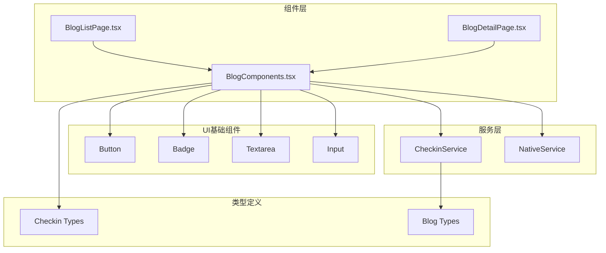
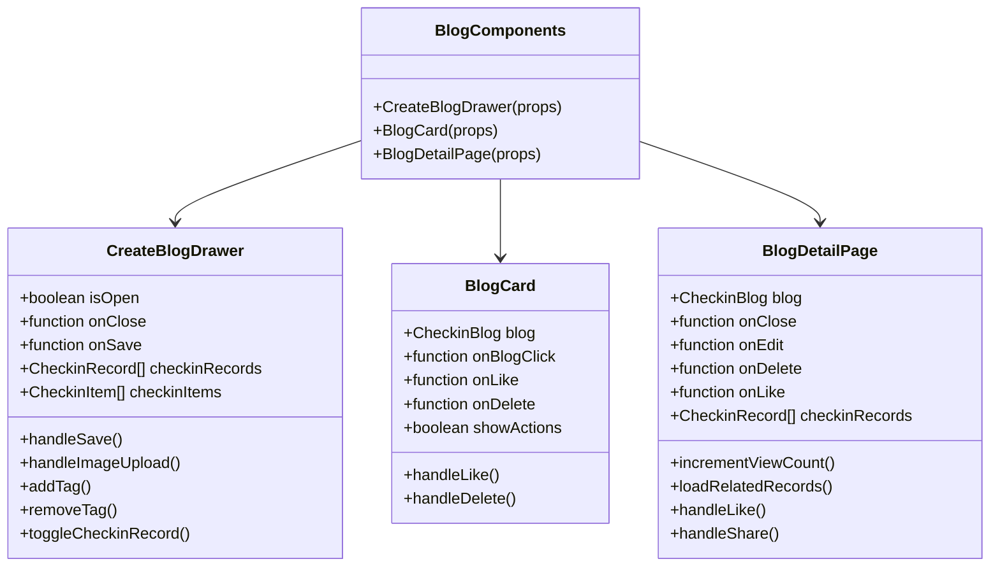
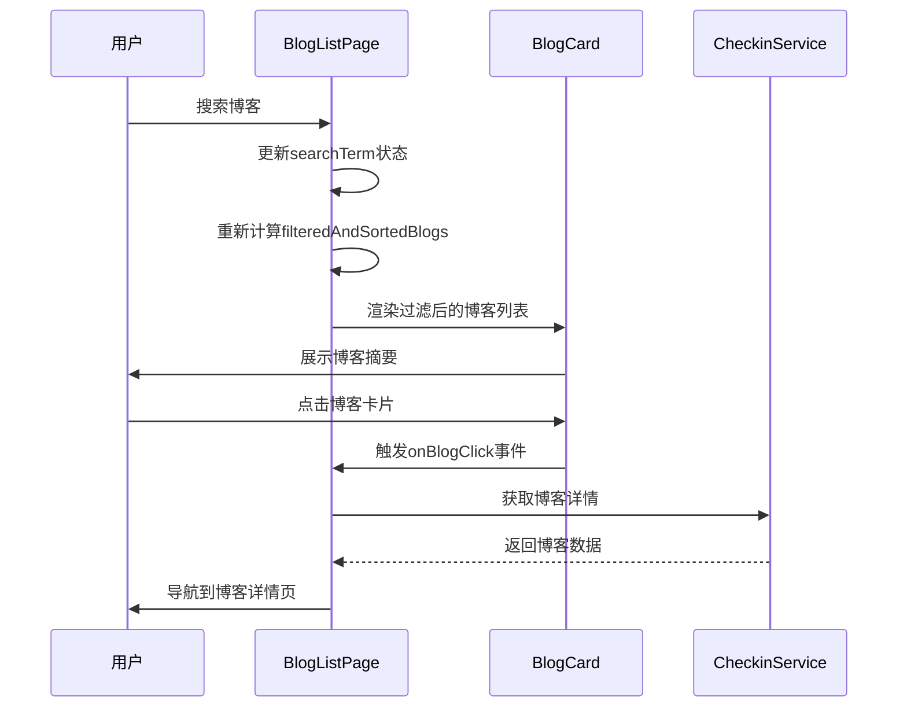
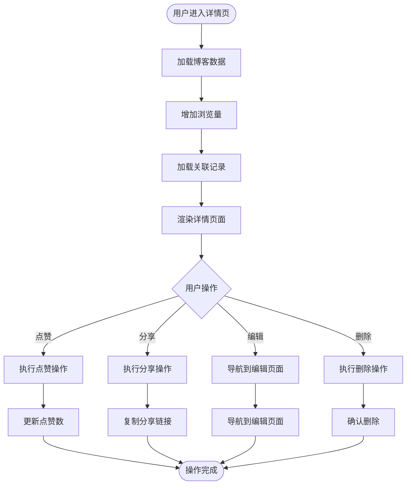
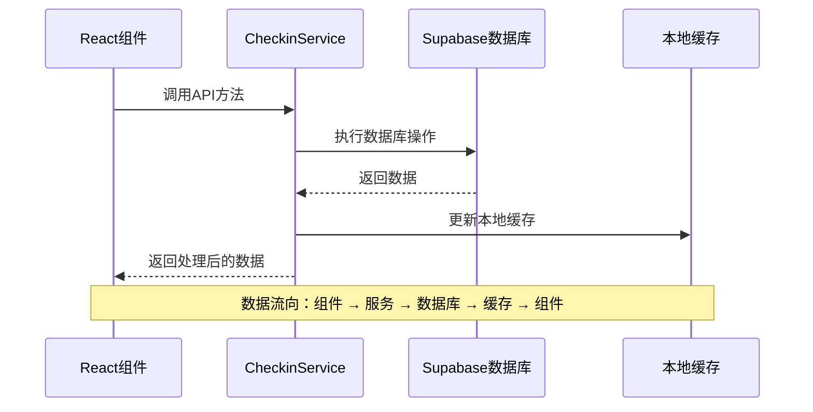

# 可复用渲染组件

<cite>
**本文档引用的文件**
- [BlogComponents.tsx](file://src/components/BlogComponents.tsx)
- [BlogListPage.tsx](file://src/components/BlogListPage.tsx)
- [BlogDetailPage.tsx](file://src/components/BlogDetailPage.tsx)
- [checkin.ts](file://src/types/checkin.ts)
- [checkinService.ts](file://src/utils/checkinService.ts)
- [button.tsx](file://src/components/ui/button.tsx)
- [badge.tsx](file://src/components/ui/badge.tsx)
- [textarea.tsx](file://src/components/ui/textarea.tsx)
</cite>

## 目录
1. [简介](#简介)
2. [项目结构概览](#项目结构概览)
3. [核心组件架构](#核心组件架构)
4. [BlogComponents组件分析](#blogcomponents组件分析)
5. [页面组件集成](#页面组件集成)
6. [样式系统与主题定制](#样式系统与主题定制)
7. [数据流与状态管理](#数据流与状态管理)
8. [性能优化策略](#性能优化策略)
9. [使用示例与最佳实践](#使用示例与最佳实践)
10. [总结](#总结)

## 简介

本文档深入分析FocusDo应用中的可复用渲染组件系统，重点关注BlogComponents.tsx中定义的核心UI组件设计模式。该系统通过React Hooks、Tailwind CSS原子化样式和TypeScript接口设计，实现了高度可复用、主题化且响应式的用户界面组件。

系统包含三个核心组件：
- **BlogCard**：博客卡片组件，用于展示博客摘要信息
- **CreateBlogDrawer**：博客创建抽屉组件，提供博客编辑功能
- **BlogDetailPage**：博客详情页面组件，展示完整博客内容

这些组件通过统一的接口设计、状态管理和样式封装，在BlogListPage和BlogDetailPage之间实现高效的数据共享与状态同步。

## 项目结构概览



**图表来源**
- [BlogComponents.tsx](file://src/components/BlogComponents.tsx#L1-L632)
- [BlogListPage.tsx](file://src/components/BlogListPage.tsx#L1-L571)
- [BlogDetailPage.tsx](file://src/components/BlogDetailPage.tsx#L1-L417)

## 核心组件架构

### 组件层次结构



**图表来源**
- [BlogComponents.tsx](file://src/components/BlogComponents.tsx#L25-L632)

### 接口设计模式

所有组件都采用清晰的接口设计，确保类型安全和易于维护：

```typescript
// 博客卡片接口
interface BlogCardProps {
  blog: CheckinBlog;
  onBlogClick: (blog: CheckinBlog) => void;
  onLike: (blogId: number | string) => void;
  onDelete?: (blogId: number | string) => void;
  showActions?: boolean;
}

// 博客创建抽屉接口
interface CreateBlogDrawerProps {
  isOpen: boolean;
  onClose: () => void;
  onSave: (blog: Omit<CheckinBlog, 'id' | 'created_at' | 'updated_at' | 'user_id' | 'like_count' | 'view_count'>) => void;
  checkinRecords: CheckinRecord[];
  checkinItems?: CheckinItem[];
}
```

**章节来源**
- [BlogComponents.tsx](file://src/components/BlogComponents.tsx#L25-L40)
- [checkin.ts](file://src/types/checkin.ts#L35-L50)

## BlogComponents组件分析

### CreateBlogDrawer组件

CreateBlogDrawer是一个功能完整的博客创建组件，集成了多种交互元素和状态管理：

#### 核心特性

1. **响应式表单设计**：支持标题、内容、封面图片、位置、标签等字段
2. **媒体处理**：内置图片上传功能，支持文件大小验证和错误处理
3. **关联功能**：自动关联今日打卡记录，增强用户体验
4. **状态管理**：使用React Hook管理复杂的状态逻辑

#### 技术实现要点

```typescript
// 表单状态管理
const [formData, setFormData] = useState({
  title: '',
  content: '',
  cover_image_url: '',
  location: '',
  tags: [] as string[],
  checkin_records: [] as number[],
  mood: 'good' as CheckinMood,
  weather: '',
  is_public: false
});
```

#### 错误处理机制

组件实现了完善的错误处理，包括：
- 文件大小限制（5MB）
- 文件类型验证
- 网络错误处理
- 用户友好的错误提示

### BlogCard组件

BlogCard是系统中最常用的组件之一，负责展示博客的摘要信息：

#### 设计特点

1. **视觉层次**：通过首图、标题、内容预览和标签的层次化布局
2. **交互反馈**：点赞、删除操作的动画效果和状态反馈
3. **响应式设计**：支持不同屏幕尺寸的自适应布局
4. **状态指示**：私密博客的视觉标识

#### 动画集成

使用Framer Motion实现流畅的动画效果：

```typescript
<motion.div
  layout
  initial={{ opacity: 0, y: 20 }}
  animate={{ opacity: 1, y: 0 }}
  className="bg-white rounded-xl overflow-hidden border border-gray-100 shadow-sm hover:shadow-md transition-all duration-200 cursor-pointer"
>
```

### BlogDetailPage组件

BlogDetailPage提供了博客的完整展示体验：

#### 特性亮点

1. **现代设计风格**：参考blog_view.md的设计规范
2. **内容渲染**：支持Markdown格式的内容解析
3. **关联数据**：展示相关的打卡记录和元数据
4. **交互功能**：点赞、分享、编辑、删除等操作

#### 内容格式化

```typescript
const formatContent = (content: string) => {
  return content
    .replace(/\*\*(.*?)\*\*/g, '<strong>$1</strong>')
    .replace(/\*(.*?)\*/g, '<em>$1</em>')
    .replace(/\n/g, '<br>');
};
```

**章节来源**
- [BlogComponents.tsx](file://src/components/BlogComponents.tsx#L41-L632)

## 页面组件集成

### BlogListPage集成

BlogListPage展示了博客列表的完整功能，包括：

#### 核心功能模块

1. **无限滚动**：基于Intersection Observer的懒加载实现
2. **高级筛选**：支持按心情、标签、时间范围等多维度过滤
3. **视图切换**：网格视图和列表视图的无缝切换
4. **搜索功能**：全文搜索和实时过滤

#### 状态管理架构



**图表来源**
- [BlogListPage.tsx](file://src/components/BlogListPage.tsx#L200-L300)

### BlogDetailPage集成

BlogDetailPage与BlogComponents紧密协作，提供完整的博客阅读体验：

#### 数据流设计



**图表来源**
- [BlogDetailPage.tsx](file://src/components/BlogDetailPage.tsx#L50-L150)

**章节来源**
- [BlogListPage.tsx](file://src/components/BlogListPage.tsx#L1-L571)
- [BlogDetailPage.tsx](file://src/components/BlogDetailPage.tsx#L1-L417)

## 样式系统与主题定制

### Tailwind CSS原子化设计

系统采用Tailwind CSS的原子化样式设计，实现高效的样式复用和主题定制：

#### 样式组织原则

1. **原子化优先**：每个样式属性独立定义，避免类名冲突
2. **语义化命名**：使用描述性的CSS类名
3. **响应式设计**：内置响应式断点支持
4. **主题一致性**：统一的颜色、间距和字体系统

#### 主题变量系统

```css
/* 主题颜色配置 */
.bg-primary { background-color: var(--primary); }
.text-primary-foreground { color: var(--primary-foreground); }
.border-input { border-color: var(--input-border); }
```

#### 组件样式封装

每个UI组件都有独立的样式封装：

```typescript
// Button组件样式
const buttonVariants = cva(
  "inline-flex items-center justify-center gap-2 whitespace-nowrap rounded-md text-sm font-medium transition-all",
  {
    variants: {
      variant: {
        default: "bg-primary text-primary-foreground hover:bg-primary/90",
        outline: "border bg-background hover:bg-accent hover:text-accent-foreground",
        secondary: "bg-secondary text-secondary-foreground hover:bg-secondary/80",
        ghost: "hover:bg-accent hover:text-accent-foreground",
        link: "text-primary underline-offset-4 hover:underline",
      },
      size: {
        default: "h-9 px-4 py-2",
        sm: "h-8 rounded-md px-3",
        lg: "h-10 rounded-md px-6",
        icon: "size-9 rounded-md",
      },
    },
  }
);
```

### 状态响应式设计

组件通过状态变化实现动态样式调整：

```typescript
// 条件样式应用
className={`
  p-3 rounded-xl border-2 text-center transition-all
  ${formData.mood === option.value 
    ? 'border-blue-500 bg-blue-50' 
    : 'border-gray-200 hover:border-gray-300'
  }
`}
```

**章节来源**
- [button.tsx](file://src/components/ui/button.tsx#L1-L59)
- [badge.tsx](file://src/components/ui/badge.tsx#L1-L47)
- [textarea.tsx](file://src/components/ui/textarea.tsx#L1-L19)

## 数据流与状态管理

### 状态管理模式

系统采用React Hook的组合模式管理组件状态：

#### 博客卡片状态管理

```typescript
// 博客卡片内部状态
const [isLiking, setIsLiking] = useState(false);

const handleLike = async (e: React.MouseEvent) => {
  e.stopPropagation();
  if (isLiking) return;
  
  try {
    setIsLiking(true);
    await NativeService.hapticLight();
    onLike(blog.id);
  } catch (error) {
    console.error('Like failed:', error);
  } finally {
    setIsLiking(false);
  }
};
```

#### 表单状态管理

```typescript
// CreateBlogDrawer表单状态
const [formData, setFormData] = useState({
  title: '',
  content: '',
  cover_image_url: '',
  location: '',
  tags: [] as string[],
  checkin_records: [] as number[],
  mood: 'good' as CheckinMood,
  weather: '',
  is_public: false
});
```

### 数据同步机制

#### 服务层集成



**图表来源**
- [checkinService.ts](file://src/utils/checkinService.ts#L1-L100)

#### 缓存策略

```typescript
// 本地缓存实现
private cache = {
  checkinItems: [] as CheckinItem[],
  checkinRecords: [] as CheckinRecord[],
  blogs: [] as CheckinBlog[],
  lastSyncTime: null as Date | null
};

async getBlogs(filters?: BlogFilters): Promise<CheckinBlog[]> {
  try {
    // ... 数据库查询逻辑
    
    if (!filters) {
      this.cache.blogs = blogs;
    }
    
    return blogs;
  } catch (error) {
    console.error('Failed to fetch blogs:', error);
    return filters ? [] : this.cache.blogs;
  }
}
```

**章节来源**
- [checkinService.ts](file://src/utils/checkinService.ts#L1-L736)

## 性能优化策略

### 懒加载与虚拟滚动

#### 无限滚动实现

BlogListPage实现了基于Intersection Observer的无限滚动：

```typescript
// 无限滚动观察器
useEffect(() => {
  if (isLoading) return;

  if (observerRef.current) observerRef.current.disconnect();

  observerRef.current = new IntersectionObserver(entries => {
    if (entries[0].isIntersecting && hasMore && onLoadMore) {
      onLoadMore();
    }
  });

  if (lastBlogElementRef.current) {
    observerRef.current.observe(lastBlogElementRef.current);
  }

  return () => {
    if (observerRef.current) observerRef.current.disconnect();
  };
}, [isLoading, hasMore, onLoadMore]);
```

#### 虚拟滚动建议

对于大量博客数据的场景，建议实现虚拟滚动：

```typescript
// 虚拟滚动伪代码
const VirtualizedBlogList = ({ blogs, containerHeight }) => {
  const { start, end } = calculateVisibleRange(containerHeight);
  
  return (
    <div style={{ height: containerHeight }}>
      {blogs.slice(start, end).map(blog => (
        <BlogCard key={blog.id} blog={blog} />
      ))}
    </div>
  );
};
```

### 组件记忆化

#### useMemo优化

```typescript
// 使用useMemo避免不必要的重新计算
const filteredAndSortedBlogs = React.useMemo(() => {
  // 复杂的筛选和排序逻辑
  return filtered.sort((a, b) => {
    // 排序算法
  });
}, [blogs, searchTerm, selectedMood, selectedTags, dateRange, sortBy, sortOrder]);
```

#### useCallback优化

```typescript
// 使用useCallback缓存回调函数
const handleBlogClick = useCallback((blog: CheckinBlog) => {
  onBlogClick(blog);
}, [onBlogClick]);

const handleLike = useCallback((blogId: number | string) => {
  onLikeBlog(blogId);
}, [onLikeBlog]);
```

### 图片优化

#### 首图懒加载

```typescript
// 首图懒加载实现
{blog.cover_image_url && (
  <div className="aspect-[4/3] bg-gray-100 relative">
    
  </div>
)}
```

#### 图片压缩与CDN

建议集成图片压缩服务和CDN加速：

```typescript
// 图片上传优化
async uploadImage(file: File): Promise<string> {
  // 图片压缩处理
  const compressedFile = await compressImage(file);
  
  // CDN分发
  const { data } = supabase.storage
    .from(bucketName)
    .getPublicUrl(filePath);
    
  return data.publicUrl;
}
```

**章节来源**
- [BlogListPage.tsx](file://src/components/BlogListPage.tsx#L100-L150)

## 使用示例与最佳实践

### 基础使用示例

#### 在页面中集成BlogCard

```typescript
// 博客列表页面使用示例
const BlogListExample = () => {
  const [blogs, setBlogs] = useState<CheckinBlog[]>([]);
  
  useEffect(() => {
    // 从服务获取博客数据
    checkinService.getBlogs().then(setBlogs);
  }, []);
  
  const handleBlogClick = (blog: CheckinBlog) => {
    // 导航到博客详情页
    navigate(`/blog/${blog.id}`);
  };
  
  const handleLike = async (blogId: number | string) => {
    await checkinService.likeBlog(blogId);
    // 刷新博客列表
    const updatedBlogs = await checkinService.getBlogs();
    setBlogs(updatedBlogs);
  };
  
  return (
    <div className="grid grid-cols-2 gap-4">
      {blogs.map(blog => (
        <BlogCard
          key={blog.id}
          blog={blog}
          onBlogClick={handleBlogClick}
          onLike={handleLike}
          showActions={true}
        />
      ))}
    </div>
  );
};
```

#### 创建博客抽屉使用

```typescript
// 博客创建抽屉使用示例
const CreateBlogExample = () => {
  const [isDrawerOpen, setIsDrawerOpen] = useState(false);
  const [checkinRecords, setCheckinRecords] = useState<CheckinRecord[]>([]);
  
  useEffect(() => {
    // 获取今日打卡记录
    const today = new Date();
    const startOfDay = new Date(today.getFullYear(), today.getMonth(), today.getDate());
    const endOfDay = new Date(today.getFullYear(), today.getMonth(), today.getDate() + 1);
    
    checkinService.getCheckinRecords(undefined, { start: startOfDay, end: endOfDay })
      .then(setCheckinRecords);
  }, []);
  
  const handleSave = async (blogData: any) => {
    try {
      await checkinService.createBlog(blogData);
      // 刷新博客列表
      const updatedBlogs = await checkinService.getBlogs();
      setBlogs(updatedBlogs);
    } catch (error) {
      console.error('Failed to create blog:', error);
    }
  };
  
  return (
    <>
      <Button onClick={() => setIsDrawerOpen(true)}>
        写Blog
      </Button>
      
      <CreateBlogDrawer
        isOpen={isDrawerOpen}
        onClose={() => setIsDrawerOpen(false)}
        onSave={handleSave}
        checkinRecords={checkinRecords}
      />
    </>
  );
};
```

### 高级使用模式

#### 自定义样式扩展

```typescript
// 自定义BlogCard样式
const CustomBlogCard = (props: BlogCardProps) => {
  return (
    <BlogCard
      {...props}
      className="rounded-2xl shadow-lg hover:shadow-xl transition-shadow"
    />
  );
};
```

#### 状态管理集成

```typescript
// Redux集成示例
const BlogListWithRedux = () => {
  const dispatch = useDispatch();
  const blogs = useSelector((state: RootState) => state.blogs.list);
  
  useEffect(() => {
    dispatch(fetchBlogs());
  }, [dispatch]);
  
  const handleLike = (blogId: number | string) => {
    dispatch(likeBlog(blogId));
  };
  
  return (
    <div>
      {blogs.map(blog => (
        <BlogCard
          key={blog.id}
          blog={blog}
          onBlogClick={handleBlogClick}
          onLike={handleLike}
        />
      ))}
    </div>
  );
};
```

### 最佳实践指南

#### 1. 组件职责分离

- BlogCard：专注于展示博客摘要
- CreateBlogDrawer：专注于博客创建和编辑
- BlogDetailPage：专注于博客详情展示

#### 2. 状态管理策略

- 使用React Hook进行局部状态管理
- 依赖服务层进行全局状态同步
- 实现适当的缓存机制

#### 3. 性能优化建议

- 合理使用React.memo和useMemo
- 实现懒加载和虚拟滚动
- 优化图片资源加载

#### 4. 错误处理

- 实现统一的错误处理机制
- 提供用户友好的错误提示
- 记录详细的错误日志

## 总结

FocusDo应用的可复用渲染组件系统展现了现代React开发的最佳实践：

### 核心优势

1. **高度可复用性**：通过清晰的接口设计和状态管理，组件可以在不同场景中灵活使用
2. **类型安全保障**：完整的TypeScript类型定义确保开发过程的安全性和可维护性
3. **主题化设计**：基于Tailwind CSS的原子化样式系统支持快速的主题定制
4. **性能优化**：合理的状态管理、缓存策略和懒加载机制保证了良好的用户体验

### 技术特色

- **组件化架构**：清晰的组件边界和职责划分
- **状态管理**：React Hook + 服务层的混合状态管理模式
- **样式系统**：原子化CSS + 主题变量的现代化样式方案
- **数据流**：单向数据流 + 本地缓存的高效数据管理

### 发展方向

1. **虚拟滚动**：对于大量数据场景，建议实现虚拟滚动提升性能
2. **代码分割**：进一步拆分组件，实现按需加载
3. **测试覆盖**：增加单元测试和集成测试覆盖率
4. **无障碍支持**：完善ARIA标签和键盘导航支持

这套组件系统不仅满足了当前的功能需求，更为未来的功能扩展和性能优化奠定了坚实的基础。通过持续的迭代和优化，它将继续为用户提供优秀的交互体验和开发效率。