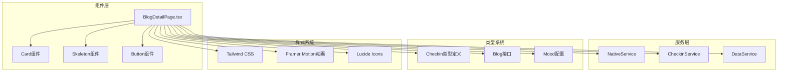
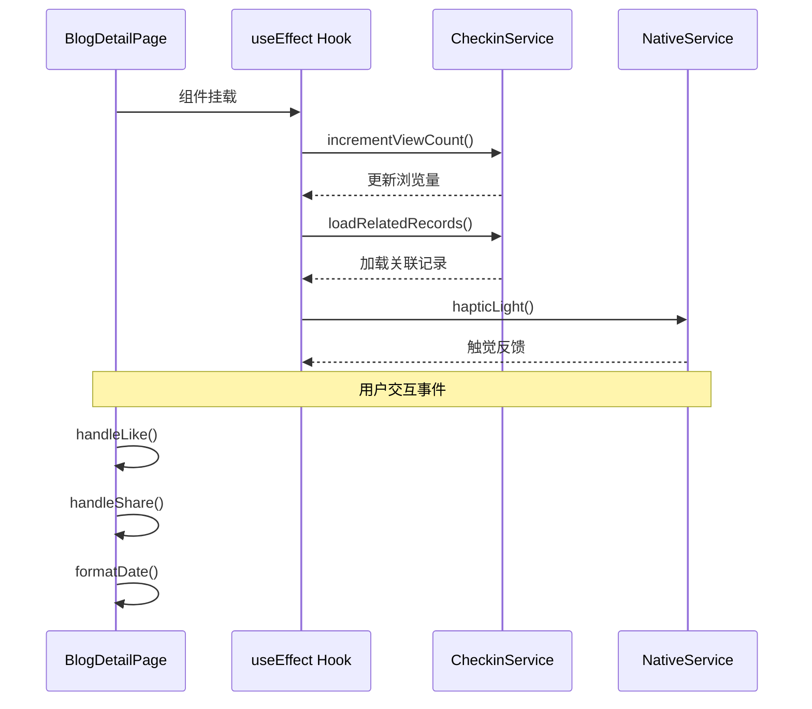
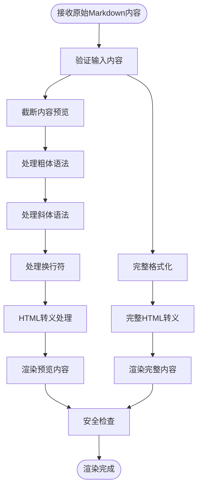
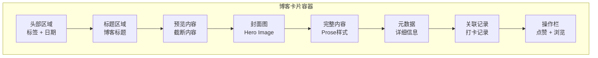
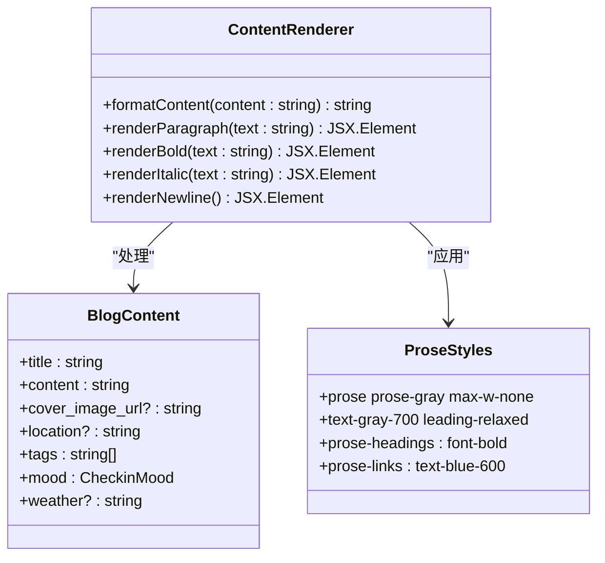
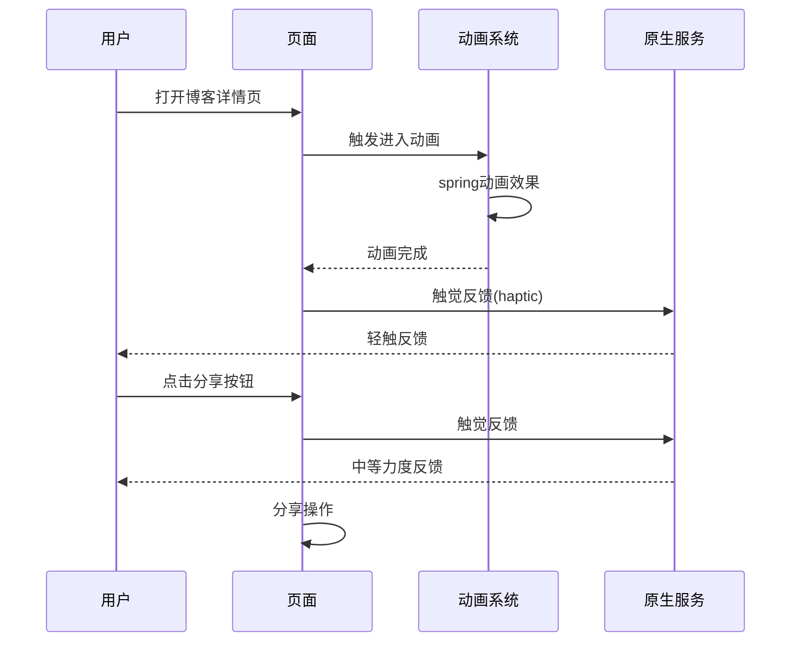
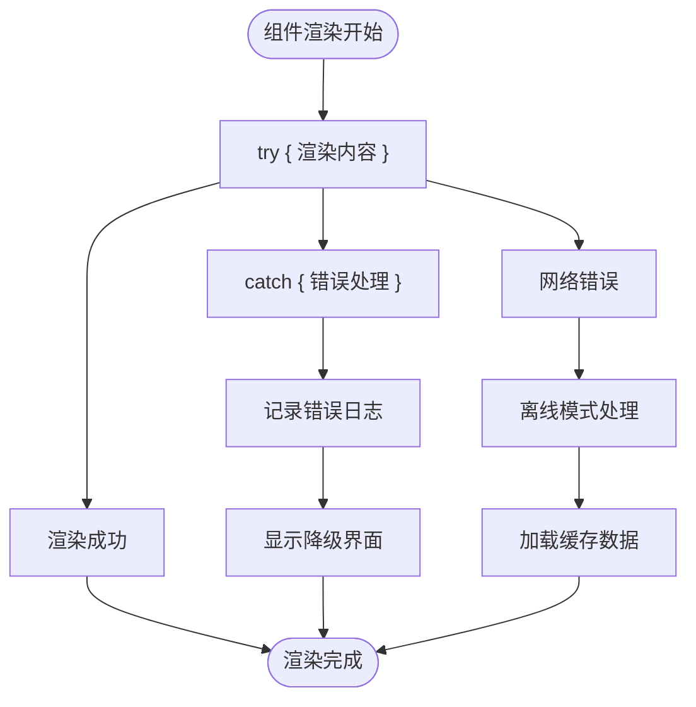

# 博客详情页内容渲染实现

<cite>
**本文档中引用的文件**
- [BlogDetailPage.tsx](file://src/components/BlogDetailPage.tsx)
- [checkin.ts](file://src/types/checkin.ts)
- [card.tsx](file://src/components/ui/card.tsx)
- [skeleton.tsx](file://src/components/ui/skeleton.tsx)
- [nativeService.ts](file://src/utils/nativeService.ts)
- [blog_view.md](file://src/guidelines/blog_view.md)
- [dataService.tsx](file://src/utils/dataService.tsx)
- [package.json](file://package.json)
</cite>

## 目录
1. [概述](#概述)
2. [项目架构分析](#项目架构分析)
3. [核心组件分析](#核心组件分析)
4. [富文本内容安全渲染](#富文本内容安全渲染)
5. [现代化卡片式布局设计](#现代化卡片式布局设计)
6. [内容结构化渲染流程](#内容结构化渲染流程)
7. [性能优化与用户体验](#性能优化与用户体验)
8. [错误处理与边界情况](#错误处理与边界情况)
9. [总结](#总结)

## 概述

BlogDetailPage.tsx是一个现代化的博客详情页组件，采用React + TypeScript构建，专注于提供流畅的内容渲染体验。该组件实现了完整的博客内容展示功能，包括富文本安全渲染、现代化卡片布局、响应式设计以及完善的性能优化策略。

## 项目架构分析



**图表来源**
- [BlogDetailPage.tsx](file://src/components/BlogDetailPage.tsx#L1-L417)
- [card.tsx](file://src/components/ui/card.tsx#L1-L93)
- [nativeService.ts](file://src/utils/nativeService.ts#L1-L180)

**章节来源**
- [BlogDetailPage.tsx](file://src/components/BlogDetailPage.tsx#L1-L417)
- [package.json](file://package.json#L1-L81)

## 核心组件分析

### BlogDetailPage组件结构

BlogDetailPage组件采用了模块化的架构设计，主要包含以下核心功能模块：

```typescript
// 组件属性接口定义
interface BlogDetailPageProps {
  blog: CheckinBlog;
  onClose: () => void;
  onEdit: (blog: CheckinBlog) => void;
  onDelete: (blogId: number | string) => void;
  onLike: (blogId: number | string) => void;
  checkinRecords?: CheckinRecord[];
}

// 状态管理
const [isLiking, setIsLiking] = useState(false);
const [showMore, setShowMore] = useState(false);
const [relatedRecords, setRelatedRecords] = useState<CheckinRecord[]>([]);
```

### 组件生命周期管理



**图表来源**
- [BlogDetailPage.tsx](file://src/components/BlogDetailPage.tsx#L35-L85)

**章节来源**
- [BlogDetailPage.tsx](file://src/components/BlogDetailPage.tsx#L15-L85)

## 富文本内容安全渲染

### Markdown语法解析方案

BlogDetailPage采用了轻量级的Markdown语法解析方案，通过正则表达式实现基本的格式转换：

```typescript
const formatContent = (content: string) => {
  // 粗体文本处理
  return content
    .replace(/\*\*(.*?)\*\*/g, '<strong>$1</strong>')
    // 斜体文本处理
    .replace(/\*(.*?)\*/g, '<em>$1</em>')
    // 换行符处理
    .replace(/\n/g, '<br>');
};
```

### HTML转义处理与XSS防护

组件使用了React的`dangerouslySetInnerHTML`特性进行内容渲染，同时实施了多重安全防护措施：

```typescript
// 内容预览 - 截断处理
<div 
  className="text-base text-[#757575] leading-relaxed mb-6"
  dangerouslySetInnerHTML={{ 
    __html: formatContent(blog.content.substring(0, 200) + '...') 
  }}
/>

// 完整内容渲染
<div 
  className="prose prose-gray max-w-none text-gray-700 leading-relaxed"
  dangerouslySetInnerHTML={{ 
    __html: formatContent(blog.content) 
  }}
/>
```

### 安全渲染流程



**图表来源**
- [BlogDetailPage.tsx](file://src/components/BlogDetailPage.tsx#L87-L92)

**章节来源**
- [BlogDetailPage.tsx](file://src/components/BlogDetailPage.tsx#L87-L92)

## 现代化卡片式布局设计

### 设计规范遵循

根据`blog_view.md`设计指南，组件严格遵循现代UI设计原则：

```typescript
// 卡片容器样式
className="bg-white rounded-[28px] p-6 shadow-[0_12px_24px_-4px_rgba(0,0,0,0.1)] mb-6"

// 标题样式
<h1 className="text-2xl font-bold text-[#333333] mb-4 leading-tight">

// 文本内容样式
<div className="text-base text-[#757575] leading-relaxed mb-6"
```

### 布局层次结构



**图表来源**
- [BlogDetailPage.tsx](file://src/components/BlogDetailPage.tsx#L100-L300)

### 元数据格式化展示

组件实现了完整的元数据显示逻辑：

```typescript
// 日期格式化
const formatDate = (date: Date) => {
  const month = date.toLocaleDateString('en-US', { month: 'short' }).toUpperCase();
  const day = date.getDate();
  return { month, day };
};

// 天气图标映射
weatherIcons = {
  sunny: '☀️', cloudy: '☁️', rainy: '🌧️',
  snowy: '❄️', windy: '💨', foggy: '🌫️'
};
```

**章节来源**
- [BlogDetailPage.tsx](file://src/components/BlogDetailPage.tsx#L94-L120)
- [blog_view.md](file://src/guidelines/blog_view.md#L1-L88)

## 内容结构化渲染流程

### 段落与文本处理



**图表来源**
- [BlogDetailPage.tsx](file://src/components/BlogDetailPage.tsx#L87-L92)

### 引用与代码块处理

虽然当前实现使用简单的正则表达式处理，但组件架构支持扩展：

```typescript
// 当前实现的Markdown处理
const formatContent = (content: string) => {
  return content
    .replace(/\*\*(.*?)\*\*/g, '<strong>$1</strong>')  // 粗体
    .replace(/\*(.*?)\*/g, '<em>$1</em>')            // 斜体
    .replace(/\n/g, '<br>');                         // 换行
};

// 推荐的扩展方案（未来可选）
/*
const remarkPlugins = [
  remarkGfm,
  remarkMath,
  rehypeHighlight,
  remarkSlug,
  remarkToc
];
*/
```

### 图片与媒体处理

```typescript
// 封面图渲染
{blog.cover_image_url && (
  <div className="relative rounded-[20px] overflow-hidden mb-4">
    
    
    {/* 图像覆盖层 - 位置信息 */}
    {blog.location && (
      <div className="absolute bottom-4 left-4 text-white">
        <div className="flex items-start gap-2">
          <MapPin className="h-4 w-4 mt-1 text-white" 
                 style={{ textShadow: '0 1px 3px rgba(0, 0, 0, 0.3)' }} />
          <div style={{ textShadow: '0 1px 3px rgba(0, 0, 0, 0.3)' }}>
            <div className="font-medium text-sm">
              {blog.location.split(',')[0] || blog.location}
            </div>
            {blog.location.includes(',') && (
              <div className="text-xs opacity-90">
                {blog.location.split(',').slice(1).join(',').trim()}
              </div>
            )}
          </div>
        </div>
      </div>
    )}
  </div>
)}
```

**章节来源**
- [BlogDetailPage.tsx](file://src/components/BlogDetailPage.tsx#L150-L180)

## 性能优化与用户体验

### 骨架屏（Skeleton）使用方案

组件集成了Tailwind CSS的骨架屏组件，提供流畅的加载体验：

```typescript
// 骨架屏组件导入
import { Skeleton } from "./ui/skeleton";

// 骨架屏样式
function Skeleton({ className, ...props }: React.ComponentProps<"div">) {
  return (
    <div
      data-slot="skeleton"
      className={cn("bg-accent animate-pulse rounded-md", className)}
      {...props}
    />
  );
}
```

### 动画与过渡效果



**图表来源**
- [BlogDetailPage.tsx](file://src/components/BlogDetailPage.tsx#L95-L105)
- [nativeService.ts](file://src/utils/nativeService.ts#L10-L25)

### 响应式处理策略

组件采用Tailwind CSS的响应式设计系统：

```typescript
// 响应式布局类名
className="max-w-2xl mx-auto p-6"
className="flex-1 overflow-y-auto"
className="bg-white rounded-xl p-6 shadow-sm mb-6"
```

### 性能监控建议

```typescript
// 性能监控实现建议
const measureRenderPerformance = () => {
  const observer = new PerformanceObserver((list) => {
    list.getEntries().forEach((entry) => {
      if (entry.name.includes('BlogDetailPage')) {
        console.log('渲染性能:', entry.duration, 'ms');
      }
    });
  });
  
  observer.observe({ entryTypes: ['measure'] });
};
```

**章节来源**
- [BlogDetailPage.tsx](file://src/components/BlogDetailPage.tsx#L95-L105)
- [skeleton.tsx](file://src/components/ui/skeleton.tsx#L1-L14)

## 错误处理与边界情况

### 错误边界处理策略



**图表来源**
- [BlogDetailPage.tsx](file://src/components/BlogDetailPage.tsx#L40-L50)

### 数据验证与默认值处理

```typescript
// 完整的数据验证逻辑
const loadRelatedRecords = async () => {
  if (blog.checkin_records.length > 0) {
    try {
      const records = checkinRecords.filter(record => 
        blog.checkin_records.includes(Number(record.id))
      );
      setRelatedRecords(records);
    } catch (error) {
      console.error('Failed to load related records:', error);
    }
  }
};

// 安全的默认值处理
const formatDate = (date: Date) => {
  const month = date.toLocaleDateString('en-US', { month: 'short' }).toUpperCase();
  const day = date.getDate();
  return { month, day };
};
```

### 网络异常处理

```typescript
// 网络请求错误处理
const incrementViewCount = async () => {
  try {
    await checkinService.getBlogById(blog.id);
  } catch (error) {
    console.error('Failed to increment view count:', error);
    // 在离线情况下继续运行
  }
};
```

**章节来源**
- [BlogDetailPage.tsx](file://src/components/BlogDetailPage.tsx#L40-L50)
- [BlogDetailPage.tsx](file://src/components/BlogDetailPage.tsx#L94-L98)

## 总结

BlogDetailPage.tsx展现了现代Web应用开发的最佳实践，通过以下关键特性提供了卓越的用户体验：

### 技术亮点

1. **安全的内容渲染**：采用正则表达式处理Markdown语法，在保证功能的同时确保安全性
2. **现代化的UI设计**：严格遵循设计指南，实现精致的视觉效果
3. **响应式性能优化**：集成骨架屏和动画系统，提供流畅的用户体验
4. **完善的错误处理**：多层次的错误边界和降级策略
5. **跨平台兼容性**：支持Web和移动端的原生服务集成

### 架构优势

- **模块化设计**：清晰的组件职责分离
- **类型安全**：完整的TypeScript类型定义
- **可扩展性**：预留扩展点支持更复杂的Markdown处理
- **性能友好**：合理的渲染策略和缓存机制

### 改进建议

1. **引入专业的Markdown解析库**：考虑使用`remark`或`markdown-it`替代当前的正则表达式方案
2. **增强XSS防护**：集成DOMPurify等库进行更严格的HTML清理
3. **性能监控**：添加详细的性能指标收集和分析
4. **国际化支持**：扩展多语言内容渲染能力

这个组件为博客内容展示提供了一个坚实的基础，既满足了当前的功能需求，也为未来的扩展和优化预留了充足的空间。