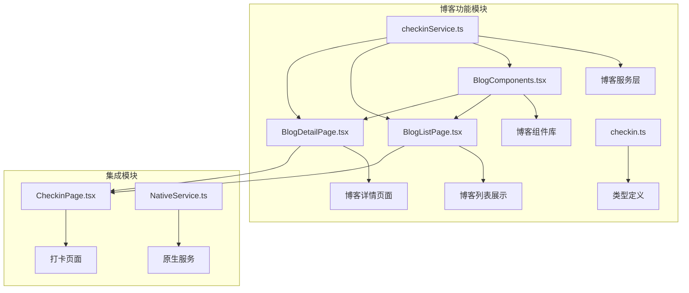
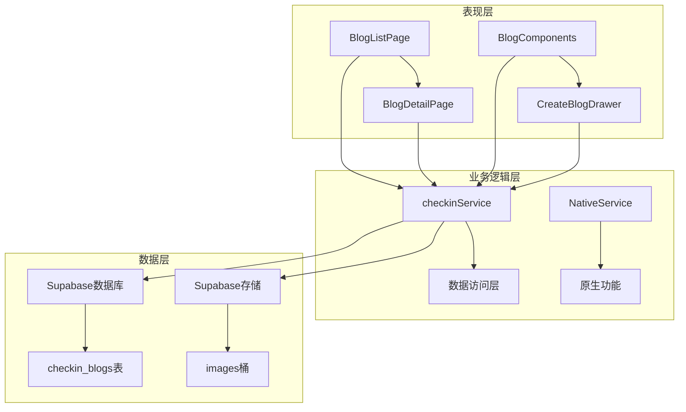
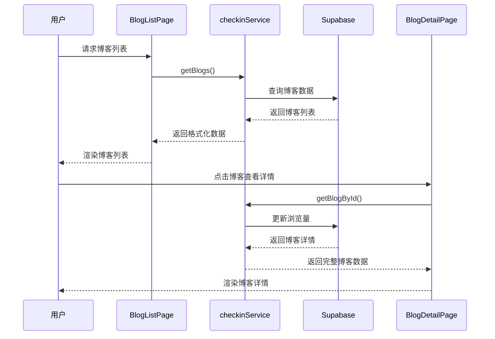
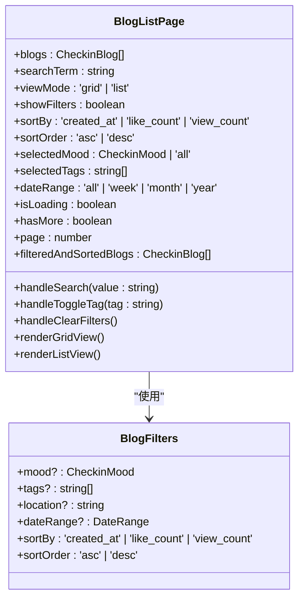
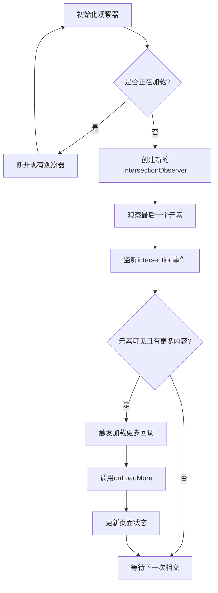
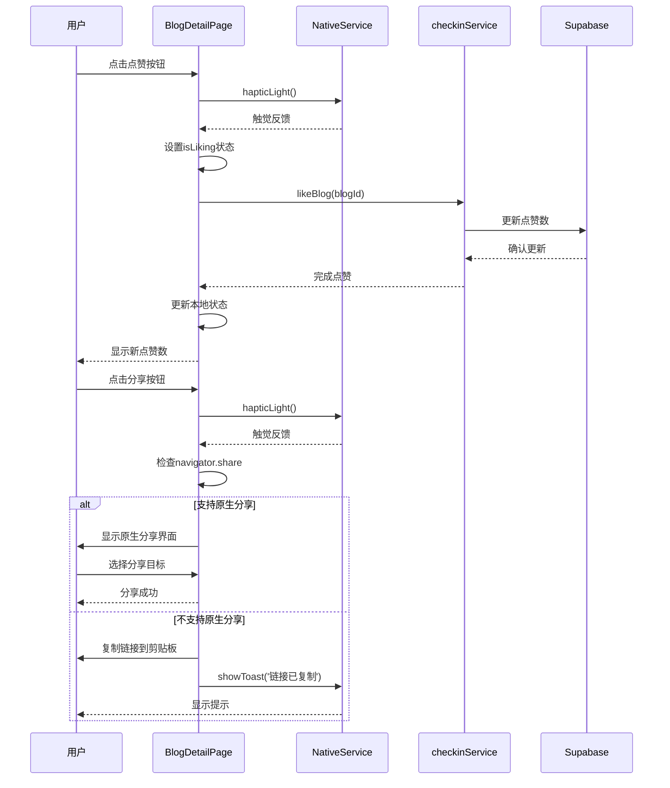
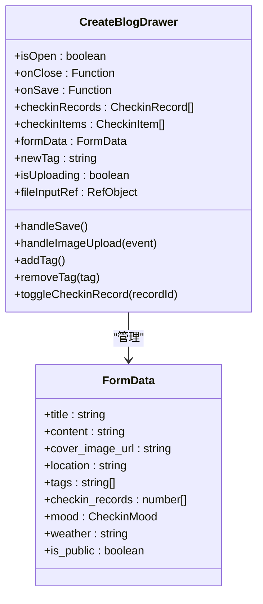
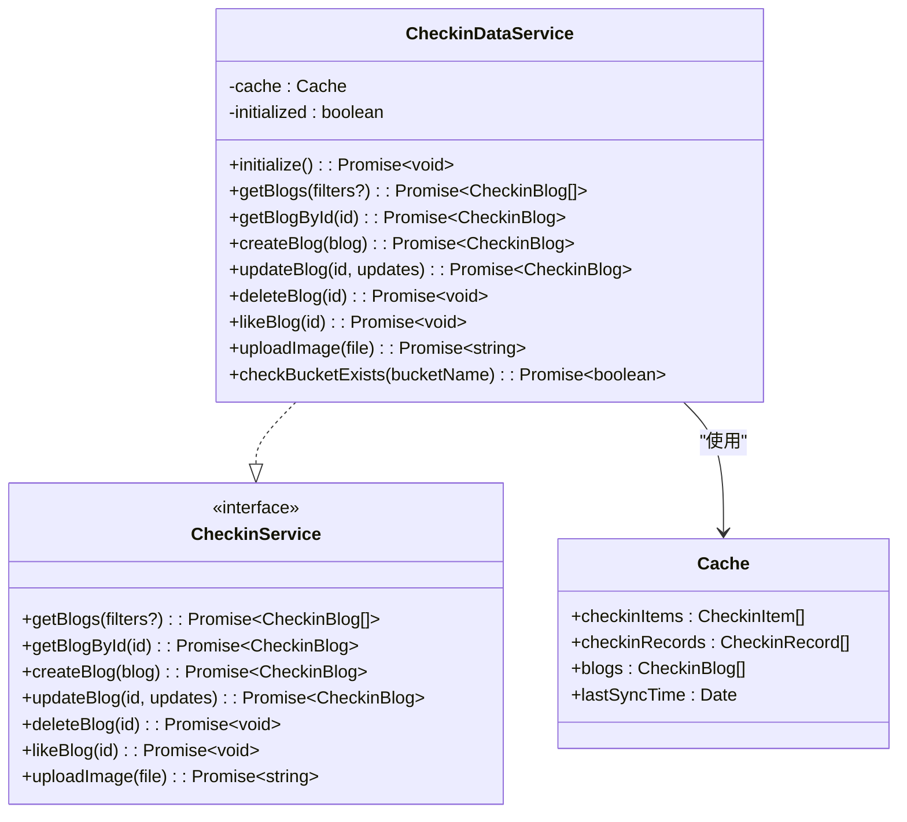
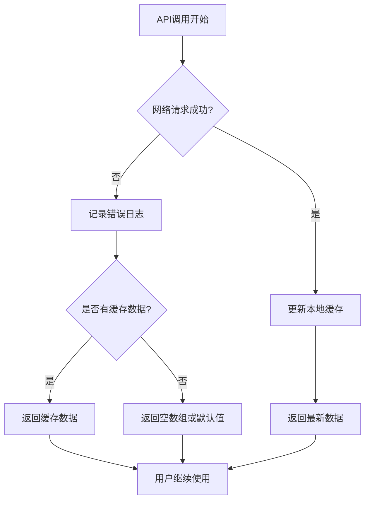
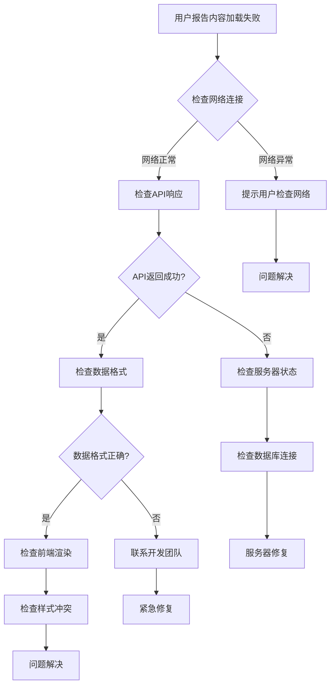

# 博客功能

<cite>
**本文档引用的文件**
- [BlogListPage.tsx](file://src/components/BlogListPage.tsx)
- [BlogDetailPage.tsx](file://src/components/BlogDetailPage.tsx)
- [BlogComponents.tsx](file://src/components/BlogComponents.tsx)
- [checkinService.ts](file://src/utils/checkinService.ts)
- [checkin.ts](file://src/types/checkin.ts)
- [CheckinPage.tsx](file://src/components/CheckinPage.tsx)
- [blog_view.md](file://src/guidelines/blog_view.md)
</cite>

## 目录
1. [简介](#简介)
2. [项目结构](#项目结构)
3. [核心组件分析](#核心组件分析)
4. [架构概览](#架构概览)
5. [详细组件分析](#详细组件分析)
6. [数据流分析](#数据流分析)
7. [性能考虑](#性能考虑)
8. [故障排除指南](#故障排除指南)
9. [结论](#结论)

## 简介

FocusDo博客功能是一个集成了打卡系统的内容创作与分享平台，为用户提供了一个完整的博客生态系统。该功能不仅支持传统的博客写作和展示，还深度整合了打卡系统的数据，实现了从日常打卡到内容创作的无缝衔接。

博客功能的核心特性包括：
- **动态博客列表展示**：支持网格和列表两种视图模式，提供丰富的筛选和排序功能
- **富文本内容渲染**：支持Markdown格式的文章内容，具备安全的HTML渲染机制
- **交互式博客详情**：提供点赞、分享、编辑、删除等完整的交互功能
- **智能内容关联**：自动关联用户的打卡记录，生成相关内容
- **多维度筛选**：支持按心情、标签、时间范围等多种方式进行内容筛选
- **响应式设计**：适配移动端和桌面端的完美用户体验

## 项目结构

博客功能的文件组织遵循清晰的模块化原则，主要文件分布在以下目录结构中：



**图表来源**
- [BlogListPage.tsx](file://src/components/BlogListPage.tsx#L1-L50)
- [BlogDetailPage.tsx](file://src/components/BlogDetailPage.tsx#L1-L50)
- [BlogComponents.tsx](file://src/components/BlogComponents.tsx#L1-L50)
- [checkinService.ts](file://src/utils/checkinService.ts#L1-L50)

**章节来源**
- [BlogListPage.tsx](file://src/components/BlogListPage.tsx#L1-L571)
- [BlogDetailPage.tsx](file://src/components/BlogDetailPage.tsx#L1-L417)
- [BlogComponents.tsx](file://src/components/BlogComponents.tsx#L1-L632)

## 核心组件分析

### 博客列表页面 (BlogListPage)

博客列表页面是用户浏览和发现博客内容的主要入口，提供了丰富的内容展示和交互功能。

#### 主要特性
- **双视图模式**：支持网格视图和列表视图的自由切换
- **智能筛选系统**：提供多维度筛选功能，包括心情、标签、时间范围等
- **实时排序**：支持按创建时间、点赞数、浏览量进行排序
- **无限滚动**：优化的分页加载机制，提升用户体验
- **搜索功能**：全文搜索支持标题、内容、标签和地点

#### 技术实现要点
- 使用React.memo优化渲染性能
- 实现IntersectionObserver进行懒加载
- 采用Friction动画库提供流畅的过渡效果
- 实现本地状态缓存减少API调用

### 博客详情页面 (BlogDetailPage)

博客详情页面专注于内容的深度展示和互动体验。

#### 核心功能
- **富文本渲染**：支持Markdown格式的高质量内容展示
- **互动功能**：点赞、分享、编辑、删除等完整操作链路
- **关联记录**：自动关联相关的打卡记录，增强内容连贯性
- **元数据展示**：详细的时间、地点、心情等信息展示

#### 安全特性
- 使用dangerouslySetInnerHTML渲染内容，但经过严格的安全处理
- 实现内容截断和预览功能，避免过长内容影响性能
- 支持多种分享渠道，包括原生分享和链接复制

### 博客组件库 (BlogComponents)

博客组件库提供了可复用的UI组件，确保整个博客系统的视觉一致性。

#### 主要组件
- **CreateBlogDrawer**：博客创建抽屉，提供完整的博客编辑功能
- **BlogCard**：博客卡片组件，支持多种展示模式
- **标签系统**：灵活的标签管理和过滤功能
- **图片上传**：安全的图片上传和预览功能

**章节来源**
- [BlogListPage.tsx](file://src/components/BlogListPage.tsx#L30-L100)
- [BlogDetailPage.tsx](file://src/components/BlogDetailPage.tsx#L30-L100)
- [BlogComponents.tsx](file://src/components/BlogComponents.tsx#L30-L100)

## 架构概览

博客功能采用了分层架构设计，确保了代码的可维护性和扩展性：



**图表来源**
- [checkinService.ts](file://src/utils/checkinService.ts#L1-L50)
- [BlogListPage.tsx](file://src/components/BlogListPage.tsx#L1-L30)

### 数据流架构

博客功能的数据流遵循单向数据流原则，确保了数据的一致性和可预测性：



**图表来源**
- [BlogListPage.tsx](file://src/components/BlogListPage.tsx#L200-L250)
- [BlogDetailPage.tsx](file://src/components/BlogDetailPage.tsx#L50-L100)
- [checkinService.ts](file://src/utils/checkinService.ts#L400-L450)

## 详细组件分析

### 博客列表页面详细分析

博客列表页面是整个博客功能的核心组件，实现了复杂的状态管理和交互逻辑。

#### 状态管理系统



**图表来源**
- [BlogListPage.tsx](file://src/components/BlogListPage.tsx#L30-L80)
- [checkin.ts](file://src/types/checkin.ts#L150-L170)

#### 筛选和排序算法

博客列表页面实现了高效的筛选和排序算法，通过React.useMemo优化性能：

```typescript
const filteredAndSortedBlogs = React.useMemo(() => {
  let filtered = blogs;

  // 搜索筛选
  if (searchTerm.trim()) {
    const searchLower = searchTerm.toLowerCase();
    filtered = filtered.filter(blog => 
      blog.title.toLowerCase().includes(searchLower) ||
      blog.content.toLowerCase().includes(searchLower) ||
      blog.tags.some(tag => tag.toLowerCase().includes(searchLower)) ||
      (blog.location && blog.location.toLowerCase().includes(searchLower))
    );
  }

  // 心情筛选
  if (selectedMood !== 'all') {
    filtered = filtered.filter(blog => blog.mood === selectedMood);
  }

  // 标签筛选
  if (selectedTags.length > 0) {
    filtered = filtered.filter(blog => 
      selectedTags.some(tag => blog.tags.includes(tag))
    );
  }

  // 日期筛选
  if (dateRange !== 'all') {
    const now = new Date();
    const startDate = new Date();
    
    switch (dateRange) {
      case 'week':
        startDate.setDate(now.getDate() - 7);
        break;
      case 'month':
        startDate.setMonth(now.getMonth() - 1);
        break;
      case 'year':
        startDate.setFullYear(now.getFullYear() - 1);
        break;
    }
    
    filtered = filtered.filter(blog => blog.created_at >= startDate);
  }

  // 排序
  return filtered.sort((a, b) => {
    let aValue: number;
    let bValue: number;

    switch (sortBy) {
      case 'like_count':
        aValue = a.like_count;
        bValue = b.like_count;
        break;
      case 'view_count':
        aValue = a.view_count;
        bValue = b.view_count;
        break;
      default: // created_at
        aValue = a.created_at.getTime();
        bValue = b.created_at.getTime();
    }

    return sortOrder === 'desc' ? bValue - aValue : aValue - bValue;
  });
}, [blogs, searchTerm, selectedMood, selectedTags, dateRange, sortBy, sortOrder]);
```

**章节来源**
- [BlogListPage.tsx](file://src/components/BlogListPage.tsx#L80-L150)

### 博客详情页面详细分析

博客详情页面专注于提供沉浸式的阅读体验和丰富的交互功能。

#### 内容渲染机制

博客详情页面实现了安全的Markdown内容渲染机制：

```typescript
const formatContent = (content: string) => {
  // 简单的Markdown渲染
  return content
    .replace(/\*\*(.*?)\*\*/g, '<strong>$1</strong>')
    .replace(/\*(.*?)\*/g, '<em>$1</em>')
    .replace(/\n/g, '<br>');
};
```

#### 无限滚动实现



**图表来源**
- [BlogListPage.tsx](file://src/components/BlogListPage.tsx#L150-L200)

#### 互动功能实现

博客详情页面提供了完整的互动功能链路：



**图表来源**
- [BlogDetailPage.tsx](file://src/components/BlogDetailPage.tsx#L80-L150)

**章节来源**
- [BlogDetailPage.tsx](file://src/components/BlogDetailPage.tsx#L100-L200)

### 博客组件库详细分析

博客组件库提供了可复用的UI组件，确保了整个博客系统的视觉一致性。

#### 创建博客抽屉组件

创建博客抽屉组件是博客功能的核心交互组件，提供了完整的博客创建体验：



**图表来源**
- [BlogComponents.tsx](file://src/components/BlogComponents.tsx#L30-L100)

#### 图片上传安全机制

博客组件库实现了安全的图片上传机制，包含多重验证和错误处理：

```typescript
const handleImageUpload = async (event: React.ChangeEvent<HTMLInputElement>) => {
  const file = event.target.files?.[0];
  if (!file) return;

  // 检查文件大小（5MB限制）
  if (file.size > 5 * 1024 * 1024) {
    await NativeService.showToast('图片大小不能超过5MB');
    return;
  }

  // 检查文件类型
  if (!file.type.startsWith('image/')) {
    await NativeService.showToast('请选择图片文件');
    return;
  }

  try {
    setIsUploading(true);
    const imageUrl = await checkinService.uploadImage(file);
    setFormData(prev => ({ ...prev, cover_image_url: imageUrl }));
    await NativeService.showToast('图片上传成功');
  } catch (error: any) {
    console.error('Image upload failed:', error);
    
    // 提供更具体的错误信息
    let errorMessage = '图片上传失败';
    
    if (error?.message?.includes('Storage bucket') && error?.message?.includes('not found')) {
      errorMessage = '存储桶未创建，请在Supabase控制台中创建"images"桶';
    } else if (error?.message?.includes('Bucket not found')) {
      errorMessage = '存储配置错误，请在Supabase中创建存储桶';
    } else if (error?.message?.includes('Permission denied')) {
      errorMessage = '没有上传权限，请检查登录状态';
    } else if (error?.message?.includes('File size')) {
      errorMessage = '文件过大，请选择小于5MB的图片';
    }
    
    await NativeService.showToast(errorMessage);
  } finally {
    setIsUploading(false);
    // 重置文件输入框以允许重新上传同一文件
    if (event.target) {
      event.target.value = '';
    }
  }
};
```

**章节来源**
- [BlogComponents.tsx](file://src/components/BlogComponents.tsx#L100-L200)

## 数据流分析

### 博客服务层架构

博客服务层是整个博客功能的核心数据处理中心，负责与后端数据库的交互和数据转换：



**图表来源**
- [checkinService.ts](file://src/utils/checkinService.ts#L15-L50)
- [checkin.ts](file://src/types/checkin.ts#L170-L200)

### 数据持久化策略

博客服务层实现了智能的缓存策略，平衡了数据新鲜度和性能需求：

```typescript
async getBlogs(filters?: BlogFilters): Promise<CheckinBlog[]> {
  try {
    let query = supabase
      .from('checkin_blogs')
      .select('*');

    // 应用筛选器
    if (filters?.mood) {
      query = query.eq('mood', filters.mood);
    }
    
    if (filters?.location) {
      query = query.ilike('location', `%${filters.location}%`);
    }
    
    if (filters?.tags && filters.tags.length > 0) {
      query = query.overlaps('tags', filters.tags);
    }
    
    if (filters?.dateRange) {
      query = query
        .gte('created_at', filters.dateRange.start.toISOString())
        .lte('created_at', filters.dateRange.end.toISOString());
    }
    
    // 排序
    const sortBy = filters?.sortBy || 'created_at';
    const sortOrder = filters?.sortOrder || 'desc';
    const ascending = sortOrder === 'asc';
    
    query = query.order(sortBy, { ascending });

    const { data, error } = await query;

    if (error) {
      console.error('Error fetching blogs:', error);
      throw error;
    }

    const blogs: CheckinBlog[] = data.map(blog => ({
      ...blog,
      created_at: new Date(blog.created_at),
      updated_at: new Date(blog.updated_at)
    }));

    if (!filters) {
      this.cache.blogs = blogs;
    }
    
    return blogs;
  } catch (error) {
    console.error('Failed to fetch blogs:', error);
    return filters ? [] : this.cache.blogs;
  }
}
```

**章节来源**
- [checkinService.ts](file://src/utils/checkinService.ts#L350-L450)

### 错误处理和恢复机制

博客服务层实现了完善的错误处理和数据恢复机制：



**图表来源**
- [checkinService.ts](file://src/utils/checkinService.ts#L400-L500)

## 性能考虑

### 渲染性能优化

博客功能采用了多种性能优化策略：

1. **React.memo优化**：对频繁更新的组件使用memo化
2. **useMemo缓存**：对计算密集型操作使用缓存
3. **虚拟滚动**：对于大量数据使用虚拟滚动技术
4. **懒加载**：图片和内容的懒加载机制
5. **状态分离**：将不同类型的组件状态分离管理

### 缓存策略

```typescript
private cache = {
  checkinItems: [] as CheckinItem[],
  checkinRecords: [] as CheckinRecord[],
  blogs: [] as CheckinBlog[],
  lastSyncTime: null as Date | null
};
```

### 网络优化

- **批量请求**：合并多个API请求减少网络开销
- **请求去重**：避免重复的相同请求
- **超时处理**：合理的请求超时设置
- **重试机制**：失败请求的自动重试

## 故障排除指南

### 常见问题诊断流程

#### 内容加载失败

当博客内容无法正常加载时，按照以下步骤进行诊断：



#### 图片上传失败

图片上传失败的常见原因和解决方案：

1. **存储桶不存在**
   - 症状：错误消息显示"Storage bucket not found"
   - 解决方案：在Supabase控制台中创建名为"images"的存储桶

2. **文件大小超限**
   - 症状：文件大于5MB时上传失败
   - 解决方案：提示用户选择更小的图片文件

3. **权限问题**
   - 症状：显示"Permission denied"错误
   - 解决方案：检查用户认证状态，重新登录

4. **网络中断**
   - 症状：上传过程中断
   - 解决方案：检查网络连接，重新上传

#### 性能问题诊断

当遇到性能问题时，可以按照以下步骤排查：

1. **检查内存使用**：监控应用内存占用情况
2. **分析网络请求**：检查是否有过多的重复请求
3. **审查渲染性能**：使用React DevTools分析组件渲染
4. **优化图片资源**：压缩图片文件大小
5. **启用缓存**：合理设置缓存策略

**章节来源**
- [checkinService.ts](file://src/utils/checkinService.ts#L600-L700)
- [BlogComponents.tsx](file://src/components/BlogComponents.tsx#L150-L250)

## 结论

FocusDo博客功能是一个设计精良、功能完备的内容创作与分享平台。它成功地将传统的博客功能与现代的移动应用设计理念相结合，为用户提供了流畅、直观的使用体验。

### 主要优势

1. **完整的功能覆盖**：从内容创作到分享传播的全流程支持
2. **优秀的用户体验**：响应式设计和流畅的交互体验
3. **强大的技术架构**：分层架构和完善的错误处理机制
4. **高度的可扩展性**：模块化设计便于功能扩展和维护
5. **安全可靠**：多重安全验证和错误处理机制

### 技术亮点

- **智能缓存策略**：平衡数据新鲜度和性能需求
- **安全的内容渲染**：防止XSS攻击的HTML渲染机制
- **响应式设计**：适配各种设备和屏幕尺寸
- **离线支持**：智能的离线数据处理能力
- **国际化支持**：完整的多语言支持框架

### 未来发展方向

1. **AI辅助创作**：集成AI写作助手功能
2. **社交互动增强**：增加评论、收藏、关注等功能
3. **数据分析**：提供更详细的阅读和互动数据分析
4. **多媒体支持**：扩展音频、视频等多媒体内容支持
5. **个性化推荐**：基于用户行为的智能内容推荐

通过持续的功能迭代和技术优化，FocusDo博客功能将继续为用户提供更加优质的内容创作和分享体验。