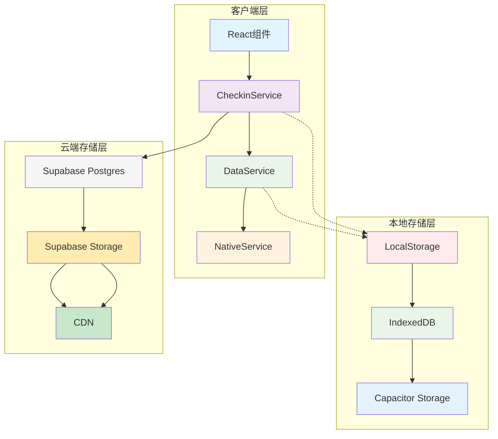
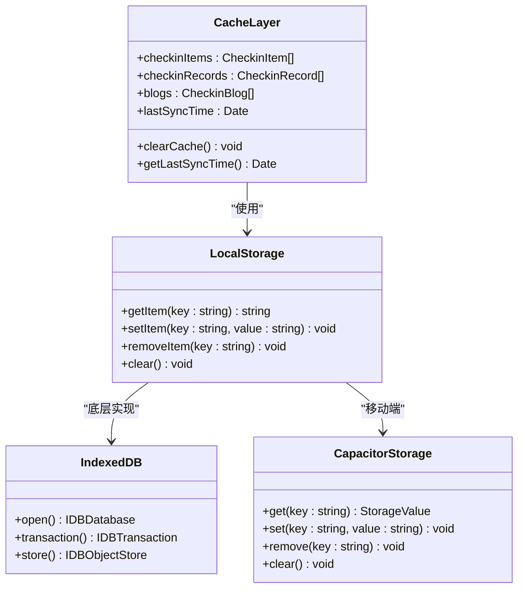
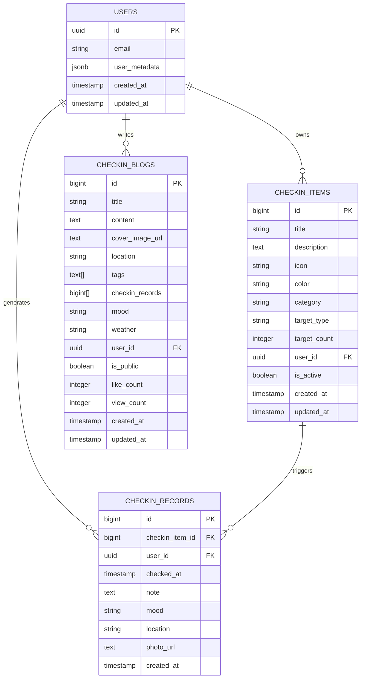
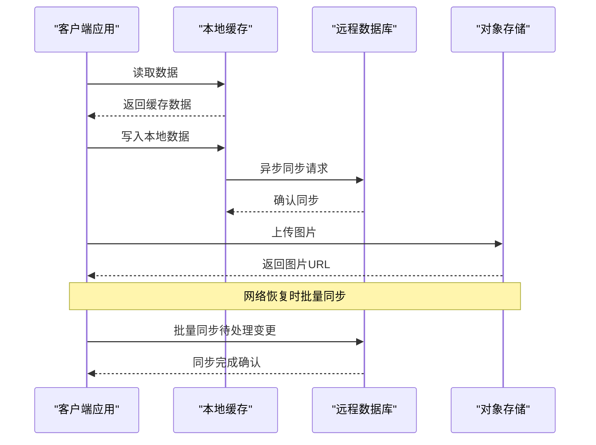
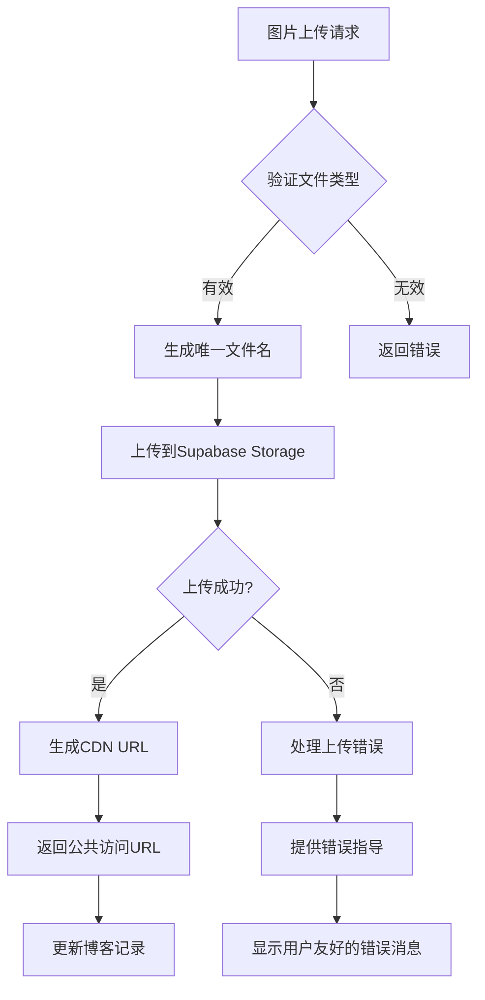
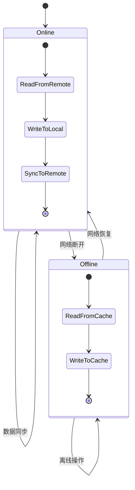
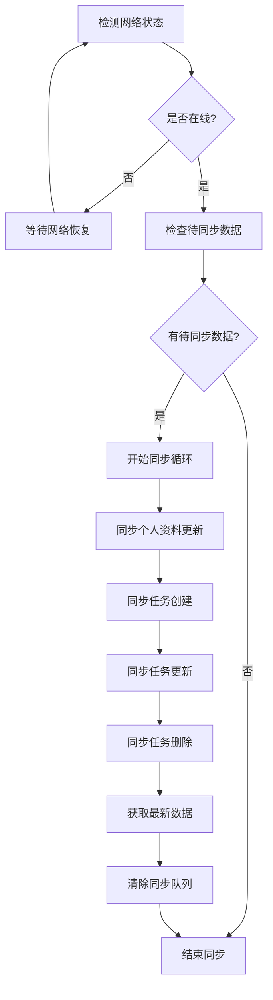
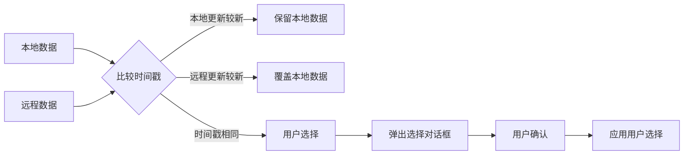
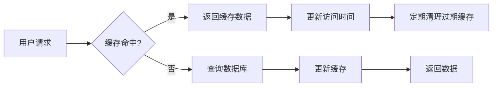
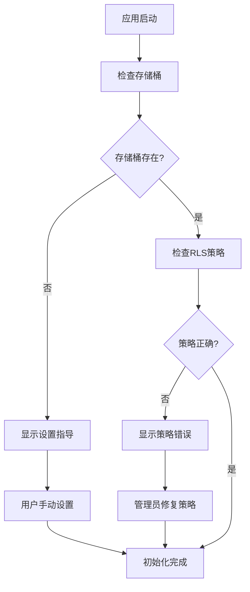

# 博客功能存储架构设计文档

<cite>
**本文档引用的文件**
- [STORAGE_SETUP_GUIDE.md](file://STORAGE_SETUP_GUIDE.md)
- [supabase_storage_setup.sql](file://supabase_storage_setup.sql)
- [src/utils/checkinService.ts](file://src/utils/checkinService.ts)
- [src/utils/dataService.tsx](file://src/utils/dataService.tsx)
- [src/utils/nativeService.ts](file://src/utils/nativeService.ts)
- [src/utils/supabase/client.ts](file://src/utils/supabase/client.ts)
- [src/utils/supabase/info.tsx](file://src/utils/supabase/info.tsx)
- [src/components/BlogComponents.tsx](file://src/components/BlogComponents.tsx)
- [src/types/checkin.ts](file://src/types/checkin.ts)
- [supabase_checkin_tables.sql](file://supabase_checkin_tables.sql)
</cite>

## 目录
1. [概述](#概述)
2. [存储架构总览](#存储架构总览)
3. [本地缓存机制](#本地缓存机制)
4. [远程数据库同步](#远程数据库同步)
5. [图片存储与CDN集成](#图片存储与cdn集成)
6. [离线优先设计](#离线优先设计)
7. [数据同步策略](#数据同步策略)
8. [冲突解决机制](#冲突解决机制)
9. [性能优化](#性能优化)
10. [故障排除指南](#故障排除指南)

## 概述

本系统采用混合存储架构，结合本地缓存和远程数据库的优势，为博客功能提供完整的数据持久化解决方案。该架构支持离线操作，确保用户在无网络环境下也能正常使用应用，并在网络恢复时自动同步数据。

## 存储架构总览

**图表来源**
- [src/utils/checkinService.ts](file://src/utils/checkinService.ts#L1-L50)
- [src/utils/dataService.tsx](file://src/utils/dataService.tsx#L1-L100)

## 本地缓存机制

### 缓存层次结构

系统采用多层缓存策略，确保数据的高效访问和持久化：

**图表来源**
- [src/utils/checkinService.ts](file://src/utils/checkinService.ts#L15-L25)
- [src/utils/dataService.tsx](file://src/utils/dataService.tsx#L60-L90)

### 缓存策略

1. **智能缓存更新**：当从远程获取数据时，自动更新本地缓存
2. **增量同步**：只同步发生变化的数据，减少网络传输
3. **缓存失效**：基于时间戳的缓存失效机制
4. **内存缓存**：在内存中维护最近使用的数据副本

**章节来源**
- [src/utils/checkinService.ts](file://src/utils/checkinService.ts#L40-L80)
- [src/utils/dataService.tsx](file://src/utils/dataService.tsx#L120-L180)

## 远程数据库同步

### 数据库架构设计

**图表来源**
- [supabase_checkin_tables.sql](file://supabase_checkin_tables.sql#L1-L50)
- [src/types/checkin.ts](file://src/types/checkin.ts#L1-L50)

### 同步机制

系统实现了双向同步机制，确保本地和远程数据的一致性：

**图表来源**
- [src/utils/checkinService.ts](file://src/utils/checkinService.ts#L600-L650)
- [src/utils/dataService.tsx](file://src/utils/dataService.tsx#L750-L800)

**章节来源**
- [src/utils/checkinService.ts](file://src/utils/checkinService.ts#L200-L300)
- [supabase_checkin_tables.sql](file://supabase_checkin_tables.sql#L100-L200)

## 图片存储与CDN集成

### 对象存储配置

系统使用Supabase Storage作为图片存储解决方案，支持CDN加速和全球分发：

**图表来源**
- [src/utils/checkinService.ts](file://src/utils/checkinService.ts#L600-L650)
- [STORAGE_SETUP_GUIDE.md](file://STORAGE_SETUP_GUIDE.md#L1-L30)

### 存储策略配置

根据STORAGE_SETUP_GUIDE.md中的配置，系统使用以下RLS策略：

1. **上传策略**：允许认证用户上传图片到images桶
2. **访问策略**：允许所有人查看公共图片
3. **删除策略**：允许用户删除自己的图片

**章节来源**
- [src/utils/checkinService.ts](file://src/utils/checkinService.ts#L600-L680)
- [supabase_storage_setup.sql](file://supabase_storage_setup.sql#L1-L42)

## 离线优先设计

### 离线数据管理

系统采用离线优先的设计理念，确保用户在任何网络状态下都能正常使用应用：

**图表来源**
- [src/utils/dataService.tsx](file://src/utils/dataService.tsx#L30-L60)
- [src/utils/checkinService.ts](file://src/utils/checkinService.ts#L15-L45)

### 离线功能支持

1. **离线数据创建**：用户可以在离线状态下创建新的博客
2. **本地数据缓存**：所有操作都先写入本地缓存
3. **待同步队列**：记录所有待同步的操作
4. **网络恢复检测**：自动检测网络状态变化

**章节来源**
- [src/utils/dataService.tsx](file://src/utils/dataService.tsx#L200-L300)
- [src/utils/checkinService.ts](file://src/utils/checkinService.ts#L700-L736)

## 数据同步策略

### 同步流程设计

**图表来源**
- [src/utils/dataService.tsx](file://src/utils/dataService.tsx#L750-L830)

### 同步优先级

系统为不同类型的操作设置不同的同步优先级：

1. **高优先级**：用户认证状态变更
2. **中优先级**：个人资料更新
3. **低优先级**：普通任务操作

**章节来源**
- [src/utils/dataService.tsx](file://src/utils/dataService.tsx#L750-L830)

## 冲突解决机制

### 时间戳优先策略

当出现数据冲突时，系统采用时间戳优先的策略：

**图表来源**
- [src/utils/dataService.tsx](file://src/utils/dataService.tsx#L200-L250)

### 冲突检测与处理

1. **自动检测**：系统自动检测数据版本冲突
2. **用户交互**：对于无法自动解决的冲突，提供用户选择界面
3. **历史记录**：保留冲突解决的历史记录

**章节来源**
- [src/utils/dataService.tsx](file://src/utils/dataService.tsx#L200-L280)

## 性能优化

### 查询优化策略

1. **索引优化**：为常用查询字段创建复合索引
2. **查询缓存**：缓存频繁查询的结果
3. **分页加载**：大数据集采用分页加载策略
4. **懒加载**：图片等资源采用懒加载

### 缓存优化

**图表来源**
- [src/utils/checkinService.ts](file://src/utils/checkinService.ts#L40-L80)

**章节来源**
- [supabase_checkin_tables.sql](file://supabase_checkin_tables.sql#L50-L100)

## 故障排除指南

### 常见存储问题

1. **存储桶未创建**
   - 错误信息：`Storage bucket "images" not found`
   - 解决方案：在Supabase控制台创建images存储桶

2. **权限不足**
   - 错误信息：`Permission denied`
   - 解决方案：检查RLS策略配置

3. **网络超时**
   - 错误信息：`Timeout error`
   - 解决方案：检查网络连接和数据库性能

### 监控与诊断

系统提供了完整的监控机制：

**图表来源**
- [src/utils/checkinService.ts](file://src/utils/checkinService.ts#L600-L650)

**章节来源**
- [STORAGE_SETUP_GUIDE.md](file://STORAGE_SETUP_GUIDE.md#L1-L80)
- [src/utils/checkinService.ts](file://src/utils/checkinService.ts#L600-L680)

## 结论

本存储架构设计充分考虑了现代移动应用的需求，通过合理的缓存策略、同步机制和冲突解决方案，为博客功能提供了稳定可靠的数据存储解决方案。该架构不仅支持离线操作，还能在恢复网络连接后自动同步数据，确保用户体验的一致性和数据的完整性。