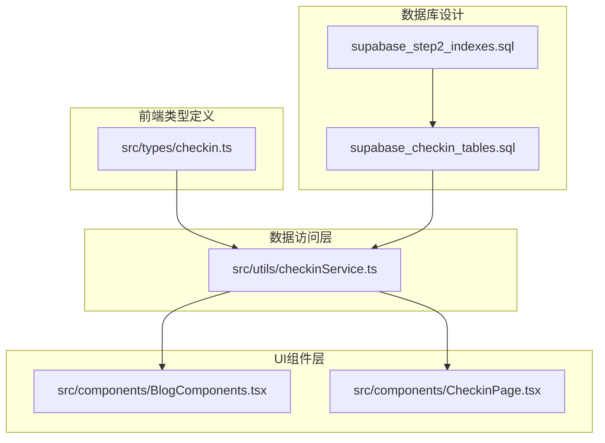
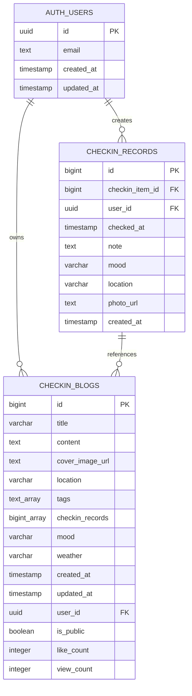
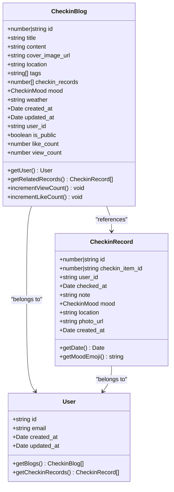
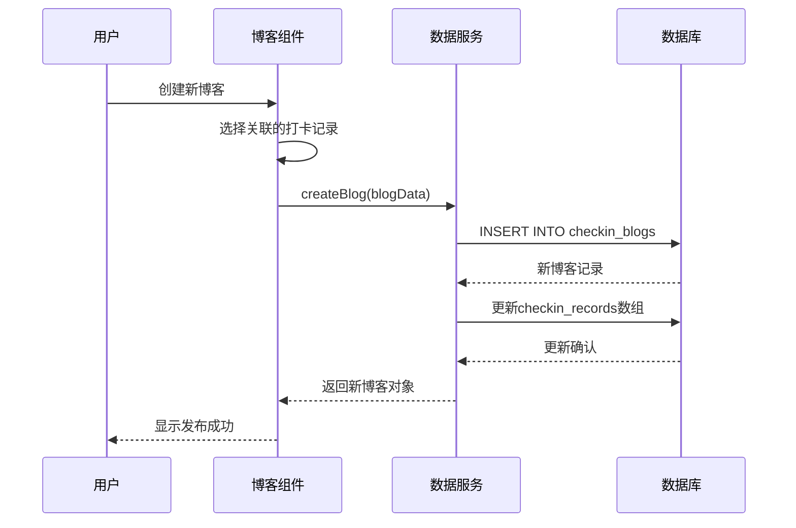
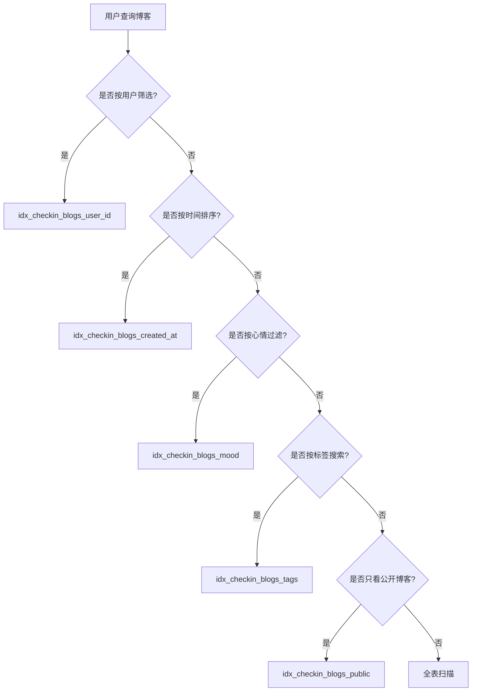
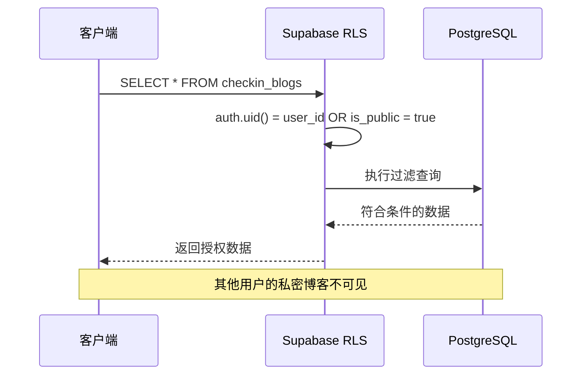
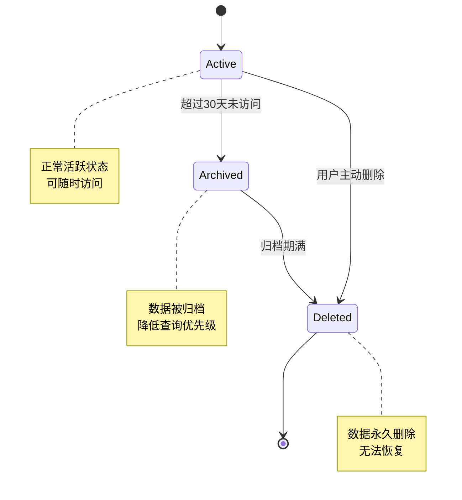

# 博客功能数据模型文档

<cite>
**本文档中引用的文件**
- [src/types/checkin.ts](file://src/types/checkin.ts)
- [supabase_checkin_tables.sql](file://supabase_checkin_tables.sql)
- [supabase_step2_indexes.sql](file://supabase_step2_indexes.sql)
- [src/utils/checkinService.ts](file://src/utils/checkinService.ts)
- [src/components/BlogComponents.tsx](file://src/components/BlogComponents.tsx)
- [src/components/CheckinPage.tsx](file://src/components/CheckinPage.tsx)
</cite>

## 目录
1. [简介](#简介)
2. [项目结构概述](#项目结构概述)
3. [核心数据模型](#核心数据模型)
4. [数据库架构](#数据库架构)
5. [实体关系图](#实体关系图)
6. [数据验证规则](#数据验证规则)
7. [索引设计](#索引设计)
8. [行级安全策略](#行级安全策略)
9. [数据生命周期管理](#数据生命周期管理)
10. [性能优化策略](#性能优化策略)
11. [故障排除指南](#故障排除指南)
12. [总结](#总结)

## 简介

本文档详细阐述了Focus应用中博客功能的数据模型设计，重点关注`src/types/checkin.ts`中`CheckinBlog`接口的字段定义、数据类型及业务含义，以及其与Supabase数据库中`checkin_blogs`表的映射关系。该系统采用现代化的TypeScript类型定义和PostgreSQL数据库设计，实现了完整的博客功能，包括文章创建、编辑、删除、点赞和浏览统计等功能。

## 项目结构概述

博客功能的数据模型分布在多个关键文件中，形成了完整的数据层架构：



**图表来源**
- [src/types/checkin.ts](file://src/types/checkin.ts#L1-L284)
- [supabase_checkin_tables.sql](file://supabase_checkin_tables.sql#L1-L284)
- [src/utils/checkinService.ts](file://src/utils/checkinService.ts#L1-L736)

## 核心数据模型

### CheckinBlog接口定义

`CheckinBlog`接口是博客功能的核心数据模型，定义了博客文章的所有必要字段：

```typescript
export interface CheckinBlog {
  id: number | string;                    // 主键标识符
  title: string;                          // 文章标题（必填）
  content: string;                        // 文章内容（支持Markdown）
  cover_image_url?: string;               // 首图URL（可选）
  location?: string;                      // 地点信息（可选）
  tags: string[];                         // 标签数组
  checkin_records: number[];              // 关联的打卡记录ID数组
  mood: CheckinMood;                      // 当前心情状态
  weather?: string;                       // 天气信息（可选）
  created_at: Date;                       // 创建时间戳
  updated_at: Date;                       // 更新时间戳
  user_id: string;                        // 用户唯一标识
  is_public: boolean;                     // 是否公开可见
  like_count: number;                     // 点赞数
  view_count: number;                     // 浏览数
}
```

### 字段详细说明

| 字段名 | 类型 | 必填 | 默认值 | 说明 |
|--------|------|------|--------|------|
| `id` | `number \| string` | 是 | - | 数据库主键，自动递增 |
| `title` | `string` | 是 | - | 博客标题，最大长度未限制 |
| `content` | `string` | 是 | - | 博客内容，支持Markdown格式 |
| `cover_image_url` | `string` | 否 | - | 博客封面图片URL |
| `location` | `string` | 否 | - | 发布博客时的地理位置 |
| `tags` | `string[]` | 是 | `[]` | 标签数组，默认为空数组 |
| `checkin_records` | `number[]` | 是 | `[]` | 关联的打卡记录ID数组 |
| `mood` | `CheckinMood` | 是 | `'neutral'` | 心情状态枚举 |
| `weather` | `string` | 否 | - | 天气状况描述 |
| `created_at` | `Date` | 是 | `NOW()` | 自动设置创建时间 |
| `updated_at` | `Date` | 是 | `NOW()` | 自动更新时间 |
| `user_id` | `string` | 是 | - | 关联的用户UUID |
| `is_public` | `boolean` | 是 | `false` | 是否公开可见，默认私密 |
| `like_count` | `number` | 是 | `0` | 点赞计数，默认为0 |
| `view_count` | `number` | 是 | `0` | 浏览计数，默认为0 |

**章节来源**
- [src/types/checkin.ts](file://src/types/checkin.ts#L39-L77)

## 数据库架构

### 表结构设计

`checkin_blogs`表的设计遵循数据库规范化原则，确保数据完整性和一致性：

```sql
CREATE TABLE IF NOT EXISTS checkin_blogs (
  id BIGSERIAL PRIMARY KEY,
  title VARCHAR(255) NOT NULL,
  content TEXT NOT NULL,
  cover_image_url TEXT,
  location VARCHAR(255),
  tags TEXT[] DEFAULT '{}',
  checkin_records BIGINT[] DEFAULT '{}',
  mood VARCHAR(20) NOT NULL DEFAULT 'neutral',
  weather VARCHAR(100),
  created_at TIMESTAMP WITH TIME ZONE DEFAULT NOW(),
  updated_at TIMESTAMP WITH TIME ZONE DEFAULT NOW(),
  user_id UUID REFERENCES auth.users(id) ON DELETE CASCADE,
  is_public BOOLEAN DEFAULT false,
  like_count INTEGER DEFAULT 0,
  view_count INTEGER DEFAULT 0,
  
  CONSTRAINT valid_mood CHECK (mood IN ('excellent', 'good', 'neutral', 'tired', 'stressed')),
  CONSTRAINT valid_like_count CHECK (like_count >= 0),
  CONSTRAINT valid_view_count CHECK (view_count >= 0)
);
```

### 外键约束关系



**图表来源**
- [supabase_checkin_tables.sql](file://supabase_checkin_tables.sql#L30-L50)

### 主键和外键设计

- **主键**：`id`字段使用PostgreSQL的`BIGSERIAL`类型，确保全局唯一性
- **外键**：`user_id`字段引用`auth.users`表，建立用户与博客的关联
- **数组类型**：`tags`和`checkin_records`使用PostgreSQL数组类型，支持灵活的数据组织

**章节来源**
- [supabase_checkin_tables.sql](file://supabase_checkin_tables.sql#L30-L50)

## 实体关系图

### 博客与用户的关系



**图表来源**
- [src/types/checkin.ts](file://src/types/checkin.ts#L39-L77)
- [src/types/checkin.ts](file://src/types/checkin.ts#L20-L38)

### 博客与打卡记录的关联

博客系统通过`checkin_records`字段与打卡记录建立多对多关系：



**图表来源**
- [src/utils/checkinService.ts](file://src/utils/checkinService.ts#L545-L597)
- [src/components/BlogComponents.tsx](file://src/components/BlogComponents.tsx#L1-L100)

**章节来源**
- [src/types/checkin.ts](file://src/types/checkin.ts#L39-L77)
- [src/utils/checkinService.ts](file://src/utils/checkinService.ts#L449-L597)

## 数据验证规则

### 数据库约束

PostgreSQL提供了多层次的数据验证机制：

1. **字段长度限制**：
   - `title`：VARCHAR(255)，防止过长标题影响性能
   - `location`：VARCHAR(255)，地理位置字符串限制
   - `weather`：VARCHAR(100)，天气描述长度限制

2. **枚举验证**：
   ```sql
   CONSTRAINT valid_mood CHECK (mood IN ('excellent', 'good', 'neutral', 'tired', 'stressed'))
   ```

3. **数值范围验证**：
   ```sql
   CONSTRAINT valid_like_count CHECK (like_count >= 0)
   CONSTRAINT valid_view_count CHECK (view_count >= 0)
   ```

4. **数组类型验证**：
   - `tags`：TEXT[]数组，支持空数组
   - `checkin_records`：BIGINT[]数组，存储关联记录ID

### 前端验证规则

TypeScript类型系统提供了编译时验证：

```typescript
// 标题长度验证（运行时）
if (!formData.title.trim()) {
  await NativeService.showToast('请输入标题');
  return;
}

// 内容长度验证（运行时）
if (!formData.content.trim()) {
  await NativeService.showToast('请输入内容');
  return;
}

// 图片大小验证
if (file.size > 5 * 1024 * 1024) {
  await NativeService.showToast('图片大小不能超过5MB');
  return;
}
```

**章节来源**
- [supabase_checkin_tables.sql](file://supabase_checkin_tables.sql#L30-L50)
- [src/components/BlogComponents.tsx](file://src/components/BlogComponents.tsx#L60-L120)

## 索引设计

### 查询性能优化

为了提升查询性能，系统创建了多个专门的索引：

```sql
-- 博客表索引
CREATE INDEX IF NOT EXISTS idx_checkin_blogs_user_id ON checkin_blogs(user_id);
CREATE INDEX IF NOT EXISTS idx_checkin_blogs_created_at ON checkin_blogs(created_at);
CREATE INDEX IF NOT EXISTS idx_checkin_blogs_mood ON checkin_blogs(mood);
CREATE INDEX IF NOT EXISTS idx_checkin_blogs_tags ON checkin_blogs USING GIN(tags);
CREATE INDEX IF NOT EXISTS idx_checkin_blogs_public ON checkin_blogs(is_public);
```

### 索引类型说明

1. **B-tree索引**（普通索引）：
   - `idx_checkin_blogs_user_id`：按用户ID查询博客
   - `idx_checkin_blogs_created_at`：按创建时间排序
   - `idx_checkin_blogs_mood`：按心情状态过滤

2. **GIN索引**（通用倒排索引）：
   - `idx_checkin_blogs_tags`：支持标签数组的快速查找
   - 特别适合`OVERLAPS`查询操作

3. **位图索引**（布尔字段）：
   - `idx_checkin_blogs_public`：快速筛选公开博客

### 查询优化效果



**图表来源**
- [supabase_step2_indexes.sql](file://supabase_step2_indexes.sql#L10-L20)

**章节来源**
- [supabase_step2_indexes.sql](file://supabase_step2_indexes.sql#L10-L20)

## 行级安全策略

### RLS策略设计

Supabase的行级安全（RLS）确保每个用户只能访问自己的数据：

```sql
-- 博客RLS策略
CREATE POLICY "Users can view their own blogs and public blogs" 
  ON checkin_blogs FOR SELECT 
  USING (auth.uid() = user_id OR is_public = true);

CREATE POLICY "Users can insert their own blogs" 
  ON checkin_blogs FOR INSERT 
  WITH CHECK (auth.uid() = user_id);

CREATE POLICY "Users can update their own blogs" 
  ON checkin_blogs FOR UPDATE 
  USING (auth.uid() = user_id);

CREATE POLICY "Users can delete their own blogs" 
  ON checkin_blogs FOR DELETE 
  USING (auth.uid() = user_id);
```

### 安全策略流程



**图表来源**
- [supabase_checkin_tables.sql](file://supabase_checkin_tables.sql#L140-L160)

### 权限控制矩阵

| 操作 | 用户博客 | 公开博客 | 结果 |
|------|----------|----------|------|
| SELECT | ✅ | ✅ | 允许访问 |
| INSERT | ✅ | ❌ | 仅允许创建 |
| UPDATE | ✅ | ❌ | 仅允许修改 |
| DELETE | ✅ | ❌ | 仅允许删除 |

**章节来源**
- [supabase_checkin_tables.sql](file://supabase_checkin_tables.sql#L140-L160)

## 数据生命周期管理

### 软删除机制

系统采用软删除策略，通过`is_active`字段标记记录状态：

```typescript
async deleteCheckinItem(id: number | string): Promise<void> {
  try {
    const { error } = await supabase
      .from('checkin_items')
      .update({ is_active: false })
      .eq('id', id);

    if (error) {
      console.error('Error deleting checkin item:', error);
      throw error;
    }

    // 从缓存中移除
    this.cache.checkinItems = this.cache.checkinItems.filter(item => item.id !== id);
  } catch (error) {
    console.error('Failed to delete checkin item:', error);
    throw error;
  }
}
```

### 归档策略



### 缓存管理

数据服务实现了智能缓存机制：

```typescript
private cache = {
  checkinItems: [] as CheckinItem[],
  checkinRecords: [] as CheckinRecord[],
  blogs: [] as CheckinBlog[],
  lastSyncTime: null as Date | null
};

async getBlogs(filters?: BlogFilters): Promise<CheckinBlog[]> {
  try {
    // ... 查询逻辑 ...
    
    if (!filters) {
      this.cache.blogs = blogs;
    }
    
    return blogs;
  } catch (error) {
    console.error('Failed to fetch blogs:', error);
    return filters ? [] : this.cache.blogs;
  }
}
```

**章节来源**
- [src/utils/checkinService.ts](file://src/utils/checkinService.ts#L15-L30)
- [src/utils/checkinService.ts](file://src/utils/checkinService.ts#L449-L498)

## 性能优化策略

### 数据库优化

1. **触发器自动更新时间**：
```sql
CREATE OR REPLACE FUNCTION update_updated_at_column()
RETURNS TRIGGER AS $$
BEGIN
  NEW.updated_at = NOW();
  RETURN NEW;
END;
$$ language 'plpgsql';

CREATE TRIGGER update_checkin_blogs_updated_at 
  BEFORE UPDATE ON checkin_blogs 
  FOR EACH ROW EXECUTE FUNCTION update_updated_at_column();
```

2. **视图优化查询**：
```sql
CREATE OR REPLACE VIEW user_checkin_overview AS
SELECT 
  ci.user_id,
  ci.id as item_id,
  ci.title,
  ci.category,
  ci.target_type,
  ci.target_count,
  COUNT(cr.id) as total_records,
  COUNT(cr.id) FILTER (WHERE DATE(cr.checked_at) = CURRENT_DATE) as today_count,
  COUNT(cr.id) FILTER (WHERE cr.checked_at >= CURRENT_DATE - INTERVAL '7 days') as week_count,
  MAX(cr.checked_at) as last_checkin
FROM checkin_items ci
LEFT JOIN checkin_records cr ON ci.id = cr.checkin_item_id
WHERE ci.is_active = true
GROUP BY ci.user_id, ci.id, ci.title, ci.category, ci.target_type, ci.target_count;
```

### 前端优化

1. **并行数据加载**：
```typescript
const [itemsData, blogsData] = await Promise.allSettled([
  checkinService.getCheckinItems(),
  checkinService.getBlogs()
]);
```

2. **增量更新**：
```typescript
// 仅更新变化的部分
setBlogs(prev => prev.map(blog => 
  blog.id === blogId 
    ? { ...blog, like_count: blog.like_count + 1 }
    : blog
));
```

**章节来源**
- [supabase_checkin_tables.sql](file://supabase_checkin_tables.sql#L70-L90)
- [src/utils/checkinService.ts](file://src/utils/checkinService.ts#L35-L45)

## 故障排除指南

### 常见问题及解决方案

1. **存储桶不存在错误**：
```typescript
if (error?.message?.includes('not found') || error?.message.includes('does not exist')) {
  throw new Error('存储桶"images"不存在。请在Supabase控制台中创建名为"images"的存储桶，并设置为公开访问。');
}
```

2. **权限不足问题**：
```typescript
if (error?.message?.includes('Permission denied')) {
  errorMessage = '没有上传权限，请检查登录状态';
}
```

3. **数据验证失败**：
```typescript
// 前端验证
if (!formData.title.trim()) {
  await NativeService.showToast('请输入标题');
  return;
}

// 后端验证
CONSTRAINT valid_like_count CHECK (like_count >= 0)
```

### 调试工具

1. **日志记录**：
```typescript
console.error('Error fetching blogs:', error);
throw error;
```

2. **缓存回退**：
```typescript
return filters ? [] : this.cache.blogs;
```

3. **状态监控**：
```typescript
getLastSyncTime(): Date | null {
  return this.cache.lastSyncTime;
}
```

**章节来源**
- [src/components/BlogComponents.tsx](file://src/components/BlogComponents.tsx#L80-L120)
- [src/utils/checkinService.ts](file://src/utils/checkinService.ts#L490-L500)

## 总结

Focus应用的博客功能数据模型展现了现代Web应用的最佳实践：

### 核心优势

1. **类型安全**：完整的TypeScript类型定义确保编译时错误检测
2. **数据完整性**：PostgreSQL约束和RLS策略保障数据安全
3. **性能优化**：多层级索引和缓存机制提升查询效率
4. **用户体验**：软删除和增量更新提供流畅的交互体验

### 技术亮点

- **数组类型支持**：PostgreSQL数组类型简化了多对多关系
- **RLS策略**：行级安全确保数据隐私
- **触发器自动化**：自动更新时间戳减少手动维护
- **视图优化**：复杂查询封装为简单视图

### 扩展建议

1. **全文搜索**：集成全文搜索引擎提升标签和内容检索能力
2. **数据归档**：实现自动化的数据归档和清理机制
3. **缓存策略**：引入Redis等外部缓存提升性能
4. **监控告警**：建立完善的数据库和应用监控体系

该数据模型为博客功能提供了坚实的基础，支持未来的功能扩展和性能优化需求。