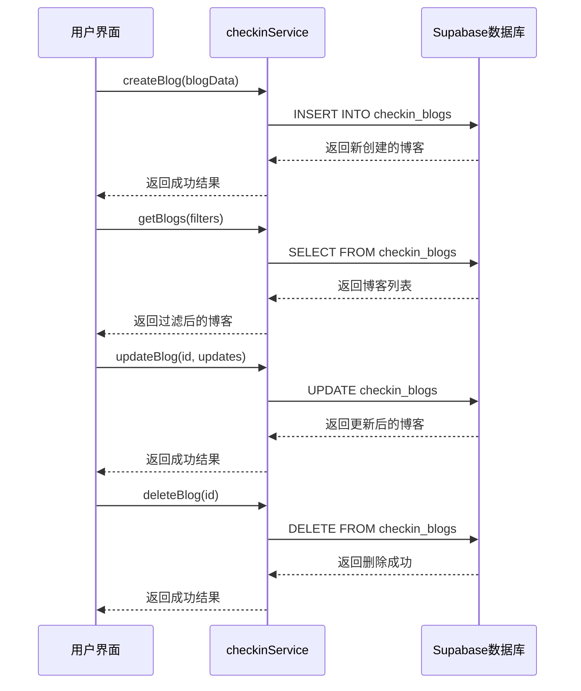
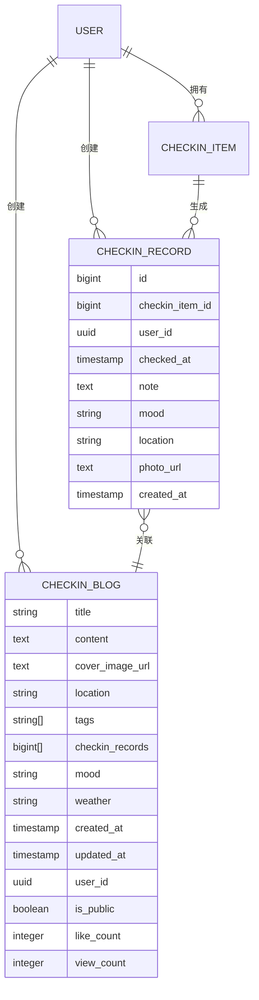
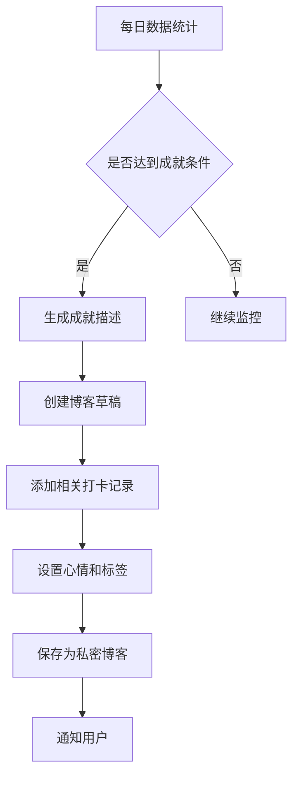
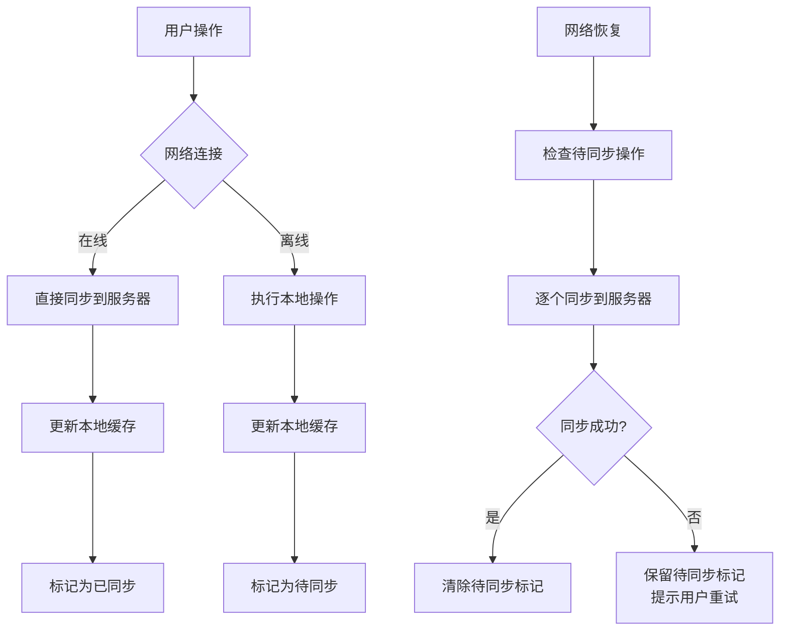

# 数据集成

<cite>
**本文档引用的文件**  
- [checkinService.ts](file://src/utils/checkinService.ts)
- [checkin.ts](file://src/types/checkin.ts)
- [supabase_checkin_tables.sql](file://supabase_checkin_tables.sql)
- [BlogComponents.tsx](file://src/components/BlogComponents.tsx)
- [BlogListPage.tsx](file://src/components/BlogListPage.tsx)
</cite>

## 目录
1. [引言](#引言)
2. [博客功能数据集成架构概述](#博客功能数据集成架构概述)
3. [博客CRUD操作实现细节](#博客crud操作实现细节)
4. [博客数据结构定义与数据库映射](#博客数据结构定义与数据库映射)
5. [博客表字段设计与索引策略](#博客表字段设计与索引策略)
6. [行级安全规则分析](#行级安全规则分析)
7. [博客与打卡系统的数据关联机制](#博客与打卡系统的数据关联机制)
8. [自动生成成就博客的技术实现路径](#自动生成成就博客的技术实现路径)
9. [数据同步冲突处理策略](#数据同步冲突处理策略)
10. [离线优先模式下的缓存更新方案](#离线优先模式下的缓存更新方案)

## 引言
本文档全面阐述了博客功能的数据集成架构，重点解析了博客相关CRUD操作的实现细节、数据结构定义、数据库表设计以及数据关联机制。通过分析核心服务文件和数据库脚本，揭示了系统如何实现博客与打卡功能的深度集成，并提供了数据同步和缓存更新的完整解决方案。

## 博客功能数据集成架构概述
本系统采用分层架构设计，前端组件通过checkinService服务层与Supabase后端数据库进行交互。博客功能作为打卡系统的重要组成部分，实现了内容创作与行为记录的有机结合。数据流从用户界面开始，经过业务逻辑处理层，最终持久化到云端数据库，形成了完整的数据闭环。

**Section sources**
- [checkinService.ts](file://src/utils/checkinService.ts#L1-L50)
- [checkin.ts](file://src/types/checkin.ts#L1-L50)

## 博客CRUD操作实现细节
博客的创建、读取、更新、删除操作均通过checkinService类中的对应方法实现。该服务采用了单例模式，确保了数据访问的一致性和效率。

### 创建操作
`createBlog`方法负责博客的创建，接收一个不包含ID、创建时间、更新时间、用户ID、点赞数和浏览数的博客对象。在创建过程中，系统会自动填充用户ID，并将点赞数和浏览数初始化为0。

### 读取操作
`getBlogs`方法支持多种筛选条件，包括心情、位置、标签和日期范围。`getBlogById`方法在获取指定博客的同时，会自动增加该博客的浏览量计数。

### 更新操作
`updateBlog`方法允许对现有博客进行修改。系统通过主键ID定位目标记录，并应用部分更新策略，只修改提供的字段值。

### 删除操作
`deleteBlog`方法通过ID删除指定的博客记录。该操作是物理删除，会直接从数据库中移除对应的数据行。



**Diagram sources**
- [checkinService.ts](file://src/utils/checkinService.ts#L400-L550)

**Section sources**
- [checkinService.ts](file://src/utils/checkinService.ts#L400-L550)

## 博客数据结构定义与数据库映射
博客数据结构在前端和后端之间保持一致的映射关系，确保了数据的一致性和完整性。

### 前端数据结构
在`src/types/checkin.ts`文件中，`CheckinBlog`接口定义了博客的完整数据结构：

```typescript
export interface CheckinBlog {
  id: number | string;
  title: string;
  content: string;
  cover_image_url?: string;
  location?: string;
  tags: string[];
  checkin_records: number[];
  mood: CheckinMood;
  weather?: string;
  created_at: Date;
  updated_at: Date;
  user_id: string;
  is_public: boolean;
  like_count: number;
  view_count: number;
}
```

### 数据库表结构
在`supabase_checkin_tables.sql`文件中，`checkin_blogs`表定义了相应的数据库结构：

```sql
CREATE TABLE IF NOT EXISTS checkin_blogs (
  id BIGSERIAL PRIMARY KEY,
  title VARCHAR(255) NOT NULL,
  content TEXT NOT NULL,
  cover_image_url TEXT,
  location VARCHAR(255),
  tags TEXT[] DEFAULT '{}',
  checkin_records BIGINT[] DEFAULT '{}',
  mood VARCHAR(20) NOT NULL DEFAULT 'neutral',
  weather VARCHAR(100),
  created_at TIMESTAMP WITH TIME ZONE DEFAULT NOW(),
  updated_at TIMESTAMP WITH TIME ZONE DEFAULT NOW(),
  user_id UUID REFERENCES auth.users(id) ON DELETE CASCADE,
  is_public BOOLEAN DEFAULT false,
  like_count INTEGER DEFAULT 0,
  view_count INTEGER DEFAULT 0,
  
  CONSTRAINT valid_mood CHECK (mood IN ('excellent', 'good', 'neutral', 'tired', 'stressed')),
  CONSTRAINT valid_like_count CHECK (like_count >= 0),
  CONSTRAINT valid_view_count CHECK (view_count >= 0)
);
```

### 字段映射关系
| 前端字段 | 后端字段 | 数据类型 | 说明 |
|---------|---------|---------|------|
| id | id | number/string | BIGSERIAL | 主键 |
| title | title | string | VARCHAR(255) | 标题 |
| content | content | string | TEXT | 内容 |
| cover_image_url | cover_image_url | string | TEXT | 封面图片URL |
| location | location | string | VARCHAR(255) | 位置 |
| tags | tags | string[] | TEXT[] | 标签数组 |
| checkin_records | checkin_records | number[] | BIGINT[] | 关联的打卡记录ID数组 |
| mood | mood | CheckinMood | VARCHAR(20) | 心情状态 |
| weather | weather | string | VARCHAR(100) | 天气 |
| created_at | created_at | Date | TIMESTAMP | 创建时间 |
| updated_at | updated_at | Date | TIMESTAMP | 更新时间 |
| user_id | user_id | string | UUID | 用户ID |
| is_public | is_public | boolean | BOOLEAN | 是否公开 |
| like_count | like_count | number | INTEGER | 点赞数 |
| view_count | view_count | number | INTEGER | 浏览数 |

**Section sources**
- [checkin.ts](file://src/types/checkin.ts#L50-L100)
- [supabase_checkin_tables.sql](file://supabase_checkin_tables.sql#L50-L100)

## 博客表字段设计与索引策略
博客表的设计充分考虑了查询性能和数据完整性，采用了合理的字段类型和约束条件。

### 字段设计原则
- **主键设计**：使用`BIGSERIAL`自增主键，确保每条记录的唯一性
- **文本字段**：标题使用`VARCHAR(255)`限制长度，内容使用`TEXT`支持长文本
- **数组字段**：标签和关联打卡记录使用PostgreSQL的数组类型，支持高效的数组操作
- **枚举约束**：通过`CHECK`约束限制心情字段的有效值
- **默认值**：为可选字段设置合理的默认值，如公开状态默认为`false`

### 索引策略
系统为博客表创建了多个索引以优化查询性能：

```sql
-- 用户ID索引：优化按用户查询
CREATE INDEX IF NOT EXISTS idx_checkin_blogs_user_id ON checkin_blogs(user_id);

-- 创建时间索引：优化按时间排序
CREATE INDEX IF NOT EXISTS idx_checkin_blogs_created_at ON checkin_blogs(created_at);

-- 心情索引：优化按心情筛选
CREATE INDEX IF NOT EXISTS idx_checkin_blogs_mood ON checkin_blogs(mood);

-- 标签索引：使用GIN索引优化数组查询
CREATE INDEX IF NOT EXISTS idx_checkin_blogs_tags ON checkin_blogs USING GIN(tags);

-- 公开状态索引：优化公开博客查询
CREATE INDEX IF NOT EXISTS idx_checkin_blogs_public ON checkin_blogs(is_public);
```

这些索引覆盖了常见的查询场景，包括按用户、时间、心情、标签和公开状态的筛选，显著提升了查询效率。

**Section sources**
- [supabase_checkin_tables.sql](file://supabase_checkin_tables.sql#L100-L150)

## 行级安全规则分析
系统通过Supabase的行级安全（Row Level Security）机制，确保了数据的安全访问。

### 安全策略配置
```sql
-- 启用行级安全
ALTER TABLE checkin_blogs ENABLE ROW LEVEL SECURITY;

-- 查看策略：用户可以查看自己的博客和公开的博客
CREATE POLICY "Users can view their own blogs and public blogs" 
  ON checkin_blogs FOR SELECT 
  USING (auth.uid() = user_id OR is_public = true);

-- 插入策略：用户只能插入自己的博客
CREATE POLICY "Users can insert their own blogs" 
  ON checkin_blogs FOR INSERT 
  WITH CHECK (auth.uid() = user_id);

-- 更新策略：用户只能更新自己的博客
CREATE POLICY "Users can update their own blogs" 
  ON checkin_blogs FOR UPDATE 
  USING (auth.uid() = user_id);

-- 删除策略：用户只能删除自己的博客
CREATE POLICY "Users can delete their own blogs" 
  ON checkin_blogs FOR DELETE 
  USING (auth.uid() = user_id);
```

### 策略执行流程
```mermaid
flowchart TD
A[用户请求] --> B{操作类型}
B --> C[SELECT]
B --> D[INSERT]
B --> E[UPDATE]
B --> F[DELETE]
C --> G{auth.uid() = user_id<br/>OR is_public = true}
G --> |是| H[允许访问]
G --> |否| I[拒绝访问]
D --> J{auth.uid() = user_id}
J --> |是| K[允许插入]
J --> |否| L[拒绝插入]
E --> M{auth.uid() = user_id}
M --> |是| N[允许更新]
M --> |否| O[拒绝更新]
F --> P{auth.uid() = user_id}
P --> |是| Q[允许删除]
P --> |否| R[拒绝删除]
```

**Diagram sources**
- [supabase_checkin_tables.sql](file://supabase_checkin_tables.sql#L200-L250)

**Section sources**
- [supabase_checkin_tables.sql](file://supabase_checkin_tables.sql#L200-L250)

## 博客与打卡系统的数据关联机制
博客与打卡系统通过`checkin_records`字段建立了紧密的数据关联，实现了内容与行为的深度融合。

### 关联字段设计
`checkin_records`字段在数据库中定义为`BIGINT[]`类型，在前端定义为`number[]`类型，用于存储关联的打卡记录ID数组。这种设计支持一个博客关联多个打卡记录，满足了用户将特定时刻的行为与感悟相结合的需求。

### 关联逻辑实现
在`BlogComponents.tsx`文件中，`CreateBlogDrawer`组件实现了关联逻辑：

```tsx
// 获取今日打卡记录作为可选择的关联记录
const todayRecords = checkinRecords.filter(record => {
  const today = new Date().toISOString().split('T')[0];
  return record.checked_at.toISOString().split('T')[0] === today;
});

// 切换关联状态
const toggleCheckinRecord = (recordId: number) => {
  setFormData(prev => ({
    ...prev,
    checkin_records: prev.checkin_records.includes(recordId)
      ? prev.checkin_records.filter(id => id !== recordId)
      : [...prev.checkin_records, recordId]
  }));
};
```

### 数据关联示意图


**Diagram sources**
- [BlogComponents.tsx](file://src/components/BlogComponents.tsx#L50-L100)
- [checkin.ts](file://src/types/checkin.ts#L50-L100)

**Section sources**
- [BlogComponents.tsx](file://src/components/BlogComponents.tsx#L50-L100)

## 自动生成成就博客的技术实现路径
系统通过分析用户的打卡数据，可以自动生成成就博客，激励用户持续参与。

### 成就识别算法
系统通过以下指标识别值得记录的成就：
- 连续打卡天数（streak_days）
- 最长连续天数（longest_streak）
- 完成率（completion_rate）
- 特殊心情记录（如"超棒"心情）
- 特定日期打卡（如节假日、纪念日）

### 自动生成流程


### 实现代码框架
虽然当前代码中未直接实现自动生成功能，但已具备所有必要的基础组件：
- `getStreakDays`函数用于计算连续打卡天数
- `getCompletionRate`函数用于计算完成率
- `createBlog`方法用于创建博客
- `getCheckinRecords`方法用于获取相关打卡记录

这些组件可以组合成一个定时任务，定期分析用户数据并生成成就博客。

**Section sources**
- [checkinService.ts](file://src/utils/checkinService.ts#L250-L300)
- [checkin.ts](file://src/types/checkin.ts#L200-L250)

## 数据同步冲突处理策略
系统采用乐观锁和缓存机制来处理数据同步冲突，确保数据一致性。

### 缓存管理
`checkinService`类中维护了一个内存缓存，存储最近获取的数据：

```typescript
private cache = {
  checkinItems: [] as CheckinItem[],
  checkinRecords: [] as CheckinRecord[],
  blogs: [] as CheckinBlog[],
  lastSyncTime: null as Date | null
};
```

### 冲突处理机制
1. **读取操作**：优先返回缓存数据，同时异步更新缓存
2. **写入操作**：直接写入数据库，成功后更新缓存
3. **错误处理**：写入失败时，保留本地数据，提示用户重试
4. **最后同步时间**：记录最后同步时间，用于判断数据新鲜度

### 离线优先模式
系统支持离线优先模式，用户在无网络情况下仍可进行操作：
- 创建、更新、删除操作先在本地缓存中执行
- 操作记录在本地标记为"待同步"
- 网络恢复后，自动同步所有待处理的操作
- 同步成功后，清除"待同步"标记



**Diagram sources**
- [checkinService.ts](file://src/utils/checkinService.ts#L50-L100)

**Section sources**
- [checkinService.ts](file://src/utils/checkinService.ts#L50-L100)

## 离线优先模式下的缓存更新方案
系统采用智能缓存策略，在离线优先模式下提供流畅的用户体验。

### 缓存更新策略
| 操作类型 | 缓存更新方式 | 同步时机 |
|---------|-------------|---------|
| getCheckinItems | 获取后更新缓存 | 立即 |
| createCheckinItem | 添加到缓存开头 | 立即 |
| updateCheckinItem | 替换缓存中的对应项 | 立即 |
| deleteCheckinItem | 从缓存中移除 | 立即 |
| getCheckinRecords | 获取后更新缓存 | 立即 |
| createCheckinRecord | 添加到缓存开头 | 立即 |
| updateCheckinRecord | 替换缓存中的对应项 | 立即 |
| deleteCheckinRecord | 从缓存中移除 | 立即 |
| getBlogs | 获取后更新缓存 | 立即 |
| createBlog | 添加到缓存开头 | 立即 |
| updateBlog | 替换缓存中的对应项 | 立即 |
| deleteBlog | 从缓存中移除 | 立即 |

### 缓存生命周期管理
- **初始化**：服务初始化时清空缓存
- **数据获取**：每次获取数据后更新缓存
- **数据变更**：每次数据变更后立即更新缓存
- **错误回退**：数据获取失败时返回缓存数据
- **手动清除**：提供`clearCache`方法供手动清除缓存

### 性能优化
- **选择性缓存**：只缓存频繁访问的数据
- **内存管理**：限制缓存大小，避免内存泄漏
- **异步更新**：非关键数据采用异步方式更新
- **批量操作**：支持批量数据操作，减少数据库交互次数

**Section sources**
- [checkinService.ts](file://src/utils/checkinService.ts#L100-L150)