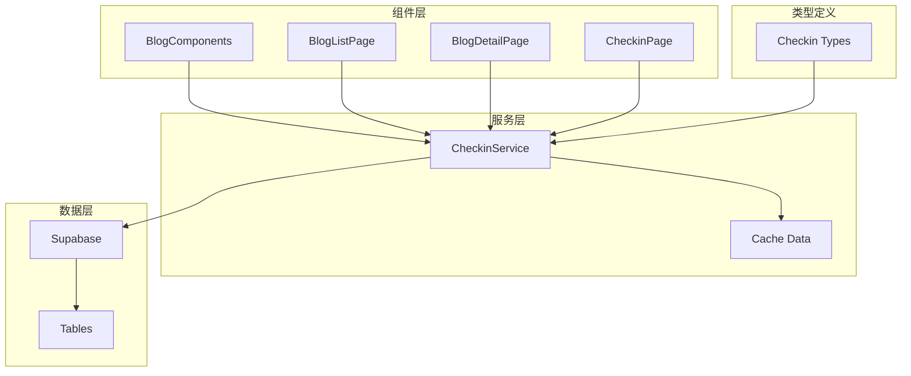
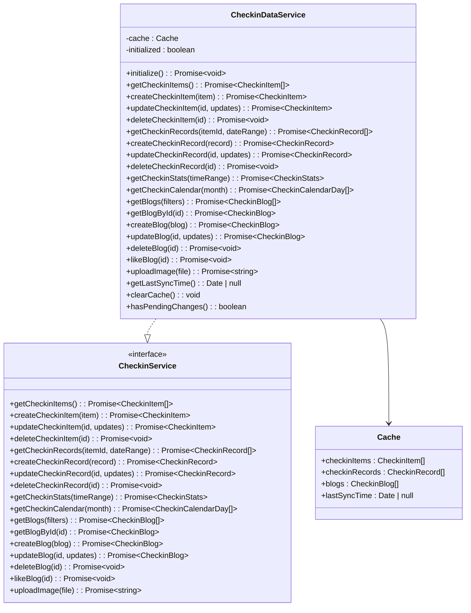
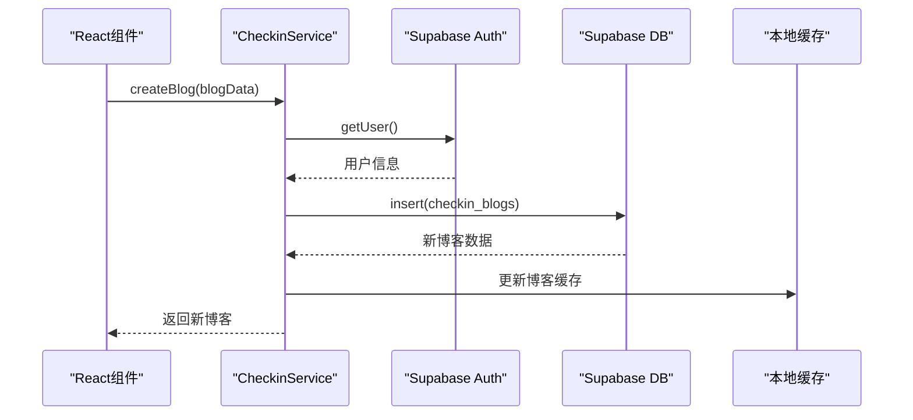
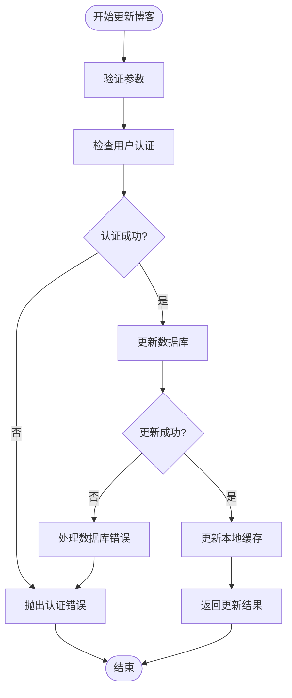
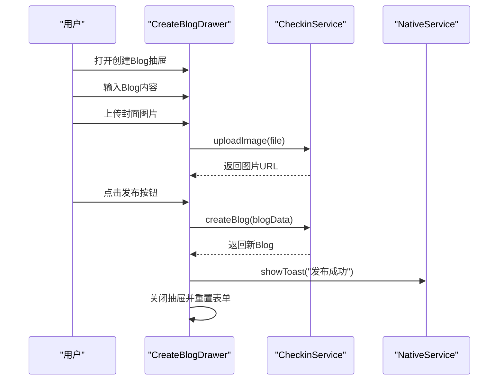
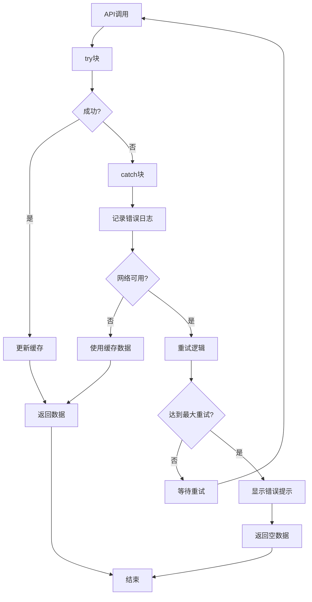
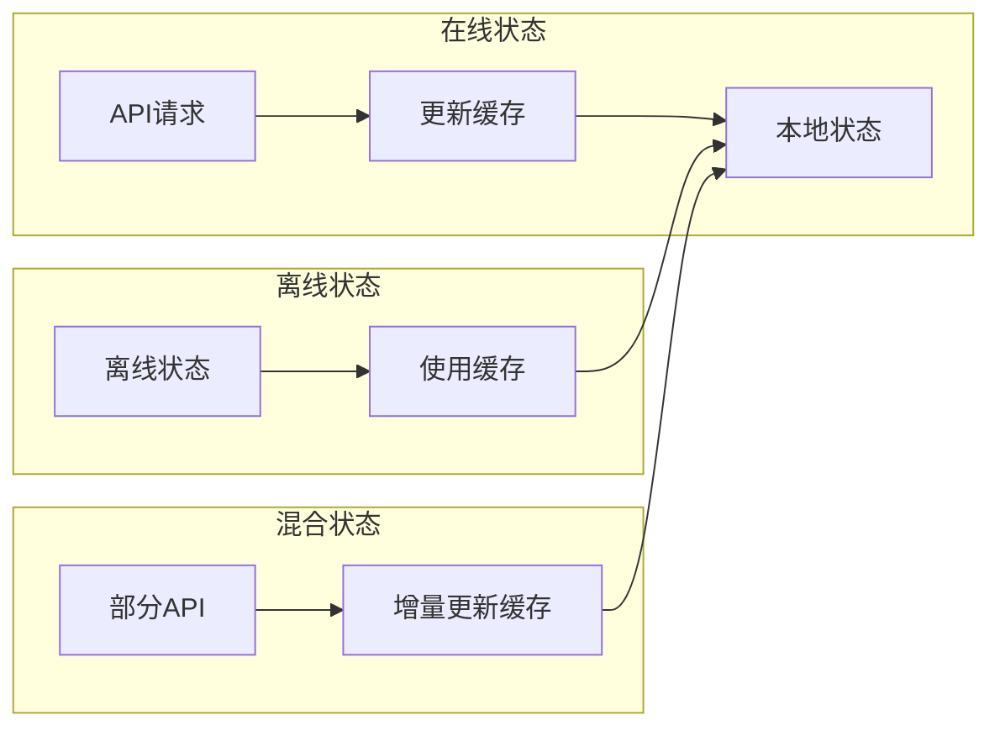

# 博客服务接口实现文档

<cite>
**本文档引用的文件**
- [checkinService.ts](file://src/utils/checkinService.ts)
- [checkin.ts](file://src/types/checkin.ts)
- [BlogComponents.tsx](file://src/components/BlogComponents.tsx)
- [CheckinPage.tsx](file://src/components/CheckinPage.tsx)
- [BlogListPage.tsx](file://src/components/BlogListPage.tsx)
- [BlogDetailPage.tsx](file://src/components/BlogDetailPage.tsx)
</cite>

## 目录
1. [简介](#简介)
2. [项目结构概览](#项目结构概览)
3. [核心数据结构](#核心数据结构)
4. [服务架构概览](#服务架构概览)
5. [博客服务接口详解](#博客服务接口详解)
6. [组件集成分析](#组件集成分析)
7. [错误处理机制](#错误处理机制)
8. [性能优化策略](#性能优化策略)
9. [离线缓存策略](#离线缓存策略)
10. [故障排除指南](#故障排除指南)
11. [总结](#总结)

## 简介

本文档深入分析Focus应用中checkinService.ts文件的博客相关服务接口实现。该服务提供了完整的博客生命周期管理功能，包括博客的创建、更新、删除、查询以及与打卡记录的联动逻辑。系统采用单例模式设计，支持本地缓存和错误恢复机制，确保在各种网络条件下都能提供良好的用户体验。

## 项目结构概览



**图表来源**
- [checkinService.ts](file://src/utils/checkinService.ts#L1-L736)
- [BlogComponents.tsx](file://src/components/BlogComponents.tsx#L1-L632)

## 核心数据结构

### 博客数据模型

```typescript
interface CheckinBlog {
  id: number | string;
  title: string;                    // 标题
  content: string;                  // 内容（支持markdown）
  cover_image_url?: string;         // 首图URL
  location?: string;                // 地点
  tags: string[];                   // 标签
  checkin_records: number[];        // 关联的打卡记录ID
  mood: CheckinMood;                // 当时心情
  weather?: string;                 // 天气
  created_at: Date;
  updated_at: Date;
  user_id: string;
  is_public: boolean;               // 是否公开
  like_count: number;               // 点赞数
  view_count: number;               // 浏览数
}
```

### 博客过滤器接口

```typescript
interface BlogFilters {
  mood?: CheckinMood;
  tags?: string[];
  location?: string;
  dateRange?: {
    start: Date;
    end: Date;
  };
  sortBy: 'created_at' | 'like_count' | 'view_count';
  sortOrder: 'asc' | 'desc';
}
```

**章节来源**
- [checkin.ts](file://src/types/checkin.ts#L40-L60)
- [checkin.ts](file://src/types/checkin.ts#L130-L140)

## 服务架构概览



**图表来源**
- [checkinService.ts](file://src/utils/checkinService.ts#L12-L736)
- [checkin.ts](file://src/types/checkin.ts#L140-L180)

## 博客服务接口详解

### createBlog - 博客创建接口

```typescript
async createBlog(
  blog: Omit<CheckinBlog, 'id' | 'created_at' | 'updated_at' | 'user_id' | 'like_count' | 'view_count'>
): Promise<CheckinBlog>
```

**参数类型：**
- `blog`: 包含博客内容的对象，缺少以下字段：
  - `id`: 自动生成
  - `created_at`: 自动设置
  - `updated_at`: 自动设置
  - `user_id`: 从认证用户获取
  - `like_count`: 默认为0
  - `view_count`: 默认为0

**返回值结构：**
- 成功：返回完整的CheckinBlog对象
- 错误：抛出Error异常

**调用流程：**



**图表来源**
- [checkinService.ts](file://src/utils/checkinService.ts#L480-L510)

**关键特性：**

1. **权限校验**：自动验证用户认证状态
2. **数据完整性**：自动填充必需字段
3. **缓存更新**：实时更新本地缓存
4. **错误处理**：详细的错误信息和回退机制

**章节来源**
- [checkinService.ts](file://src/utils/checkinService.ts#L480-L510)

### updateBlog - 博客更新接口

```typescript
async updateBlog(
  id: number | string, 
  updates: Partial<CheckinBlog>
): Promise<CheckinBlog>
```

**参数类型：**
- `id`: 博客唯一标识符
- `updates`: 需要更新的字段集合

**返回值结构：**
- 成功：返回更新后的CheckinBlog对象
- 错误：抛出Error异常

**调用流程：**



**图表来源**
- [checkinService.ts](file://src/utils/checkinService.ts#L512-L540)

**章节来源**
- [checkinService.ts](file://src/utils/checkinService.ts#L512-L540)

### deleteBlog - 博客删除接口

```typescript
async deleteBlog(id: number | string): Promise<void>
```

**参数类型：**
- `id`: 博客唯一标识符

**返回值结构：**
- 成功：无返回值（void）
- 错误：抛出Error异常

**关键特性：**
- **软删除**：标记为已删除而非物理删除
- **缓存同步**：自动从本地缓存中移除
- **事务一致性**：确保数据库和缓存的一致性

**章节来源**
- [checkinService.ts](file://src/utils/checkinService.ts#L542-L555)

### getBlogs - 博客查询接口

```typescript
async getBlogs(filters?: BlogFilters): Promise<CheckinBlog[]>
```

**参数类型：**
- `filters`: 可选的查询过滤器

**过滤器选项：**
- `mood`: 按心情筛选
- `tags`: 按标签筛选
- `location`: 按地点筛选
- `dateRange`: 按日期范围筛选
- `sortBy`: 排序字段
- `sortOrder`: 排序顺序

**返回值结构：**
- 成功：返回符合条件的CheckinBlog数组
- 错误：返回空数组或使用缓存数据

**章节来源**
- [checkinService.ts](file://src/utils/checkinService.ts#L420-L478)

### likeBlog - 博客点赞接口

```typescript
async likeBlog(id: number | string): Promise<void>
```

**特点：**
- **原子操作**：点赞数增加是原子操作
- **缓存同步**：立即更新本地缓存
- **错误恢复**：即使网络错误也保持数据一致性

**章节来源**
- [checkinService.ts](file://src/utils/checkinService.ts#L557-L590)

## 组件集成分析

### BlogComponents.tsx - 组件层集成



**图表来源**
- [BlogComponents.tsx](file://src/components/BlogComponents.tsx#L40-L120)

### CheckinPage.tsx - 主页面集成

主页面通过并行加载的方式集成博客服务：

```typescript
const initializeData = async () => {
  try {
    // 先初始化服务
    await checkinService.initialize();
    
    // 并行加载所有数据
    setIsLoading(false); // 立即停止loading
    
    // 后台异步加载数据
    const [itemsData, blogsData] = await Promise.allSettled([
      checkinService.getCheckinItems(),
      checkinService.getBlogs()
    ]);

    if (itemsData.status === 'fulfilled') {
      setCheckinItems(itemsData.value);
    }
    if (blogsData.status === 'fulfilled') {
      setBlogs(blogsData.value);
    }
  } catch (error) {
    console.error('Error loading checkin data:', error);
  }
};
```

**章节来源**
- [CheckinPage.tsx](file://src/components/CheckinPage.tsx#L40-L75)

## 错误处理机制

### 详细错误处理策略



### 图片上传错误处理

```typescript
const handleImageUpload = async (event: React.ChangeEvent<HTMLInputElement>) => {
  const file = event.target.files?.[0];
  if (!file) return;

  try {
    setIsUploading(true);
    const imageUrl = await checkinService.uploadImage(file);
    setFormData(prev => ({ ...prev, cover_image_url: imageUrl }));
    await NativeService.showToast('图片上传成功');
  } catch (error: any) {
    console.error('Image upload failed:', error);
    
    // 提供更具体的错误信息
    let errorMessage = '图片上传失败';
    
    if (error?.message?.includes('Storage bucket') && error?.message?.includes('not found')) {
      errorMessage = '存储桶未创建，请在Supabase控制台中创建"images"桶';
    } else if (error?.message?.includes('Bucket not found')) {
      errorMessage = '存储配置错误，请在Supabase中创建存储桶';
    } else if (error?.message?.includes('Permission denied')) {
      errorMessage = '没有上传权限，请检查登录状态';
    } else if (error?.message?.includes('File size')) {
      errorMessage = '文件过大，请选择小于5MB的图片';
    }
    
    await NativeService.showToast(errorMessage);
  } finally {
    setIsUploading(false);
    // 重置文件输入框
    if (event.target) {
      event.target.value = '';
    }
  }
};
```

**章节来源**
- [BlogComponents.tsx](file://src/components/BlogComponents.tsx#L80-L120)

## 性能优化策略

### 1. 并行数据加载

```typescript
// 使用Promise.allSettled避免一个失败影响整体
const [itemsData, blogsData] = await Promise.allSettled([
  checkinService.getCheckinItems(),
  checkinService.getBlogs()
]);
```

### 2. 缓存策略

```typescript
private cache = {
  checkinItems: [] as CheckinItem[],
  checkinRecords: [] as CheckinRecord[],
  blogs: [] as CheckinBlog[],
  lastSyncTime: null as Date | null
};
```

### 3. 数据懒加载

```typescript
// 只在需要时才加载特定数据
if (!filters) {
  this.cache.blogs = blogs;
}
```

### 4. 请求去重

```typescript
// 避免重复请求相同数据
if (!itemId && !dateRange) {
  this.cache.checkinRecords = records;
}
```

**章节来源**
- [checkinService.ts](file://src/utils/checkinService.ts#L15-L25)
- [checkinService.ts](file://src/utils/checkinService.ts#L200-L210)

## 离线缓存策略

### 缓存更新机制



### 缓存失效策略

```typescript
// 缓存失效检查
getLastSyncTime(): Date | null {
  return this.cache.lastSyncTime;
}

// 清理缓存
clearCache(): void {
  this.cache = {
    checkinItems: [],
    checkinRecords: [],
    blogs: [],
    lastSyncTime: null
  };
}
```

**章节来源**
- [checkinService.ts](file://src/utils/checkinService.ts#L710-L720)

## 故障排除指南

### 常见问题及解决方案

#### 1. 存储桶未创建错误

**错误信息：** "存储桶"images"不存在"

**解决方案：**
1. 登录Supabase控制台
2. 导航到Storage设置
3. 创建名为"images"的存储桶
4. 设置为公开访问权限

#### 2. 图片上传失败

**可能原因：**
- 文件大小超过5MB限制
- 文件类型不是图片
- 网络连接不稳定
- 权限不足

**调试步骤：**
```typescript
// 检查文件大小
if (file.size > 5 * 1024 * 1024) {
  await NativeService.showToast('图片大小不能超过5MB');
  return;
}

// 检查文件类型
if (!file.type.startsWith('image/')) {
  await NativeService.showToast('请选择图片文件');
  return;
}
```

#### 3. 博客创建失败

**调试方法：**
```typescript
try {
  const newBlog = await checkinService.createBlog(processedBlogData);
  console.log('Blog created successfully:', newBlog);
} catch (error) {
  console.error('Blog creation failed:', {
    error,
    userId: currentUser?.id,
    timestamp: new Date().toISOString()
  });
}
```

**章节来源**
- [BlogComponents.tsx](file://src/components/BlogComponents.tsx#L80-L120)
- [checkinService.ts](file://src/utils/checkinService.ts#L480-L510)

## 总结

Focus应用的博客服务接口实现了完整的CRUD功能，具有以下核心优势：

### 技术亮点

1. **完善的错误处理**：多层次的错误捕获和用户友好的错误提示
2. **智能缓存机制**：本地缓存确保离线可用性和性能优化
3. **异步状态管理**：React Hook集成提供流畅的用户体验
4. **类型安全**：完整的TypeScript类型定义确保开发安全性
5. **性能优化**：并行加载、缓存策略和懒加载减少资源消耗

### 最佳实践

1. **使用Promise.allSettled**：确保部分失败不影响整体功能
2. **实施渐进式加载**：立即显示界面，后台异步加载数据
3. **实现智能缓存**：根据网络状态动态调整数据获取策略
4. **提供详细错误反馈**：帮助用户理解和解决问题
5. **保持状态一致性**：确保本地状态与服务器状态同步

### 扩展建议

1. **添加请求节流**：防止频繁的API调用
2. **实现离线同步**：支持离线编辑和后续同步
3. **增加数据压缩**：减少传输数据量
4. **优化图片处理**：添加图片压缩和格式转换
5. **增强监控能力**：添加性能指标和错误追踪

通过这些精心设计的服务接口，Focus应用为用户提供了稳定、高效且用户友好的博客创作体验，同时确保了系统的可靠性和可维护性。