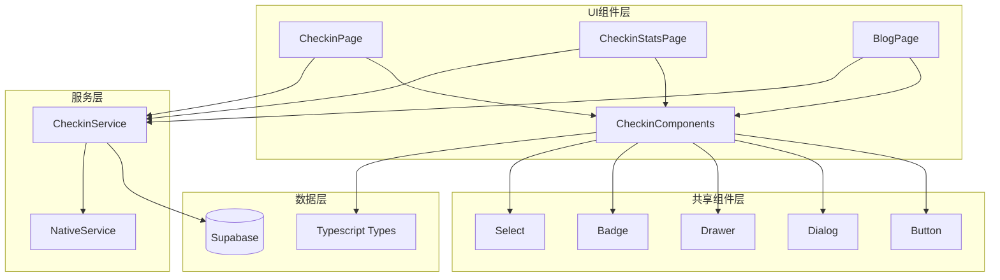
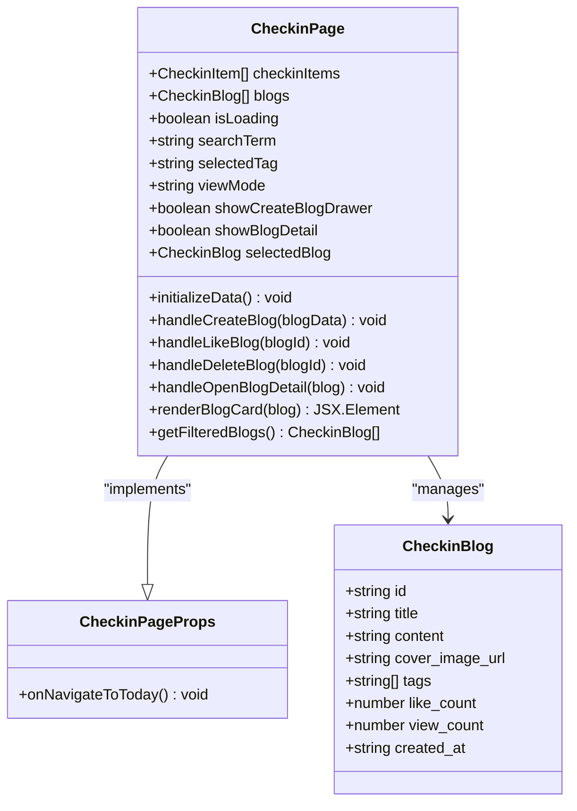
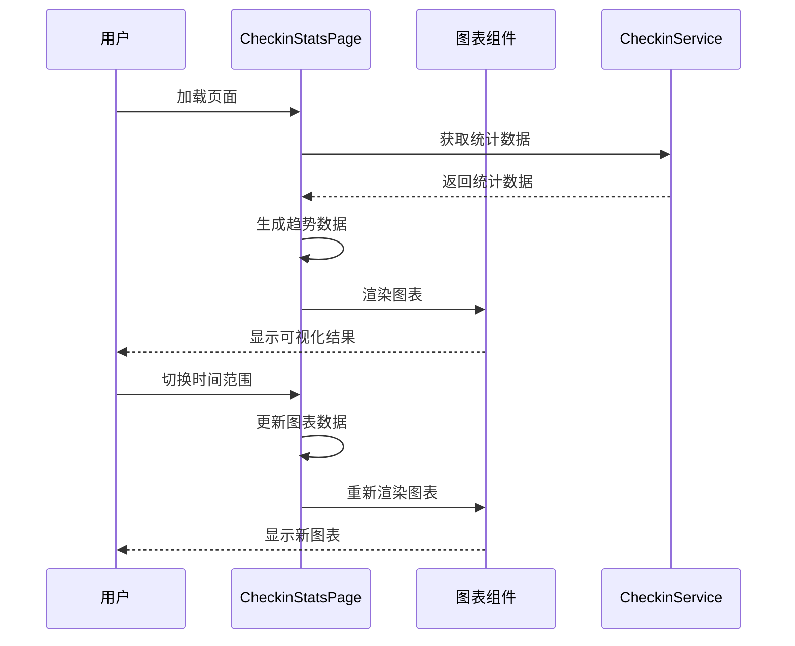
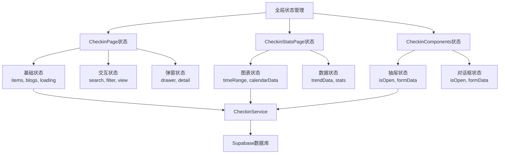
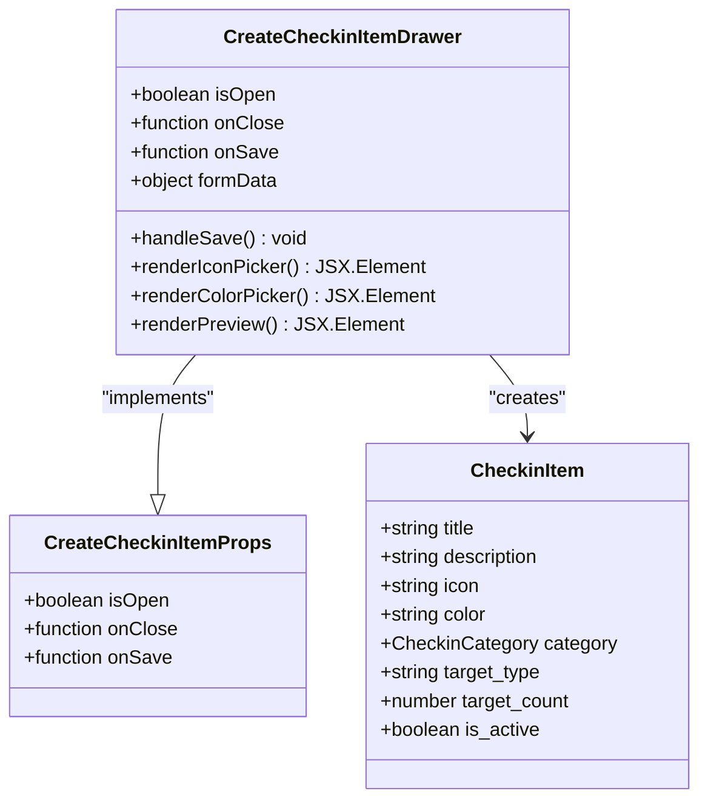

# 打卡系统UI组件详细文档

<cite>
**本文档引用的文件**
- [CheckinPage.tsx](file://src/components/CheckinPage.tsx)
- [CheckinStatsPage.tsx](file://src/components/CheckinStatsPage.tsx)
- [CheckinComponents.tsx](file://src/components/CheckinComponents.tsx)
- [checkin.ts](file://src/types/checkin.ts)
- [checkinService.ts](file://src/utils/checkinService.ts)
- [button.tsx](file://src/components/ui/button.tsx)
- [badge.tsx](file://src/components/ui/badge.tsx)
- [drawer.tsx](file://src/components/ui/drawer.tsx)
- [dialog.tsx](file://src/components/ui/dialog.tsx)
</cite>

## 目录
1. [简介](#简介)
2. [项目架构概览](#项目架构概览)
3. [核心组件分析](#核心组件分析)
4. [状态管理系统](#状态管理系统)
5. [数据可视化组件](#数据可视化组件)
6. [可复用UI组件](#可复用ui组件)
7. [响应式设计与无障碍访问](#响应式设计与无障碍访问)
8. [性能优化策略](#性能优化策略)
9. [最佳实践指南](#最佳实践指南)
10. [故障排除指南](#故障排除指南)

## 简介

打卡系统是一个基于React的现代化移动应用，采用TypeScript构建，提供了完整的个人成长追踪解决方案。系统包含三个核心页面：打卡主页面、统计分析页面和博客分享页面，以及一系列可复用的UI组件。

该系统采用了现代前端架构模式，包括：
- **组件化设计**：模块化的UI组件便于维护和扩展
- **状态管理**：集中式的状态管理确保数据一致性
- **响应式布局**：适配不同屏幕尺寸的移动端体验
- **动画效果**：流畅的过渡动画提升用户体验
- **无障碍访问**：符合WCAG标准的可访问性设计

## 项目架构概览



**图表来源**
- [CheckinPage.tsx](file://src/components/CheckinPage.tsx#L1-L385)
- [CheckinStatsPage.tsx](file://src/components/CheckinStatsPage.tsx#L1-L554)
- [CheckinComponents.tsx](file://src/components/CheckinComponents.tsx#L1-L496)

## 核心组件分析

### CheckinPage - 打卡主页面

CheckinPage是整个打卡系统的核心入口，负责展示用户的打卡项目和博客内容。该组件实现了复杂的状态管理和交互逻辑。

#### 组件架构



**图表来源**
- [CheckinPage.tsx](file://src/components/CheckinPage.tsx#L15-L30)
- [checkin.ts](file://src/types/checkin.ts#L35-L50)

#### 状态管理机制

CheckinPage采用React Hooks进行状态管理，实现了以下核心状态：

- **基础状态**：`checkinItems`、`blogs`、`isLoading`
- **交互状态**：`searchTerm`、`selectedTag`、`viewMode`
- **弹窗状态**：`showCreateBlogDrawer`、`showBlogDetail`、`selectedBlog`

#### 博客卡片渲染系统

博客卡片是CheckinPage的核心UI元素，支持多种交互功能：

```typescript
// 博客卡片渲染逻辑
const renderBlogCard = (blog: CheckinBlog) => {
  return (
    <motion.div
      key={blog.id}
      layout
      initial={{ opacity: 0, scale: 0.9 }}
      animate={{ opacity: 1, scale: 1 }}
      exit={{ opacity: 0, scale: 0.9 }}
      className="bg-white rounded-xl border border-gray-100 shadow-sm hover:shadow-md transition-all duration-200 cursor-pointer overflow-hidden"
      onClick={() => handleOpenBlogDetail(blog)}
      whileTap={{ scale: 0.98 }}
    >
      {/* 卡片内容 */}
    </motion.div>
  );
};
```

**章节来源**
- [CheckinPage.tsx](file://src/components/CheckinPage.tsx#L200-L280)

### CheckinStatsPage - 统计分析页面

CheckinStatsPage专注于数据可视化，提供了丰富的图表组件来展示用户的打卡统计信息。

#### 数据可视化架构



**图表来源**
- [CheckinStatsPage.tsx](file://src/components/CheckinStatsPage.tsx#L40-L80)
- [checkinService.ts](file://src/utils/checkinService.ts#L200-L300)

#### 趋势图表配置

系统使用Recharts库实现趋势图表，支持多种时间范围：

```typescript
// 趋势图表配置
const renderTrendChart = () => (
  <Card className="mb-6">
    <CardHeader className="pb-2">
      <div className="flex items-center justify-between">
        <CardTitle className="text-base">打卡趋势</CardTitle>
        <Select value={timeRange} onValueChange={(v) => setTimeRange(v as any)}>
          <SelectTrigger className="w-24">
            <SelectValue />
          </SelectTrigger>
          <SelectContent>
            <SelectItem value="week">7天</SelectItem>
            <SelectItem value="month">30天</SelectItem>
            <SelectItem value="year">1年</SelectItem>
          </SelectContent>
        </Select>
      </div>
    </CardHeader>
    <CardContent>
      <div className="h-48">
        <ResponsiveContainer width="100%" height="100%">
          <AreaChart data={trendData}>
            <defs>
              <linearGradient id="colorCount" x1="0" y1="0" x2="0" y2="1">
                <stop offset="5%" stopColor="#3B82F6" stopOpacity={0.3}/>
                <stop offset="95%" stopColor="#3B82F6" stopOpacity={0}/>
              </linearGradient>
            </defs>
            <CartesianGrid strokeDasharray="3 3" stroke="#f0f0f0" />
            <XAxis dataKey="day" tick={{ fontSize: 12 }} axisLine={false} />
            <YAxis hide />
            <Area
              type="monotone"
              dataKey="count"
              stroke="#3B82F6"
              fillOpacity={1}
              fill="url(#colorCount)"
            />
          </AreaChart>
        </ResponsiveContainer>
      </div>
    </CardContent>
  </Card>
);
```

**章节来源**
- [CheckinStatsPage.tsx](file://src/components/CheckinStatsPage.tsx#L150-L200)

## 状态管理系统

### 状态层次结构



**图表来源**
- [CheckinPage.tsx](file://src/components/CheckinPage.tsx#L25-L45)
- [CheckinStatsPage.tsx](file://src/components/CheckinStatsPage.tsx#L30-L50)

### 异步数据加载策略

系统采用并行数据加载和渐进式渲染策略：

```typescript
const initializeData = async () => {
  try {
    // 并行加载所有数据，不阻塞UI
    setIsLoading(false); // 立即停止loading，先显示界面
    
    // 后台异步加载数据
    const [itemsData, blogsData] = await Promise.allSettled([
      checkinService.getCheckinItems(),
      checkinService.getBlogs()
    ]);

    if (itemsData.status === 'fulfilled') {
      setCheckinItems(itemsData.value);
    }
    if (blogsData.status === 'fulfilled') {
      setBlogs(blogsData.value);
    }
  } catch (error) {
    console.error('Error loading checkin data:', error);
  }
};
```

**章节来源**
- [CheckinPage.tsx](file://src/components/CheckinPage.tsx#L45-L70)

## 数据可视化组件

### 日历热力图实现

系统实现了基于Recharts的日历热力图，用于展示每日打卡完成情况：

```typescript
// 日历热力图数据生成
const generateCalendarData = (month: Date) => {
  const startOfMonth = new Date(month.getFullYear(), month.getMonth(), 1);
  const endOfMonth = new Date(month.getFullYear(), month.getMonth() + 1, 0);
  
  const records = await this.getCheckinRecords(undefined, {
    start: startOfMonth,
    end: endOfMonth
  });

  const calendar: CheckinCalendarDay[] = [];
  
  for (let day = 1; day <= endOfMonth.getDate(); day++) {
    const date = new Date(month.getFullYear(), month.getMonth(), day);
    const dateStr = date.toISOString().split('T')[0];
    
    const dayRecords = records.filter(record => 
      record.checked_at.toISOString().split('T')[0] === dateStr
    );
    
    // 计算当日完成率
    const completionRate = calculateCompletionRate(dayRecords);
    
    calendar.push({
      date: dateStr,
      records: dayRecords,
      completion_rate: Math.min(completionRate, 100),
      mood: getMainMood(dayRecords)
    });
  }
  
  return calendar;
};
```

### 分布饼图配置

分类分布图使用Recharts的PieChart组件实现：

```typescript
// 分类分布图配置
const renderCategoryDistribution = () => {
  const categoryData = Object.entries(stats.category_distribution)
    .filter(([_, count]) => count > 0)
    .map(([category, count]) => ({
      name: DEFAULT_CHECKIN_CATEGORIES[category as CheckinCategory].name,
      value: count,
      color: DEFAULT_CHECKIN_CATEGORIES[category as CheckinCategory].color,
      icon: DEFAULT_CHECKIN_CATEGORIES[category as CheckinCategory].icon
    }));

  return (
    <Card className="mb-6">
      <CardHeader className="pb-2 cursor-pointer">
        <CardTitle className="text-base">分类分布</CardTitle>
      </CardHeader>
      
      <CardContent>
        <ResponsiveContainer width="100%" height={200}>
          <PieChart>
            <Pie
              data={categoryData}
              cx="50%"
              cy="50%"
              labelLine={false}
              outerRadius={80}
              fill="#8884d8"
              dataKey="value"
            >
              {categoryData.map((entry, index) => (
                <Cell key={`cell-${index}`} fill={entry.color} />
              ))}
            </Pie>
          </PieChart>
        </ResponsiveContainer>
      </CardContent>
    </Card>
  );
};
```

**章节来源**
- [CheckinStatsPage.tsx](file://src/components/CheckinStatsPage.tsx#L250-L350)

## 可复用UI组件

### CreateCheckinItemDrawer - 打卡项目创建抽屉

CreateCheckinItemDrawer是一个功能完整的表单抽屉组件，支持复杂的表单验证和实时预览：



**图表来源**
- [CheckinComponents.tsx](file://src/components/CheckinComponents.tsx#L20-L50)
- [checkin.ts](file://src/types/checkin.ts#L5-L15)

#### 表单验证机制

```typescript
const handleSave = async () => {
  if (!formData.title.trim()) {
    await NativeService.showToast('请输入项目名称');
    return;
  }

  try {
    await NativeService.hapticLight();
    onSave(formData);
    onClose();
    
    // 重置表单
    setFormData({
      title: '',
      description: '',
      icon: '📝',
      color: '#3B82F6',
      category: 'other',
      target_type: 'daily',
      target_count: 1,
      is_active: true
    });
  } catch (error) {
    console.error('Failed to create checkin item:', error);
    await NativeService.showToast('创建失败，请重试');
  }
};
```

**章节来源**
- [CheckinComponents.tsx](file://src/components/CheckinComponents.tsx#L50-L80)

### CheckinDialog - 打卡确认对话框

CheckinDialog提供了完整的打卡确认界面，支持多维度的打卡信息记录：

```typescript
// 心情选项配置
const moodOptions = Object.entries(MOOD_CONFIG).map(([key, config]) => ({
  value: key as CheckinMood,
  emoji: config.emoji,
  name: config.name,
  color: config.color
}));

// 对话框渲染
return (
  <AnimatePresence>
    {isOpen && (
      <motion.div
        initial={{ opacity: 0, scale: 0.9, y: 20 }}
        animate={{ opacity: 1, scale: 1, y: 0 }}
        exit={{ opacity: 0, scale: 0.9, y: 20 }}
        className="fixed inset-0 flex items-center justify-center z-50 p-4"
      >
        <div className="bg-white rounded-2xl w-full max-w-md max-h-[80vh] overflow-hidden">
          {/* 对话框内容 */}
        </div>
      </motion.div>
    )}
  </AnimatePresence>
);
```

**章节来源**
- [CheckinComponents.tsx](file://src/components/CheckinComponents.tsx#L300-L400)

## 响应式设计与无障碍访问

### 响应式布局策略

系统采用Tailwind CSS的响应式设计原则，确保在不同设备上的良好体验：

```css
/* 移动端优先的样式 */
.grid-cols-1 {
  grid-template-columns: repeat(1, minmax(0, 1fr));
}

@media (min-width: 640px) {
  .grid-cols-2 {
    grid-template-columns: repeat(2, minmax(0, 1fr));
  }
}

/* 适配不同屏幕尺寸 */
.max-w-md {
  max-width: 28rem;
}

.max-h-screen {
  max-height: 100vh;
}

.overflow-y-auto {
  overflow-y: auto;
}
```

### 无障碍访问实现

系统遵循WCAG 2.1 AA标准，实现了以下无障碍特性：

1. **语义化HTML结构**
2. **键盘导航支持**
3. **屏幕阅读器兼容**
4. **高对比度模式支持**
5. **焦点管理**

```typescript
// 无障碍按钮组件
<Button
  variant="outline"
  size="sm"
  onClick={() => setViewMode(viewMode === 'grid' ? 'list' : 'grid')}
  aria-label="切换视图模式"
>
  {viewMode === 'grid' ? <List className="h-4 w-4" /> : <Grid className="h-4 w-4" />}
</Button>
```

**章节来源**
- [CheckinPage.tsx](file://src/components/CheckinPage.tsx#L300-L320)

## 性能优化策略

### 组件懒加载

系统采用React.lazy和Suspense实现组件懒加载：

```typescript
// 动态导入组件
const LazyComponent = React.lazy(() => import('./LazyComponent'));

// 使用Suspense包装
<React.Suspense fallback={<div>Loading...</div>}>
  <LazyComponent />
</React.Suspense>
```

### 虚拟滚动优化

对于大量数据的列表渲染，系统实现了虚拟滚动：

```typescript
// 虚拟滚动配置
const VirtualizedList = ({ items, renderItem }) => {
  const { virtualizer, scrollToIndex } = useVirtual({
    size: items.length,
    parentRef: containerRef,
    estimateSize: () => 100,
    overscan: 5
  });

  return (
    <div ref={containerRef} style={{ height: '400px', overflow: 'auto' }}>
      <div style={{ height: `${virtualizer.getTotalSize()}px`, position: 'relative' }}>
        {virtualizer.getVirtualItems().map((virtualItem) => (
          <div
            key={virtualItem.key}
            style={{
              position: 'absolute',
              top: 0,
              left: 0,
              width: '100%',
              height: `${virtualItem.size}px`,
              transform: `translateY(${virtualItem.start}px)`
            }}
          >
            {renderItem(items[virtualItem.index])}
          </div>
        ))}
      </div>
    </div>
  );
};
```

### 缓存策略

系统实现了多层缓存机制：

```typescript
// 检查缓存有效性
const getCachedData = (key: string, ttl: number = 300000) => {
  const cached = localStorage.getItem(key);
  if (!cached) return null;
  
  const { timestamp, data } = JSON.parse(cached);
  if (Date.now() - timestamp > ttl) {
    localStorage.removeItem(key);
    return null;
  }
  
  return data;
};
```

## 最佳实践指南

### 组件组合使用

推荐的组件组合模式：

```typescript
// 推荐的组件嵌套结构
<CheckinPage>
  <CreateCheckinItemDrawer />
  <CheckinDialog />
  <BlogDetailPage />
</CheckinPage>

// 属性传递的最佳实践
<CheckinPage 
  onNavigateToToday={handleNavigateToToday}
  initialData={initialData}
/>
```

### 错误处理模式

```typescript
// 统一的错误处理模式
const handleError = (error: unknown, context: string) => {
  console.error(`${context} failed:`, error);
  
  if (error instanceof Error) {
    return {
      success: false,
      message: error.message,
      code: error.name
    };
  }
  
  return {
    success: false,
    message: '未知错误',
    code: 'UNKNOWN_ERROR'
  };
};
```

### 状态更新模式

```typescript
// 状态更新的最佳实践
const updateState = (updates: Partial<State>) => {
  setState(prev => ({
    ...prev,
    ...updates,
    updatedAt: new Date()
  }));
};
```

## 故障排除指南

### 常见问题诊断

1. **组件渲染异常**
   - 检查props类型是否正确
   - 验证状态初始化是否完整
   - 确认依赖项是否正确导入

2. **数据加载失败**
   - 检查网络连接状态
   - 验证API端点可用性
   - 查看错误日志信息

3. **动画效果异常**
   - 确认framer-motion版本兼容性
   - 检查CSS动画冲突
   - 验证DOM结构完整性

### 调试工具使用

```typescript
// 开发环境调试工具
const debugLog = (message: string, data?: any) => {
  if (process.env.NODE_ENV === 'development') {
    console.log(`[DEBUG] ${message}`, data);
  }
};

// 性能监控
const measurePerformance = (fn: Function, name: string) => {
  const start = performance.now();
  const result = fn();
  const end = performance.now();
  
  console.log(`${name} took ${end - start} milliseconds`);
  return result;
};
```

### 性能监控指标

建议监控的关键性能指标：

- **首次内容绘制 (FCP)**: < 1.5秒
- **最大内容绘制 (LCP)**: < 2.5秒
- **首次输入延迟 (FID)**: < 100毫秒
- **累积布局偏移 (CLS)**: < 0.1

通过以上详细的文档分析，我们全面了解了打卡系统UI组件的设计理念、实现细节和最佳实践。这些组件不仅提供了优秀的用户体验，还展现了现代React开发的最佳实践。