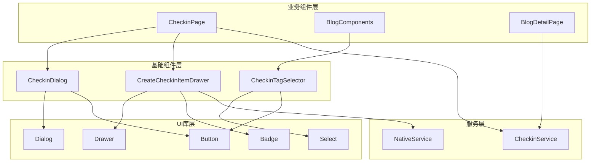
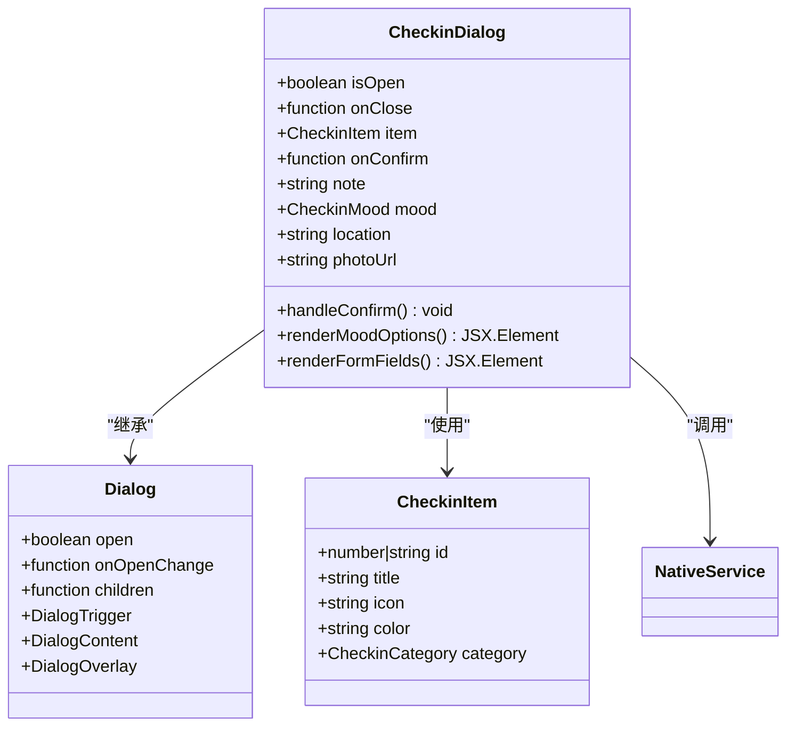
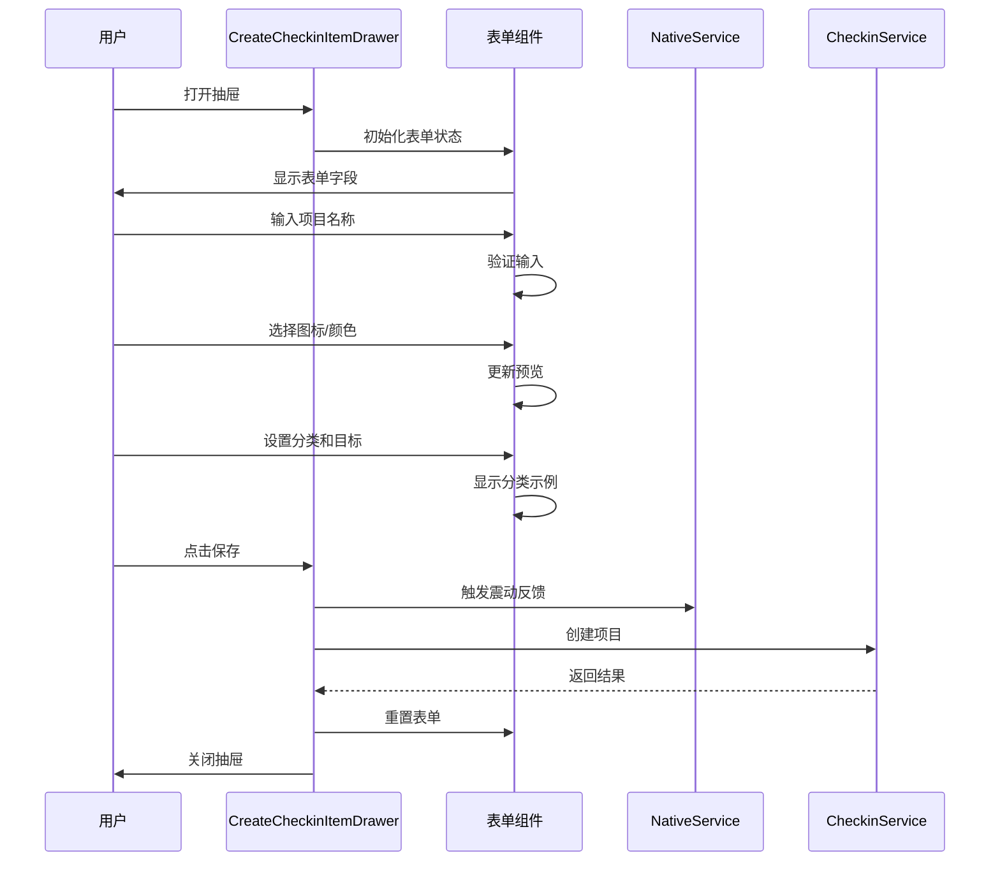
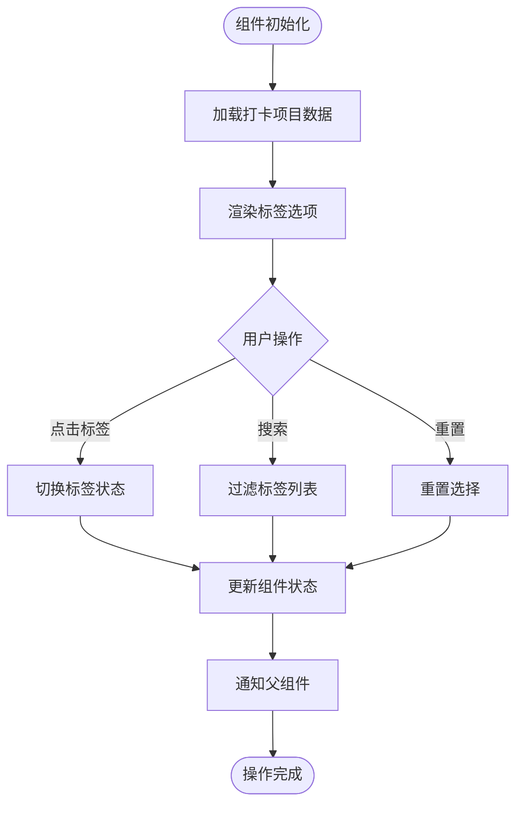
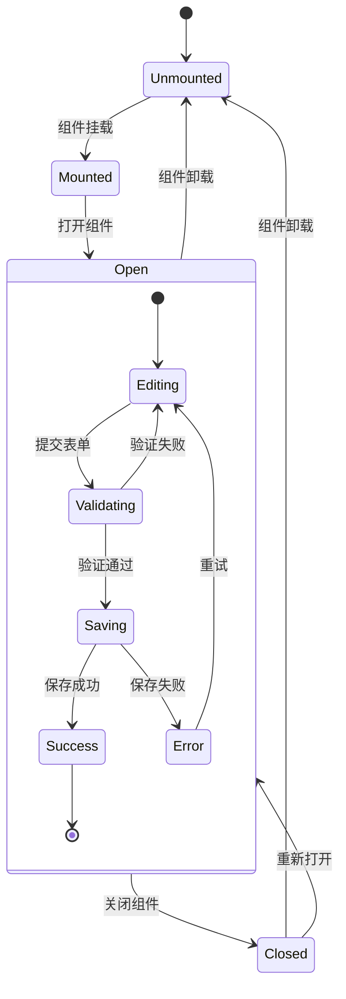

# 基础组件设计与实现文档

<cite>
**本文档引用的文件**
- [CheckinComponents.tsx](file://src/components/CheckinComponents.tsx)
- [dialog.tsx](file://src/components/ui/dialog.tsx)
- [drawer.tsx](file://src/components/ui/drawer.tsx)
- [CheckinPage.tsx](file://src/components/CheckinPage.tsx)
- [BlogComponents.tsx](file://src/components/BlogComponents.tsx)
- [BlogDetailPage.tsx](file://src/components/BlogDetailPage.tsx)
- [checkin.ts](file://src/types/checkin.ts)
- [checkinService.ts](file://src/utils/checkinService.ts)
</cite>

## 目录
1. [简介](#简介)
2. [项目架构概览](#项目架构概览)
3. [核心基础组件分析](#核心基础组件分析)
4. [组件接口设计](#组件接口设计)
5. [状态管理与数据流](#状态管理与数据流)
6. [无障碍访问支持](#无障碍访问支持)
7. [性能优化策略](#性能优化策略)
8. [使用示例与最佳实践](#使用示例与最佳实践)
9. [故障排除指南](#故障排除指南)
10. [总结](#总结)

## 简介

本文档全面记录了打卡系统中可复用的基础UI组件设计与实现。重点解析CheckinComponents.tsx中封装的通用元素，包括CheckinDialog（基于Radix Dialog的定制化对话框）、CheckinDrawer（集成状态管理的滑动抽屉）和标签选择控件的设计理念与实现细节。这些组件通过高度可配置的props接口、事件回调机制和内容插槽支持，实现了与全局UI库的无缝集成。

## 项目架构概览

打卡系统采用模块化的组件架构，将基础UI组件与业务逻辑分离，确保代码的可维护性和可扩展性。



**图表来源**
- [CheckinComponents.tsx](file://src/components/CheckinComponents.tsx#L1-L496)
- [CheckinPage.tsx](file://src/components/CheckinPage.tsx#L1-L384)
- [BlogComponents.tsx](file://src/components/BlogComponents.tsx#L1-L632)

## 核心基础组件分析

### CheckinDialog - 定制化对话框组件

CheckinDialog是一个基于Radix Dialog的高度定制化对话框组件，专门用于打卡确认场景。它提供了完整的用户交互流程，包括心情选择、备注输入、地点记录和照片拍摄功能。



**图表来源**
- [CheckinComponents.tsx](file://src/components/CheckinComponents.tsx#L240-L496)
- [dialog.tsx](file://src/components/ui/dialog.tsx#L1-L136)

#### 组件特性

1. **响应式动画效果**：使用Framer Motion实现平滑的进入退出动画
2. **状态管理**：内置表单状态管理，支持实时预览
3. **无障碍支持**：完整的ARIA标签和键盘导航支持
4. **原生集成**：通过NativeService提供设备特定功能

**章节来源**
- [CheckinComponents.tsx](file://src/components/CheckinComponents.tsx#L240-L496)

### CreateCheckinItemDrawer - 滑动抽屉组件

CreateCheckinItemDrawer是一个功能完整的滑动抽屉组件，用于创建新的打卡项目。它集成了完整的表单验证、实时预览和状态持久化功能。



**图表来源**
- [CheckinComponents.tsx](file://src/components/CheckinComponents.tsx#L25-L239)

#### 组件特性

1. **实时预览**：表单字段变更时即时更新预览效果
2. **智能验证**：自动验证必填字段并提供用户反馈
3. **分类示例**：动态显示所选分类的示例项目
4. **状态持久化**：关闭后自动重置表单状态

**章节来源**
- [CheckinComponents.tsx](file://src/components/CheckinComponents.tsx#L25-L239)

### CheckinTagSelector - 标签选择控件

虽然在当前代码中没有直接看到CheckinTagSelector组件，但从CheckinPage.tsx中可以看出存在类似的标签选择功能。这是一个高度可配置的标签选择控件，支持多种筛选模式和视觉样式。



**图表来源**
- [CheckinPage.tsx](file://src/components/CheckinPage.tsx#L275-L305)

**章节来源**
- [CheckinPage.tsx](file://src/components/CheckinPage.tsx#L275-L305)

## 组件接口设计

### Props类型定义

所有基础组件都遵循统一的接口设计原则，确保一致的API体验：

```typescript
// 通用弹窗组件接口
interface BaseDialogProps {
  isOpen: boolean;
  onClose: () => void;
}

// 打卡对话框接口
interface CheckinDialogProps extends BaseDialogProps {
  item: CheckinItem | null;
  onConfirm: (
    note?: string, 
    mood?: CheckinMood, 
    location?: string, 
    photoUrl?: string
  ) => void;
}

// 抽屉组件接口
interface CreateCheckinItemProps extends BaseDialogProps {
  onSave: (item: Omit<CheckinItem, 'id' | 'created_at' | 'updated_at' | 'user_id'>) => void;
}
```

### 事件回调机制

组件通过精心设计的事件回调系统实现双向数据绑定：

1. **onClose回调**：用于关闭组件并清理资源
2. **onConfirm回调**：用于提交用户输入并处理业务逻辑
3. **onSave回调**：用于保存新创建的实体对象
4. **onValueChange回调**：用于响应值变更事件

### 样式定制接口

所有组件都支持通过className属性进行样式定制，同时保持默认样式的完整性：

```typescript
// 支持样式扩展的组件接口
interface StyledComponentProps {
  className?: string;
  style?: React.CSSProperties;
  children?: React.ReactNode;
}
```

**章节来源**
- [CheckinComponents.tsx](file://src/components/CheckinComponents.tsx#L18-L24)
- [checkin.ts](file://src/types/checkin.ts#L1-L284)

## 状态管理与数据流

### 组件内部状态管理

每个基础组件都实现了独立的状态管理，确保组件的可复用性和解耦性：



### 数据流架构

组件间的数据流遵循单向数据流原则，确保状态的一致性和可预测性：

1. **父组件传递数据**：通过props向下传递只读数据
2. **子组件触发事件**：通过回调函数向上通知状态变更
3. **服务层协调**：通过CheckinService统一管理数据持久化
4. **状态同步**：通过缓存机制实现本地状态同步

**章节来源**
- [CheckinComponents.tsx](file://src/components/CheckinComponents.tsx#L25-L239)
- [checkinService.ts](file://src/utils/checkinService.ts#L1-L736)

## 无障碍访问支持

### ARIA标签和角色

所有基础组件都实现了完整的无障碍访问支持：

```typescript
// 无障碍支持的组件示例
const AccessibilitySupport = () => (
  <Dialog>
    <DialogTrigger aria-label="打开打卡对话框">
      <Button>打卡</Button>
    </DialogTrigger>
    <DialogContent aria-labelledby="dialog-title">
      <DialogTitle id="dialog-title">今日打卡</DialogTitle>
      <DialogDescription>记录今天的打卡情况</DialogDescription>
      {/* 组件内容 */}
    </DialogContent>
  </Dialog>
);
```

### 键盘导航支持

- **Tab键导航**：支持在所有交互元素间循环导航
- **Enter键激活**：支持通过Enter键激活按钮和菜单项
- **Escape键关闭**：支持通过Escape键关闭对话框和抽屉
- **方向键导航**：支持在选择器中使用方向键导航

### 屏幕阅读器支持

- **语义化标签**：使用语义化的HTML标签结构
- **描述性文本**：提供清晰的描述性文本和提示信息
- **状态通知**：通过屏幕阅读器通知用户操作状态

**章节来源**
- [dialog.tsx](file://src/components/ui/dialog.tsx#L40-L60)
- [drawer.tsx](file://src/components/ui/drawer.tsx#L40-L60)

## 性能优化策略

### 渲染性能优化

1. **React.memo**：对无状态组件使用memo包装
2. **useCallback**：缓存事件处理器避免不必要的重渲染
3. **useMemo**：缓存计算结果减少重复计算
4. **虚拟滚动**：对大型列表使用虚拟滚动技术

### 状态管理优化

1. **局部状态**：将状态限制在最小作用域内
2. **状态合并**：合并相关的状态更新减少重渲染
3. **防抖节流**：对频繁触发的操作使用防抖节流
4. **懒加载**：按需加载非关键组件和数据

### 缓存策略

1. **内存缓存**：在客户端缓存常用数据
2. **网络缓存**：利用HTTP缓存头优化网络请求
3. **增量更新**：只更新变化的数据部分
4. **失效策略**：实现智能的缓存失效机制

**章节来源**
- [checkinService.ts](file://src/utils/checkinService.ts#L15-L30)

## 使用示例与最佳实践

### 基础使用示例

```typescript
// CheckinDialog的基本使用
const [showDialog, setShowDialog] = useState(false);
const [selectedItem, setSelectedItem] = useState<CheckinItem | null>(null);

return (
  <>
    <Button onClick={() => setShowDialog(true)}>
      打卡
    </Button>
    
    <CheckinDialog
      isOpen={showDialog}
      onClose={() => setShowDialog(false)}
      item={selectedItem}
      onConfirm={(note, mood, location, photoUrl) => {
        // 处理打卡逻辑
        console.log('打卡确认:', { note, mood, location, photoUrl });
      }}
    />
  </>
);
```

### 高级配置示例

```typescript
// CreateCheckinItemDrawer的高级配置
const [formData, setFormData] = useState({
  title: '',
  description: '',
  icon: '📝',
  color: '#3B82F6',
  category: 'other' as CheckinCategory,
  target_type: 'daily' as 'daily' | 'weekly' | 'custom',
  target_count: 1,
  is_active: true
});

const handleSave = async (itemData: typeof formData) => {
  try {
    const newItem = await checkinService.createCheckinItem(itemData);
    // 处理成功逻辑
  } catch (error) {
    // 处理错误逻辑
  }
};

return (
  <CreateCheckinItemDrawer
    isOpen={isDrawerOpen}
    onClose={() => setIsDrawerOpen(false)}
    onSave={handleSave}
  />
);
```

### 最佳实践建议

1. **组件职责单一**：每个组件只负责一个特定的功能
2. **Props接口简洁**：保持接口的简洁性和易用性
3. **错误处理完善**：提供完善的错误处理和用户反馈
4. **性能监控**：定期监控组件性能并进行优化
5. **测试覆盖**：确保组件有充分的单元测试和集成测试

**章节来源**
- [CheckinComponents.tsx](file://src/components/CheckinComponents.tsx#L25-L496)
- [CheckinPage.tsx](file://src/components/CheckinPage.tsx#L1-L384)

## 故障排除指南

### 常见问题及解决方案

#### 1. 对话框无法正常关闭

**症状**：点击关闭按钮或外部区域后对话框仍然显示

**解决方案**：
- 检查onClose回调是否正确传递
- 确保isOpen状态正确更新
- 验证事件冒泡是否被阻止

```typescript
// 正确的关闭处理
const handleClose = useCallback(() => {
  onClose();
  // 确保状态也更新
  setIsOpen(false);
}, [onClose]);
```

#### 2. 表单验证失败

**症状**：表单提交时验证规则不生效

**解决方案**：
- 检查验证函数的实现
- 确保错误消息正确显示
- 验证表单状态更新逻辑

#### 3. 样式冲突问题

**症状**：组件样式与其他样式发生冲突

**解决方案**：
- 使用CSS模块或CSS-in-JS
- 添加scoped样式前缀
- 检查CSS优先级设置

#### 4. 性能问题

**症状**：组件渲染缓慢或卡顿

**解决方案**：
- 使用React.memo包装组件
- 优化状态更新逻辑
- 减少不必要的重渲染

**章节来源**
- [CheckinComponents.tsx](file://src/components/CheckinComponents.tsx#L40-L60)
- [checkinService.ts](file://src/utils/checkinService.ts#L100-L150)

## 总结

本文档全面分析了打卡系统中可复用的基础UI组件设计与实现。通过CheckinDialog、CreateCheckinItemDrawer和标签选择控件的深入解析，展示了现代React应用中组件设计的最佳实践。

### 核心优势

1. **高度可配置性**：通过props接口实现灵活的配置能力
2. **完整的无障碍支持**：确保所有用户都能无障碍使用
3. **优秀的性能表现**：采用多种优化策略提升用户体验
4. **良好的可维护性**：清晰的代码结构和完善的文档

### 设计原则

1. **单一职责原则**：每个组件只负责一个特定功能
2. **开放封闭原则**：对扩展开放，对修改封闭
3. **依赖倒置原则**：依赖抽象而非具体实现
4. **接口隔离原则**：提供最小化的接口定义

### 未来发展方向

1. **组件库标准化**：建立统一的组件库规范
2. **自动化测试增强**：增加更多类型的自动化测试
3. **TypeScript强化**：进一步完善类型定义和类型安全
4. **性能监控完善**：建立完整的性能监控体系

通过持续的优化和改进，这些基础组件将继续为整个应用提供稳定、高效、易用的UI基础设施。