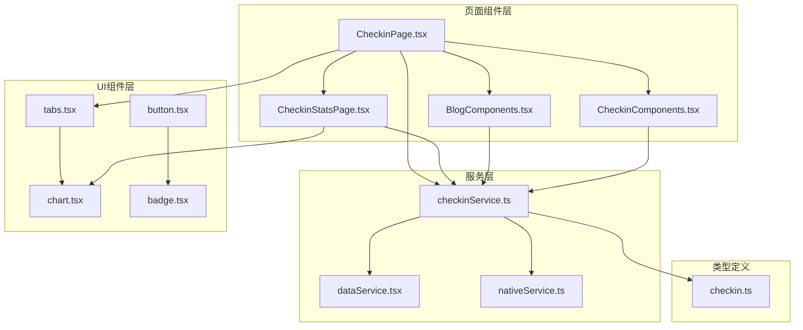
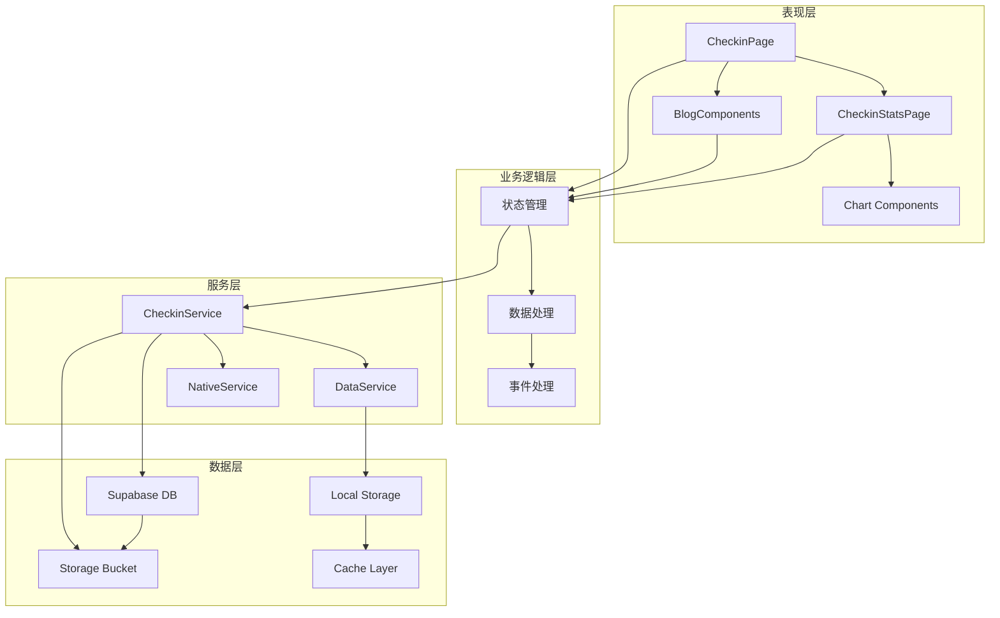
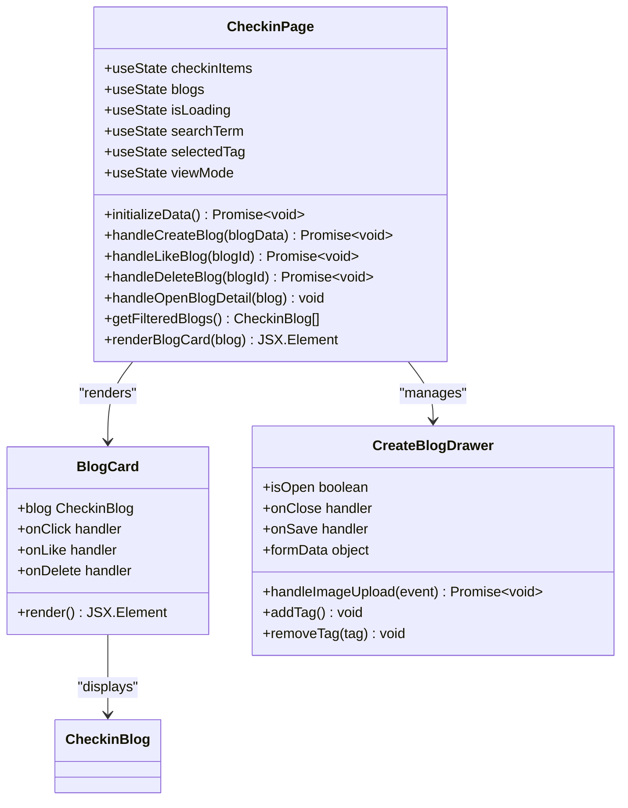
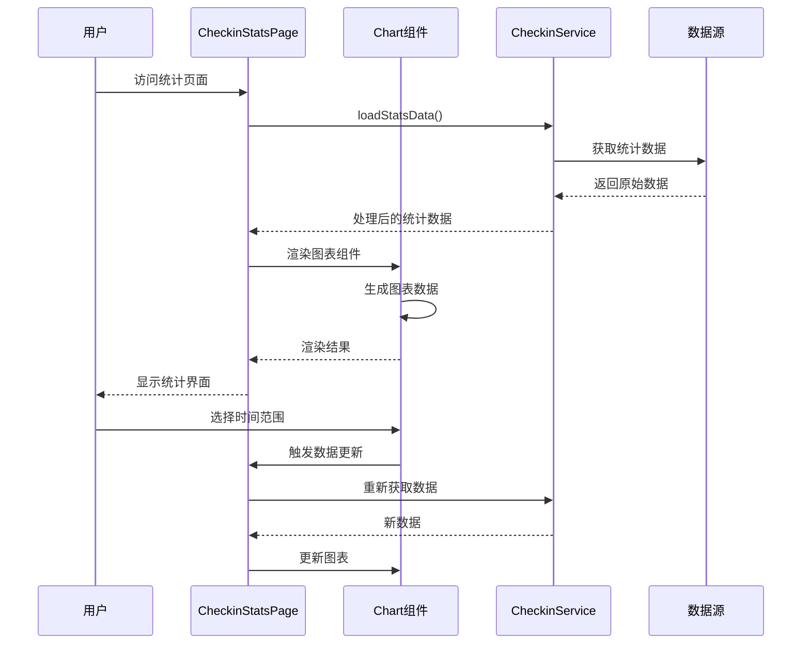
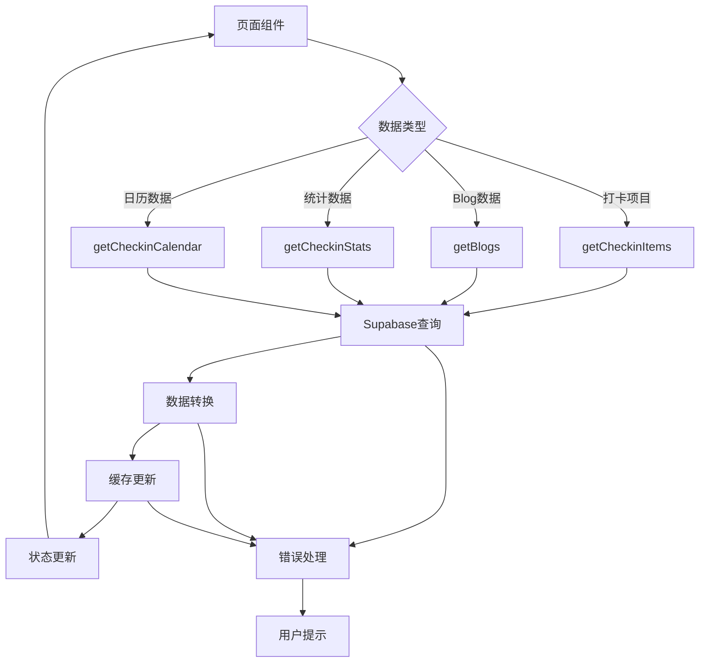
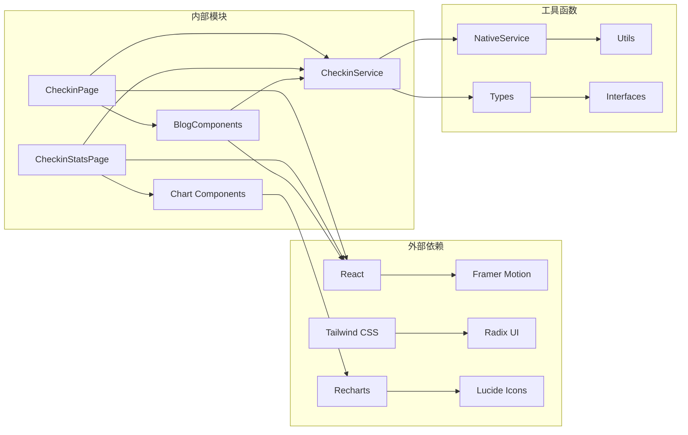

# 页面组件

<cite>
**本文档引用的文件**
- [CheckinPage.tsx](file://src/components/CheckinPage.tsx)
- [CheckinStatsPage.tsx](file://src/components/CheckinStatsPage.tsx)
- [checkinService.ts](file://src/utils/checkinService.ts)
- [dataService.tsx](file://src/utils/dataService.tsx)
- [chart.tsx](file://src/components/ui/chart.tsx)
- [tabs.tsx](file://src/components/ui/tabs.tsx)
- [checkin.ts](file://src/types/checkin.ts)
- [BlogComponents.tsx](file://src/components/BlogComponents.tsx)
- [index.css](file://src/index.css)
</cite>

## 目录
1. [简介](#简介)
2. [项目结构](#项目结构)
3. [核心组件](#核心组件)
4. [架构概览](#架构概览)
5. [详细组件分析](#详细组件分析)
6. [依赖关系分析](#依赖关系分析)
7. [性能考虑](#性能考虑)
8. [故障排除指南](#故障排除指南)
9. [结论](#结论)

## 简介

本文档深入分析了打卡系统的核心页面组件实现，重点关注CheckinPage.tsx和CheckinStatsPage.tsx两个主要页面组件。这些组件构成了用户与打卡功能交互的主要界面，提供了完整的打卡体验，包括打卡项目管理、Blog创作、数据统计和可视化展示等功能。

系统采用React + TypeScript技术栈，结合Tailwind CSS进行样式设计，使用Radix UI和Recharts等现代化组件库来构建用户界面。通过精心设计的状态管理和数据流，确保了良好的用户体验和高效的性能表现。

## 项目结构

打卡系统的页面组件位于`src/components/`目录下，主要包含以下关键文件：



**图表来源**
- [CheckinPage.tsx](file://src/components/CheckinPage.tsx#L1-L385)
- [CheckinStatsPage.tsx](file://src/components/CheckinStatsPage.tsx#L1-L554)
- [checkinService.ts](file://src/utils/checkinService.ts#L1-L736)

**章节来源**
- [CheckinPage.tsx](file://src/components/CheckinPage.tsx#L1-L50)
- [CheckinStatsPage.tsx](file://src/components/CheckinStatsPage.tsx#L1-L50)

## 核心组件

### CheckinPage.tsx - 打卡主页面

CheckinPage.tsx是整个打卡系统的核心入口页面，负责展示用户的Blog列表、提供创建Blog的功能，以及管理各种交互操作。

#### 主要特性：
- **响应式布局**：支持网格和列表两种视图模式
- **智能搜索和筛选**：基于标题、内容和标签的全文搜索
- **实时状态管理**：使用React Hooks进行状态同步
- **动画效果**：利用Framer Motion实现流畅的过渡动画
- **错误处理**：完善的异常捕获和用户反馈机制

#### 核心状态管理：
```typescript
// 主要状态变量
const [checkinItems, setCheckinItems] = useState<CheckinItem[]>([]);
const [blogs, setBlogs] = useState<CheckinBlog[]>([]);
const [isLoading, setIsLoading] = useState(true);
const [searchTerm, setSearchTerm] = useState("");
const [selectedTag, setSelectedTag] = useState<string>("all");
const [viewMode, setViewMode] = useState<'grid' | 'list'>('grid');
```

### CheckinStatsPage.tsx - 数据统计页面

CheckinStatsPage.tsx专注于数据可视化和统计分析，为用户提供全面的打卡数据分析和趋势洞察。

#### 主要特性：
- **多维度统计**：包括完成率、连续天数、分类分布等指标
- **交互式图表**：使用Recharts构建动态图表
- **时间范围选择**：支持周、月、年的数据对比
- **热力图展示**：直观的打卡日历热力图
- **成就系统**：基于用户行为的成就徽章展示

**章节来源**
- [CheckinPage.tsx](file://src/components/CheckinPage.tsx#L25-L100)
- [CheckinStatsPage.tsx](file://src/components/CheckinStatsPage.tsx#L30-L120)

## 架构概览

系统采用分层架构设计，清晰分离了表现层、业务逻辑层和服务层：



**图表来源**
- [CheckinPage.tsx](file://src/components/CheckinPage.tsx#L1-L20)
- [CheckinStatsPage.tsx](file://src/components/CheckinStatsPage.tsx#L1-L20)
- [checkinService.ts](file://src/utils/checkinService.ts#L1-L50)

## 详细组件分析

### CheckinPage.tsx 详细分析

#### 页面结构设计

CheckinPage采用了简洁而功能丰富的页面结构：



**图表来源**
- [CheckinPage.tsx](file://src/components/CheckinPage.tsx#L25-L100)
- [BlogComponents.tsx](file://src/components/BlogComponents.tsx#L40-L120)

#### 状态管理机制

CheckinPage实现了复杂的状态管理逻辑，包括：

1. **异步数据加载**：使用Promise.allSettled并行加载多个数据源
2. **错误边界处理**：对每个数据源独立处理错误，避免单点故障
3. **状态同步**：实时更新本地状态以提升用户体验
4. **依赖控制**：精确控制useEffect的依赖数组

```typescript
const initializeData = async () => {
  try {
    await checkinService.initialize();
    setIsLoading(false);
    
    const [itemsData, blogsData] = await Promise.allSettled([
      checkinService.getCheckinItems(),
      checkinService.getBlogs()
    ]);

    if (itemsData.status === 'fulfilled') {
      setCheckinItems(itemsData.value);
    }
    if (blogsData.status === 'fulfilled') {
      setBlogs(blogsData.value);
    }
  } catch (error) {
    console.error('Error loading checkin data:', error);
  }
};
```

#### 用户交互事件处理

系统实现了多种用户交互事件：

1. **点击打卡**：触发checkinService的创建记录功能
2. **长按编辑**：提供Blog编辑功能的占位实现
3. **点赞操作**：实时更新点赞数并同步到服务器
4. **删除操作**：安全删除Blog并更新本地状态
5. **搜索过滤**：实时搜索和标签筛选

**章节来源**
- [CheckinPage.tsx](file://src/components/CheckinPage.tsx#L45-L150)

### CheckinStatsPage.tsx 详细分析

#### 数据可视化实现

CheckinStatsPage使用Radix UI图表组件构建了丰富的数据可视化：



**图表来源**
- [CheckinStatsPage.tsx](file://src/components/CheckinStatsPage.tsx#L40-L80)
- [chart.tsx](file://src/components/ui/chart.tsx#L1-L50)

#### 技术细节

1. **趋势折线图**：使用AreaChart展示打卡趋势
2. **分布饼图**：使用PieChart展示分类分布
3. **日历热力图**：使用网格布局展示打卡密度
4. **动态更新**：基于时间范围的实时数据刷新

#### 数据聚合和格式化

系统实现了复杂的数据聚合逻辑：

```typescript
const generateTrendData = () => {
  const now = new Date();
  const days = timeRange === 'week' ? 7 : timeRange === 'month' ? 30 : 365;
  
  const data = Array.from({ length: days }, (_, i) => {
    const date = new Date(now);
    date.setDate(date.getDate() - (days - 1 - i));
    
    const dayOfWeek = date.getDay();
    const isWeekend = dayOfWeek === 0 || dayOfWeek === 6;
    const baseCount = isWeekend ? 2 : 4;
    const randomVariation = Math.floor(Math.random() * 3);
    
    return {
      date: date.toISOString().split('T')[0],
      day: date.toLocaleDateString('zh-CN', { weekday: 'short' }),
      count: Math.max(0, baseCount + randomVariation - 1),
      completion: Math.min(100, (baseCount + randomVariation) * 25)
    };
  });
  
  setTrendData(data);
};
```

**章节来源**
- [CheckinStatsPage.tsx](file://src/components/CheckinStatsPage.tsx#L80-L200)

### 与服务层的交互流程

#### CheckinService集成

CheckinPage和CheckinStatsPage都通过checkinService与后端服务进行交互：



**图表来源**
- [checkinService.ts](file://src/utils/checkinService.ts#L30-L100)
- [CheckinPage.tsx](file://src/components/CheckinPage.tsx#L45-L80)

#### 数据流管理

系统实现了完整的数据流管理机制：

1. **数据获取**：从Supabase数据库获取原始数据
2. **数据转换**：将数据库格式转换为前端可用格式
3. **数据缓存**：使用内存缓存提升性能
4. **状态同步**：实时更新组件状态
5. **错误恢复**：提供降级方案和用户反馈

**章节来源**
- [checkinService.ts](file://src/utils/checkinService.ts#L50-L150)

## 依赖关系分析

### 组件间依赖关系



**图表来源**
- [CheckinPage.tsx](file://src/components/CheckinPage.tsx#L1-L20)
- [CheckinStatsPage.tsx](file://src/components/CheckinStatsPage.tsx#L1-L20)

### 第三方库集成

系统集成了多个现代化的第三方库：

1. **React生态系统**：React 18 + TypeScript
2. **UI组件库**：Radix UI用于基础组件
3. **图表库**：Recharts用于数据可视化
4. **动画库**：Framer Motion用于动画效果
5. **图标库**：Lucide React提供高质量图标
6. **CSS框架**：Tailwind CSS实现响应式设计

**章节来源**
- [CheckinPage.tsx](file://src/components/CheckinPage.tsx#L1-L20)
- [CheckinStatsPage.tsx](file://src/components/CheckinStatsPage.tsx#L1-L20)

## 性能考虑

### 页面生命周期管理

系统实现了高效的页面生命周期管理：

1. **懒加载**：使用React.lazy和Suspense实现组件懒加载
2. **虚拟滚动**：对于大量数据的列表使用虚拟滚动
3. **防抖加载**：搜索和筛选操作使用防抖技术
4. **缓存策略**：智能缓存减少网络请求

### 性能优化技巧

1. **并发数据加载**：使用Promise.allSettled并行加载数据
2. **增量更新**：只更新发生变化的部分DOM
3. **记忆化**：使用useMemo和useCallback优化性能
4. **代码分割**：按路由拆分代码包

### 渲染性能优化

```typescript
// 防抖搜索示例
const debouncedSearch = useCallback(
  debounce((term: string) => {
    setSearchTerm(term);
  }, 300),
  []
);

// 虚拟滚动实现
const renderBlogCard = useCallback((blog: CheckinBlog) => {
  return (
    <motion.div
      key={blog.id}
      layout
      initial={{ opacity: 0, scale: 0.9 }}
      animate={{ opacity: 1, scale: 1 }}
      exit={{ opacity: 0, scale: 0.9 }}
      className="bg-white rounded-xl border border-gray-100 shadow-sm hover:shadow-md transition-all duration-200 cursor-pointer overflow-hidden"
    >
      {/* 卡片内容 */}
    </motion.div>
  );
}, []);
```

## 故障排除指南

### 常见渲染问题

1. **数据加载失败**
   - 检查网络连接状态
   - 验证Supabase配置
   - 查看浏览器控制台错误信息

2. **状态不同步**
   - 确认useEffect依赖数组正确
   - 检查异步操作的错误处理
   - 验证状态更新函数的调用时机

3. **性能问题**
   - 使用React DevTools分析组件渲染
   - 检查是否存在不必要的重新渲染
   - 优化大型列表的渲染性能

### 错误处理机制

系统实现了完善的错误处理机制：

```typescript
// 错误边界示例
const handleCreateBlog = async (blogData: any) => {
  try {
    const processedBlogData = {
      ...blogData,
      tags: blogData.tags || [],
      checkin_records: blogData.checkin_records || []
    };
    
    const newBlog = await checkinService.createBlog(processedBlogData);
    setBlogs(prev => [newBlog, ...prev]);
    
    await NativeService.showToast('发布成功！');
  } catch (error) {
    console.error('Failed to create blog:', error);
    await NativeService.showToast('发布失败，请重试');
  }
};
```

**章节来源**
- [CheckinPage.tsx](file://src/components/CheckinPage.tsx#L80-L120)

## 结论

打卡系统的页面组件展现了现代React应用的最佳实践，通过精心设计的架构和组件结构，实现了功能丰富、性能优异的用户体验。主要优势包括：

1. **模块化设计**：清晰的组件分离和职责划分
2. **状态管理**：高效的状态管理和数据流
3. **性能优化**：多层次的性能优化策略
4. **错误处理**：完善的错误处理和用户反馈机制
5. **可扩展性**：良好的架构设计便于功能扩展

这些组件不仅满足了当前的功能需求，也为未来的功能扩展和维护奠定了坚实的基础。通过持续的优化和改进，系统能够为用户提供更加流畅和愉悦的打卡体验。