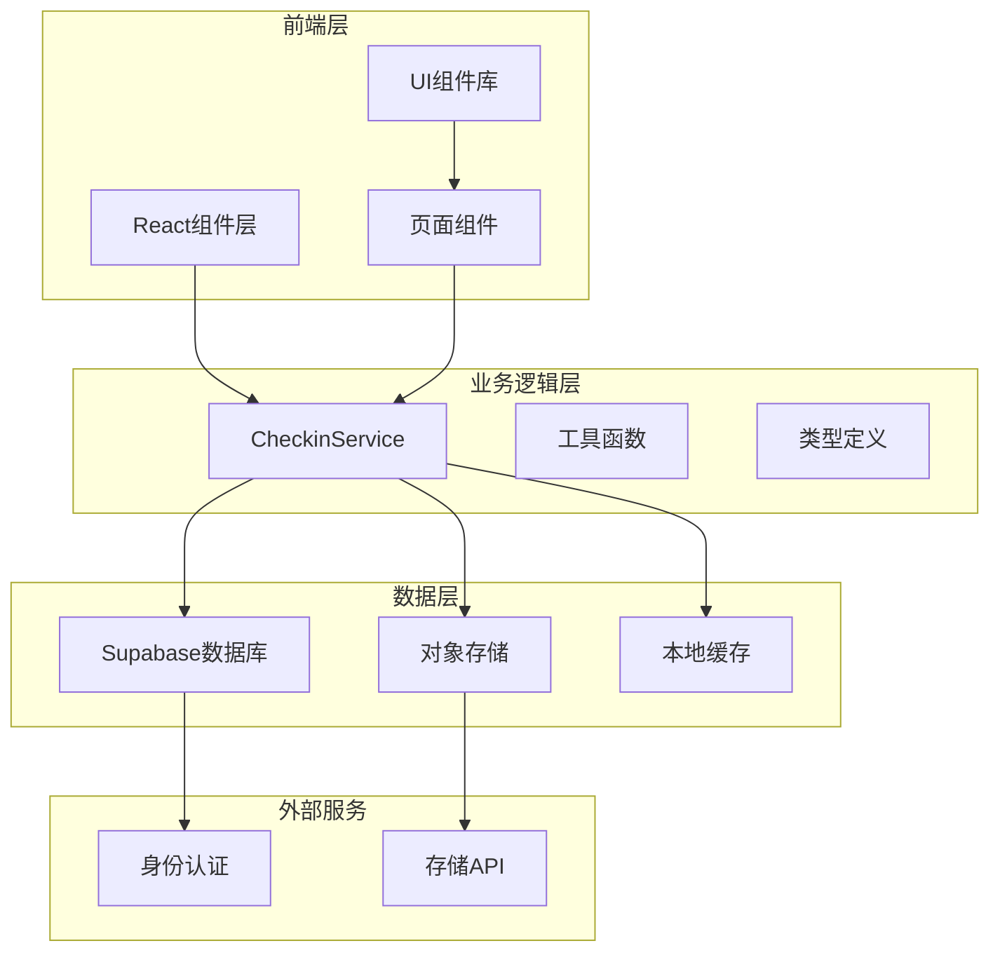
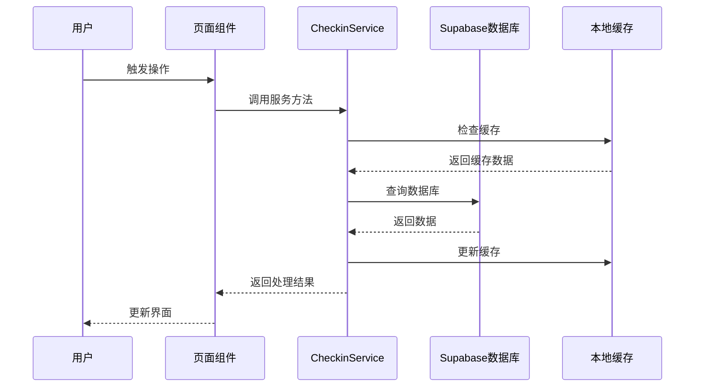
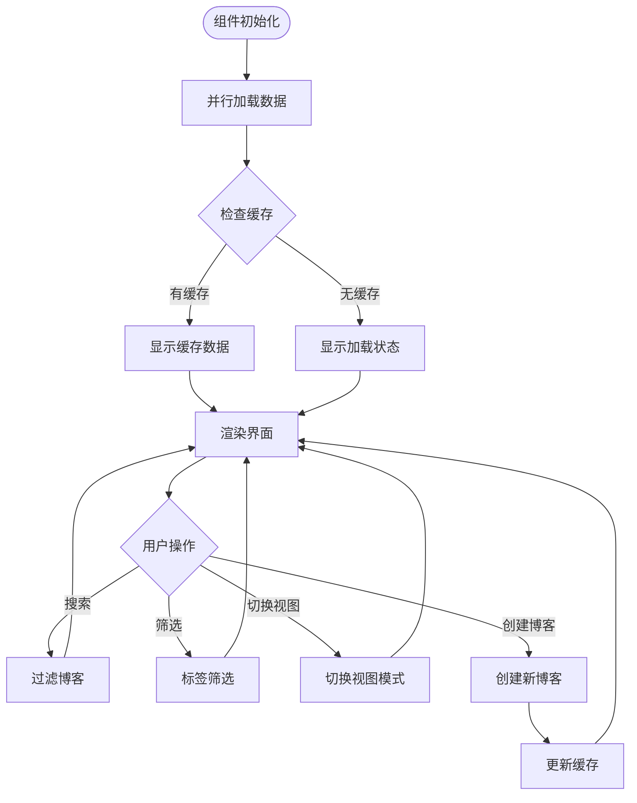
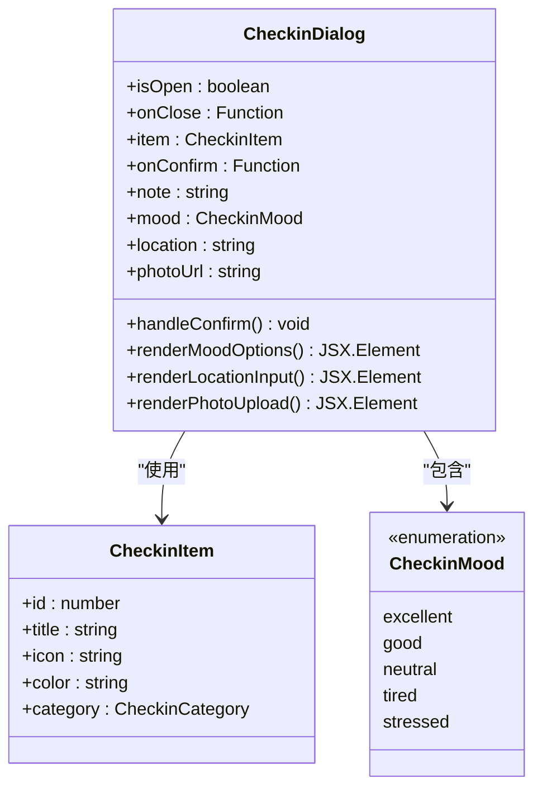
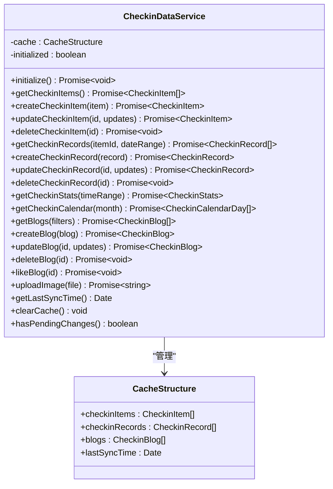
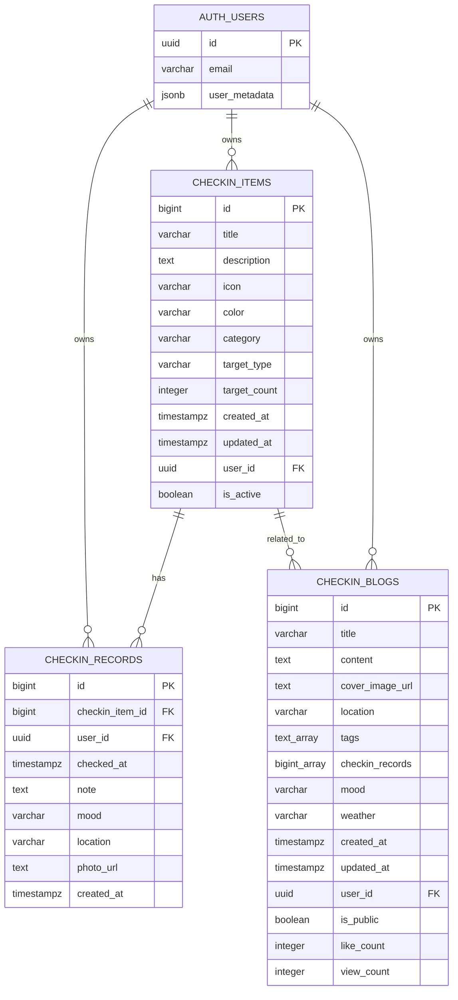
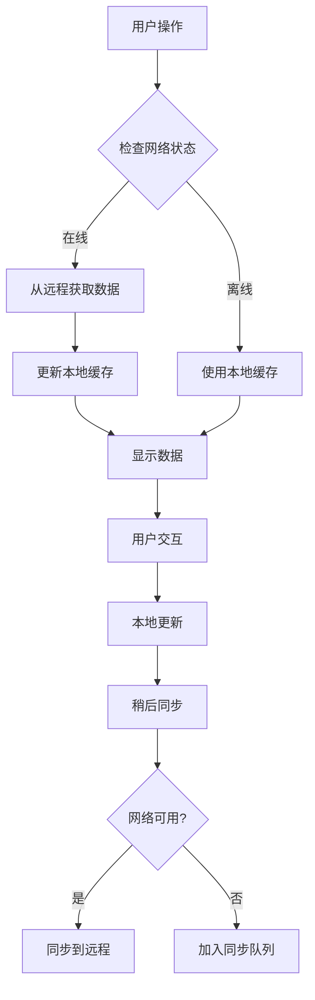

# 打卡系统架构设计文档

<cite>
**本文档引用的文件**
- [src/types/checkin.ts](file://src/types/checkin.ts)
- [src/utils/checkinService.ts](file://src/utils/checkinService.ts)
- [src/components/CheckinPage.tsx](file://src/components/CheckinPage.tsx)
- [src/components/CheckinStatsPage.tsx](file://src/components/CheckinStatsPage.tsx)
- [src/components/CheckinComponents.tsx](file://src/components/CheckinComponents.tsx)
- [src/utils/supabase/client.ts](file://src/utils/supabase/client.ts)
- [src/utils/supabase/info.tsx](file://src/utils/supabase/info.tsx)
- [supabase_checkin_tables.sql](file://supabase_checkin_tables.sql)
- [src/utils/dataService.tsx](file://src/utils/dataService.tsx)
</cite>

## 目录
1. [系统概述](#系统概述)
2. [核心数据模型](#核心数据模型)
3. [架构设计](#架构设计)
4. [核心组件分析](#核心组件分析)
5. [服务层设计](#服务层设计)
6. [数据库设计](#数据库设计)
7. [性能优化策略](#性能优化策略)
8. [故障排查指南](#故障排查指南)
9. [总结与建议](#总结与建议)

## 系统概述

打卡系统是一个综合性的习惯养成平台，集成了打卡记录、数据分析、博客分享等功能模块。系统采用React前端框架配合Supabase后端服务，实现了完整的离线优先、实时同步的用户体验。

### 核心功能模块

- **打卡项目管理**：创建、编辑、删除个性化打卡项目
- **打卡记录追踪**：记录每日打卡行为，支持备注、心情、位置、照片等丰富信息
- **统计分析**：提供多维度的数据可视化和趋势分析
- **博客分享**：将打卡经历转化为文字记录，支持标签分类和公开设置
- **成就系统**：通过徽章激励用户持续使用

## 核心数据模型

### CheckinItem - 打卡项目

```typescript
interface CheckinItem {
  id: number | string;
  title: string;                    // 打卡项目名称
  description?: string;             // 描述
  icon: string;                     // 图标emoji
  color: string;                    // 主题颜色
  category: CheckinCategory;        // 分类
  target_type: 'daily' | 'weekly' | 'custom'; // 目标类型
  target_count: number;             // 目标次数
  created_at: Date;
  updated_at: Date;
  user_id: string;
  is_active: boolean;               // 是否激活
}
```

### CheckinRecord - 打卡记录

```typescript
interface CheckinRecord {
  id: number | string;
  checkin_item_id: number | string;
  user_id: string;
  checked_at: Date;                 // 打卡时间
  note?: string;                    // 打卡备注
  mood?: CheckinMood;               // 心情状态
  location?: string;                // 地点
  photo_url?: string;               // 照片URL
  created_at: Date;
}
```

### CheckinBlog - 博客文章

```typescript
interface CheckinBlog {
  id: number | string;
  title: string;                    // 标题
  content: string;                  // 内容（支持markdown）
  cover_image_url?: string;         // 首图URL
  location?: string;                // 地点
  tags: string[];                   // 标签
  checkin_records: number[];        // 关联的打卡记录ID
  mood: CheckinMood;                // 当时心情
  weather?: string;                 // 天气
  created_at: Date;
  updated_at: Date;
  user_id: string;
  is_public: boolean;               // 是否公开
  like_count: number;               // 点赞数
  view_count: number;               // 浏览数
}
```

**章节来源**
- [src/types/checkin.ts](file://src/types/checkin.ts#L1-L284)

## 架构设计

### 整体架构图



**图表来源**
- [src/utils/checkinService.ts](file://src/utils/checkinService.ts#L1-L50)
- [src/utils/supabase/client.ts](file://src/utils/supabase/client.ts#L1-L12)

### 数据流架构



**图表来源**
- [src/utils/checkinService.ts](file://src/utils/checkinService.ts#L43-L90)
- [src/components/CheckinPage.tsx](file://src/components/CheckinPage.tsx#L40-L80)

## 核心组件分析

### CheckinPage.tsx - 打卡主页

CheckinPage是整个打卡功能的核心入口，负责展示用户的打卡项目和博客文章。

#### 主要功能特性

1. **并行数据加载**：同时加载打卡项目和博客数据，提升用户体验
2. **智能缓存策略**：优先显示缓存数据，后台异步更新
3. **丰富的交互体验**：支持网格/列表视图切换、搜索过滤、动画效果
4. **集成博客功能**：直接展示关联的打卡博客

#### 核心代码实现

```typescript
// 并行数据加载
const [itemsData, blogsData] = await Promise.allSettled([
  checkinService.getCheckinItems(),
  checkinService.getBlogs()
]);

// 智能缓存更新
if (itemsData.status === 'fulfilled') {
  setCheckinItems(itemsData.value);
}
if (blogsData.status === 'fulfilled') {
  setBlogs(blogsData.value);
}
```

#### 界面渲染流程



**图表来源**
- [src/components/CheckinPage.tsx](file://src/components/CheckinPage.tsx#L40-L80)
- [src/components/CheckinPage.tsx](file://src/components/CheckinPage.tsx#L100-L150)

**章节来源**
- [src/components/CheckinPage.tsx](file://src/components/CheckinPage.tsx#L1-L385)

### CheckinStatsPage.tsx - 统计分析页

CheckinStatsPage提供了全面的数据可视化和统计分析功能。

#### 统计指标体系

系统提供以下核心统计指标：

- **基础统计**：总项目数、活跃项目数、总打卡次数、今日打卡数
- **时间维度**：本周完成、本月完成、连续打卡天数、最长连续天数
- **质量指标**：完成率、心情分布、分类分布
- **成就系统**：首次打卡、连续打卡、完美月份、博客达人等成就

#### 数据可视化组件

1. **趋势图表**：使用AreaChart展示历史打卡趋势
2. **分类分布**：使用进度条展示各类别打卡占比
3. **心情分布**：使用表情符号和进度条展示心情统计
4. **日历热力图**：直观展示每日打卡完成情况

#### 核心统计算法

```typescript
// 连续打卡天数计算
export const getStreakDays = (records: CheckinRecord[]): number => {
  if (records.length === 0) return 0;
  
  const today = new Date();
  let streak = 0;
  let currentDate = new Date(today);
  
  while (true) {
    const dateStr = currentDate.toISOString().split('T')[0];
    const hasRecord = records.some(record => 
      record.checked_at.toISOString().split('T')[0] === dateStr
    );
    
    if (hasRecord) {
      streak++;
      currentDate.setDate(currentDate.getDate() - 1);
    } else {
      break;
    }
  }
  
  return streak;
};

// 完成率计算
export const getCompletionRate = (items: CheckinItem[], records: CheckinRecord[], timeRange: { start: Date; end: Date }): number => {
  if (items.length === 0) return 0;
  
  const totalTargets = items.reduce((sum, item) => {
    const days = Math.ceil((timeRange.end.getTime() - timeRange.start.getTime()) / (1000 * 60 * 60 * 24));
    return sum + (item.target_type === 'daily' ? days * item.target_count : item.target_count);
  }, 0);
  
  const completedCount = records.filter(record => 
    record.checked_at >= timeRange.start && record.checked_at <= timeRange.end
  ).length;
  
  return totalTargets > 0 ? Math.round((completedCount / totalTargets) * 100) : 0;
};
```

**章节来源**
- [src/components/CheckinStatsPage.tsx](file://src/components/CheckinStatsPage.tsx#L1-L554)
- [src/types/checkin.ts](file://src/types/checkin.ts#L250-L284)

### CheckinComponents.tsx - 可复用UI组件

CheckinComponents提供了多个可复用的UI组件，支持完整的打卡功能交互。

#### CreateCheckinItemDrawer - 创建打卡项目抽屉

这是一个完整的抽屉式表单组件，支持：

- **基本信息输入**：项目名称、描述
- **视觉定制**：图标选择、颜色主题
- **分类设置**：预设分类选项和示例
- **目标配置**：频率设置和目标次数
- **实时预览**：即时查看项目效果

#### CheckinDialog - 打卡确认对话框



**图表来源**
- [src/components/CheckinComponents.tsx](file://src/components/CheckinComponents.tsx#L250-L496)

**章节来源**
- [src/components/CheckinComponents.tsx](file://src/components/CheckinComponents.tsx#L1-L496)

## 服务层设计

### CheckinDataService - 核心服务类

CheckinDataService采用了单例模式和智能缓存策略，实现了完整的CRUD操作和离线优先的数据同步机制。

#### 缓存架构设计



**图表来源**
- [src/utils/checkinService.ts](file://src/utils/checkinService.ts#L15-L30)

#### 数据同步机制

服务层实现了多层次的数据同步策略：

1. **即时响应**：优先返回本地缓存数据，确保快速响应
2. **后台更新**：异步从远程数据库获取最新数据
3. **错误恢复**：网络异常时自动使用缓存数据
4. **手动刷新**：支持用户主动刷新数据

#### 图片上传功能

```typescript
async uploadImage(file: File): Promise<string> {
  try {
    const bucketName = 'images';
    
    // 检查存储桶是否存在
    const bucketExists = await this.checkBucketExists(bucketName);
    if (!bucketExists) {
      throw new Error('Storage bucket "images" not found. Please create it manually in Supabase console.');
    }
    
    const fileExt = file.name.split('.').pop();
    const fileName = `${Date.now()}-${Math.random().toString(36).substring(2)}.${fileExt}`;
    const filePath = `checkin-images/${fileName}`;

    const { error: uploadError } = await supabase.storage
      .from(bucketName)
      .upload(filePath, file);

    if (uploadError) {
      console.error('Error uploading image:', uploadError);
      throw uploadError;
    }

    const { data } = supabase.storage
      .from(bucketName)
      .getPublicUrl(filePath);

    return data.publicUrl;
  } catch (error) {
    console.error('Failed to upload image:', error);
    throw error;
  }
}
```

**章节来源**
- [src/utils/checkinService.ts](file://src/utils/checkinService.ts#L1-L760)

## 数据库设计

### 表结构设计



**图表来源**
- [supabase_checkin_tables.sql](file://supabase_checkin_tables.sql#L1-L50)

### 索引优化策略

数据库设计包含了全面的索引优化策略：

1. **主键索引**：所有表都使用BIGSERIAL主键
2. **外键索引**：建立必要的外键索引
3. **查询优化**：针对常用查询条件建立复合索引
4. **全文搜索**：使用GIN索引支持标签数组查询

### 行级安全策略

系统实现了严格的行级安全策略：

- **用户隔离**：每个用户只能访问自己的数据
- **公开策略**：博客支持公开/私有模式
- **权限控制**：精确控制CRUD操作权限

**章节来源**
- [supabase_checkin_tables.sql](file://supabase_checkin_tables.sql#L1-L284)

## 性能优化策略

### 分页加载策略

对于大量打卡记录，系统采用了智能分页加载策略：

1. **虚拟滚动**：对于博客列表，使用虚拟滚动技术
2. **懒加载**：按需加载统计数据和日历数据
3. **缓存策略**：合理设置缓存过期时间
4. **批量查询**：减少数据库连接次数

### 离线优先设计



### 数据压缩与传输优化

- **JSON序列化优化**：使用紧凑的JSON格式
- **二进制数据处理**：图片采用Base64编码传输
- **增量更新**：只传输变更的数据

## 故障排查指南

### 常见问题诊断

#### 打卡状态不同步

**症状**：本地显示已打卡，但服务器数据未更新

**排查步骤**：
1. 检查网络连接状态
2. 验证用户认证状态
3. 查看本地缓存数据
4. 检查数据库同步日志
5. 重置缓存并重新同步

```typescript
// 缓存清理方法
clearCache(): void {
  this.cache = {
    checkinItems: [],
    checkinRecords: [],
    blogs: [],
    lastSyncTime: null
  };
}
```

#### 图片上传失败

**症状**：无法上传打卡照片

**排查步骤**：
1. 检查存储桶配置
2. 验证文件格式和大小限制
3. 确认网络连接稳定
4. 查看存储API响应

#### 数据加载缓慢

**症状**：页面加载时间过长

**优化措施**：
1. 启用并行数据加载
2. 实施智能缓存策略
3. 优化数据库查询
4. 使用CDN加速静态资源

### 调试工具与监控

系统提供了完善的调试和监控机制：

- **控制台日志**：详细的错误日志记录
- **网络监控**：跟踪API请求状态
- **缓存监控**：观察缓存命中率
- **性能指标**：测量关键操作耗时

**章节来源**
- [src/utils/checkinService.ts](file://src/utils/checkinService.ts#L720-L760)

## 总结与建议

### 系统优势

1. **架构清晰**：采用分层架构，职责明确
2. **用户体验优秀**：离线优先，响应迅速
3. **扩展性强**：模块化设计，易于扩展新功能
4. **数据安全**：完善的权限控制和数据保护

### 改进建议

1. **性能优化**：考虑引入GraphQL减少数据传输
2. **功能增强**：添加更多社交互动功能
3. **移动端优化**：针对移动设备进行深度优化
4. **国际化支持**：添加多语言支持

### 最佳实践

1. **数据一致性**：确保本地缓存与远程数据的一致性
2. **错误处理**：完善错误边界和降级策略
3. **测试覆盖**：增加单元测试和集成测试
4. **文档维护**：保持代码注释和文档的及时更新

通过这套完整的打卡系统，用户可以有效地管理个人习惯，获得持续的动力和成就感。系统的模块化设计和良好的扩展性为未来的功能迭代奠定了坚实的基础。