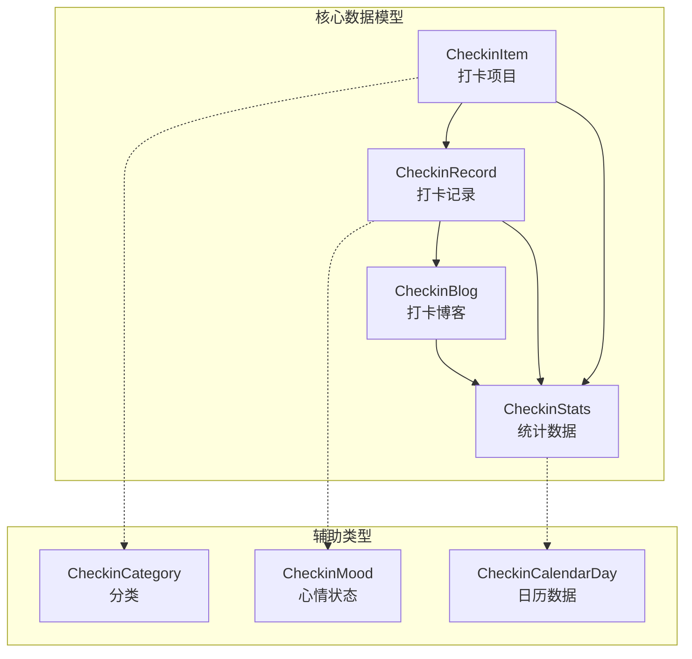
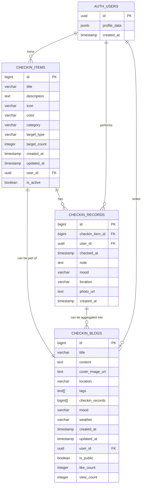

# 打卡系统数据模型文档

<cite>
**本文档中引用的文件**
- [src/types/checkin.ts](file://src/types/checkin.ts)
- [src/utils/checkinService.ts](file://src/utils/checkinService.ts)
- [supabase_checkin_tables.sql](file://supabase_checkin_tables.sql)
- [src/components/CheckinComponents.tsx](file://src/components/CheckinComponents.tsx)
- [src/components/CheckinPage.tsx](file://src/components/CheckinPage.tsx)
</cite>

## 目录
1. [简介](#简介)
2. [核心数据模型概述](#核心数据模型概述)
3. [CheckinItem 数据模型](#checkinitem-数据模型)
4. [CheckinRecord 数据模型](#checkinrecord-数据模型)
5. [CheckinBlog 数据模型](#checkinblog-数据模型)
6. [CheckinStats 数据模型](#checkinstats-数据模型)
7. [数据模型关系图](#数据模型关系图)
8. [服务接口与CRUD操作](#服务接口与crud操作)
9. [数据验证与约束](#数据验证与约束)
10. [前端组件集成](#前端组件集成)
11. [性能优化考虑](#性能优化考虑)
12. [常见问题与解决方案](#常见问题与解决方案)
13. [扩展指南](#扩展指南)

## 简介

打卡系统是一个完整的个人成长追踪平台，通过四个核心数据模型实现了从基础打卡到深度数据分析的完整功能链。本文档详细阐述了CheckinItem、CheckinRecord、CheckinBlog和CheckinStats等接口的结构定义、业务逻辑和实际应用场景。

## 核心数据模型概述

打卡系统采用分层数据架构，每个模型都有明确的职责和业务边界：



**图表来源**
- [src/types/checkin.ts](file://src/types/checkin.ts#L1-L284)

## CheckinItem 数据模型

CheckinItem是打卡系统的核心实体，代表用户创建的打卡项目。每个项目都有明确的目标、分类和个性化配置。

### 字段定义与业务含义

```typescript
export interface CheckinItem {
  id: number | string;                    // 唯一标识符，支持数字和字符串
  title: string;                          // 项目名称，必填字段
  description?: string;                   // 项目描述，可选字段
  icon: string;                           // 图标emoji，表示项目类型
  color: string;                          // 主题颜色，十六进制格式
  category: CheckinCategory;              // 分类，枚举类型
  target_type: 'daily' | 'weekly' | 'custom'; // 目标类型
  target_count: number;                   // 目标次数，必须大于0
  created_at: Date;                       // 创建时间
  updated_at: Date;                       // 更新时间
  user_id: string;                        // 用户ID，外键关联
  is_active: boolean;                     // 是否激活状态
}
```

### 数据类型与约束

- **id**: 支持数字和字符串类型，便于不同数据库的兼容性
- **title**: 长度限制由数据库决定，建议不超过255字符
- **icon**: 使用emoji字符，支持常见的表情符号
- **color**: 十六进制颜色值，确保在UI中正确渲染
- **category**: 枚举类型，确保数据一致性
- **target_type**: 固定三种类型，分别对应不同的目标模式
- **target_count**: 正整数，最小值为1
- **is_active**: 软删除机制，不影响历史数据

### 分类体系

系统提供了八个标准化的分类：

```typescript
export type CheckinCategory = 
  | 'health'      // 健康 - 🏥
  | 'fitness'     // 运动 - 💪
  | 'learning'    // 学习 - 📚
  | 'habit'       // 习惯 - ⭐
  | 'work'        // 工作 - 💼
  | 'hobby'       // 爱好 - 🎨
  | 'social'      // 社交 - 👥
  | 'other';      // 其他 - 📝
```

**章节来源**
- [src/types/checkin.ts](file://src/types/checkin.ts#L5-L18)

## CheckinRecord 数据模型

CheckinRecord记录用户的实际打卡行为，包含时间戳、备注和附加信息。

### 字段定义与业务逻辑

```typescript
export interface CheckinRecord {
  id: number | string;
  checkin_item_id: number | string;       // 关联的打卡项目ID
  user_id: string;                        // 用户ID
  checked_at: Date;                       // 打卡时间，精确到秒
  note?: string;                          // 打卡备注，可选
  mood?: CheckinMood;                     // 心情状态，可选
  location?: string;                      // 地点，可选
  photo_url?: string;                     // 照片URL，可选
  created_at: Date;                       // 记录创建时间
}
```

### 心情状态体系

```typescript
export type CheckinMood = 
  | 'excellent'   // 😄 超棒
  | 'good'        // 😊 不错  
  | 'neutral'     // 😐 一般
  | 'tired'       // 😴 疲惫
  | 'stressed';   // 😰 焦虑
```

### 关联关系

CheckinRecord与CheckinItem之间存在一对一的关系：
- 每条记录必须关联一个有效的CheckinItem
- 通过checkin_item_id建立外键约束
- 支持多对一关系，一个项目可以有多个记录

**章节来源**
- [src/types/checkin.ts](file://src/types/checkin.ts#L20-L32)

## CheckinBlog 数据模型

CheckinBlog是高级功能模块，允许用户将打卡记录整合为带有丰富内容的文章。

### 字段定义与扩展功能

```typescript
export interface CheckinBlog {
  id: number | string;
  title: string;                          // 文章标题
  content: string;                        // Markdown格式的内容
  cover_image_url?: string;               // 封面图片URL
  location?: string;                      // 发布地点
  tags: string[];                         // 标签数组
  checkin_records: number[];              // 关联的打卡记录ID数组
  mood: CheckinMood;                      // 当前心情
  weather?: string;                       // 天气信息
  created_at: Date;                       // 创建时间
  updated_at: Date;                       // 更新时间
  user_id: string;                        // 用户ID
  is_public: boolean;                     // 是否公开
  like_count: number;                     // 点赞数
  view_count: number;                     // 浏览数
}
```

### 博客特性

- **内容富媒体**: 支持Markdown格式，便于编写高质量内容
- **标签系统**: 使用数组存储标签，支持全文搜索优化
- **关联机制**: 通过checkin_records字段关联多个打卡记录
- **社交功能**: 包含点赞和浏览计数，支持社区互动
- **隐私控制**: is_public字段控制内容可见性

### 数据完整性约束

数据库层面设置了严格的约束：
- tags字段使用GIN索引，支持高效的数组查询
- mood字段有枚举验证，确保数据一致性
- like_count和view_count有非负约束

**章节来源**
- [src/types/checkin.ts](file://src/types/checkin.ts#L39-L56)

## CheckinStats 数据模型

CheckinStats提供综合性的数据分析，帮助用户了解自己的打卡习惯和进步情况。

### 字段定义与统计维度

```typescript
export interface CheckinStats {
  total_items: number;                    // 总打卡项目数
  active_items: number;                   // 活跃项目数
  total_records: number;                  // 总打卡次数
  today_records: number;                  // 今日打卡次数
  week_records: number;                   // 本周打卡次数
  month_records: number;                  // 本月打卡次数
  streak_days: number;                    // 连续打卡天数
  longest_streak: number;                 // 最长连续天数
  completion_rate: number;                // 完成率百分比
  favorite_category: CheckinCategory;     // 最喜欢的分类
  total_blogs: number;                    // Blog总数
  mood_distribution: Record<CheckinMood, number>; // 心情分布
  category_distribution: Record<CheckinCategory, number>; // 分类分布
}
```

### 统计算法

系统实现了复杂的统计计算：

```typescript
// 连续天数计算
export const getStreakDays = (records: CheckinRecord[]): number => {
  if (records.length === 0) return 0;
  
  const today = new Date();
  let streak = 0;
  let currentDate = new Date(today);
  
  while (true) {
    const dateStr = currentDate.toISOString().split('T')[0];
    const hasRecord = records.some(record => 
      record.checked_at.toISOString().split('T')[0] === dateStr
    );
    
    if (hasRecord) {
      streak++;
      currentDate.setDate(currentDate.getDate() - 1);
    } else {
      break;
    }
  }
  
  return streak;
};

// 完成率计算
export const getCompletionRate = (
  items: CheckinItem[], 
  records: CheckinRecord[], 
  timeRange: { start: Date; end: Date }
): number => {
  if (items.length === 0) return 0;
  
  const totalTargets = items.reduce((sum, item) => {
    const days = Math.ceil((timeRange.end.getTime() - timeRange.start.getTime()) / (1000 * 60 * 60 * 24));
    return sum + (item.target_type === 'daily' ? days * item.target_count : item.target_count);
  }, 0);
  
  const completedCount = records.filter(record => 
    record.checked_at >= timeRange.start && record.checked_at <= timeRange.end
  ).length;
  
  return totalTargets > 0 ? Math.round((completedCount / totalTargets) * 100) : 0;
};
```

**章节来源**
- [src/types/checkin.ts](file://src/types/checkin.ts#L58-L77)

## 数据模型关系图



**图表来源**
- [supabase_checkin_tables.sql](file://supabase_checkin_tables.sql#L1-L284)

## 服务接口与CRUD操作

CheckinService接口定义了完整的数据访问层，支持所有必要的CRUD操作。

### 服务接口概览

```typescript
export interface CheckinService {
  // 打卡项目管理
  getCheckinItems(): Promise<CheckinItem[]>;
  createCheckinItem(item: Omit<CheckinItem, 'id' | 'created_at' | 'updated_at' | 'user_id'>): Promise<CheckinItem>;
  updateCheckinItem(id: number | string, updates: Partial<CheckinItem>): Promise<CheckinItem>;
  deleteCheckinItem(id: number | string): Promise<void>;

  // 打卡记录管理
  getCheckinRecords(itemId?: number | string, dateRange?: { start: Date; end: Date }): Promise<CheckinRecord[]>;
  createCheckinRecord(record: Omit<CheckinRecord, 'id' | 'created_at' | 'user_id'>): Promise<CheckinRecord>;
  updateCheckinRecord(id: number | string, updates: Partial<CheckinRecord>): Promise<CheckinRecord>;
  deleteCheckinRecord(id: number | string): Promise<void>;

  // 统计数据
  getCheckinStats(timeRange?: { start: Date; end: Date }): Promise<CheckinStats>;
  getCheckinCalendar(month: Date): Promise<CheckinCalendarDay[]>;

  // Blog管理
  getBlogs(filters?: BlogFilters): Promise<CheckinBlog[]>;
  getBlogById(id: number | string): Promise<CheckinBlog>;
  createBlog(blog: Omit<CheckinBlog, 'id' | 'created_at' | 'updated_at' | 'user_id' | 'like_count' | 'view_count'>): Promise<CheckinBlog>;
  updateBlog(id: number | string, updates: Partial<CheckinBlog>): Promise<CheckinBlog>;
  deleteBlog(id: number | string): Promise<void>;
  likeBlog(id: number | string): Promise<void>;
}
```

### 实际使用示例

#### 创建打卡项目

```typescript
const newItem = await checkinService.createCheckinItem({
  title: "每日阅读",
  description: "每天阅读至少30分钟",
  icon: "📚",
  color: "#8B5CF6",
  category: "learning",
  target_type: "daily",
  target_count: 1,
  is_active: true
});
```

#### 创建打卡记录

```typescript
const newRecord = await checkinService.createCheckinRecord({
  checkin_item_id: newItem.id,
  note: "今天读了《JavaScript权威指南》第5章",
  mood: "good",
  location: "书房"
});
```

#### 获取统计数据

```typescript
const stats = await checkinService.getCheckinStats({
  start: new Date("2024-01-01"),
  end: new Date("2024-01-31")
});

console.log(`本月完成率: ${stats.completion_rate}%`);
console.log(`最长连续打卡: ${stats.longest_streak}天`);
```

**章节来源**
- [src/types/checkin.ts](file://src/types/checkin.ts#L152-L177)
- [src/utils/checkinService.ts](file://src/utils/checkinService.ts#L1-L760)

## 数据验证与约束

### 数据库约束

Supabase数据库设置了多层次的约束保证数据完整性：

```sql
-- 打卡项目约束
CONSTRAINT valid_category CHECK (category IN ('health', 'fitness', 'learning', 'habit', 'work', 'hobby', 'social', 'other'))
CONSTRAINT valid_target_type CHECK (target_type IN ('daily', 'weekly', 'custom'))
CONSTRAINT valid_target_count CHECK (target_count > 0)

-- 打卡记录约束
CONSTRAINT valid_mood CHECK (mood IN ('excellent', 'good', 'neutral', 'tired', 'stressed') OR mood IS NULL)

-- Blog约束
CONSTRAINT valid_mood CHECK (mood IN ('excellent', 'good', 'neutral', 'tired', 'stressed'))
CONSTRAINT valid_like_count CHECK (like_count >= 0)
CONSTRAINT valid_view_count CHECK (view_count >= 0)
```

### 前端验证

```typescript
// 表单验证示例
const validateCheckinItem = (item: Partial<CheckinItem>): string[] => {
  const errors: string[] = [];
  
  if (!item.title?.trim()) {
    errors.push("项目名称不能为空");
  }
  
  if (item.target_count && item.target_count <= 0) {
    errors.push("目标次数必须大于0");
  }
  
  if (!Object.values(CheckinCategory).includes(item.category as CheckinCategory)) {
    errors.push("无效的分类");
  }
  
  return errors;
};
```

### 类型安全

TypeScript提供了编译时的类型检查：

```typescript
// 使用Partial确保只传递需要更新的字段
const updateItem = async (id: number, updates: Partial<CheckinItem>) => {
  const result = await checkinService.updateCheckinItem(id, updates);
  // 编译时检查updates是否符合CheckinItem的字段要求
};
```

**章节来源**
- [supabase_checkin_tables.sql](file://supabase_checkin_tables.sql#L10-L20)

## 前端组件集成

### 组件Props接口

系统为每个数据模型都定义了对应的React组件Props接口：

```typescript
export interface CheckinItemCardProps {
  item: CheckinItem;
  todayRecord?: CheckinRecord;
  onCheckin: (itemId: number | string, note?: string, mood?: CheckinMood) => void;
  onEditItem: (item: CheckinItem) => void;
  onDeleteItem: (itemId: number | string) => void;
}

export interface BlogCardProps {
  blog: CheckinBlog;
  onBlogClick: (blog: CheckinBlog) => void;
  onLike: (blogId: number | string) => void;
  onDelete?: (blogId: number | string) => void;
}

export interface CreateBlogProps {
  checkinRecords: CheckinRecord[];
  onClose: () => void;
  onSave: (blog: Omit<CheckinBlog, 'id' | 'created_at' | 'updated_at' | 'user_id' | 'like_count' | 'view_count'>) => void;
}
```

### 组件使用示例

```typescript
// CheckinItem卡片组件
<CheckinItemCard
  item={item}
  todayRecord={todayRecord}
  onCheckin={handleCheckin}
  onEditItem={handleEditItem}
  onDeleteItem={handleDeleteItem}
/>

// Blog列表组件
<BlogList
  blogs={blogs}
  onBlogClick={handleBlogClick}
  onCreateBlog={handleCreateBlog}
  onFilterChange={handleFilterChange}
  filters={filters}
/>
```

### 状态管理

组件内部维护局部状态：

```typescript
const [formData, setFormData] = useState({
  title: '',
  description: '',
  icon: '📝',
  color: '#3B82F6',
  category: 'other' as CheckinCategory,
  target_type: 'daily' as 'daily' | 'weekly' | 'custom',
  target_count: 1,
  is_active: true
});
```

**章节来源**
- [src/types/checkin.ts](file://src/types/checkin.ts#L95-L150)
- [src/components/CheckinComponents.tsx](file://src/components/CheckinComponents.tsx#L1-L496)

## 性能优化考虑

### 数据库索引策略

```sql
-- 打卡项目索引
CREATE INDEX IF NOT EXISTS idx_checkin_items_user_id ON checkin_items(user_id);
CREATE INDEX IF NOT EXISTS idx_checkin_items_category ON checkin_items(category);
CREATE INDEX IF NOT EXISTS idx_checkin_items_active ON checkin_items(is_active);

-- 打卡记录索引
CREATE INDEX IF NOT EXISTS idx_checkin_records_user_id ON checkin_records(user_id);
CREATE INDEX IF NOT EXISTS idx_checkin_records_item_id ON checkin_records(checkin_item_id);
CREATE INDEX IF NOT EXISTS idx_checkin_records_checked_at ON checkin_records(checked_at);
CREATE INDEX IF NOT EXISTS idx_checkin_records_mood ON checkin_records(mood);

-- Blog索引
CREATE INDEX IF NOT EXISTS idx_checkin_blogs_user_id ON checkin_blogs(user_id);
CREATE INDEX IF NOT EXISTS idx_checkin_blogs_created_at ON checkin_blogs(created_at);
CREATE INDEX IF NOT EXISTS idx_checkin_blogs_mood ON checkin_blogs(mood);
CREATE INDEX IF NOT EXISTS idx_checkin_blogs_tags ON checkin_blogs USING GIN(tags);
CREATE INDEX IF NOT EXISTS idx_checkin_blogs_public ON checkin_blogs(is_public);
```

### 缓存机制

CheckinDataService实现了智能缓存：

```typescript
private cache = {
  checkinItems: [] as CheckinItem[],
  checkinRecords: [] as CheckinRecord[],
  blogs: [] as CheckinBlog[],
  lastSyncTime: null as Date | null
};

async getCheckinItems(): Promise<CheckinItem[]> {
  try {
    // 从数据库获取最新数据
    const { data, error } = await supabase
      .from('checkin_items')
      .select('*')
      .eq('is_active', true)
      .order('created_at', { ascending: false });
    
    // 更新缓存
    this.cache.checkinItems = items;
    this.cache.lastSyncTime = new Date();
    
    return items;
  } catch (error) {
    // 返回缓存数据作为回退
    return this.cache.checkinItems;
  }
}
```

### 查询优化

```typescript
// 使用条件查询避免全表扫描
async getCheckinRecords(itemId?: number | string, dateRange?: { start: Date; end: Date }): Promise<CheckinRecord[]> {
  let query = supabase
    .from('checkin_records')
    .select('*')
    .order('checked_at', { ascending: false });

  if (itemId) {
    query = query.eq('checkin_item_id', itemId);
  }

  if (dateRange) {
    query = query
      .gte('checked_at', dateRange.start.toISOString())
      .lte('checked_at', dateRange.end.toISOString());
  }

  const { data, error } = await query;
  // ...
}
```

**章节来源**
- [supabase_checkin_tables.sql](file://supabase_checkin_tables.sql#L64-L92)
- [src/utils/checkinService.ts](file://src/utils/checkinService.ts#L15-L30)

## 常见问题与解决方案

### 类型错误

#### 问题：日期类型转换错误
```typescript
// 错误：直接赋值ISO字符串给Date类型
const wrongDate = "2024-01-01"; // string类型
const correctDate = new Date("2024-01-01"); // Date类型
```

**解决方案**：
```typescript
// 在服务层统一处理日期转换
const records: CheckinRecord[] = data.map(record => ({
  ...record,
  checked_at: new Date(record.checked_at),
  created_at: new Date(record.created_at)
}));
```

#### 问题：枚举类型不匹配
```typescript
// 错误：使用不存在的分类
const invalidItem = {
  category: "invalid_category" // 不在CheckinCategory枚举中
};
```

**解决方案**：
```typescript
// 使用类型断言和验证
const safeCategory = category as CheckinCategory;
if (!Object.values(CheckinCategory).includes(safeCategory)) {
  throw new Error("Invalid category");
}
```

### 数据一致性问题

#### 问题：软删除导致的数据不一致
```typescript
// 删除项目后，相关记录仍然存在
await checkinService.deleteCheckinItem(itemId);
// checkin_records表中仍有旧数据
```

**解决方案**：
```typescript
// 使用CASCADE删除确保数据完整性
CREATE TABLE checkin_records (
  id BIGSERIAL PRIMARY KEY,
  checkin_item_id BIGINT REFERENCES checkin_items(id) ON DELETE CASCADE,
  // ...
);
```

### 性能问题

#### 问题：大量数据查询导致性能下降
```typescript
// 错误：一次性加载所有数据
const allRecords = await checkinService.getCheckinRecords(); // 可能返回数千条记录
```

**解决方案**：
```typescript
// 使用分页和范围查询
const paginatedRecords = await checkinService.getCheckinRecords(undefined, {
  start: new Date("2024-01-01"),
  end: new Date("2024-01-31")
});
```

### 前端状态同步问题

#### 问题：组件状态与服务器状态不同步
```typescript
// 问题：本地状态未及时更新
const [items, setItems] = useState<CheckinItem[]>([]);
// 用户创建新项目后，界面未刷新
```

**解决方案**：
```typescript
// 使用事件驱动的状态更新
const handleCreateItem = async (item: CheckinItem) => {
  await checkinService.createCheckinItem(item);
  // 重新加载数据以确保状态同步
  const updatedItems = await checkinService.getCheckinItems();
  setItems(updatedItems);
};
```

## 扩展指南

### 添加新的数据模型字段

#### 步骤1：更新TypeScript接口
```typescript
// src/types/checkin.ts
export interface CheckinItem {
  id: number | string;
  title: string;
  description?: string;
  icon: string;
  color: string;
  category: CheckinCategory;
  target_type: 'daily' | 'weekly' | 'custom';
  target_count: number;
  created_at: Date;
  updated_at: Date;
  user_id: string;
  is_active: boolean;
  // 新增字段
  reminder_time?: string; // 提醒时间 HH:mm
  notification_enabled?: boolean; // 是否启用通知
}
```

#### 步骤2：更新数据库表
```sql
-- supabase_checkin_tables.sql
ALTER TABLE checkin_items ADD COLUMN reminder_time VARCHAR(5);
ALTER TABLE checkin_items ADD COLUMN notification_enabled BOOLEAN DEFAULT false;
```

#### 步骤3：更新服务层
```typescript
// src/utils/checkinService.ts
async createCheckinItem(item: Omit<CheckinItem, 'id' | 'created_at' | 'updated_at' | 'user_id'>): Promise<CheckinItem> {
  const { data, error } = await supabase
    .from('checkin_items')
    .insert({
      ...item,
      user_id: user.id,
      reminder_time: item.reminder_time,
      notification_enabled: item.notification_enabled
    })
    .select()
    .single();
  // ...
}
```

### 自定义验证规则

#### 添加业务规则验证
```typescript
export const validateCustomRules = (item: CheckinItem): string[] => {
  const errors: string[] = [];
  
  // 验证目标次数合理性
  if (item.target_type === 'daily' && item.target_count > 10) {
    errors.push("每日目标次数不应超过10次");
  }
  
  // 验证颜色格式
  if (!/^#[0-9A-F]{6}$/i.test(item.color)) {
    errors.push("颜色格式必须为十六进制");
  }
  
  // 验证提醒时间格式
  if (item.reminder_time && !/^([01]\d|2[0-3]):([0-5]\d)$/.test(item.reminder_time)) {
    errors.push("提醒时间格式必须为HH:mm");
  }
  
  return errors;
};
```

### 批量操作优化

#### 实现批量创建
```typescript
async batchCreateCheckinItems(items: Omit<CheckinItem, 'id' | 'created_at' | 'updated_at' | 'user_id'>[]): Promise<CheckinItem[]> {
  const { data, error } = await supabase
    .from('checkin_items')
    .insert(items.map(item => ({ ...item, user_id: user.id })))
    .select();
    
  if (error) throw error;
  
  return data.map(item => ({
    ...item,
    created_at: new Date(item.created_at),
    updated_at: new Date(item.updated_at)
  }));
}
```

### 数据迁移工具

#### 创建数据迁移脚本
```typescript
// scripts/migrate-data.ts
export async function migrateCheckinItems() {
  // 1. 导出现有数据
  const oldItems = await checkinService.getCheckinItems();
  
  // 2. 转换数据格式
  const migratedItems = oldItems.map(item => ({
    ...item,
    // 添加默认值
    reminder_time: item.reminder_time || '09:00',
    notification_enabled: item.notification_enabled ?? true
  }));
  
  // 3. 批量导入新数据
  await batchCreateCheckinItems(migratedItems);
  
  console.log(`成功迁移 ${migratedItems.length} 个项目`);
}
```

### 扩展统计功能

#### 添加新的统计指标
```typescript
export interface ExtendedCheckinStats extends CheckinStats {
  average_completion_time?: number;     // 平均完成时间（分钟）
  top_categories?: string[];           // 前三大分类
  engagement_score?: number;           // 用户参与度评分
  recommendation?: string;             // 个性化建议
}

// 实现新的统计计算
const calculateExtendedStats = (items: CheckinItem[], records: CheckinRecord[]): ExtendedCheckinStats => {
  const baseStats = calculateBasicStats(items, records);
  
  // 计算平均完成时间
  const avgCompletionTime = calculateAverageCompletionTime(records);
  
  // 计算用户参与度
  const engagementScore = calculateEngagementScore(baseStats);
  
  return {
    ...baseStats,
    average_completion_time: avgCompletionTime,
    engagement_score: engagementScore,
    recommendation: generateRecommendation(baseStats, engagementScore)
  };
};
```

通过遵循这些扩展指南，开发者可以安全地扩展打卡系统的功能，同时保持数据模型的一致性和系统的稳定性。每个扩展都应该经过充分的测试，并考虑向后兼容性。