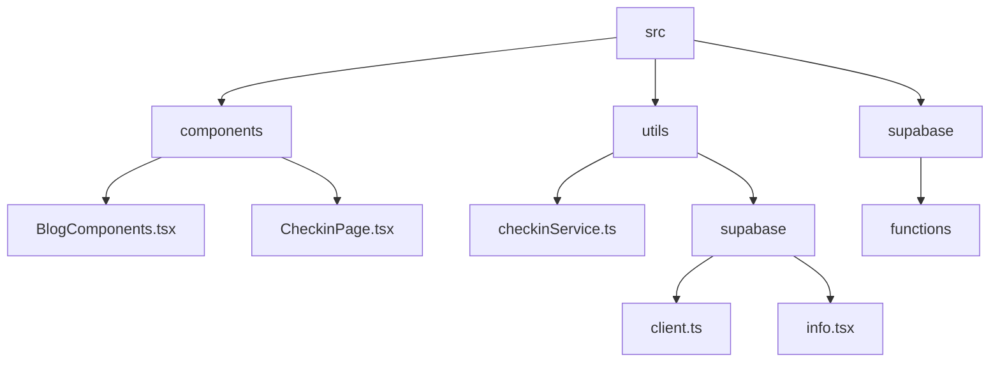
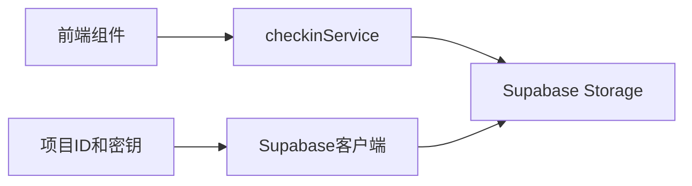
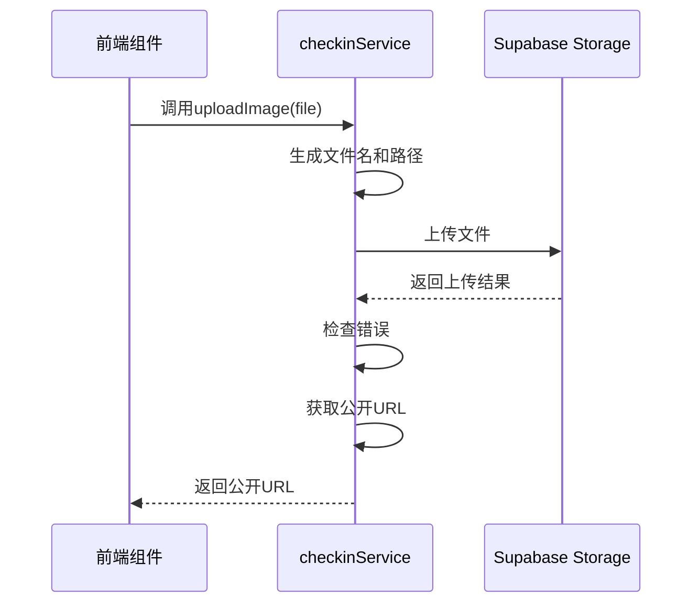
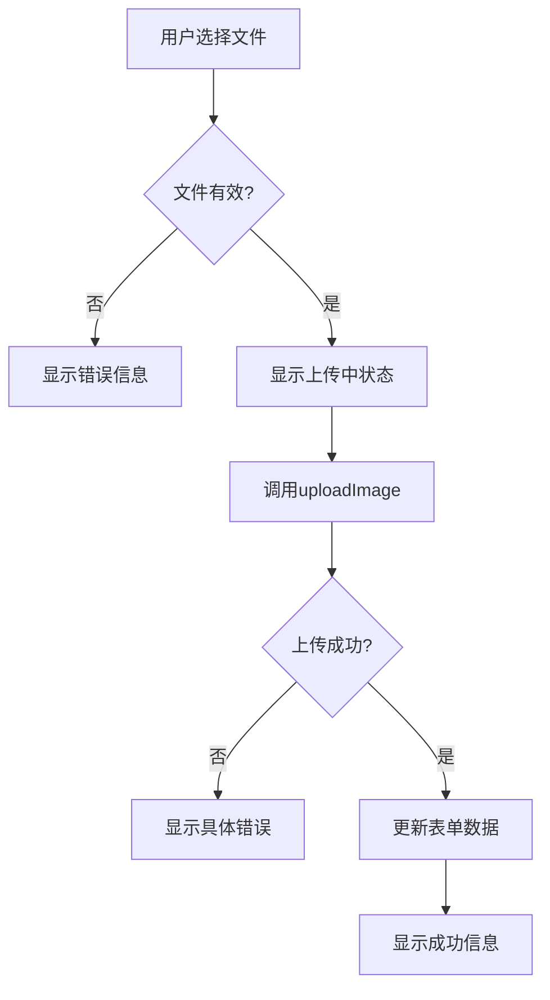
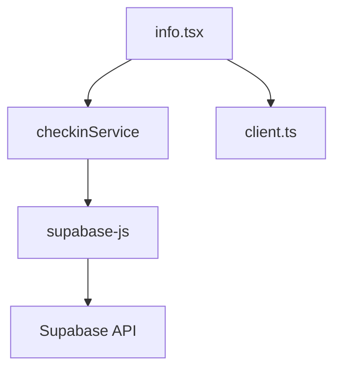

# 存储集成

<cite>
**本文档中引用的文件**  
- [checkinService.ts](file://src/utils/checkinService.ts#L640-L735)
- [BlogComponents.tsx](file://src/components/BlogComponents.tsx#L94-L173)
- [CheckinPage.tsx](file://src/components/CheckinPage.tsx)
- [client.ts](file://src/utils/supabase/client.ts)
- [info.tsx](file://src/utils/supabase/info.tsx)
- [STORAGE_SETUP_GUIDE.md](file://STORAGE_SETUP_GUIDE.md)
- [supabase_storage_setup.sql](file://supabase_storage_setup.sql)
</cite>

## 目录
1. [简介](#简介)
2. [项目结构](#项目结构)
3. [核心组件](#核心组件)
4. [架构概述](#架构概述)
5. [详细组件分析](#详细组件分析)
6. [依赖分析](#依赖分析)
7. [性能考虑](#性能考虑)
8. [故障排除指南](#故障排除指南)
9. [结论](#结论)

## 简介
本文档全面文档化了`uploadImage`方法与Supabase Storage的集成机制，包括文件上传流程、存储桶检查、文件命名策略、路径生成和公开URL获取。详细解释了初始化时的预检作用及错误处理策略，并说明了图片上传在博客和打卡记录中的实际应用场景。同时提供了前端文件输入到服务调用的完整示例代码，涵盖常见问题如上传失败、存储桶不存在、权限配置等的解决方案，并给出Supabase存储策略配置的最佳实践指导。

## 项目结构
本项目采用模块化结构，主要功能集中在`src`目录下。与存储集成相关的核心文件分布在`utils`和`components`目录中。`utils/checkinService.ts`包含图片上传的核心逻辑，而`components/BlogComponents.tsx`和`components/CheckinPage.tsx`则展示了前端组件如何使用这些功能。

**图示来源**  
- [BlogComponents.tsx](file://src/components/BlogComponents.tsx)
- [checkinService.ts](file://src/utils/checkinService.ts)
- [client.ts](file://src/utils/supabase/client.ts)

**本节来源**  
- [src](file://src)
- [components](file://src/components)
- [utils](file://src/utils)

## 核心组件
核心组件包括`checkinService`中的`uploadImage`方法，负责与Supabase Storage进行交互。该方法处理文件上传、错误处理和公开URL生成。前端组件如`BlogComponents`和`CheckinPage`通过调用此服务实现图片上传功能。

**本节来源**  
- [checkinService.ts](file://src/utils/checkinService.ts#L640-L735)
- [BlogComponents.tsx](file://src/components/BlogComponents.tsx#L94-L173)

## 架构概述
系统架构采用分层设计，前端组件通过`checkinService`与Supabase Storage进行通信。`checkinService`封装了所有与存储相关的操作，提供统一的接口给前端使用。Supabase客户端通过`supabaseUrl`和`publicAnonKey`进行初始化，确保安全的API访问。

**图示来源**  
- [client.ts](file://src/utils/supabase/client.ts)
- [checkinService.ts](file://src/utils/checkinService.ts#L640-L735)

## 详细组件分析
### uploadImage方法分析
`uploadImage`方法是图片上传的核心，它接收一个`File`对象，生成唯一的文件名和路径，然后上传到Supabase Storage的`images`桶中。上传成功后，返回公开URL。

**图示来源**  
- [checkinService.ts](file://src/utils/checkinService.ts#L640-L735)

**本节来源**  
- [checkinService.ts](file://src/utils/checkinService.ts#L640-L735)

### 前端集成分析
前端组件如`BlogComponents`通过`handleImageUpload`方法处理文件输入事件，验证文件类型和大小后调用`checkinService.uploadImage`。上传过程中显示加载状态，成功后更新表单数据。

**图示来源**  
- [BlogComponents.tsx](file://src/components/BlogComponents.tsx#L94-L173)

**本节来源**  
- [BlogComponents.tsx](file://src/components/BlogComponents.tsx#L94-L173)

## 依赖分析
系统依赖于Supabase客户端库进行存储操作，通过`@supabase/supabase-js`提供API。项目ID和匿名密钥从`info.tsx`文件中导入，确保配置的集中管理。

**图示来源**  
- [client.ts](file://src/utils/supabase/client.ts)
- [info.tsx](file://src/utils/supabase/info.tsx)

**本节来源**  
- [client.ts](file://src/utils/supabase/client.ts)
- [info.tsx](file://src/utils/supabase/info.tsx)

## 性能考虑
- 文件大小限制为5MB，防止大文件上传影响性能
- 使用随机文件名避免命名冲突
- 直接尝试上传，不进行额外的存储桶存在性检查，减少网络请求
- 错误处理提供具体信息，帮助用户快速解决问题

## 故障排除指南
### 常见问题及解决方案
- **存储桶未创建**：在Supabase控制台中创建名为`images`的公开存储桶
- **权限被拒绝**：检查用户登录状态和RLS策略配置
- **文件过大**：确保文件小于5MB
- **存储桶不存在**：确认存储桶名称为`images`且已正确创建

### Supabase存储策略配置最佳实践
1. 创建`images`存储桶并设置为公开
2. 添加以下RLS策略：
   - 允许认证用户上传图片
   - 允许所有人查看图片
   - 允许用户删除自己的图片
3. 使用SQL脚本或控制台手动创建存储桶

**本节来源**  
- [STORAGE_SETUP_GUIDE.md](file://STORAGE_SETUP_GUIDE.md)
- [supabase_storage_setup.sql](file://supabase_storage_setup.sql)

## 结论
本文档详细介绍了`uploadImage`方法与Supabase Storage的集成机制，涵盖了从文件上传流程到错误处理的各个方面。通过合理的架构设计和错误处理策略，确保了图片上传功能的稳定性和用户体验。遵循最佳实践配置Supabase存储策略，可以有效避免常见问题，提升系统可靠性。