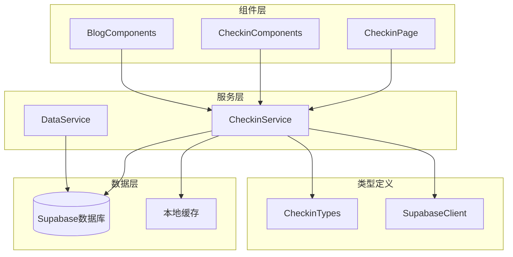
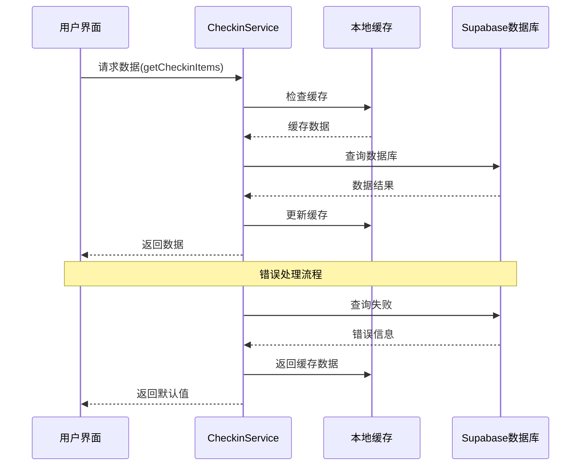
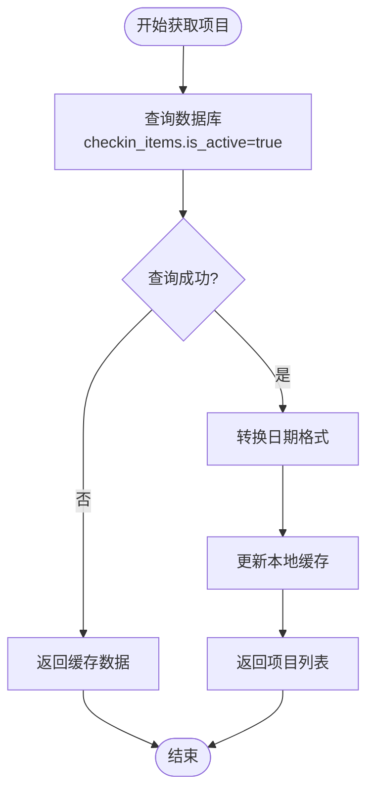
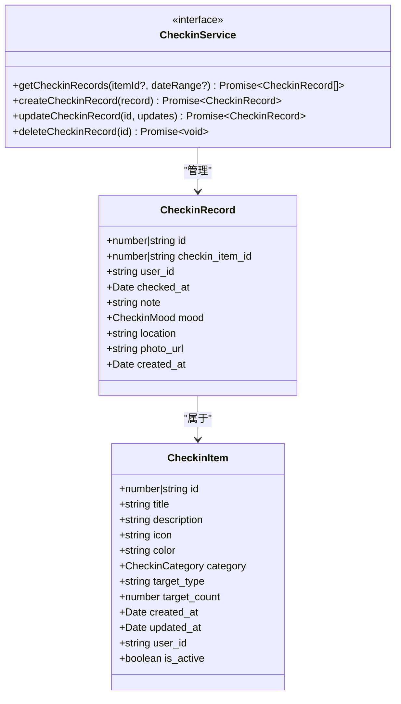
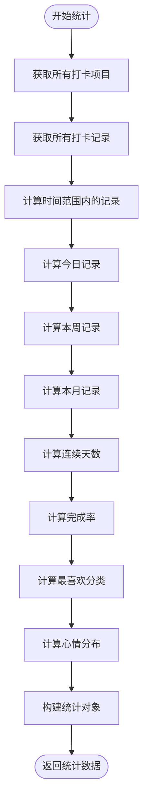
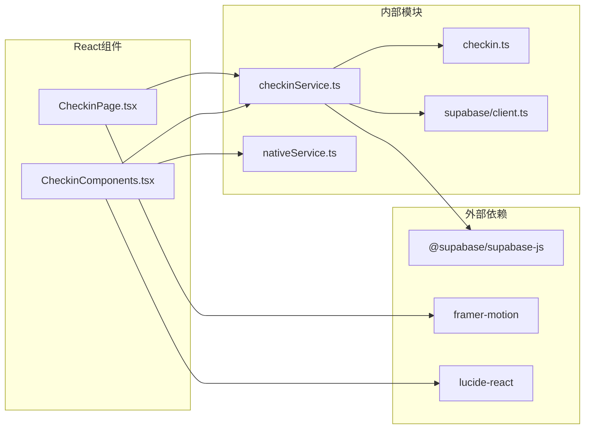

# 数据管理

<cite>
**本文档引用的文件**
- [checkinService.ts](file://src/utils/checkinService.ts)
- [checkin.ts](file://src/types/checkin.ts)
- [client.ts](file://src/utils/supabase/client.ts)
- [dataService.tsx](file://src/utils/dataService.tsx)
- [CheckinPage.tsx](file://src/components/CheckinPage.tsx)
- [CheckinComponents.tsx](file://src/components/CheckinComponents.tsx)
</cite>

## 目录
1. [简介](#简介)
2. [项目结构](#项目结构)
3. [核心组件](#核心组件)
4. [架构概览](#架构概览)
5. [详细组件分析](#详细组件分析)
6. [依赖关系分析](#依赖关系分析)
7. [性能考虑](#性能考虑)
8. [故障排除指南](#故障排除指南)
9. [结论](#结论)

## 简介

checkinService是一个专门用于管理打卡项目和打卡记录的核心数据服务。它提供了完整的CRUD操作功能，包括数据从Supabase数据库获取、本地缓存更新、错误处理与回退机制的完整流程。该服务采用单例模式设计，确保在整个应用程序中只有一个统一的数据管理实例。

## 项目结构



**图表来源**
- [checkinService.ts](file://src/utils/checkinService.ts#L1-L50)
- [dataService.tsx](file://src/utils/dataService.tsx#L1-L50)

**章节来源**
- [checkinService.ts](file://src/utils/checkinService.ts#L1-L736)
- [checkin.ts](file://src/types/checkin.ts#L1-L284)

## 核心组件

### CheckinDataService 类

CheckinDataService是整个数据管理系统的核心，实现了CheckinService接口的所有方法。它包含以下主要功能模块：

1. **数据缓存管理**：维护本地缓存以提高性能和离线可用性
2. **Supabase集成**：与Supabase数据库进行实时数据同步
3. **错误处理机制**：提供完善的错误处理和回退策略
4. **用户身份验证**：集成Supabase认证系统

### 数据模型

系统定义了四个核心数据模型：

- **CheckinItem**：打卡项目，包含项目基本信息和目标设置
- **CheckinRecord**：打卡记录，记录用户的实际打卡行为
- **CheckinBlog**：博客文章，用户分享的打卡心得
- **CheckinStats**：统计数据，提供各种维度的统计信息

**章节来源**
- [checkinService.ts](file://src/utils/checkinService.ts#L10-L30)
- [checkin.ts](file://src/types/checkin.ts#L1-L50)

## 架构概览



**图表来源**
- [checkinService.ts](file://src/utils/checkinService.ts#L35-L60)
- [checkinService.ts](file://src/utils/checkinService.ts#L150-L180)

## 详细组件分析

### 打卡项目管理

#### getCheckinItems 方法

```typescript
async getCheckinItems(): Promise<CheckinItem[]>
```

该方法负责获取所有活跃的打卡项目：

1. **数据库查询**：从`checkin_items`表中查询所有`is_active=true`的项目
2. **数据转换**：将数据库返回的字符串日期转换为JavaScript Date对象
3. **缓存更新**：将查询结果存储到本地缓存中
4. **错误处理**：如果查询失败，返回缓存中的数据作为回退



**图表来源**
- [checkinService.ts](file://src/utils/checkinService.ts#L35-L60)

#### createCheckinItem 方法

```typescript
async createCheckinItem(item: Omit<CheckinItem, 'id' | 'created_at' | 'updated_at' | 'user_id'>): Promise<CheckinItem>
```

该方法创建新的打卡项目：

1. **身份验证**：检查用户是否已登录
2. **数据库插入**：向`checkin_items`表插入新记录
3. **缓存更新**：将新项目添加到缓存列表的开头
4. **错误处理**：捕获并处理所有可能的错误

**章节来源**
- [checkinService.ts](file://src/utils/checkinService.ts#L62-L95)

### 打卡记录管理

#### getCheckinRecords 方法

```typescript
async getCheckinRecords(itemId?: number | string, dateRange?: { start: Date; end: Date }): Promise<CheckinRecord[]>
```

该方法支持灵活的查询条件：

1. **条件构建**：根据传入的参数动态构建查询条件
2. **关联查询**：同时获取关联的打卡项目信息
3. **日期过滤**：支持按日期范围过滤记录
4. **缓存策略**：只有在无条件查询时才更新缓存



**图表来源**
- [checkin.ts](file://src/types/checkin.ts#L15-L35)
- [checkin.ts](file://src/types/checkin.ts#L37-L50)

**章节来源**
- [checkinService.ts](file://src/utils/checkinService.ts#L150-L190)

### 统计数据功能

#### getCheckinStats 方法

该方法提供全面的统计数据：

1. **数据聚合**：计算总项目数、活跃项目数、打卡次数等
2. **时间范围分析**：支持按日、周、月统计
3. **连续天数计算**：使用`getStreakDays`算法计算连续打卡天数
4. **完成率计算**：基于目标类型和实际打卡次数计算完成率
5. **分类统计**：分析用户最喜欢的分类和心情分布



**图表来源**
- [checkinService.ts](file://src/utils/checkinService.ts#L250-L350)

**章节来源**
- [checkinService.ts](file://src/utils/checkinService.ts#L250-L350)

### 博客管理功能

#### 图片上传功能

```typescript
async uploadImage(file: File): Promise<string>
```

该方法提供图片上传功能：

1. **文件命名**：生成唯一的文件名
2. **存储桶检查**：验证存储桶是否存在
3. **上传处理**：将图片上传到Supabase Storage
4. **错误处理**：提供详细的错误信息和解决方案

**章节来源**
- [checkinService.ts](file://src/utils/checkinService.ts#L650-L700)

## 依赖关系分析



**图表来源**
- [checkinService.ts](file://src/utils/checkinService.ts#L1-L10)
- [CheckinPage.tsx](file://src/components/CheckinPage.tsx#L1-L15)

**章节来源**
- [checkinService.ts](file://src/utils/checkinService.ts#L1-L10)
- [client.ts](file://src/utils/supabase/client.ts#L1-L12)

## 性能考虑

### 缓存策略

1. **智能缓存**：只在必要时更新缓存，减少不必要的数据库查询
2. **延迟加载**：UI组件立即显示，后台异步加载数据
3. **增量更新**：只更新发生变化的数据，保持缓存一致性

### 错误处理机制

1. **渐进式降级**：网络错误时返回缓存数据
2. **用户友好的错误提示**：通过NativeService显示Toast消息
3. **错误恢复**：在网络恢复后自动重新同步数据

### 离线支持

虽然当前实现主要依赖在线数据，但通过本地缓存提供了基本的离线支持能力。

## 故障排除指南

### 常见问题及解决方案

#### 1. 数据加载失败

**症状**：页面无法显示打卡项目或记录
**原因**：网络连接问题或数据库查询失败
**解决方案**：
- 检查网络连接状态
- 查看浏览器开发者工具中的网络请求
- 确认Supabase数据库连接正常

#### 2. 缓存不同步

**症状**：看到过期的数据或看不到最新修改
**原因**：本地缓存与数据库不一致
**解决方案**：
```typescript
// 清除缓存强制刷新
checkinService.clearCache();
await checkinService.getCheckinItems();
```

#### 3. 图片上传失败

**症状**：无法上传图片或上传后无法显示
**原因**：存储桶配置问题或权限不足
**解决方案**：
- 确认Supabase中存在名为"images"的存储桶
- 设置存储桶为公开访问
- 检查文件大小和格式限制

#### 4. 用户认证问题

**症状**：无法创建项目或记录
**原因**：用户未登录或会话过期
**解决方案**：
- 确保用户已正确登录
- 检查Supabase认证配置
- 重新登录以刷新会话

**章节来源**
- [checkinService.ts](file://src/utils/checkinService.ts#L650-L700)
- [checkinService.ts](file://src/utils/checkinService.ts#L720-L736)

## 结论

checkinService提供了一个完整、可靠的数据管理解决方案，具有以下优势：

1. **完整的CRUD功能**：支持所有基本的数据操作
2. **健壮的错误处理**：提供多层错误处理和回退机制
3. **高效的缓存策略**：提升应用性能和用户体验
4. **清晰的架构设计**：模块化设计便于维护和扩展
5. **良好的类型安全**：完整的TypeScript类型定义

该服务为打卡应用提供了坚实的数据基础，支持用户创建和管理打卡项目、记录打卡行为、查看统计数据等功能。通过合理的缓存策略和错误处理机制，确保了应用在各种网络条件下的稳定运行。