# CheckinService服务逻辑深度解析

<cite>
**本文档引用的文件**
- [checkinService.ts](file://src/utils/checkinService.ts)
- [checkin.ts](file://src/types/checkin.ts)
- [client.ts](file://src/utils/supabase/client.ts)
- [info.tsx](file://src/utils/supabase/info.tsx)
- [CheckinPage.tsx](file://src/components/CheckinPage.tsx)
- [supabase_checkin_tables.sql](file://supabase_checkin_tables.sql)
</cite>

## 目录
1. [简介](#简介)
2. [项目结构概览](#项目结构概览)
3. [核心服务架构](#核心服务架构)
4. [初始化与认证机制](#初始化与认证机制)
5. [数据模型与类型系统](#数据模型与类型系统)
6. [核心业务方法详解](#核心业务方法详解)
7. [离线优先架构设计](#离线优先架构设计)
8. [统计计算算法](#统计计算算法)
9. [异常处理与错误重试](#异常处理与错误重试)
10. [性能优化策略](#性能优化策略)
11. [扩展指南](#扩展指南)
12. [总结](#总结)

## 简介

CheckinService是一个基于TypeScript实现的业务服务层，专门负责管理用户的打卡功能。该服务采用单例模式设计，提供了完整的CRUD操作、统计计算、离线优先架构和与Supabase数据库的无缝集成。服务支持打卡项目管理、打卡记录追踪、Blog创作与分享等功能，是整个应用的核心业务逻辑中心。

## 项目结构概览

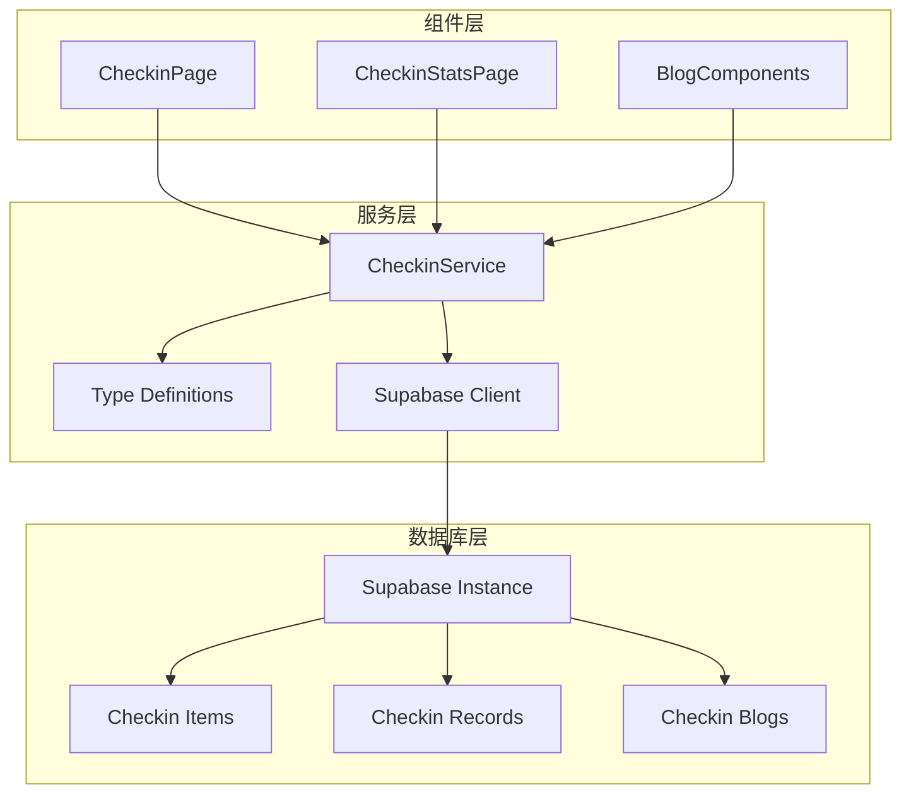

**图表来源**
- [checkinService.ts](file://src/utils/checkinService.ts#L1-L20)
- [client.ts](file://src/utils/supabase/client.ts#L1-L12)

**章节来源**
- [checkinService.ts](file://src/utils/checkinService.ts#L1-L736)
- [checkin.ts](file://src/types/checkin.ts#L1-L284)

## 核心服务架构

CheckinService采用了面向对象的设计模式，实现了CheckinService接口的所有方法。服务内部维护了一个内存缓存系统，支持离线数据同步和快速响应。

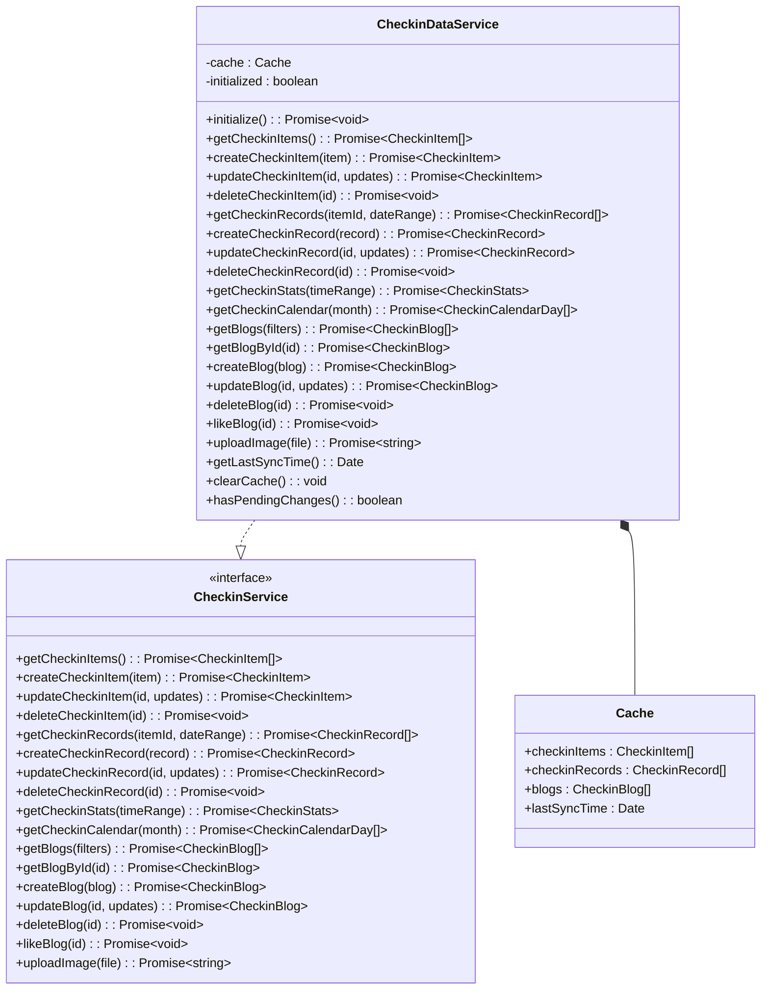

**图表来源**
- [checkinService.ts](file://src/utils/checkinService.ts#L13-L736)
- [checkin.ts](file://src/types/checkin.ts#L150-L180)

**章节来源**
- [checkinService.ts](file://src/utils/checkinService.ts#L13-L736)

## 初始化与认证机制

CheckinService的初始化过程采用了渐进式加载策略，确保应用启动的流畅性：

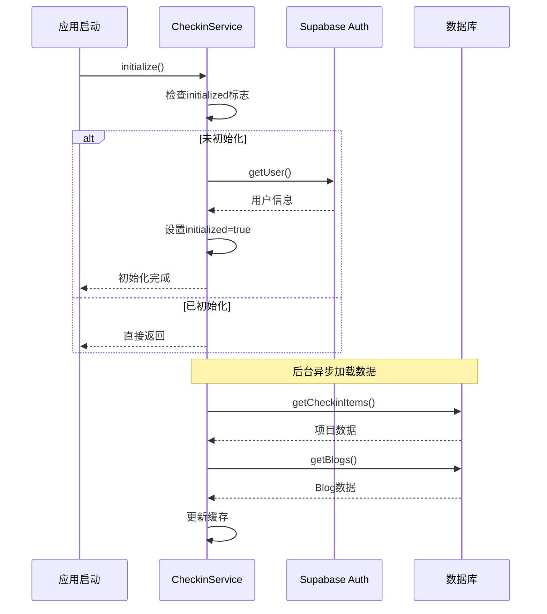

**图表来源**
- [checkinService.ts](file://src/utils/checkinService.ts#L25-L40)
- [client.ts](file://src/utils/supabase/client.ts#L1-L12)

初始化过程的关键特性：
- **非阻塞设计**：初始化不会阻塞UI渲染，立即返回控制权给应用
- **自动认证**：通过Supabase自动获取当前用户会话
- **错误容忍**：即使初始化失败，应用仍能正常运行
- **幂等性**：多次调用initialize()只会执行一次初始化逻辑

**章节来源**
- [checkinService.ts](file://src/utils/checkinService.ts#L25-L40)

## 数据模型与类型系统

CheckinService基于强类型设计，定义了完整的数据模型体系：

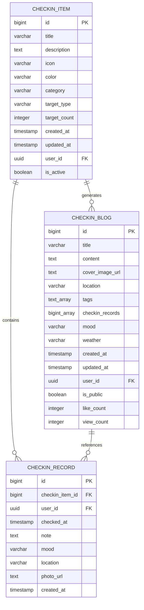

**图表来源**
- [supabase_checkin_tables.sql](file://supabase_checkin_tables.sql#L1-L50)
- [checkin.ts](file://src/types/checkin.ts#L1-L100)

### 核心数据类型

1. **CheckinItem**：打卡项目实体，包含标题、描述、图标、颜色、分类等属性
2. **CheckinRecord**：打卡记录实体，记录具体的打卡行为和相关信息
3. **CheckinBlog**：Blog文章实体，支持Markdown内容、标签、图片等功能
4. **CheckinStats**：统计信息实体，提供各种维度的汇总数据

**章节来源**
- [checkin.ts](file://src/types/checkin.ts#L1-L284)

## 核心业务方法详解

### 打卡项目管理

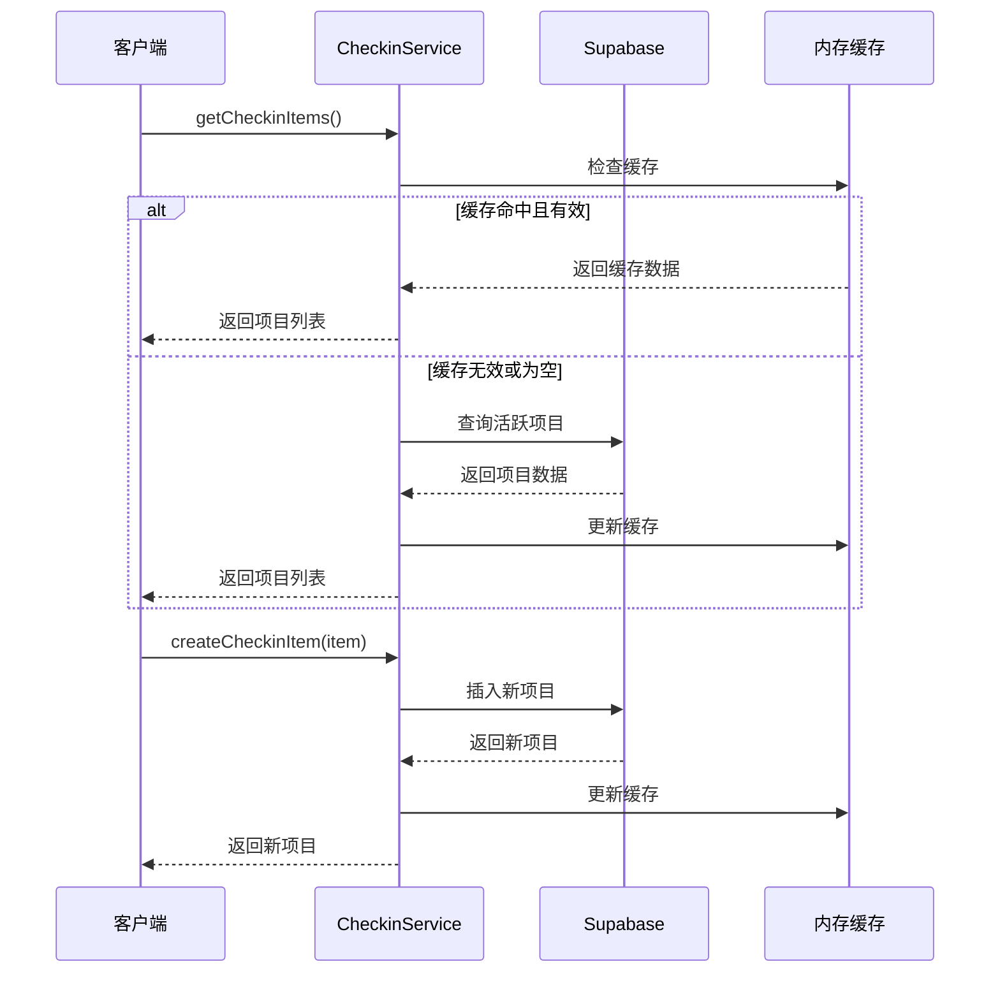

**图表来源**
- [checkinService.ts](file://src/utils/checkinService.ts#L42-L85)

### 打卡记录管理

打卡记录管理支持灵活的时间范围查询和关联查询：

```typescript
// 支持多种查询组合
const records = await service.getCheckinRecords(
  itemId,           // 可选：指定项目ID
  dateRange         // 可选：日期范围
);
```

### Blog管理

Blog管理提供了完整的CRUD操作，支持全文搜索、标签过滤和排序：

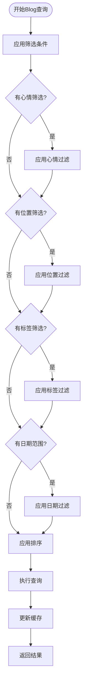

**图表来源**
- [checkinService.ts](file://src/utils/checkinService.ts#L280-L320)

**章节来源**
- [checkinService.ts](file://src/utils/checkinService.ts#L42-L420)

## 离线优先架构设计

CheckinService实现了完整的离线优先架构，确保在网络不稳定或离线状态下仍能提供良好的用户体验：

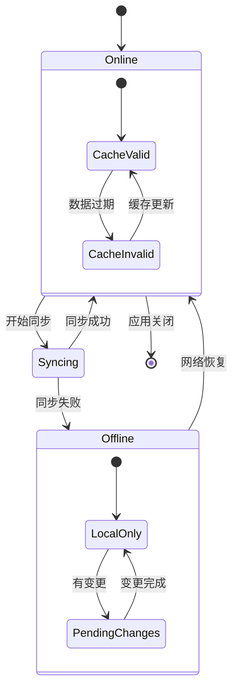

### 缓存策略

1. **智能缓存失效**：根据数据类型和使用频率设置不同的缓存策略
2. **增量更新**：只更新发生变化的数据，减少网络传输
3. **回退机制**：当网络请求失败时，自动使用缓存数据

### 状态一致性保障

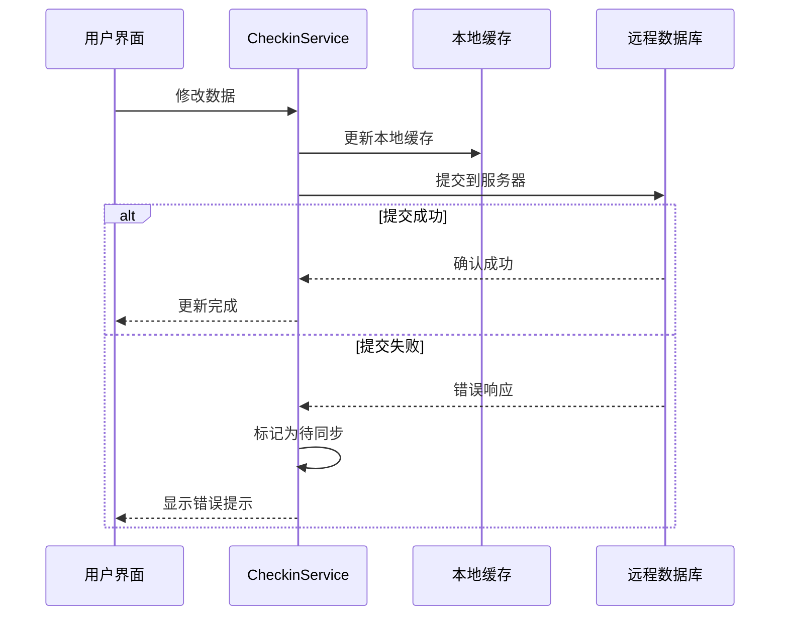

**图表来源**
- [checkinService.ts](file://src/utils/checkinService.ts#L60-L85)
- [checkinService.ts](file://src/utils/checkinService.ts#L120-L145)

**章节来源**
- [checkinService.ts](file://src/utils/checkinService.ts#L15-L25)
- [checkinService.ts](file://src/utils/checkinService.ts#L60-L145)

## 统计计算算法

CheckinService实现了多种统计计算算法，为用户提供全面的数据洞察：

### 连续打卡天数计算

```typescript
export const getStreakDays = (records: CheckinRecord[]): number => {
  if (records.length === 0) return 0;
  
  const today = new Date();
  let streak = 0;
  let currentDate = new Date(today);
  
  while (true) {
    const dateStr = currentDate.toISOString().split('T')[0];
    const hasRecord = records.some(record => 
      record.checked_at.toISOString().split('T')[0] === dateStr
    );
    
    if (hasRecord) {
      streak++;
      currentDate.setDate(currentDate.getDate() - 1);
    } else {
      break;
    }
  }
  
  return streak;
};
```

### 完成率计算

```typescript
export const getCompletionRate = (
  items: CheckinItem[], 
  records: CheckinRecord[], 
  timeRange: { start: Date; end: Date }
): number => {
  if (items.length === 0) return 0;
  
  const totalTargets = items.reduce((sum, item) => {
    const days = Math.ceil((timeRange.end.getTime() - timeRange.start.getTime()) / (1000 * 60 * 60 * 24));
    return sum + (item.target_type === 'daily' ? days * item.target_count : item.target_count);
  }, 0);
  
  const completedCount = records.filter(record => 
    record.checked_at >= timeRange.start && record.checked_at <= timeRange.end
  ).length;
  
  return totalTargets > 0 ? Math.round((completedCount / totalTargets) * 100) : 0;
};
```

### 统计数据聚合流程

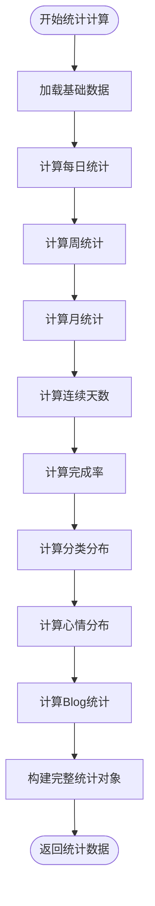

**图表来源**
- [checkinService.ts](file://src/utils/checkinService.ts#L346-L420)

**章节来源**
- [checkin.ts](file://src/types/checkin.ts#L271-L283)
- [checkinService.ts](file://src/utils/checkinService.ts#L346-L420)

## 异常处理与错误重试

CheckinService采用了多层次的异常处理策略，确保系统的稳定性和用户体验：

### 错误处理层次

1. **网络层错误**：处理Supabase连接问题
2. **认证层错误**：处理用户认证失败
3. **业务层错误**：处理业务逻辑异常
4. **缓存层错误**：处理缓存操作失败

### 错误恢复机制

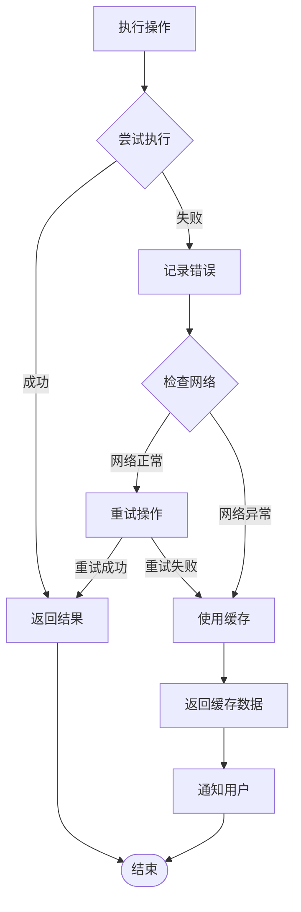

### 错误类型分类

1. **临时性错误**：网络中断、超时等，支持自动重试
2. **永久性错误**：认证失败、权限不足等，需要用户干预
3. **数据错误**：数据格式错误、约束违反等，提供具体错误信息

**章节来源**
- [checkinService.ts](file://src/utils/checkinService.ts#L42-L85)
- [checkinService.ts](file://src/utils/checkinService.ts#L120-L145)

## 性能优化策略

### 批量操作优化

```typescript
// 并行加载多个数据源
const [itemsData, blogsData] = await Promise.allSettled([
  checkinService.getCheckinItems(),
  checkinService.getBlogs()
]);
```

### 分页查询优化

```typescript
// 使用游标分页避免全量加载
const pageSize = 20;
let offset = 0;
let hasMore = true;

while (hasMore) {
  const page = await service.getBlogs({
    limit: pageSize,
    offset: offset
  });
  
  processPage(page);
  hasMore = page.length === pageSize;
  offset += pageSize;
}
```

### 查询优化策略

1. **索引优化**：为常用查询字段建立复合索引
2. **查询缓存**：对重复查询结果进行缓存
3. **懒加载**：按需加载非关键数据
4. **预加载**：提前加载可能需要的数据

**章节来源**
- [CheckinPage.tsx](file://src/components/CheckinPage.tsx#L40-L60)

## 扩展指南

### 添加新的业务方法

要向CheckinService添加新的业务方法，需要遵循以下步骤：

1. **定义接口方法**：在CheckinService接口中添加新方法签名
2. **实现业务逻辑**：在CheckinDataService类中实现具体逻辑
3. **更新缓存策略**：考虑是否需要缓存和缓存更新逻辑
4. **添加错误处理**：确保新方法有适当的错误处理
5. **编写单元测试**：验证新方法的功能正确性

### 新增数据类型

```typescript
// 1. 在checkin.ts中定义新类型
export interface NewDataType {
  id: number | string;
  name: string;
  data: any;
  created_at: Date;
  updated_at: Date;
}

// 2. 在CheckinService接口中添加方法
export interface CheckinService {
  // ... 现有方法
  getNewData(): Promise<NewDataType[]>;
  createNewData(data: Omit<NewDataType, 'id' | 'created_at' | 'updated_at'>): Promise<NewDataType>;
}

// 3. 在CheckinDataService中实现
async getNewData(): Promise<NewDataType[]> {
  // 实现逻辑
}
```

### 集成新的外部服务

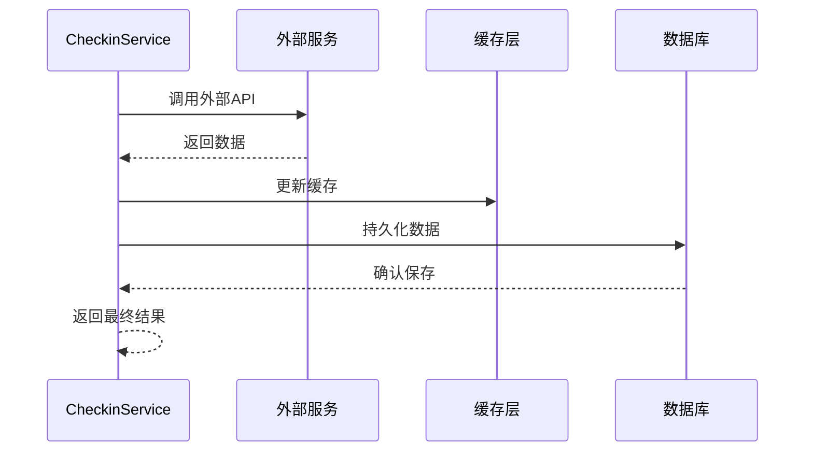

**图表来源**
- [checkinService.ts](file://src/utils/checkinService.ts#L1-L20)

## 总结

CheckinService是一个设计精良的业务服务层，具有以下核心优势：

### 技术特点

1. **完整的离线优先架构**：确保在网络不稳定时仍能提供良好体验
2. **强类型系统**：提供编译时错误检测和更好的开发体验
3. **模块化设计**：清晰的职责分离和高内聚低耦合
4. **性能优化**：多层缓存和批量操作优化

### 架构优势

1. **可扩展性**：易于添加新的业务功能和数据类型
2. **可维护性**：清晰的代码结构和完善的错误处理
3. **可靠性**：多层次的错误恢复和数据一致性保障
4. **用户体验**：流畅的异步操作和智能缓存策略

### 最佳实践

1. **渐进式加载**：避免阻塞UI渲染
2. **错误容忍**：网络失败时提供优雅降级
3. **缓存策略**：合理平衡数据新鲜度和性能
4. **类型安全**：充分利用TypeScript的类型系统

CheckinService为整个应用提供了坚实的数据管理和业务逻辑基础，是现代React应用中服务层设计的优秀范例。通过合理的架构设计和性能优化，它能够满足复杂业务场景的需求，同时保持代码的可维护性和扩展性。