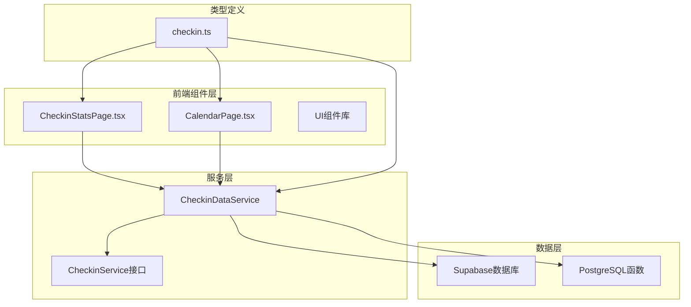
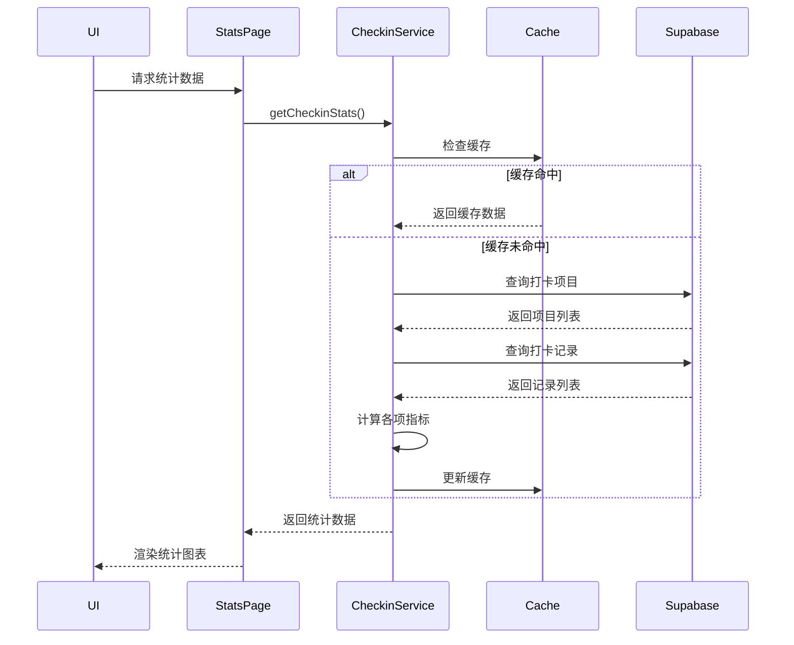
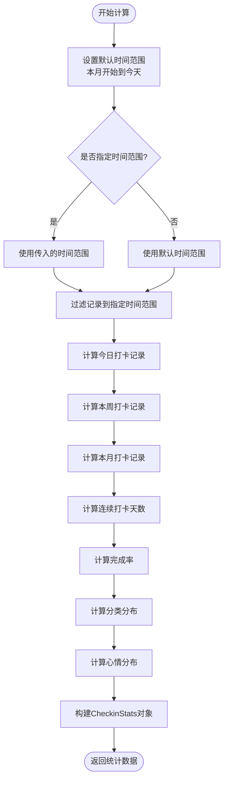
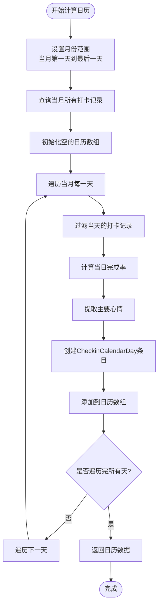
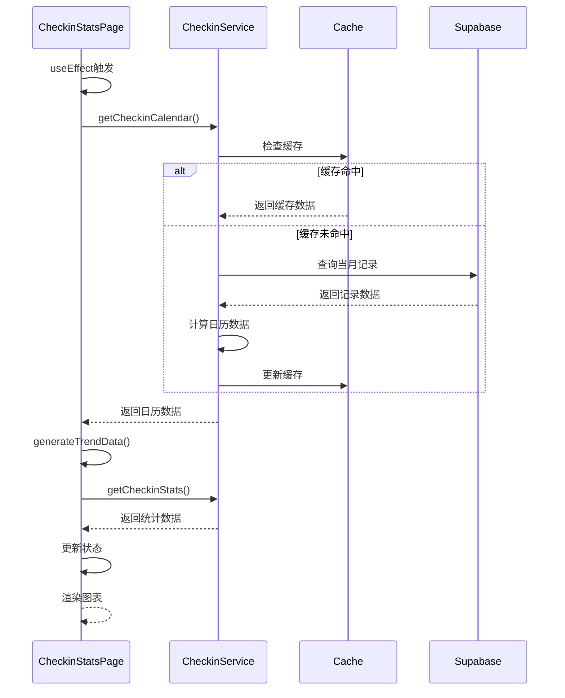
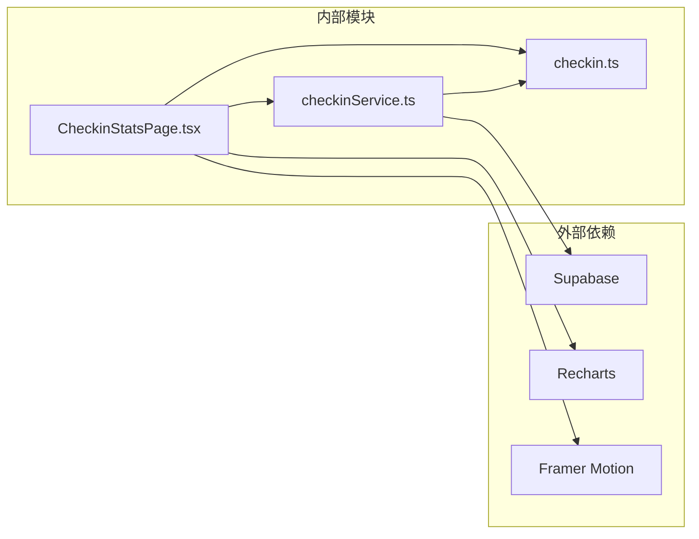

# 统计服务

<cite>
**本文档引用的文件**
- [checkinService.ts](file://src/utils/checkinService.ts)
- [checkin.ts](file://src/types/checkin.ts)
- [CheckinStatsPage.tsx](file://src/components/CheckinStatsPage.tsx)
- [CalendarPage.tsx](file://src/components/CalendarPage.tsx)
- [supabase_checkin_tables.sql](file://supabase_checkin_tables.sql)
</cite>

## 目录
1. [简介](#简介)
2. [项目结构](#项目结构)
3. [核心组件](#核心组件)
4. [架构概览](#架构概览)
5. [详细组件分析](#详细组件分析)
6. [依赖关系分析](#依赖关系分析)
7. [性能考虑](#性能考虑)
8. [故障排除指南](#故障排除指南)
9. [结论](#结论)

## 简介

FocusDo打卡应用的统计服务是一个综合性的数据分析系统，负责计算用户的打卡行为数据，包括完成率、连续打卡天数、最长连续记录、心情分布等关键指标。该系统通过getCheckinStats和getCheckinCalendar两个核心方法，为用户提供全面的统计分析和可视化展示。

统计服务采用分层架构设计，包含数据访问层、业务逻辑层和表现层。数据访问层通过Supabase数据库提供数据持久化；业务逻辑层实现复杂的统计计算算法；表现层则负责数据的可视化展示和用户交互。

## 项目结构



**图表来源**
- [checkinService.ts](file://src/utils/checkinService.ts#L1-L50)
- [CheckinStatsPage.tsx](file://src/components/CheckinStatsPage.tsx#L1-L30)

**章节来源**
- [checkinService.ts](file://src/utils/checkinService.ts#L1-L736)
- [checkin.ts](file://src/types/checkin.ts#L1-L284)

## 核心组件

### CheckinDataService 类

CheckinDataService 是统计服务的核心实现类，继承自 CheckinService 接口。该类提供了完整的数据访问和业务逻辑处理能力。

```typescript
class CheckinDataService implements CheckinService {
  private cache = {
    checkinItems: [] as CheckinItem[],
    checkinRecords: [] as CheckinRecord[],
    blogs: [] as CheckinBlog[],
    lastSyncTime: null as Date | null
  };
}
```

### 数据模型

系统定义了完整的数据模型来描述打卡相关的实体：

- **CheckinItem**: 打卡项目，包含标题、描述、图标、颜色、分类等属性
- **CheckinRecord**: 打卡记录，包含打卡时间、备注、心情状态、地点等信息
- **CheckinBlog**: Blog文章，支持Markdown内容、标签、心情状态等功能
- **CheckinStats**: 统计数据，包含各种汇总指标
- **CheckinCalendarDay**: 日历视图数据，包含每日完成率和主要心情

**章节来源**
- [checkin.ts](file://src/types/checkin.ts#L1-L100)
- [checkinService.ts](file://src/utils/checkinService.ts#L10-L30)

## 架构概览



**图表来源**
- [checkinService.ts](file://src/utils/checkinService.ts#L200-L380)
- [CheckinStatsPage.tsx](file://src/components/CheckinStatsPage.tsx#L50-L100)

## 详细组件分析

### getCheckinStats 方法分析

getCheckinStats 方法是统计服务的核心功能，负责计算用户的综合统计指标。

#### 方法签名
```typescript
async getCheckinStats(timeRange?: { start: Date; end: Date }): Promise<CheckinStats>
```

#### 时间范围过滤逻辑



**图表来源**
- [checkinService.ts](file://src/utils/checkinService.ts#L200-L380)

#### 完成率计算算法

完成率计算是统计服务的核心算法之一：

```typescript
export const getCompletionRate = (items: CheckinItem[], records: CheckinRecord[], timeRange: { start: Date; end: Date }): number => {
  if (items.length === 0) return 0;
  
  const totalTargets = items.reduce((sum, item) => {
    const days = Math.ceil((timeRange.end.getTime() - timeRange.start.getTime()) / (1000 * 60 * 60 * 24));
    return sum + (item.target_type === 'daily' ? days * item.target_count : item.target_count);
  }, 0);
  
  const completedCount = records.filter(record => 
    record.checked_at >= timeRange.start && record.checked_at <= timeRange.end
  ).length;
  
  return totalTargets > 0 ? Math.round((completedCount / totalTargets) * 100) : 0;
};
```

该算法考虑了不同目标类型的差异：
- **每日目标**: 计算时间段内的总目标次数
- **每周目标**: 计算固定的目标次数
- **自定义目标**: 计算固定的目标次数

#### 连续打卡天数计算

```typescript
export const getStreakDays = (records: CheckinRecord[]): number => {
  if (records.length === 0) return 0;
  
  const today = new Date();
  let streak = 0;
  let currentDate = new Date(today);
  
  while (true) {
    const dateStr = currentDate.toISOString().split('T')[0];
    const hasRecord = records.some(record => 
      record.checked_at.toISOString().split('T')[0] === dateStr
    );
    
    if (hasRecord) {
      streak++;
      currentDate.setDate(currentDate.getDate() - 1);
    } else {
      break;
    }
  }
  
  return streak;
};
```

#### 数据聚合和分类统计

系统实现了多层次的数据聚合：

1. **项目级别聚合**: 统计总项目数、活跃项目数
2. **时间级别聚合**: 按今日、本周、本月进行时间切片
3. **分类级别聚合**: 按健康、运动、学习等分类统计
4. **心情级别聚合**: 按心情状态进行分布统计

**章节来源**
- [checkinService.ts](file://src/utils/checkinService.ts#L200-L380)
- [checkin.ts](file://src/types/checkin.ts#L225-L283)

### getCheckinCalendar 方法分析

getCheckinCalendar 方法负责生成月度日历视图，为用户提供直观的打卡情况展示。

#### 方法签名
```typescript
async getCheckinCalendar(month: Date): Promise<CheckinCalendarDay[]>
```

#### 日历视图计算流程



**图表来源**
- [checkinService.ts](file://src/utils/checkinService.ts#L382-L420)

#### 完成率计算方式

每日完成率的计算采用了简化的算法：

```typescript
const dailyTargets = items.filter(item => item.target_type === 'daily').length;
const completionRate = dailyTargets > 0 ? Math.round((dayRecords.length / dailyTargets) * 100) : 0;
```

该算法的优势：
- **简单高效**: 只需统计当日记录数与目标项目数的比值
- **实时响应**: 不需要复杂的跨天计算
- **用户体验**: 提供即时反馈，用户能快速了解当日完成情况

#### 主要心情提取逻辑

```typescript
const moods = dayRecords.map(r => r.mood).filter(Boolean) as CheckinMood[];
const mainMood = moods.length > 0 ? moods[0] : null;
```

提取逻辑的特点：
- **顺序优先**: 取第一个记录的心情作为主要心情
- **简单明了**: 不进行复杂的统计分析
- **一致性**: 同一天内保持心情的一致性显示

**章节来源**
- [checkinService.ts](file://src/utils/checkinService.ts#L382-L420)

### 统计页面集成分析

#### 数据加载流程



**图表来源**
- [CheckinStatsPage.tsx](file://src/components/CheckinStatsPage.tsx#L50-L100)

#### 可视化数据渲染

统计页面使用多种图表组件来展示数据：

1. **趋势图表**: 使用 AreaChart 展示历史趋势
2. **分类分布**: 使用进度条展示各类别占比
3. **心情分布**: 使用彩色进度条展示心情状态
4. **日历热力图**: 使用网格热力图展示每日完成情况
5. **成就徽章**: 使用卡片布局展示成就解锁状态

**章节来源**
- [CheckinStatsPage.tsx](file://src/components/CheckinStatsPage.tsx#L1-L554)

## 依赖关系分析



**图表来源**
- [checkinService.ts](file://src/utils/checkinService.ts#L1-L10)
- [CheckinStatsPage.tsx](file://src/components/CheckinStatsPage.tsx#L1-L20)

### 缓存策略

系统实现了多层缓存机制：

1. **内存缓存**: 在 CheckinDataService 中维护最近的数据副本
2. **组件缓存**: 在 React 组件中缓存计算结果
3. **浏览器缓存**: 利用浏览器的 HTTP 缓存机制

### 数据预加载

```typescript
async initialize(): Promise<void> {
  if (this.initialized) return;
  
  try {
    // 预加载基础数据
    await this.getCheckinItems();
    await this.getCheckinRecords();
    this.initialized = true;
  } catch (error) {
    console.error('Failed to initialize CheckinDataService:', error);
  }
}
```

**章节来源**
- [checkinService.ts](file://src/utils/checkinService.ts#L30-L50)

## 性能考虑

### 计算复杂度控制

1. **时间范围限制**: 默认只计算当月数据，避免全量扫描
2. **索引优化**: 在数据库层面为常用查询字段建立索引
3. **批量查询**: 将多个小查询合并为批量查询
4. **缓存利用**: 充分利用缓存减少重复计算

### 数据库优化

```sql
-- 为常用查询字段建立索引
CREATE INDEX idx_checkin_records_user_date ON checkin_records(user_id, DATE(checked_at));
CREATE INDEX idx_checkin_items_user_active ON checkin_items(user_id, is_active);
```

### 前端优化

1. **虚拟滚动**: 对于大量数据使用虚拟滚动技术
2. **懒加载**: 按需加载统计数据和图表
3. **防抖节流**: 对频繁触发的操作进行防抖处理
4. **Web Workers**: 将复杂的计算任务放到 Web Worker 中执行

## 故障排除指南

### 常见统计偏差问题

#### 1. 完成率计算异常

**症状**: 完成率显示超过100%
**原因**: 目标计算错误或记录重复
**解决方案**:
```typescript
// 检查目标计算逻辑
const totalTargets = items.reduce((sum, item) => {
  const days = Math.ceil((timeRange.end.getTime() - timeRange.start.getTime()) / (1000 * 60 * 60 * 24));
  return sum + (item.target_type === 'daily' ? days * item.target_count : item.target_count);
}, 0);
```

#### 2. 连续天数计算错误

**症状**: 连续天数显示不正确
**原因**: 时间格式转换错误或日期边界问题
**解决方案**:
```typescript
// 确保日期格式一致
const dateStr = currentDate.toISOString().split('T')[0];
const hasRecord = records.some(record => 
  record.checked_at.toISOString().split('T')[0] === dateStr
);
```

#### 3. 心情分布统计不准确

**症状**: 心情分布显示异常
**原因**: 空值处理不当或数据类型错误
**解决方案**:
```typescript
// 正确处理空值
const moodDistribution: Record<CheckinMood, number> = periodRecords.reduce((acc, record) => {
  if (record.mood) {
    acc[record.mood] = (acc[record.mood] || 0) + 1;
  }
  return acc;
}, {} as Record<CheckinMood, number>);
```

### 性能问题诊断

#### 1. 查询超时

**症状**: 统计数据加载缓慢
**诊断步骤**:
1. 检查数据库连接状态
2. 分析查询执行计划
3. 检查网络延迟
4. 验证缓存命中率

#### 2. 内存泄漏

**症状**: 应用运行时间越长越慢
**诊断步骤**:
1. 检查事件监听器是否正确清理
2. 验证定时器是否正确清除
3. 检查大型对象是否及时释放

#### 3. 缓存失效

**症状**: 数据更新后显示过期数据
**解决方案**:
```typescript
clearCache(): void {
  this.cache = {
    checkinItems: [],
    checkinRecords: [],
    blogs: [],
    lastSyncTime: null
  };
}
```

**章节来源**
- [checkinService.ts](file://src/utils/checkinService.ts#L680-L736)

## 结论

FocusDo的统计服务通过精心设计的架构和算法，为用户提供了全面而准确的打卡数据分析功能。getCheckinStats和getCheckinCalendar两个核心方法分别负责综合统计和日历视图的计算，通过合理的缓存策略和性能优化，确保了良好的用户体验。

系统的成功关键在于：
1. **清晰的职责分离**: 数据访问、业务逻辑和表现层的明确划分
2. **高效的算法设计**: 针对不同统计需求的优化算法
3. **完善的缓存机制**: 多层缓存确保数据访问的高效性
4. **健壮的错误处理**: 全面的错误捕获和降级策略

未来可以考虑的改进方向：
1. **实时统计**: 引入WebSocket实现实时数据更新
2. **高级分析**: 添加趋势预测和智能建议功能
3. **个性化定制**: 允许用户自定义统计指标和展示方式
4. **移动端优化**: 针对移动设备的特殊优化