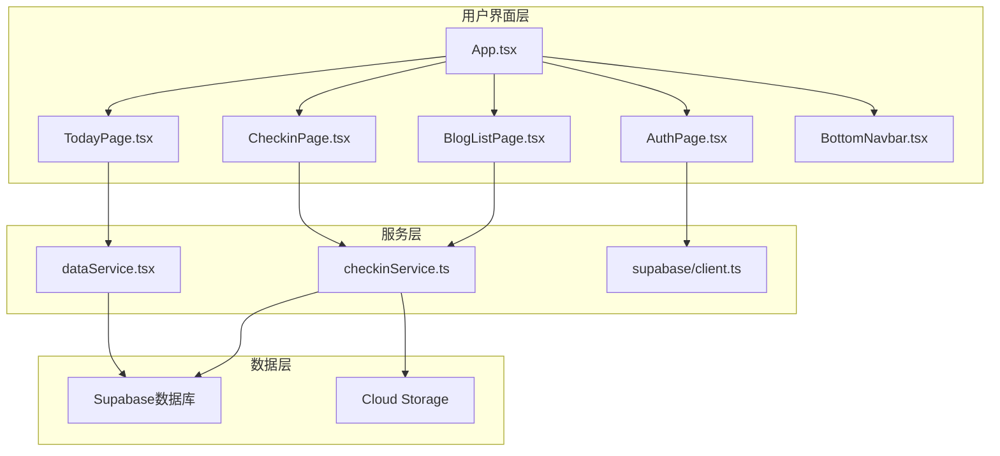
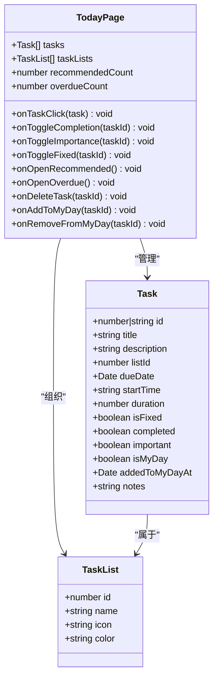
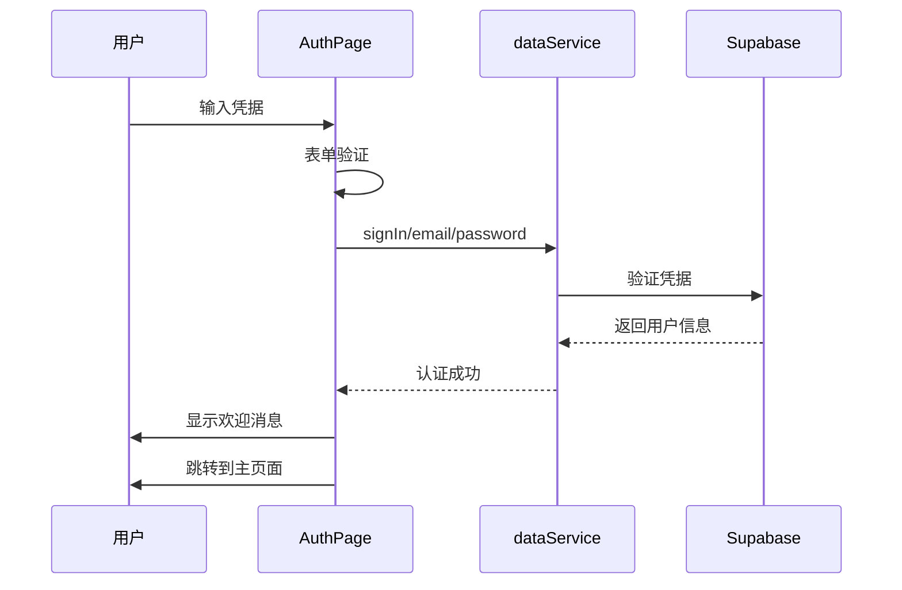
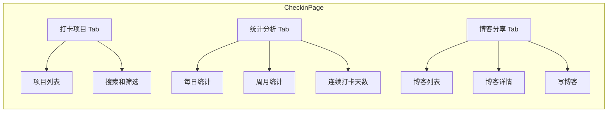
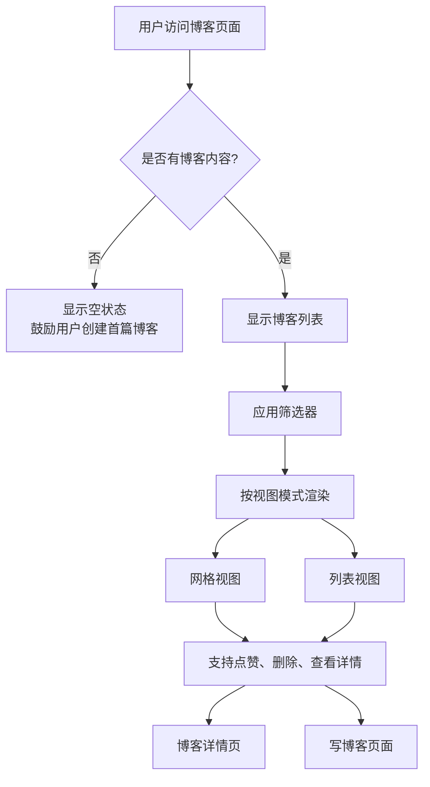
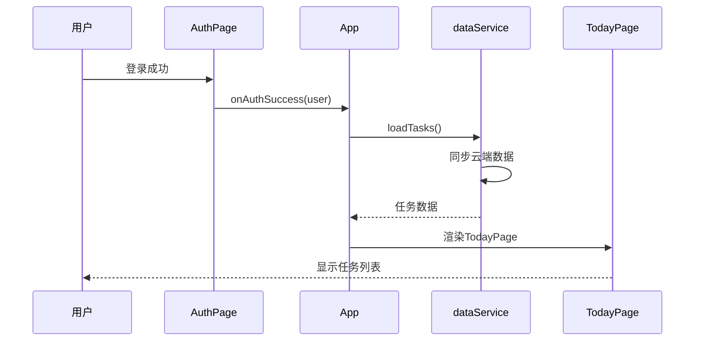
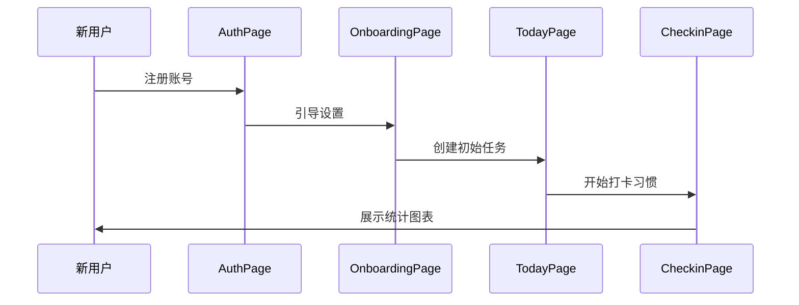

# 核心功能模块

<cite>
**本文档引用的文件**
- [TodayPage.tsx](file://src/components/TodayPage.tsx)
- [CheckinPage.tsx](file://src/components/CheckinPage.tsx)
- [BlogListPage.tsx](file://src/components/BlogListPage.tsx)
- [AuthPage.tsx](file://src/components/AuthPage.tsx)
- [App.tsx](file://src/App.tsx)
- [dataService.tsx](file://src/utils/dataService.tsx)
- [checkinService.ts](file://src/utils/checkinService.ts)
- [checkin.ts](file://src/types/checkin.ts)
- [BottomNavbar.tsx](file://src/components/BottomNavbar.tsx)
</cite>

## 目录
1. [简介](#简介)
2. [项目架构概览](#项目架构概览)
3. [任务管理系统](#任务管理系统)
4. [用户认证系统](#用户认证系统)
5. [打卡系统](#打卡系统)
6. [博客功能](#博客功能)
7. [功能间关联性](#功能间关联性)
8. [使用示例和预期行为](#使用示例和预期行为)
9. [总结](#总结)

## 简介

Focus.do 是一个综合性的个人生产力和习惯养成应用，集成了任务管理、用户认证、打卡系统和博客功能四大核心模块。该应用采用现代化的 React 技术栈，结合 Supabase 数据库和云端存储，为用户提供无缝的跨平台体验。

## 项目架构概览

**图表来源**
- [App.tsx](file://src/App.tsx#L1-L50)
- [dataService.tsx](file://src/utils/dataService.tsx#L1-L50)
- [checkinService.ts](file://src/utils/checkinService.ts#L1-L50)

## 任务管理系统

### 功能概述

任务管理系统是应用的核心功能，提供完整的任务生命周期管理，包括任务创建、编辑、完成、优先级设置和时间安排等功能。

### 主要组件

#### TodayPage.tsx - 我的一天视图

TodayPage 是任务管理系统的入口页面，专门为用户展示当天的任务列表。该页面实现了以下核心功能：

- **智能任务推荐**：根据任务的到期时间和固定时间自动推荐任务
- **过期任务提醒**：突出显示逾期未完成的任务
- **滑动操作**：支持左滑删除、右滑移除 MyDay 任务
- **长按固定**：通过长按操作将任务固定到当天
- **多维度筛选**：支持按列表、搜索关键词进行任务过滤

**图表来源**
- [TodayPage.tsx](file://src/components/TodayPage.tsx#L25-L50)
- [dataService.tsx](file://src/utils/dataService.tsx#L20-L40)

### 任务管理特性

1. **智能 MyDay 管理**：自动管理用户的"我的一天"任务集合
2. **离线支持**：在网络断开时仍可创建和编辑任务
3. **实时同步**：网络恢复后自动同步本地更改到云端
4. **丰富的交互**：支持手势操作、震动反馈和动画效果

**章节来源**
- [TodayPage.tsx](file://src/components/TodayPage.tsx#L1-L535)
- [dataService.tsx](file://src/utils/dataService.tsx#L300-L500)

## 用户认证系统

### 功能概述

用户认证系统负责管理用户的身份验证、授权和个人资料管理，确保应用的安全性和个性化体验。

### 主要组件

#### AuthPage.tsx - 登录注册页面

AuthPage 提供完整的用户认证流程，支持邮箱密码登录和注册：

- **双模式切换**：轻松在登录和注册之间切换
- **表单验证**：实时验证输入的有效性
- **Google OAuth 支持**：预留 Google 登录集成
- **流畅动画**：使用 Framer Motion 实现平滑的页面过渡

**图表来源**
- [AuthPage.tsx](file://src/components/AuthPage.tsx#L40-L80)
- [dataService.tsx](file://src/utils/dataService.tsx#L150-L200)

### 认证流程特点

1. **无刷新认证**：使用 Supabase 的标准认证机制
2. **会话持久化**：自动保存和恢复用户会话
3. **错误处理**：友好的错误提示和恢复建议
4. **安全传输**：所有敏感数据都经过加密传输

**章节来源**
- [AuthPage.tsx](file://src/components/AuthPage.tsx#L1-L271)
- [dataService.tsx](file://src/utils/dataService.tsx#L150-L250)

## 打卡系统

### 功能概述

打卡系统是一个综合性的习惯追踪和生活记录平台，支持多种类型的打卡项目、详细的统计分析和社区互动功能。

### 主要组件

#### CheckinPage.tsx - 打卡主页面

CheckinPage 是打卡系统的核心界面，提供三个主要功能区：

1. **打卡项目管理**：创建和管理各种打卡项目
2. **统计分析**：查看个人打卡数据和趋势
3. **博客分享**：撰写和分享打卡心得

**图表来源**
- [CheckinPage.tsx](file://src/components/CheckinPage.tsx#L50-L150)

#### 打卡项目类型

系统支持八种不同的打卡分类：

- **健康 (Health)**：饮食、运动、睡眠等健康相关活动
- **运动 (Fitness)**：跑步、健身、瑜伽等体育锻炼
- **学习 (Learning)**：阅读、课程、技能提升等活动
- **习惯 (Habit)**：日常习惯培养项目
- **工作 (Work)**：工作任务和职业发展
- **爱好 (Hobby)**：兴趣爱好和休闲活动
- **社交 (Social)**：人际交往和社会活动
- **其他 (Other)**：自定义的其他类型

### 打卡功能特性

1. **多样化打卡**：支持文字、照片、位置等多种形式的打卡
2. **智能提醒**：根据打卡项目的频率设置智能提醒
3. **数据分析**：提供详细的打卡统计和趋势分析
4. **社区互动**：支持博客分享和点赞评论

**章节来源**
- [CheckinPage.tsx](file://src/components/CheckinPage.tsx#L1-L420)
- [checkin.ts](file://src/types/checkin.ts#L1-L100)

## 博客功能

### 功能概述

博客功能允许用户记录和分享他们的打卡经历、生活感悟和成长故事，形成个人的数字日记和知识分享平台。

### 主要组件

#### BlogListPage.tsx - 博客列表页面

BlogListPage 提供完整的博客浏览和管理功能：

- **多视图模式**：支持网格视图和列表视图
- **智能筛选**：按心情、标签、时间范围等条件筛选博客
- **无限滚动**：支持大量博客的高效加载
- **交互式排序**：支持按创建时间、点赞数、浏览量排序

**图表来源**
- [BlogListPage.tsx](file://src/components/BlogListPage.tsx#L100-L200)

### 博客特性

1. **Markdown 支持**：完整的 Markdown 语法支持
2. **多媒体集成**：支持图片上传和位置标记
3. **社交功能**：点赞、浏览量统计
4. **标签系统**：方便的内容分类和检索

**章节来源**
- [BlogListPage.tsx](file://src/components/BlogListPage.tsx#L1-L571)

## 功能间关联性

### 认证与任务管理的关联

当用户成功认证后，系统会自动：
1. 加载用户的个人任务数据
2. 同步本地离线任务到云端
3. 更新用户的引导状态
4. 导航到主任务页面

**图表来源**
- [App.tsx](file://src/App.tsx#L200-L250)
- [dataService.tsx](file://src/utils/dataService.tsx#L300-L400)

### 打卡与博客的关联

打卡系统与博客功能紧密集成：

1. **数据关联**：博客可以关联特定的打卡记录
2. **内容丰富**：用户可以在博客中分享打卡心得
3. **统计整合**：博客数据纳入整体统计分析
4. **社区互动**：支持博客之间的互动和分享

**章节来源**
- [CheckinPage.tsx](file://src/components/CheckinPage.tsx#L300-L400)

## 使用示例和预期行为

### 示例 1：新用户首次使用

**预期行为**：
- 用户注册后自动进入引导流程
- 系统创建基础任务模板
- 用户可以开始打卡习惯
- 系统自动收集和分析数据

### 示例 2：日常任务管理

1. **打开应用**：用户看到 TodayPage 的任务列表
2. **完成任务**：点击任务复选框标记完成
3. **添加新任务**：使用浮动按钮创建新任务
4. **管理优先级**：使用星标标记重要任务
5. **固定任务**：长按任务将其固定到当天

### 示例 3：打卡习惯养成

1. **创建打卡项目**：在 CheckinPage 中添加新的打卡项目
2. **每日打卡**：按时完成打卡并记录心情
3. **查看统计**：定期查看打卡统计和趋势
4. **分享心得**：撰写博客分享打卡经验

### 示例 4：博客创作

1. **浏览博客**：在 BlogListPage 中查看他人博客
2. **创建博客**：使用 CreateBlogDrawer 撰写新博客
3. **添加媒体**：插入图片和位置信息
4. **分享互动**：点赞、评论和分享博客

**章节来源**
- [App.tsx](file://src/App.tsx#L100-L200)
- [TodayPage.tsx](file://src/components/TodayPage.tsx#L100-L200)

## 总结

Focus.do 的四大核心功能模块形成了一个完整而协调的生态系统：

- **任务管理系统**提供高效的日常任务管理
- **用户认证系统**确保应用的安全性和个性化
- **打卡系统**帮助用户建立和维持良好的习惯
- **博客功能**促进知识分享和社区互动

这些功能相互补充，共同构成了一个全方位的个人生产力和习惯养成解决方案。通过统一的用户界面和流畅的交互设计，用户可以轻松地在不同功能模块间切换，实现高效的时间管理和自我提升。