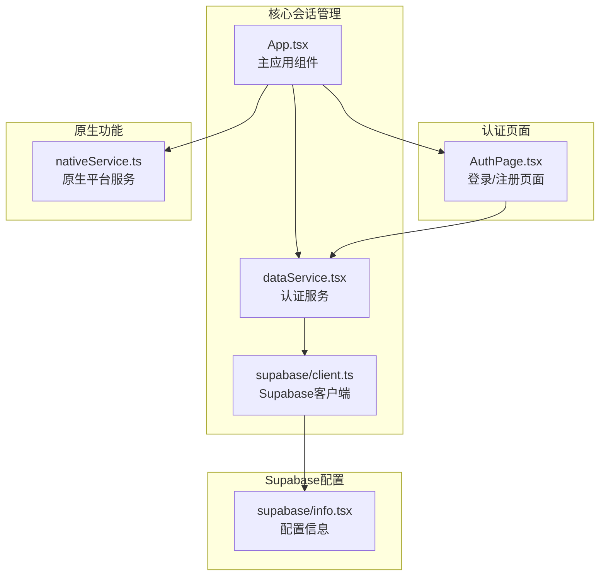
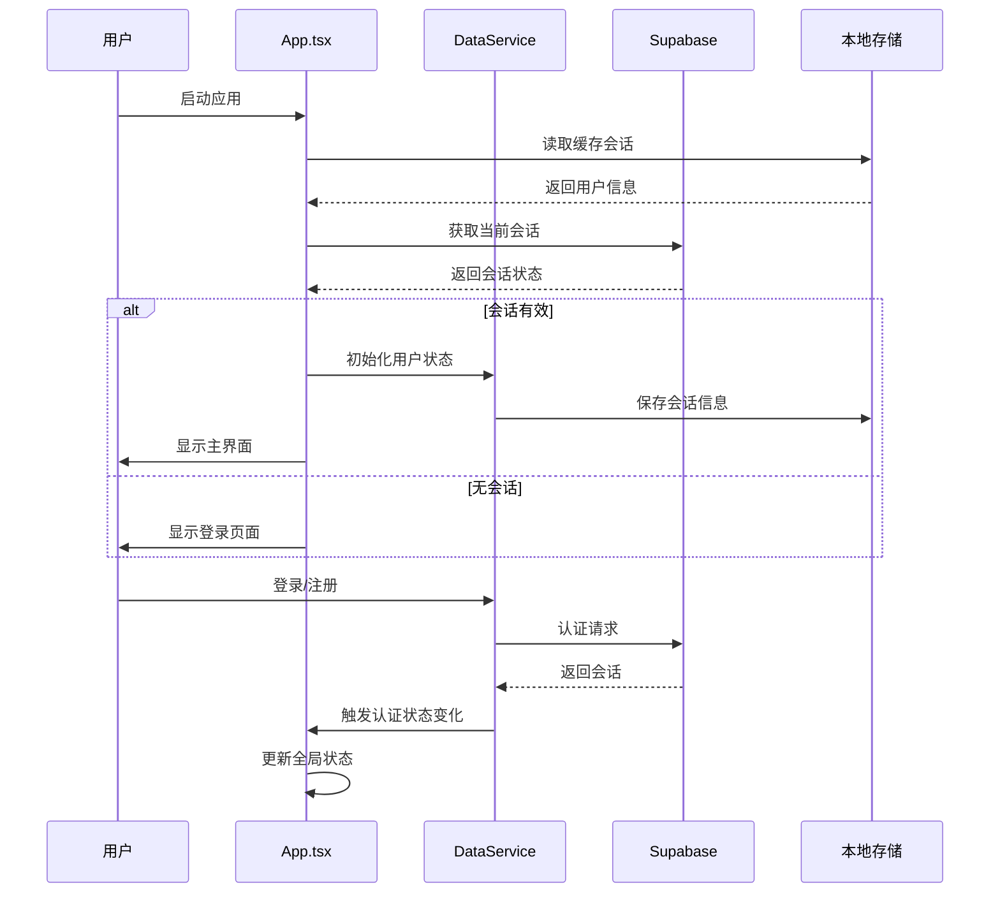
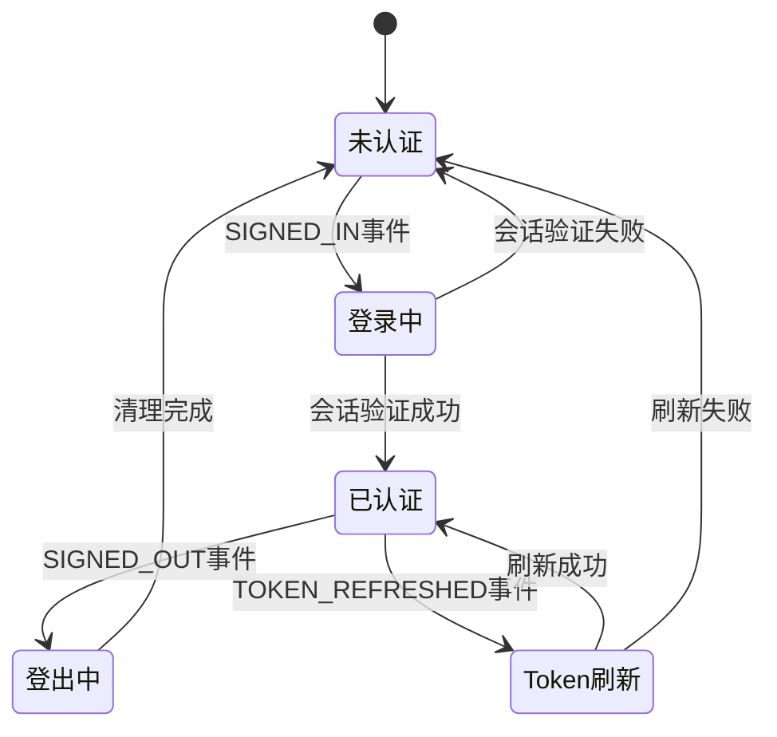
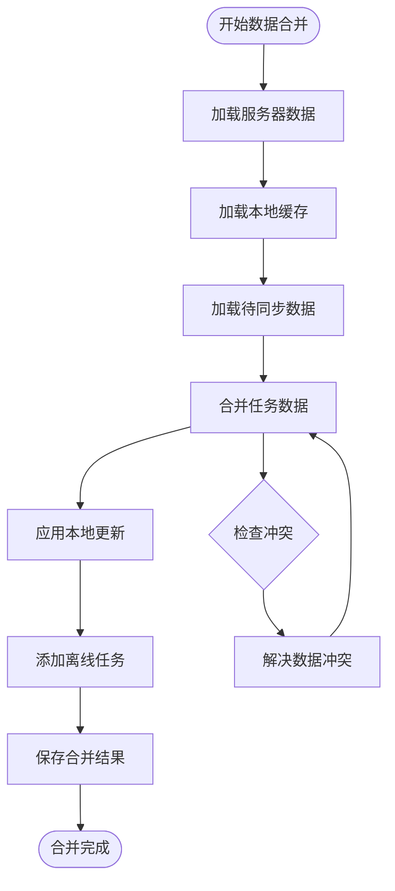

# 会话管理机制

<cite>
**本文档引用的文件**
- [src/App.tsx](file://src/App.tsx)
- [src/utils/dataService.tsx](file://src/utils/dataService.tsx)
- [src/utils/supabase/client.ts](file://src/utils/supabase/client.ts)
- [src/utils/supabase/info.tsx](file://src/utils/supabase/info.tsx)
- [src/components/AuthPage.tsx](file://src/components/AuthPage.tsx)
- [src/utils/nativeService.ts](file://src/utils/nativeService.ts)
</cite>

## 目录
1. [简介](#简介)
2. [项目结构概览](#项目结构概览)
3. [核心会话管理组件](#核心会话管理组件)
4. [架构概览](#架构概览)
5. [详细组件分析](#详细组件分析)
6. [会话状态流转](#会话状态流转)
7. [离线数据同步机制](#离线数据同步机制)
8. [性能优化策略](#性能优化策略)
9. [故障排除指南](#故障排除指南)
10. [总结](#总结)

## 简介

本文档深入分析了一个基于React和Supabase的现代化任务管理应用程序的会话管理机制。该系统通过精心设计的状态管理、数据同步和离线支持，为用户提供无缝的跨设备体验。

应用程序采用以下核心技术栈：
- **React**：现代JavaScript框架，支持组件化开发
- **Supabase**：开源Firebase替代方案，提供实时数据库和认证服务
- **TypeScript**：强类型语言，提升代码质量和开发效率
- **Capacitor**：跨平台移动应用框架，支持原生功能集成

## 项目结构概览

应用程序采用模块化的文件组织结构，核心会话管理相关的文件分布如下：



**图表来源**
- [src/App.tsx](file://src/App.tsx#L1-L50)
- [src/utils/dataService.tsx](file://src/utils/dataService.tsx#L1-L50)
- [src/utils/supabase/client.ts](file://src/utils/supabase/client.ts#L1-L12)

## 核心会话管理组件

### 主应用组件 (App.tsx)

App.tsx是整个会话管理的核心控制器，负责：

1. **状态初始化**：在组件挂载时读取本地存储的会话信息
2. **事件监听**：持续监控Supabase认证状态变化
3. **状态协调**：协调用户状态、任务数据和UI状态的同步
4. **生命周期管理**：处理应用启动、关闭和重连过程

```typescript
// 核心状态定义
const [user, setUser] = useState<User | null>(null);
const [isAuthenticated, setIsAuthenticated] = useState(false);
const [showOnboarding, setShowOnboarding] = useState(false);
const [isLoading, setIsLoading] = useState(true);
```

### 数据服务层 (dataService.tsx)

DataService类提供了完整的会话管理和数据同步功能：

1. **会话持久化**：自动保存和恢复用户会话
2. **离线支持**：智能处理网络中断情况
3. **数据同步**：双向同步本地和远程数据
4. **错误恢复**：优雅处理各种异常情况

**章节来源**
- [src/App.tsx](file://src/App.tsx#L240-L283)
- [src/utils/dataService.tsx](file://src/utils/dataService.tsx#L50-L94)

## 架构概览

系统采用分层架构设计，确保各组件职责清晰且松耦合：



**图表来源**
- [src/App.tsx](file://src/App.tsx#L284-L316)
- [src/utils/dataService.tsx](file://src/utils/dataService.tsx#L175-L230)

## 详细组件分析

### Supabase认证监听机制

应用程序通过两个层次的认证监听机制确保会话状态的准确性：

#### 1. App.tsx中的认证监听

```typescript
useEffect(() => {
  const { data: { subscription } } = supabase.auth.onAuthStateChange(
    async (event, session) => {
      console.log('Auth state changed:', event, session?.user?.id);
      
      if (event === 'SIGNED_IN' && session) {
        // 用户登录处理
        if (!user || user.id !== session.user.id) {
          const userData: User = {
            id: session.user.id,
            email: session.user.email || '',
            name: session.user.user_metadata?.name || session.user.email || '',
            onboarding_completed: session.user.user_metadata?.onboarding_completed || false
          };
          
          setUser(userData);
          setIsAuthenticated(true);
          setShowOnboarding(!userData.onboarding_completed);
        }
      } else if (event === 'SIGNED_OUT' || !session) {
        // 用户登出处理
        setUser(null);
        setIsAuthenticated(false);
        setTasks([]);
        setShowOnboarding(false);
      } else if (event === 'TOKEN_REFRESHED' && session) {
        // Token刷新处理
        console.log('Token refreshed successfully, keeping current state');
      }
    }
  );
  
  return () => subscription.unsubscribe();
}, [user]);
```

#### 2. DataService中的认证监听

DataService类内部维护了独立的认证监听机制：

```typescript
// 监听Supabase认证状态变化
supabase.auth.onAuthStateChange((event, session) => {
  console.log('Auth state changed:', event, session);
  
  if (session) {
    this.accessToken = session.access_token;
    this.user = {
      id: session.user.id,
      email: session.user.email || '',
      name: session.user.user_metadata?.name || session.user.email || '',
      onboarding_completed: session.user.user_metadata?.onboarding_completed || false
    };
    
    // 保存到缓存
    this.saveToCache('taskmaster_user', this.user);
    this.saveToCache('taskmaster_token', this.accessToken);
  } else {
    this.accessToken = null;
    this.user = null;
    // 清理缓存
    localStorage.removeItem('taskmaster_user');
    localStorage.removeItem('taskmaster_token');
  }
});
```

**章节来源**
- [src/App.tsx](file://src/App.tsx#L324-L386)
- [src/utils/dataService.tsx](file://src/utils/dataService.tsx#L88-L108)

### 会话持久化机制

系统实现了多层次的会话持久化策略：

#### 1. 本地存储缓存

```typescript
private saveToCache(key: string, data: any) {
  try {
    localStorage.setItem(key, JSON.stringify(data));
  } catch (error) {
    console.error('Error saving to cache:', error);
  }
}

private loadCachedData() {
  try {
    const cachedUser = localStorage.getItem('taskmaster_user');
    const cachedToken = localStorage.getItem('taskmaster_token');
    
    if (cachedUser && cachedToken) {
      this.user = JSON.parse(cachedUser);
      this.accessToken = cachedToken;
    }
  } catch (error) {
    console.error('Error loading cached data:', error);
  }
}
```

#### 2. 自动会话恢复

```typescript
const initializeApp = async () => {
  try {
    // 使用Supabase标准方式获取session
    const { data: { session } } = await supabase.auth.getSession();
    
    if (session) {
      console.log('Found valid session, initializing user...');
      
      // 从session中构建用户信息
      const userData: User = {
        id: session.user.id,
        email: session.user.email || '',
        name: session.user.user_metadata?.name || session.user.email || '',
        onboarding_completed: session.user.user_metadata?.onboarding_completed || false
      };
      
      setUser(userData);
      setIsAuthenticated(true);
      setShowOnboarding(!userData.onboarding_completed);
    }
  } catch (error) {
    console.error('Error initializing app:', error);
  } finally {
    setIsLoading(false);
  }
};
```

**章节来源**
- [src/utils/dataService.tsx](file://src/utils/dataService.tsx#L88-L135)
- [src/App.tsx](file://src/App.tsx#L284-L316)

### 用户对象构建逻辑

用户对象的构建遵循以下优先级顺序：

1. **用户元数据**：从`session.user.user_metadata`中提取自定义数据
2. **邮箱地址**：作为备用标识符
3. **用户名**：最终回退值

```typescript
const userData: User = {
  id: session.user.id,
  email: session.user.email || '',
  name: session.user.user_metadata?.name || session.user.email || '',
  onboarding_completed: session.user.user_metadata?.onboarding_completed || false
};
```

特别关注`onboarding_completed`元数据的处理，这是决定是否显示引导界面的关键标志。

**章节来源**
- [src/App.tsx](file://src/App.tsx#L300-L310)
- [src/utils/dataService.tsx](file://src/utils/dataService.tsx#L95-L105)

## 会话状态流转

### 认证状态变化流程

系统支持三种主要的认证状态变化：



### 状态转换处理

#### SIGNED_IN状态处理

当检测到用户登录时，系统执行以下步骤：

1. **身份验证**：确认新用户的唯一性
2. **用户信息提取**：从会话中构建完整的用户对象
3. **状态更新**：更新全局应用状态
4. **引导界面控制**：根据`onboarding_completed`标志决定显示状态
5. **数据加载**：异步加载用户任务数据

#### SIGNED_OUT状态处理

用户登出时，系统执行全面的状态清理：

```typescript
else if (event === 'SIGNED_OUT' || !session) {
  console.log('User signed out or session invalid');
  setUser(null);
  setIsAuthenticated(false);
  setTasks([]);
  setShowOnboarding(false);
  setViewMode("today");
  setDrawerMode(null);
  setSelectedTask(null);
}
```

#### TOKEN_REFRESHED状态处理

Token刷新不会影响当前应用状态，仅记录日志：

```typescript
else if (event === 'TOKEN_REFRESHED' && session) {
  console.log('Token refreshed successfully, keeping current state');
}
```

**章节来源**
- [src/App.tsx](file://src/App.tsx#L324-L386)

## 离线数据同步机制

### 智能数据合并策略

系统实现了复杂的离线数据合并算法，确保本地更改不会丢失：



**图表来源**
- [src/utils/dataService.tsx](file://src/utils/dataService.tsx#L400-L450)

### 待同步数据管理

系统跟踪三种类型的待同步数据：

1. **待更新任务**：本地修改但未同步的任务
2. **待创建任务**：离线创建的新任务
3. **待删除任务**：本地删除但未同步的任务

```typescript
// 智能合并服务器数据和本地离线更改
private mergeTasksWithOfflineChanges(serverTasks: Task[]): Task[] {
  const cachedTasks = this.getCachedTasks();
  const pendingUpdates = this.getFromCache('taskmaster_pending_updates') || {};
  const pendingCreates = this.getFromCache('taskmaster_pending_creates') || [];
  
  // 从服务器任务开始
  let mergedTasks = [...serverTasks];
  
  // 应用本地待同步的更新
  Object.entries(pendingUpdates).forEach(([taskId, updates]) => {
    const index = mergedTasks.findIndex(task => task.id.toString() === taskId);
    if (index !== -1 && updates && typeof updates === 'object') {
      mergedTasks[index] = {
        ...mergedTasks[index],
        ...(updates as Partial<Task>),
        updatedAt: new Date().toISOString()
      };
    }
  });
  
  // 添加本地创建的离线任务
  pendingCreates.forEach((offlineTask: Task) => {
    const normalizedOfflineTask = {
      ...offlineTask,
      dueDate: new Date(offlineTask.dueDate),
      startDate: offlineTask.startDate ? new Date(offlineTask.startDate) : undefined,
      addedToMyDayAt: offlineTask.addedToMyDayAt ? new Date(offlineTask.addedToMyDayAt) : undefined,
    };
    mergedTasks.push(normalizedOfflineTask);
  });
  
  return mergedTasks;
}
```

**章节来源**
- [src/utils/dataService.tsx](file://src/utils/dataService.tsx#L400-L450)

### MyDay任务过期处理

系统实现了智能的MyDay任务过期检查和自动刷新机制：

```typescript
// MyDay过期检查和刷新逻辑
private async refreshExpiredMyDayTasks(tasks: Task[]): Promise<Task[]> {
  const today = new Date();
  today.setHours(0, 0, 0, 0);
  
  const expiredMyDayTasks: Task[] = [];
  const refreshedTasks: Task[] = [];
  
  for (const task of tasks) {
    if (task.isMyDay && task.addedToMyDayAt) {
      const addedDate = new Date(task.addedToMyDayAt);
      addedDate.setHours(0, 0, 0, 0);
      
      // 如果添加日期在今天之前且任务未完成，则认为过期
      if (addedDate < today && !task.completed) {
        const expiredTask = {
          ...task,
          isMyDay: false,
          addedToMyDayAt: undefined
        };
        
        expiredMyDayTasks.push(expiredTask);
        refreshedTasks.push(expiredTask);
      } else {
        refreshedTasks.push(task);
      }
    } else {
      refreshedTasks.push(task);
    }
  }
  
  // 如果有过期任务，批量更新数据库
  if (expiredMyDayTasks.length > 0) {
    for (const expiredTask of expiredMyDayTasks) {
      await supabase
        .from('tasks')
        .update({
          is_my_day: false,
          added_to_my_day_at: null
        })
        .eq('id', expiredTask.id);
    }
  }
  
  return refreshedTasks;
}
```

**章节来源**
- [src/utils/dataService.tsx](file://src/utils/dataService.tsx#L450-L520)

## 性能优化策略

### 超时保护机制

系统为关键操作设置了合理的超时保护，提升用户体验：

```typescript
// 获取当前Session - 添加超时保护
async getCurrentSession() {
  try {
    console.log('getCurrentSession: Calling supabase.auth.getSession()...');
    
    // 添加超时保护 - 5秒超时
    const timeoutPromise = new Promise((_, reject) => {
      setTimeout(() => reject(new Error('getSession timeout')), 5000);
    });
    
    const sessionPromise = supabase.auth.getSession();
    
    const result = await Promise.race([sessionPromise, timeoutPromise]) as any;
    const { data: { session }, error } = result;
    
    if (error) {
      console.error('getCurrentSession: Error getting session:', error);
      return null;
    }
    
    return session;
  } catch (error) {
    console.error('getCurrentSession: Exception:', error);
    return null;
  }
}
```

### 异步任务处理

应用采用非阻塞的方式加载初始数据：

```typescript
// 不等待任务加载，直接进入主页，在后台加载任务
console.log('User initialized, loading tasks in background...');
// 在后台加载任务，不阻塞主页显示
loadTasks().catch(error => {
  console.error('Background task loading failed:', error);
});
```

### 网络状态监听

系统实时监听网络状态变化：

```typescript
constructor() {
  // Listen for online/offline events
  window.addEventListener('online', () => {
    this.isOnline = true;
    this.syncData();
  });
  
  window.addEventListener('offline', () => {
    this.isOnline = false;
  });
}
```

**章节来源**
- [src/utils/dataService.tsx](file://src/utils/dataService.tsx#L230-L260)
- [src/App.tsx](file://src/App.tsx#L314-L316)
- [src/utils/dataService.tsx](file://src/utils/dataService.tsx#L50-L58)

## 故障排除指南

### 常见会话问题及解决方案

#### 1. 会话丢失问题

**症状**：用户频繁需要重新登录
**原因**：可能由于Token过期或浏览器隐私设置
**解决方案**：
- 检查浏览器Cookie设置
- 确认Supabase配置正确
- 验证网络连接稳定性

#### 2. 离线数据不同步

**症状**：本地更改在其他设备上不可见
**原因**：网络延迟或同步队列积压
**解决方案**：
- 检查网络连接状态
- 手动触发数据同步
- 清理本地缓存后重新同步

#### 3. MyDay任务异常

**症状**：MyDay任务显示不正确或过期
**原因**：时间计算错误或数据库同步问题
**解决方案**：
- 检查系统时间和时区设置
- 手动刷新任务数据
- 重新登录以重建会话

### 调试技巧

#### 启用详细日志

```typescript
// 在App.tsx中启用详细日志
console.log('Auth state changed:', event, session?.user?.id);
console.log('Found valid session, initializing user...');
console.log('User initialized, loading tasks in background...');
```

#### 检查本地存储

```javascript
// 检查会话缓存
localStorage.getItem('taskmaster_user');
localStorage.getItem('taskmaster_token');
localStorage.getItem('taskmaster_tasks');
```

#### 监控网络状态

```typescript
// 检查网络连接
navigator.onLine;
window.addEventListener('online', () => console.log('Online'));
window.addEventListener('offline', () => console.log('Offline'));
```

**章节来源**
- [src/App.tsx](file://src/App.tsx#L324-L386)
- [src/utils/dataService.tsx](file://src/utils/dataService.tsx#L88-L135)

## 总结

本文档详细分析了基于React和Supabase的现代化任务管理应用的会话管理机制。该系统通过以下关键特性实现了可靠的用户认证和数据同步：

### 核心优势

1. **多层认证监听**：双重认证监听机制确保状态一致性
2. **智能离线支持**：完善的离线数据同步和合并策略
3. **性能优化**：超时保护和异步处理提升用户体验
4. **错误恢复**：优雅的错误处理和自动恢复机制
5. **跨平台兼容**：支持Web和原生平台的统一会话管理

### 技术亮点

- **实时状态同步**：通过Supabase实时数据库实现实时数据同步
- **智能缓存策略**：多层次缓存确保应用性能和可靠性
- **MyDay智能管理**：自动过期检查和刷新机制
- **原生功能集成**：Capacitor框架提供的原生平台支持

### 最佳实践

该会话管理系统展示了现代Web应用开发的最佳实践，包括：
- 分层架构设计
- 错误边界处理
- 用户体验优化
- 开发者工具集成

通过深入理解这些机制，开发者可以构建更加健壮和用户友好的任务管理应用。