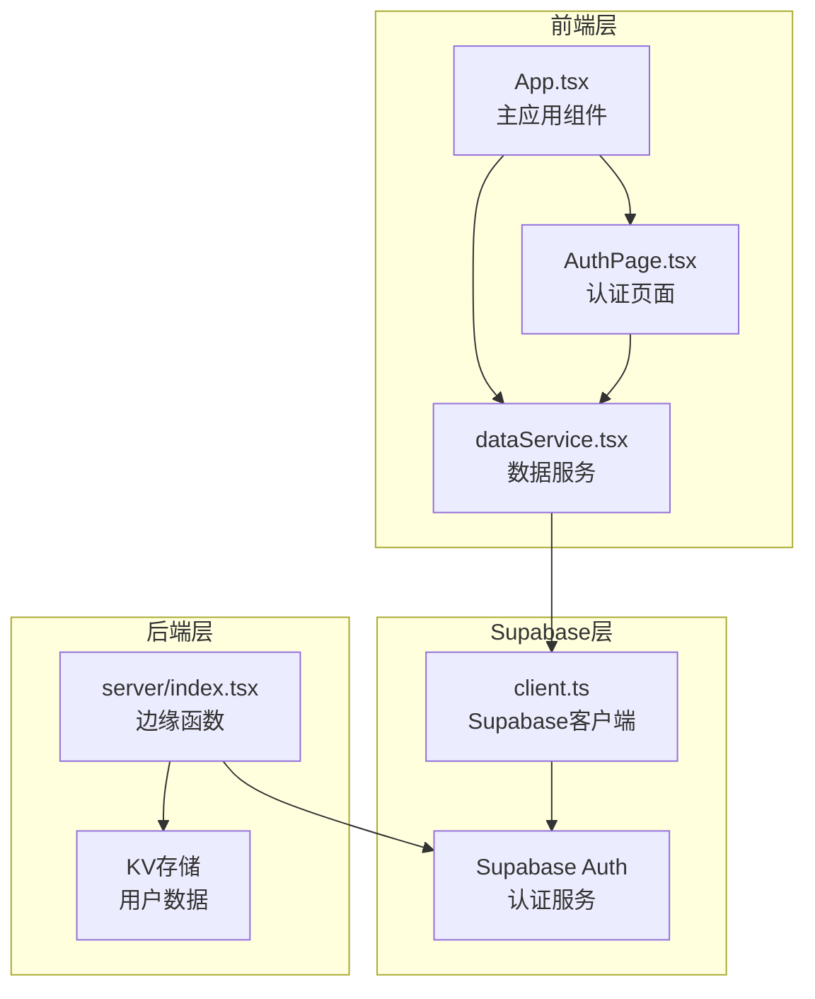
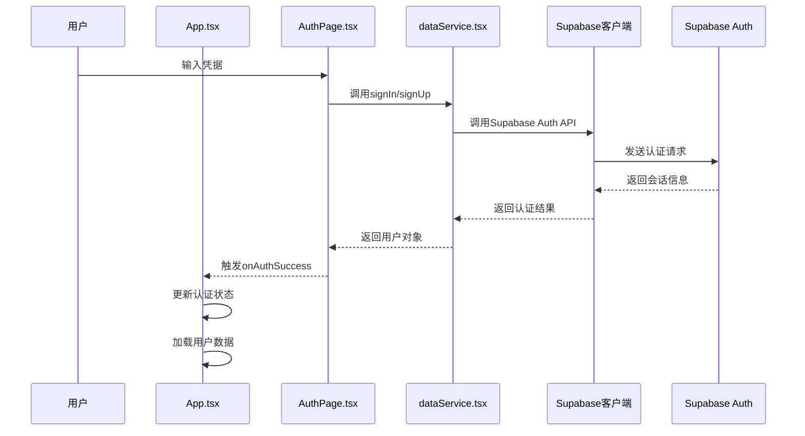
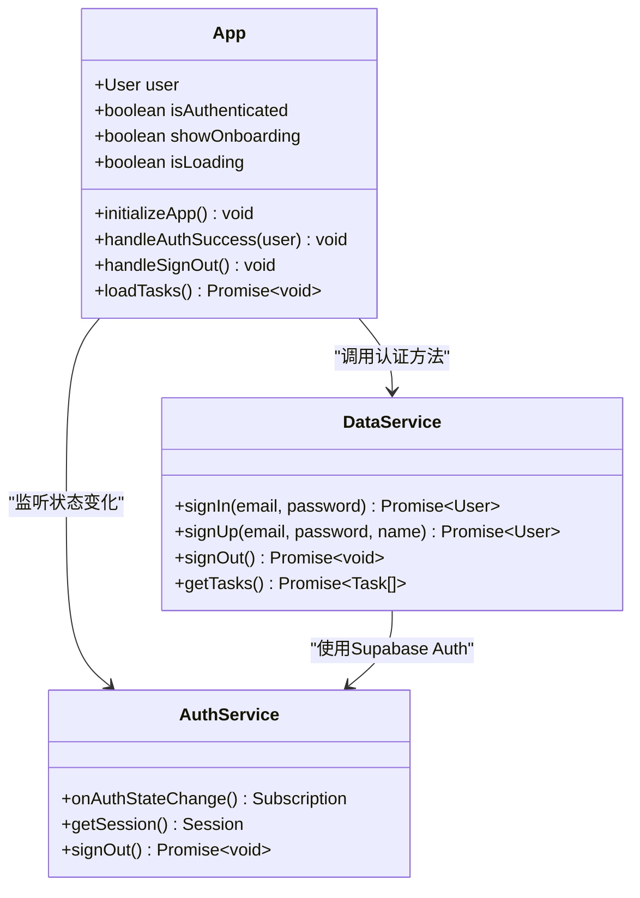
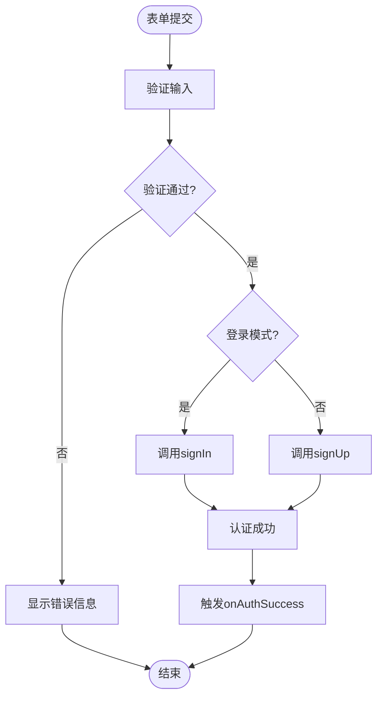
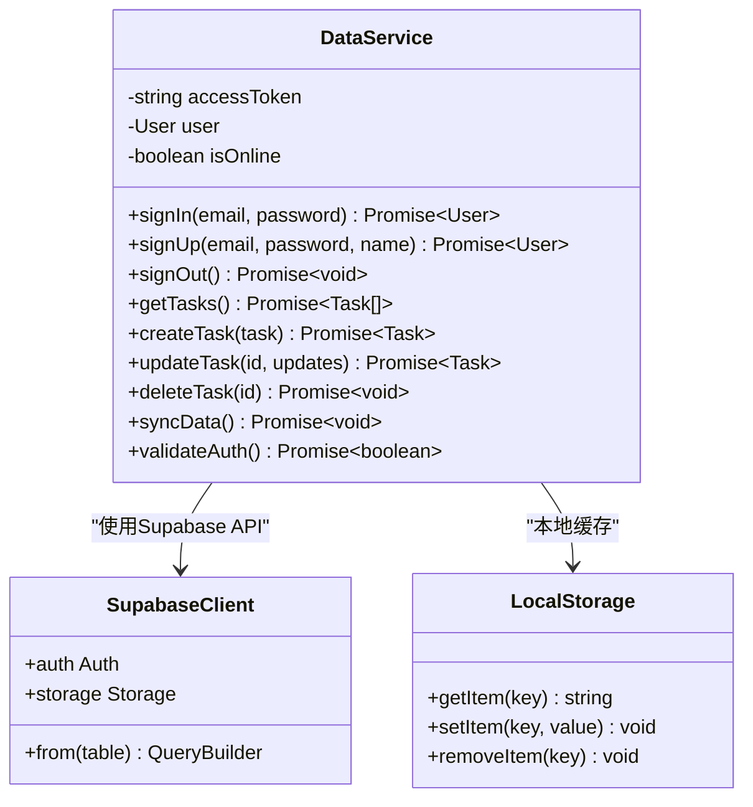
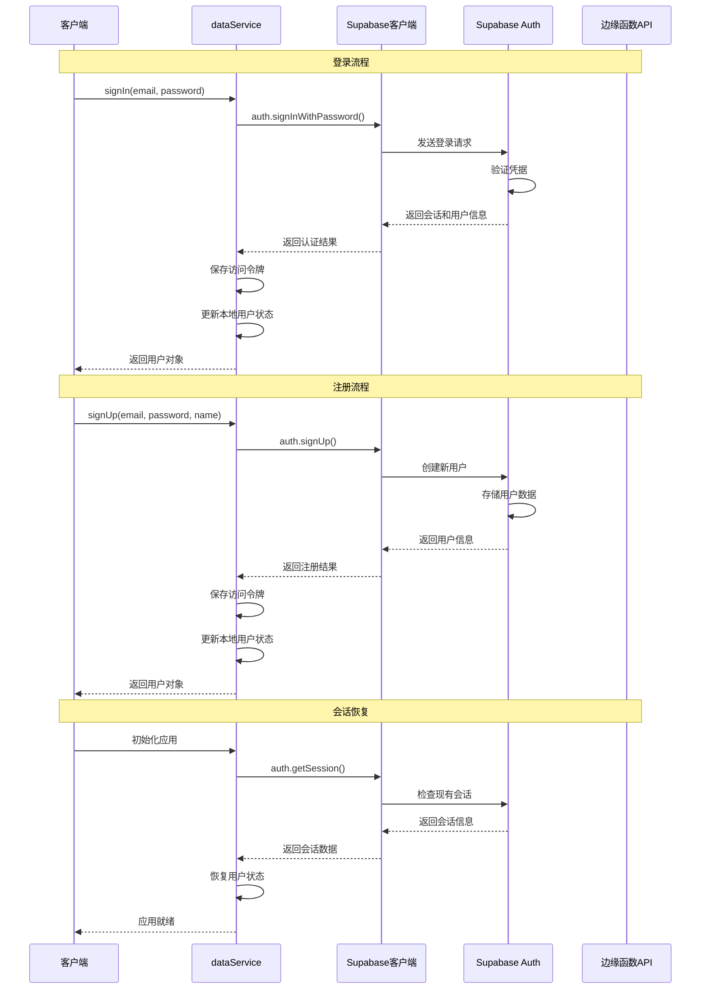

# 基于Supabase Auth的用户认证系统

<cite>
**本文档引用的文件**
- [App.tsx](file://src/App.tsx)
- [AuthPage.tsx](file://src/components/AuthPage.tsx)
- [dataService.tsx](file://src/utils/dataService.tsx)
- [client.ts](file://src/utils/supabase/client.ts)
- [index.tsx](file://src/supabase/functions/server/index.tsx)
</cite>

## 目录
1. [简介](#简介)
2. [项目结构概览](#项目结构概览)
3. [核心组件分析](#核心组件分析)
4. [架构概览](#架构概览)
5. [详细组件分析](#详细组件分析)
6. [认证流程时序图](#认证流程时序图)
7. [安全最佳实践](#安全最佳实践)
8. [故障排除指南](#故障排除指南)
9. [总结](#总结)

## 简介

本项目是一个基于React的待办事项管理应用，采用Supabase Auth作为认证后端，实现了完整的用户注册、登录、会话管理和状态持久化功能。系统设计注重用户体验和安全性，提供了流畅的认证体验和可靠的数据同步机制。

## 项目结构概览



**图表来源**
- [App.tsx](file://src/App.tsx#L1-L50)
- [AuthPage.tsx](file://src/components/AuthPage.tsx#L1-L30)
- [dataService.tsx](file://src/utils/dataService.tsx#L1-L50)

**章节来源**
- [App.tsx](file://src/App.tsx#L1-L100)
- [AuthPage.tsx](file://src/components/AuthPage.tsx#L1-L50)

## 核心组件分析

### 全局认证状态管理

App.tsx负责整个应用的认证状态管理，使用React状态钩子维护用户会话：

```typescript
// 认证状态
const [user, setUser] = useState<User | null>(null);
const [isAuthenticated, setIsAuthenticated] = useState(false);
const [showOnboarding, setShowOnboarding] = useState(false);
const [isLoading, setIsLoading] = useState(true);
```

### 认证页面组件

AuthPage.tsx提供完整的注册/登录表单，支持以下功能：
- 表单验证（必填字段、密码匹配、长度要求）
- 错误处理和用户反馈
- 切换登录/注册模式
- Google OAuth占位符（待实现）

### 数据服务层

dataService.tsx封装了与Supabase的交互，提供：
- 用户认证方法（signIn、signUp、signOut）
- 任务管理功能
- 离线数据同步
- 缓存管理

**章节来源**
- [App.tsx](file://src/App.tsx#L240-L280)
- [AuthPage.tsx](file://src/components/AuthPage.tsx#L15-L85)
- [dataService.tsx](file://src/utils/dataService.tsx#L40-L100)

## 架构概览



**图表来源**
- [App.tsx](file://src/App.tsx#L314-L386)
- [AuthPage.tsx](file://src/components/AuthPage.tsx#L45-L85)
- [dataService.tsx](file://src/utils/dataService.tsx#L175-L230)

## 详细组件分析

### App.tsx - 全局认证状态管理

App.tsx是整个应用的核心组件，负责管理全局认证状态和用户会话：



**图表来源**
- [App.tsx](file://src/App.tsx#L240-L316)
- [dataService.tsx](file://src/utils/dataService.tsx#L175-L230)

#### 关键特性：

1. **自动会话恢复**：应用启动时自动检查现有会话
2. **状态监听**：实时监听Supabase认证状态变化
3. **错误处理**：优雅处理认证失败和网络错误
4. **用户体验优化**：快速加载和渐进式渲染

### AuthPage.tsx - 注册/登录表单实现

AuthPage.tsx提供了完整的认证表单界面，包含以下核心功能：



**图表来源**
- [AuthPage.tsx](file://src/components/AuthPage.tsx#L45-L85)

#### 表单验证逻辑：

1. **必填字段检查**：确保邮箱和密码字段不为空
2. **注册模式特殊验证**：
   - 名称字段验证
   - 密码匹配检查
   - 密码长度限制（至少6字符）
3. **实时反馈**：使用Toast通知提供即时反馈

### dataService.tsx - Supabase集成层

dataService.tsx是连接前端和Supabase的关键组件，实现了完整的认证和数据管理功能：



**图表来源**
- [dataService.tsx](file://src/utils/dataService.tsx#L40-L100)
- [client.ts](file://src/utils/supabase/client.ts#L1-L12)

#### 核心功能模块：

1. **认证管理**：
   - 使用Supabase标准认证API
   - 自动令牌刷新
   - 会话持久化

2. **数据同步**：
   - 离线优先策略
   - 智能合并算法
   - 批量同步机制

3. **错误处理**：
   - 网络状态检测
   - 降级策略
   - 用户友好的错误消息

**章节来源**
- [App.tsx](file://src/App.tsx#L314-L430)
- [AuthPage.tsx](file://src/components/AuthPage.tsx#L45-L120)
- [dataService.tsx](file://src/utils/dataService.tsx#L175-L309)

### Supabase客户端配置

client.ts文件配置了Supabase客户端，启用了关键的安全和性能特性：

```typescript
export const supabase = createClient(supabaseUrl, publicAnonKey, {
  auth: {
    autoRefreshToken: true,    // 自动刷新令牌
    persistSession: true,      // 持久化会话
    detectSessionInUrl: false  // 禁用URL会话检测
  }
})
```

**章节来源**
- [client.ts](file://src/utils/supabase/client.ts#L1-L12)

## 认证流程时序图



**图表来源**
- [dataService.tsx](file://src/utils/dataService.tsx#L175-L230)
- [App.tsx](file://src/App.tsx#L279-L316)

## 安全最佳实践

### 敏感信息存储

1. **环境变量保护**：
   - 使用Supabase项目ID和匿名密钥
   - 配置边缘函数的环境变量
   - 避免硬编码敏感信息

2. **令牌安全**：
   - 自动令牌刷新机制
   - 会话持久化但安全存储
   - 过期时间检查

3. **数据传输安全**：
   - HTTPS加密通信
   - 请求头认证
   - CSRF防护

### 防止暴力破解

1. **客户端验证**：
   - 密码强度检查
   - 输入限制
   - 防重复提交

2. **服务端防护**：
   - Supabase内置速率限制
   - 边缘函数限流
   - 异常行为检测

### 数据保护

1. **权限控制**：
   - Row Level Security (RLS)策略
   - 用户数据隔离
   - 权限验证

2. **数据加密**：
   - 传输层加密
   - 敏感字段加密
   - 客户端缓存加密

**章节来源**
- [dataService.tsx](file://src/utils/dataService.tsx#L133-L183)
- [index.tsx](file://src/supabase/functions/server/index.tsx#L1-L50)

## 故障排除指南

### 常见认证问题

#### 1. 会话过期问题

**症状**：用户频繁需要重新登录
**原因**：令牌过期或会话丢失
**解决方案**：
```typescript
// 检查令牌有效性
async validateAuth(): Promise<boolean> {
  try {
    const session = await this.getCurrentSession();
    return session !== null && 
           session.expires_at ? 
           new Date(session.expires_at * 1000) > new Date() : false;
  } catch (error) {
    return false;
  }
}
```

#### 2. 第三方登录失败

**症状**：Google OAuth或其他第三方登录无响应
**原因**：OAuth配置缺失或网络问题
**解决方案**：
- 实现Google OAuth回调
- 检查OAuth配置
- 提供备用登录方式

#### 3. 网络连接问题

**症状**：离线时无法访问应用
**原因**：网络中断或DNS问题
**解决方案**：
```typescript
// 网络状态检测
private isOnline: boolean = navigator.onLine;

window.addEventListener('online', () => {
  this.isOnline = true;
  this.syncData(); // 自动同步
});
```

#### 4. 数据同步冲突

**症状**：本地和服务器数据不一致
**原因**：并发编辑或网络延迟
**解决方案**：
```typescript
// 智能合并算法
private mergeTasksWithOfflineChanges(serverTasks: Task[]): Task[] {
  // 合并服务器数据和本地离线更改
  // 保护重要本地修改
  // 处理冲突情况
}
```

### 调试方法

1. **启用详细日志**：
```typescript
console.log('Auth state changed:', event, session?.user?.id);
console.log('getCurrentSession: Result - session:', session ? 'exists' : 'null');
```

2. **检查网络请求**：
- 使用浏览器开发者工具
- 监控API响应状态
- 分析错误信息

3. **验证认证状态**：
```typescript
// 检查认证状态
console.log('Is authenticated:', this.isAuthenticated());
console.log('User:', this.getCurrentUser());
console.log('Session:', this.getCurrentSession());
```

**章节来源**
- [dataService.tsx](file://src/utils/dataService.tsx#L224-L269)
- [App.tsx](file://src/App.tsx#L314-L386)

## 总结

本项目实现了一个完整、安全、高性能的基于Supabase Auth的用户认证系统。系统的主要优势包括：

### 技术亮点

1. **现代化架构**：采用React Hooks和TypeScript，确保类型安全和开发效率
2. **离线优先**：智能的离线数据同步和缓存机制
3. **用户体验**：流畅的认证流程和实时状态更新
4. **安全性**：多层安全防护和数据保护机制

### 功能特性

- 完整的注册/登录流程
- 自动会话管理和令牌刷新
- 离线数据同步和冲突解决
- 智能错误处理和用户反馈
- 现代化的UI设计和动画效果

### 扩展建议

1. **增强认证**：实现双因素认证和生物识别
2. **社交登录**：完善Google OAuth和其他社交平台集成
3. **高级安全**：添加IP白名单和设备绑定
4. **监控分析**：集成认证事件监控和分析

这个认证系统为现代Web应用提供了坚实的基础，既保证了安全性，又提供了优秀的用户体验。通过合理的架构设计和最佳实践的应用，系统能够适应各种使用场景和扩展需求。