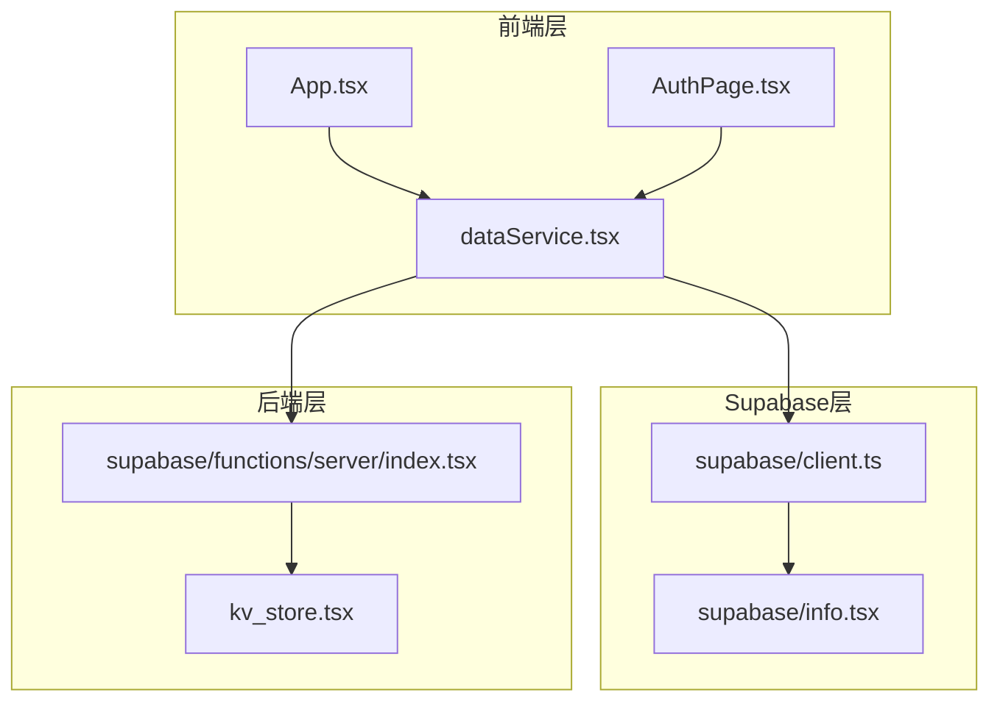
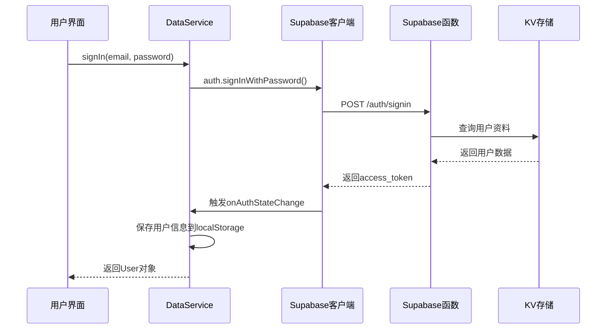
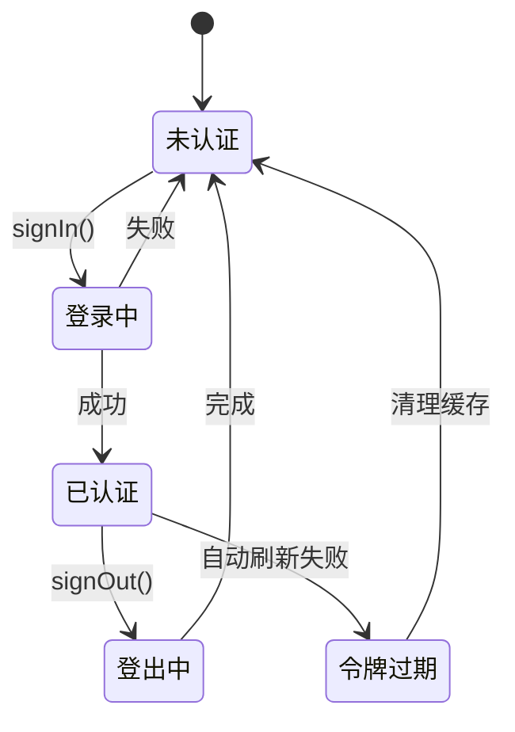
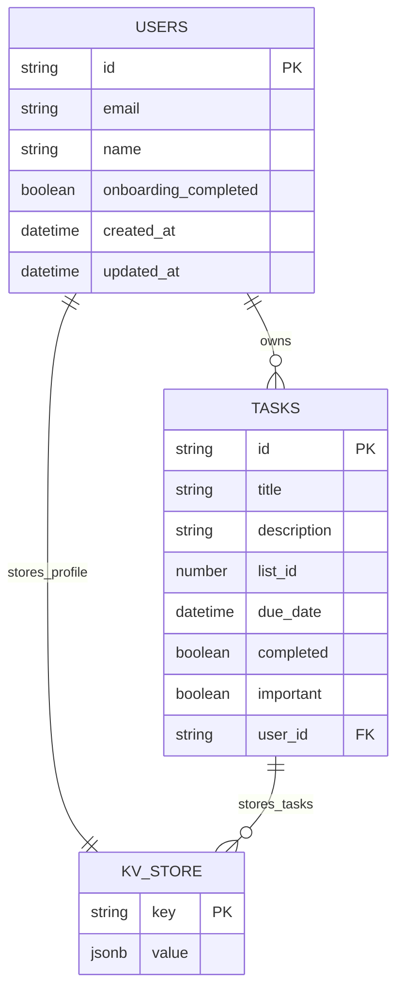
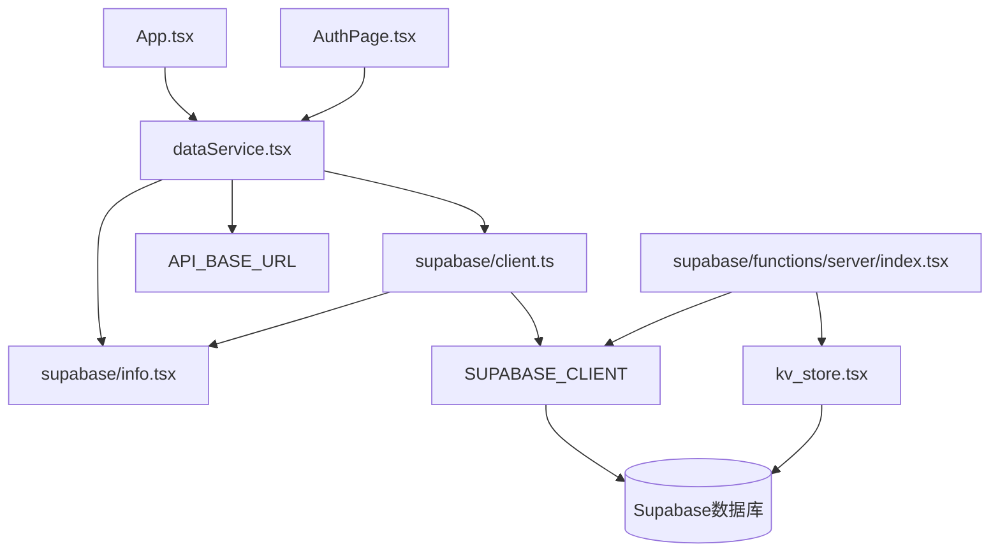

# 认证服务集成

<cite>
**本文档引用的文件**
- [dataService.tsx](file://src/utils/dataService.tsx)
- [client.ts](file://src/utils/supabase/client.ts)
- [info.tsx](file://src/utils/supabase/info.tsx)
- [App.tsx](file://src/App.tsx)
- [AuthPage.tsx](file://src/components/AuthPage.tsx)
- [index.tsx](file://src/supabase/functions/server/index.tsx)
- [kv_store.tsx](file://src/supabase/functions/server/kv_store.tsx)
</cite>

## 目录
1. [简介](#简介)
2. [项目结构概览](#项目结构概览)
3. [核心组件分析](#核心组件分析)
4. [架构概览](#架构概览)
5. [详细组件分析](#详细组件分析)
6. [依赖关系分析](#依赖关系分析)
7. [性能考虑](#性能考虑)
8. [故障排除指南](#故障排除指南)
9. [结论](#结论)

## 简介

本文档全面分析了Focus应用中与Supabase Auth服务的集成接口，重点描述了`dataService.tsx`中认证相关方法的实现细节。该系统提供了完整的用户认证解决方案，包括登录、注册、登出功能，并实现了安全的凭证处理和API调用机制。

系统采用分层架构设计，通过`DataService`类封装了对@supabase/supabase-js客户端的调用，实现了安全的认证令牌管理、自动刷新机制和离线数据同步功能。整个认证流程经过精心设计，确保了用户数据的安全性和应用的可靠性。

## 项目结构概览



**图表来源**
- [App.tsx](file://src/App.tsx#L1-L50)
- [dataService.tsx](file://src/utils/dataService.tsx#L1-L30)
- [client.ts](file://src/utils/supabase/client.ts#L1-L12)

**章节来源**
- [dataService.tsx](file://src/utils/dataService.tsx#L1-L886)
- [client.ts](file://src/utils/supabase/client.ts#L1-L12)

## 核心组件分析

### DataService类

`DataService`类是认证服务的核心组件，负责管理用户认证状态、处理API请求和维护本地缓存。该类实现了以下关键功能：

- **认证状态管理**：通过Supabase的`onAuthStateChange`事件监听器实时跟踪认证状态
- **令牌管理**：自动处理access token和refresh token的存储与刷新
- **离线支持**：提供完整的离线数据同步机制
- **错误处理**：统一的错误处理和重试机制

### Supabase客户端配置

```typescript
export const supabase = createClient(supabaseUrl, publicAnonKey, {
  auth: {
    autoRefreshToken: true,
    persistSession: true,
    detectSessionInUrl: false
  }
})
```

该配置启用了自动令牌刷新和会话持久化，确保用户在应用重启后仍保持登录状态。

**章节来源**
- [dataService.tsx](file://src/utils/dataService.tsx#L15-L35)
- [client.ts](file://src/utils/supabase/client.ts#L6-L11)

## 架构概览



**图表来源**
- [dataService.tsx](file://src/utils/dataService.tsx#L185-L205)
- [index.tsx](file://src/supabase/functions/server/index.tsx#L58-L97)

## 详细组件分析

### 认证方法实现

#### signIn方法

```typescript
async signIn(email: string, password: string): Promise<User> {
  const { data, error } = await supabase.auth.signInWithPassword({
    email,
    password
  });

  if (error) {
    throw new Error(error.message);
  }

  if (!data.session || !data.user) {
    throw new Error('登录失败：未获取到用户信息');
  }

  // 返回用户信息（onAuthStateChange会自动处理session和token）
  return {
    id: data.user.id,
    email: data.user.email || '',
    name: data.user.user_metadata?.name || data.user.email || '',
    onboarding_completed: data.user.user_metadata?.onboarding_completed || false
  };
}
```

该方法实现了完整的登录流程：
1. 调用Supabase客户端的`signInWithPassword`方法
2. 验证响应数据的有效性
3. 解析用户元数据并构建标准化的User对象
4. 自动触发认证状态变更事件

#### signUp方法

```typescript
async signUp(email: string, password: string, name: string): Promise<User> {
  const { data, error } = await supabase.auth.signUp({
    email,
    password,
    options: {
      data: {
        name: name,
        onboarding_completed: false
      }
    }
  });

  if (error) {
    throw new Error(error.message);
  }

  if (!data.user) {
    throw new Error('注册失败：未获取到用户信息');
  }

  // 返回用户信息
  return {
    id: data.user.id,
    email: data.user.email || '',
    name: name,
    onboarding_completed: false
  };
}
```

注册方法的特点：
- 支持自定义用户元数据（姓名、引导状态）
- 自动确认邮箱地址（无需邮件服务器）
- 提供详细的错误信息反馈

#### signOut方法

```typescript
async signOut() {
  await supabase.auth.signOut();
  // onAuthStateChange会自动清理状态和缓存
  localStorage.removeItem('taskmaster_tasks');
  localStorage.removeItem('taskmaster_last_sync');
}
```

登出操作确保：
- 清理Supabase会话
- 移除本地缓存数据
- 触发认证状态变更事件

**章节来源**
- [dataService.tsx](file://src/utils/dataService.tsx#L185-L220)

### 认证状态管理



**图表来源**
- [dataService.tsx](file://src/utils/dataService.tsx#L35-L65)

### 网络请求处理

```typescript
private async makeRequest(endpoint: string, options: RequestInit = {}) {
  const url = `${API_BASE_URL}${endpoint}`;
  const headers = {
    'Content-Type': 'application/json',
    ...options.headers,
  };

  // 使用onAuthStateChange中保存的token，避免重复调用getCurrentSession
  if (this.accessToken) {
    headers['Authorization'] = `Bearer ${this.accessToken}`;
  } else {
    headers['Authorization'] = `Bearer ${publicAnonKey}`;
  }

  try {
    const response = await fetch(url, {
      ...options,
      headers,
    });

    if (!response.ok) {
      const errorData = await response.json().catch(() => ({}));
      
      // 特别处理401错误
      if (response.status === 401) {
        console.warn(`401 Unauthorized for ${endpoint}: Token may be invalid or expired`);
        throw new Error(`HTTP 401 - Unauthorized (${errorData.error || 'Token invalid'})`);
      }
      
      throw new Error(errorData.error || `HTTP ${response.status}`);
    }

    return await response.json();
  } catch (error) {
    if (!this.isOnline) {
      throw new Error('You are offline. Please check your connection.');
    }
    throw error;
  }
}
```

该方法实现了：
- 自动化的认证令牌注入
- 统一的错误处理机制
- 网络连接状态检测
- 401错误的特殊处理

**章节来源**
- [dataService.tsx](file://src/utils/dataService.tsx#L130-L180)

### 后端函数服务器

后端采用Hono框架实现RESTful API，提供以下端点：

#### 认证端点

```typescript
// 注册端点
app.post("/make-server-724a4c6b/auth/signup", async (c) => {
  const { email, password, name } = await c.req.json();
  
  const { data, error } = await supabase.auth.admin.createUser({
    email,
    password,
    user_metadata: { name },
    email_confirm: true
  });

  // 存储用户资料到KV存储
  await kv.set(`user:${data.user.id}`, {
    id: data.user.id,
    email: data.user.email,
    name,
    created_at: new Date().toISOString(),
    onboarding_completed: false
  });

  return c.json({ user: { /* 用户信息 */ } });
});
```

#### 数据存储机制



**图表来源**
- [kv_store.tsx](file://src/supabase/functions/server/kv_store.tsx#L1-L30)
- [index.tsx](file://src/supabase/functions/server/index.tsx#L1-L50)

**章节来源**
- [index.tsx](file://src/supabase/functions/server/index.tsx#L30-L100)
- [kv_store.tsx](file://src/supabase/functions/server/kv_store.tsx#L1-L87)

## 依赖关系分析



**图表来源**
- [dataService.tsx](file://src/utils/dataService.tsx#L1-L10)
- [client.ts](file://src/utils/supabase/client.ts#L1-L12)

**章节来源**
- [dataService.tsx](file://src/utils/dataService.tsx#L1-L20)
- [client.ts](file://src/utils/supabase/client.ts#L1-L12)

## 性能考虑

### 缓存策略

系统实现了多层缓存机制：
- **内存缓存**：在DataService实例中缓存用户信息和令牌
- **本地存储**：使用localStorage持久化用户数据和离线任务
- **智能合并**：合并服务器数据和本地离线更改

### 离线支持

```typescript
// 智能合并算法
private mergeTasksWithOfflineChanges(serverTasks: Task[]): Task[] {
  const cachedTasks = this.getCachedTasks();
  const pendingUpdates = this.getFromCache('taskmaster_pending_updates') || {};
  const pendingCreates = this.getFromCache('taskmaster_pending_creates') || [];
  
  // 应用本地待同步的更新
  Object.entries(pendingUpdates).forEach(([taskId, updates]) => {
    const index = mergedTasks.findIndex(task => task.id.toString() === taskId);
    if (index !== -1 && updates && typeof updates === 'object') {
      mergedTasks[index] = {
        ...mergedTasks[index],
        ...(updates as Partial<Task>),
        updatedAt: new Date().toISOString()
      };
    }
  });
  
  // 添加本地创建的离线任务
  pendingCreates.forEach((offlineTask: Task) => {
    mergedTasks.push({
      ...offlineTask,
      dueDate: new Date(offlineTask.dueDate),
      startDate: offlineTask.startDate ? new Date(offlineTask.startDate) : undefined,
    });
  });
  
  return mergedTasks;
}
```

### 超时保护

```typescript
// 查询超时保护
const timeoutPromise = new Promise((_, reject) => {
  setTimeout(() => reject(new Error('getTasks timeout after 2 seconds')), 2000);
});

const queryPromise = supabase
  .from('tasks')
  .select('*')
  .order('created_at', { ascending: false });

const result = await Promise.race([queryPromise, timeoutPromise]);
```

## 故障排除指南

### 常见问题及解决方案

#### 1. 认证失败

**症状**：登录或注册时出现错误
**原因**：网络连接问题、凭据错误、Supabase服务异常
**解决方案**：
- 检查网络连接状态
- 验证邮箱和密码格式
- 查看控制台错误日志

#### 2. 令牌过期

**症状**：API调用返回401错误
**原因**：access token已过期
**解决方案**：
- 系统自动尝试刷新令牌
- 检查`autoRefreshToken`配置
- 重新登录获取新令牌

#### 3. 离线数据丢失

**症状**：离线模式下数据无法同步
**原因**：本地存储损坏或权限不足
**解决方案**：
- 清除localStorage数据
- 检查浏览器存储权限
- 重新登录同步数据

**章节来源**
- [dataService.tsx](file://src/utils/dataService.tsx#L280-L320)

## 结论

本文档详细分析了Focus应用中与Supabase Auth服务的集成实现。该系统通过精心设计的分层架构，提供了安全、可靠、高性能的认证解决方案。

### 主要优势

1. **安全性**：采用HTTPS传输、令牌自动刷新、错误处理机制
2. **可靠性**：离线支持、智能缓存、数据同步
3. **易用性**：简洁的API接口、完善的错误反馈
4. **扩展性**：模块化设计、易于维护和扩展

### 最佳实践建议

1. **安全防护**：定期轮换API密钥，启用双因素认证
2. **性能优化**：合理设置缓存策略，优化网络请求
3. **监控告警**：建立完整的错误监控和告警机制
4. **用户体验**：提供清晰的错误提示和加载状态

该认证服务集成方案为现代Web应用提供了完整的身份验证解决方案，既保证了安全性，又兼顾了用户体验和开发效率。