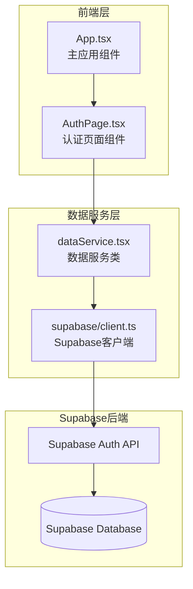
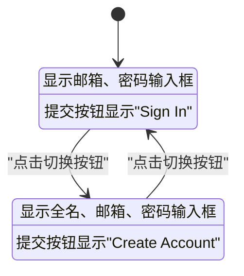
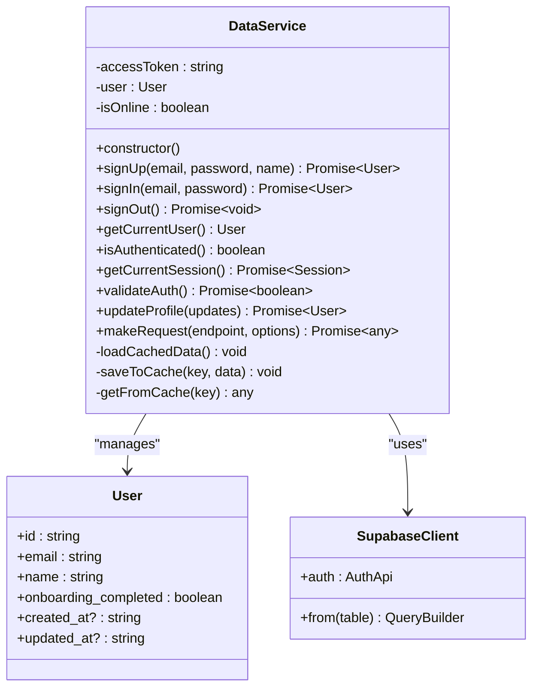
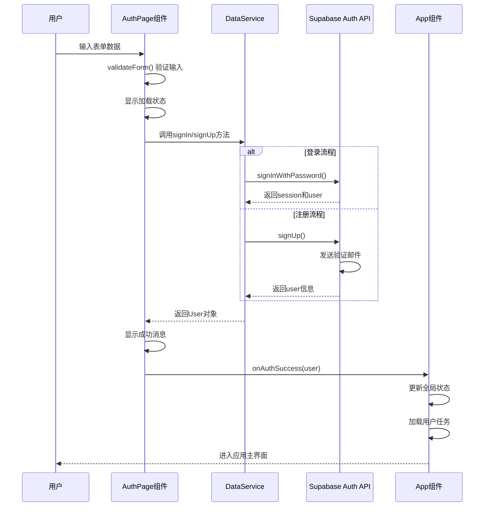
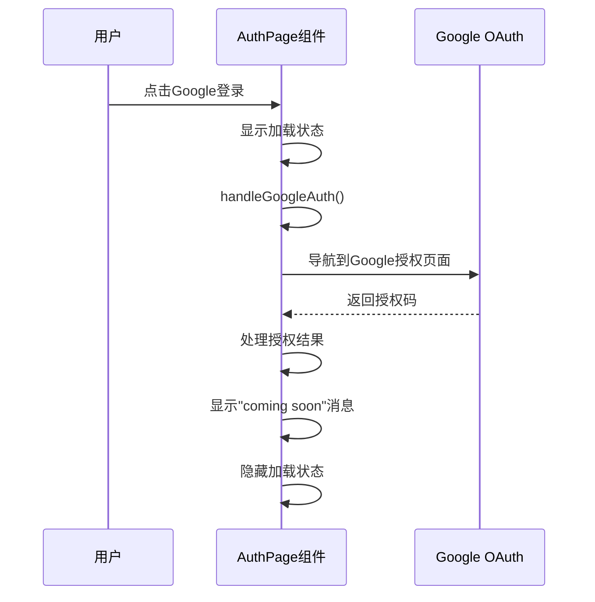
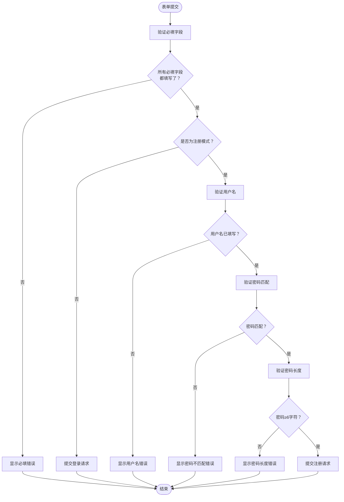
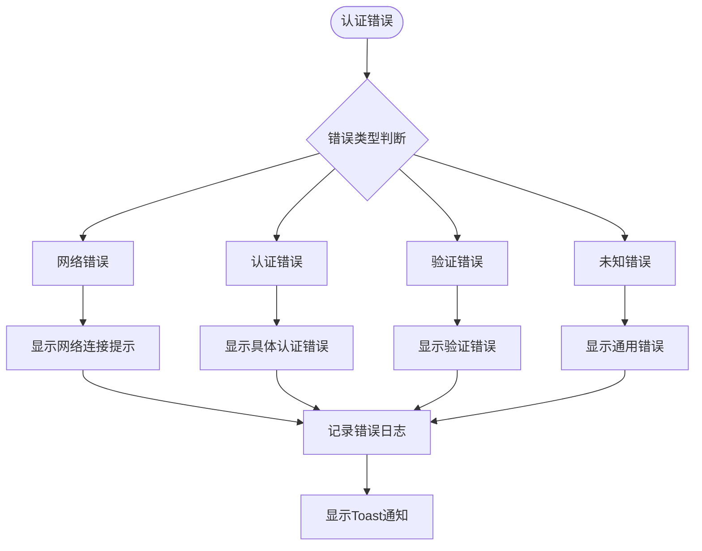
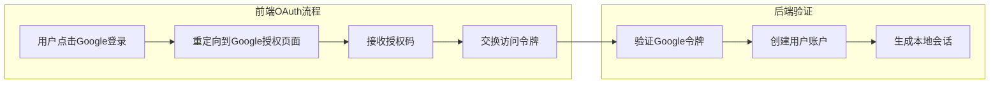

# 认证流程

<cite>
**本文档引用的文件**
- [AuthPage.tsx](file://src/components/AuthPage.tsx)
- [dataService.tsx](file://src/utils/dataService.tsx)
- [client.ts](file://src/utils/supabase/client.ts)
- [info.tsx](file://src/utils/supabase/info.tsx)
- [App.tsx](file://src/App.tsx)
</cite>

## 目录
1. [简介](#简介)
2. [项目架构概览](#项目架构概览)
3. [认证页面组件分析](#认证页面组件分析)
4. [数据服务层分析](#数据服务层分析)
5. [认证流程时序图](#认证流程时序图)
6. [表单验证机制](#表单验证机制)
7. [错误处理与用户反馈](#错误处理与用户反馈)
8. [第三方登录扩展设计](#第三方登录扩展设计)
9. [常见问题与调试指南](#常见问题与调试指南)
10. [总结](#总结)

## 简介

本文档详细分析了Focus Do应用中的认证流程实现，重点关注AuthPage.tsx中注册/登录表单的构建逻辑，以及dataService.tsx中与Supabase Auth API的交互机制。该系统采用现代化的React架构，结合Supabase作为后端服务，提供了完整的用户认证体验。

## 项目架构概览

认证系统的核心组件包括：



**图表来源**
- [AuthPage.tsx](file://src/components/AuthPage.tsx#L1-L271)
- [dataService.tsx](file://src/utils/dataService.tsx#L1-L886)
- [client.ts](file://src/utils/supabase/client.ts#L1-L12)

## 认证页面组件分析

### 组件状态管理

AuthPage组件使用React Hooks进行状态管理：

```typescript
const [isLogin, setIsLogin] = useState(true);
const [showPassword, setShowPassword] = useState(false);
const [isLoading, setIsLoading] = useState(false);
const [formData, setFormData] = useState({
  email: "",
  password: "",
  name: "",
  confirmPassword: ""
});
```

### 表单切换逻辑

组件支持登录和注册两种模式的无缝切换：



**图表来源**
- [AuthPage.tsx](file://src/components/AuthPage.tsx#L15-L16)

### UI状态反馈机制

组件实现了完整的UI状态反馈：

1. **加载状态**：通过`isLoading`状态控制提交按钮的禁用状态和加载动画
2. **表单验证**：实时验证用户输入并提供即时反馈
3. **视觉反馈**：使用动画效果增强用户体验

**章节来源**
- [AuthPage.tsx](file://src/components/AuthPage.tsx#L13-L271)

## 数据服务层分析

### DataService类架构

DataService类负责管理所有与Supabase的交互：



**图表来源**
- [dataService.tsx](file://src/utils/dataService.tsx#L40-L886)
- [client.ts](file://src/utils/supabase/client.ts#L1-L12)

### 认证方法实现

#### 登录方法

```typescript
async signIn(email: string, password: string): Promise<User> {
  const { data, error } = await supabase.auth.signInWithPassword({
    email,
    password
  });

  if (error) {
    throw new Error(error.message);
  }

  if (!data.session || !data.user) {
    throw new Error('登录失败：未获取到用户信息');
  }

  return {
    id: data.user.id,
    email: data.user.email || '',
    name: data.user.user_metadata?.name || data.user.email || '',
    onboarding_completed: data.user.user_metadata?.onboarding_completed || false
  };
}
```

#### 注册方法

```typescript
async signUp(email: string, password: string, name: string): Promise<User> {
  const { data, error } = await supabase.auth.signUp({
    email,
    password,
    options: {
      data: {
        name: name,
        onboarding_completed: false
      }
    }
  });

  if (error) {
    throw new Error(error.message);
  }

  if (!data.user) {
    throw new Error('注册失败：未获取到用户信息');
  }

  return {
    id: data.user.id,
    email: data.user.email || '',
    name: name,
    onboarding_completed: false
  };
}
```

**章节来源**
- [dataService.tsx](file://src/utils/dataService.tsx#L175-L220)

## 认证流程时序图

### 完整认证流程



**图表来源**
- [AuthPage.tsx](file://src/components/AuthPage.tsx#L50-L85)
- [dataService.tsx](file://src/utils/dataService.tsx#L175-L220)

### 第三方登录流程



**图表来源**
- [AuthPage.tsx](file://src/components/AuthPage.tsx#L87-L97)

## 表单验证机制

### 验证规则实现

AuthPage组件实现了多层次的表单验证：



**图表来源**
- [AuthPage.tsx](file://src/components/AuthPage.tsx#L32-L50)

### 错误提示策略

系统使用Toast通知提供即时反馈：

1. **必填字段错误**：`"Please fill in all required fields"`
2. **用户名错误**：`"Please enter your name"`
3. **密码不匹配**：`"Passwords do not match"`
4. **密码长度错误**：`"Password must be at least 6 characters"`

**章节来源**
- [AuthPage.tsx](file://src/components/AuthPage.tsx#L32-L50)

## 错误处理与用户反馈

### 错误分类处理



**图表来源**
- [AuthPage.tsx](file://src/components/AuthPage.tsx#L75-L85)
- [dataService.tsx](file://src/utils/dataService.tsx#L145-L170)

### 用户反馈机制

系统实现了多层次的用户反馈：

1. **即时反馈**：表单验证时的实时提示
2. **操作反馈**：加载状态和成功/失败提示
3. **错误处理**：详细的错误信息和建议

**章节来源**
- [AuthPage.tsx](file://src/components/AuthPage.tsx#L75-L85)
- [dataService.tsx](file://src/utils/dataService.tsx#L145-L170)

## 第三方登录扩展设计

### 当前实现状态

目前Google第三方登录处于占位实现阶段：

```typescript
const handleGoogleAuth = async () => {
  setIsLoading(true);
  try {
    // Implement Google OAuth
    toast.info("Google sign-in coming soon!");
  } catch (error) {
    console.error("Google auth error:", error);
    toast.error("Google sign-in failed");
  } finally {
    setIsLoading(false);
  }
};
```

### 扩展设计思路

#### 1. OAuth集成架构



#### 2. 实现步骤

1. **配置Google OAuth**：
   - 在Google Cloud Console创建OAuth客户端
   - 配置回调URL和授权范围

2. **前端实现**：
   ```typescript
   const handleGoogleAuth = async () => {
     try {
       const googleAuth = new GoogleAuth({
         clientId: GOOGLE_CLIENT_ID,
         scope: 'profile email'
       });
       
       const token = await googleAuth.signIn();
       const user = await dataService.googleSignIn(token);
       onAuthSuccess(user);
     } catch (error) {
       toast.error("Google登录失败，请重试");
     }
   };
   ```

3. **后端验证**：
   - 验证Google ID令牌
   - 创建或更新用户记录
   - 生成本地会话

#### 3. 安全考虑

- 使用HTTPS确保通信安全
- 验证令牌签名和有效期
- 实施适当的速率限制
- 记录和监控登录活动

**章节来源**
- [AuthPage.tsx](file://src/components/AuthPage.tsx#L87-L97)

## 常见问题与调试指南

### 网络连接问题

#### 问题描述
用户无法连接到Supabase后端服务

#### 调试步骤
1. **检查网络连接**：确认设备有稳定的互联网连接
2. **验证API密钥**：检查`projectId`和`publicAnonKey`的有效性
3. **测试API端点**：使用Postman或curl测试Supabase API
4. **查看浏览器控制台**：检查网络请求错误

#### 解决方案
```typescript
// 检查在线状态
private isOnline: boolean = navigator.onLine;

// 网络错误处理
if (!this.isOnline) {
  throw new Error('You are offline. Please check your connection.');
}
```

### 无效凭证错误

#### 问题描述
用户输入的邮箱或密码不正确

#### 调试方法
1. **验证输入格式**：检查邮箱格式和密码强度
2. **查看Supabase日志**：检查认证失败的具体原因
3. **测试凭据**：使用相同的凭据在其他环境中测试

#### 用户提示策略
```typescript
try {
  const user = await dataService.signIn(email, password);
  toast.success("欢迎回来！");
} catch (error) {
  if (error.message.includes("invalid")) {
    toast.error("邮箱或密码不正确，请重试");
  } else {
    toast.error("登录失败，请稍后重试");
  }
}
```

### 邮箱已存在错误

#### 问题描述
注册时邮箱已被使用

#### 调试步骤
1. **检查邮箱唯一性**：确认邮箱地址是否已被注册
2. **查看错误详情**：检查Supabase返回的具体错误信息
3. **测试边界情况**：尝试使用不同的邮箱地址

#### 用户提示策略
```typescript
try {
  const user = await dataService.signUp(email, password, name);
  toast.success("账户创建成功！");
} catch (error) {
  if (error.message.includes("already registered")) {
    toast.error("该邮箱已被注册，请直接登录");
  } else {
    toast.error("注册失败：" + error.message);
  }
}
```

### 会话管理问题

#### 问题描述
用户会话意外丢失或过期

#### 调试方法
1. **检查会话状态**：验证Supabase会话的有效性
2. **监控Token刷新**：检查自动Token刷新机制
3. **查看缓存状态**：检查本地存储的用户数据

#### 解决方案
```typescript
// 监听认证状态变化
useEffect(() => {
  const { data: { subscription } } = supabase.auth.onAuthStateChange(
    async (event, session) => {
      if (event === 'SIGNED_OUT' || !session) {
        // 清理应用状态
        setUser(null);
        setIsAuthenticated(false);
        setTasks([]);
      }
    }
  );
}, []);
```

**章节来源**
- [dataService.tsx](file://src/utils/dataService.tsx#L145-L170)
- [App.tsx](file://src/App.tsx#L314-L349)

## 总结

Focus Do应用的认证系统展现了现代Web应用的最佳实践：

### 核心特性

1. **完整的表单验证**：多层次的验证规则确保数据质量
2. **优雅的错误处理**：清晰的错误提示和用户指导
3. **流畅的用户体验**：动画效果和即时反馈提升交互体验
4. **可扩展的架构**：模块化设计便于功能扩展

### 技术亮点

- **React Hooks**：高效的状态管理和组件生命周期
- **Supabase集成**：零基础设施的后端服务
- **TypeScript**：强类型保证代码质量和开发效率
- **Toast通知**：简洁有效的用户反馈机制

### 改进建议

1. **增强安全性**：实施更严格的输入验证和CSRF保护
2. **优化性能**：添加请求缓存和离线支持
3. **完善测试**：增加单元测试和集成测试覆盖率
4. **扩展功能**：实现完整的第三方登录支持

该认证系统为Focus Do应用提供了坚实的安全基础和优秀的用户体验，为后续的功能扩展奠定了良好的技术基础。