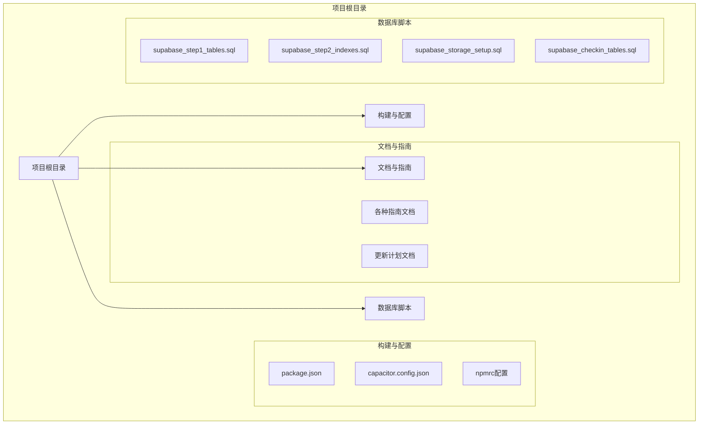
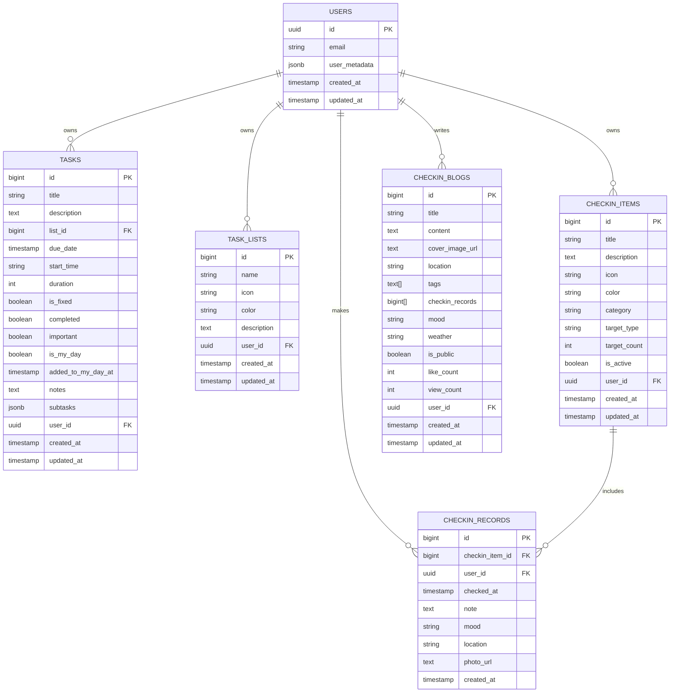
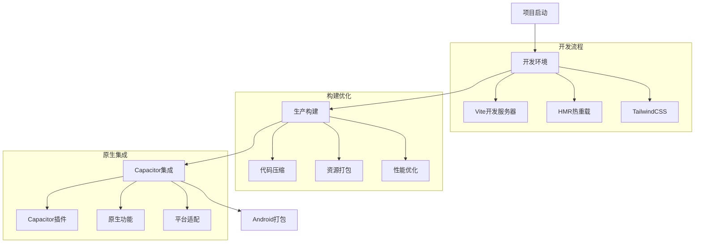

# Focus_do_Figma2 项目目录结构说明

<cite>
**本文档引用的文件**
- [README.md](file://README.md)
- [package.json](file://package.json)
- [src/App.tsx](file://src/App.tsx)
- [src/components/ui/button.tsx](file://src/components/ui/button.tsx)
- [src/utils/dataService.tsx](file://src/utils/dataService.tsx)
- [src/types/checkin.ts](file://src/types/checkin.ts)
- [supabase_step1_tables.sql](file://supabase_step1_tables.sql)
- [updateplan.md](file://updateplan.md)
</cite>

## 目录

1. [项目概述](#项目概述)
2. [根目录结构](#根目录结构)
3. [Android原生工程](#android原生工程)
4. [源代码核心结构](#源代码核心结构)
5. [数据库与后端服务](#数据库与后端服务)
6. [项目配置与构建](#项目配置与构建)
7. [开发指南与文档](#开发指南与文档)
8. [总结](#总结)

## 项目概述

Focus_do_Figma2 是一个基于 React 和 TypeScript 的现代化任务管理应用，采用组件化架构设计，支持移动端原生功能集成。项目结合了 Figma 设计稿的视觉实现和 Capacitor 的跨平台能力，提供了完整的任务管理、日历视图、签到统计和博客功能。

### 核心特性

- **任务管理**: 时间轴式今日视图、列表管理、日历视图
- **签到系统**: 多维度打卡项目、统计分析、博客记录
- **原生集成**: Capacitor 支持 Android 原生功能
- **云端同步**: Supabase 数据库和实时同步
- **响应式设计**: 移动优先，全屏适配

## 根目录结构



**图表来源**
- [package.json](file://package.json#L1-L81)
- [README.md](file://README.md#L1-L48)

**章节来源**
- [README.md](file://README.md#L1-L48)
- [package.json](file://package.json#L1-L81)

## Android原生工程

### 目录结构

```
android/
├── app/src/main/
│   ├── assets/           # 静态资源
│   ├── java/com/focusdo/app/  # Java源码
│   ├── res/              # 资源文件
│   │   ├── drawable/     # 图标资源
│   │   ├── layout/       # 布局文件
│   │   ├── mipmap-*/*    # 应用图标
│   │   ├── values/       # 字符串和样式
│   │   └── xml/          # 配置文件
│   └── AndroidManifest.xml  # 应用清单
├── capacitor-cordova-android-plugins/  # Cordova插件
└── gradle.properties     # Gradle配置
```

### 功能特点

- **Capacitor集成**: 提供原生功能桥接
- **Android原生**: 支持触觉反馈、通知、相机等原生API
- **多平台支持**: 编译为APK可在Android设备运行
- **安全区域适配**: 支持刘海屏和挖孔屏

**章节来源**
- [CAPACITOR_SUMMARY.md](file://CAPACITOR_SUMMARY.md)

## 源代码核心结构

### src/ 目录组织

```mermaid
graph TB
subgraph "src/ 源代码目录"
Src[src/]
subgraph "组件层"
Components[components/]
UI[ui/] # 基础UI组件
Shared[shared/] # 共享组件
Figma[figma/] # Figma相关组件
end
subgraph "业务逻辑"
Utils[utils/] # 工具函数
Types[types/] # 类型定义
Supabase[supabase/] # Supabase集成
end
subgraph "样式与配置"
Styles[styles/] # CSS样式
Imports[imports/] # 导入的SVG组件
Guidelines[guidelines/] # 开发规范
end
Src --> Components
Src --> Utils
Src --> Styles
Src --> Types
end
```

**图表来源**
- [src/App.tsx](file://src/App.tsx#L1-L50)
- [src/components/ui/button.tsx](file://src/components/ui/button.tsx#L1-L59)

### 组件层次结构

#### 1. 基础UI组件 (src/components/ui/)
- **原子组件**: 按钮、输入框、标签等基础元素
- **复合组件**: 对话框、抽屉、侧边栏等复杂组件
- **布局组件**: 卡片、表格、导航等布局容器

#### 2. 页面级组件 (src/components/)
- **功能页面**: TodayPage、ListsPage、CalendarPage、CheckinPage
- **交互组件**: FloatingActionButton、TaskDetailDrawer
- **工具组件**: BottomNavbar、PullToRefresh

#### 3. 共享组件 (src/components/shared/)
- **StatusBar**: 状态栏组件
- **SvgIcon**: SVG图标组件

#### 4. Figma集成 (src/components/figma/)
- **ImageWithFallback**: 图片加载组件

**章节来源**
- [src/App.tsx](file://src/App.tsx#L1-L199)
- [src/components/ui/button.tsx](file://src/components/ui/button.tsx#L1-L59)

## 数据库与后端服务

### 数据库架构



**图表来源**
- [supabase_step1_tables.sql](file://supabase_step1_tables.sql#L1-L62)
- [src/types/checkin.ts](file://src/types/checkin.ts#L1-L284)

### 后端服务架构

#### 1. Supabase 边缘函数
- **位置**: `src/supabase/functions/server/`
- **功能**: 用户认证、数据同步、业务逻辑处理
- **实现**: TypeScript + Hono 框架

#### 2. 数据服务层
- **位置**: `src/utils/dataService.tsx`
- **职责**: 
  - 数据持久化管理
  - 离线数据同步
  - 实时数据监听
  - 错误处理和重试机制

#### 3. 类型定义
- **位置**: `src/types/`
- **内容**: 
  - `checkin.ts`: 签到相关类型
  - 其他业务类型定义

**章节来源**
- [src/utils/dataService.tsx](file://src/utils/dataService.tsx#L1-L799)
- [src/types/checkin.ts](file://src/types/checkin.ts#L1-L284)

## 项目配置与构建

### 构建工具配置



**图表来源**
- [package.json](file://package.json#L60-L70)

### 依赖管理

#### 核心依赖
- **React 生态**: React 18.3.1, React DOM
- **UI框架**: Radix UI 组件库
- **样式**: Tailwind CSS 4.x
- **动画**: Framer Motion 12.x
- **表单**: React Hook Form 7.55.0

#### Capacitor 插件
- @capacitor/android: Android 平台支持
- @capacitor/haptics: 触觉反馈
- @capacitor/local-notifications: 本地通知
- @capacitor/preferences: 本地存储

**章节来源**
- [package.json](file://package.json#L1-L81)

## 开发指南与文档

### 文档体系

#### 1. 开发规范
- **位置**: `src/guidelines/`
- **内容**: 
  - Guidelines.md: 通用开发规范
  - blog_view.md: 博客视图规范
  - fab2_view.md: FAB 重设计规范

#### 2. 技术文档
- **位置**: 项目根目录
- **内容**:
  - README.md: 项目介绍
  - ANDROID_BUILD_GUIDE.md: Android 构建指南
  - STORAGE_SETUP_GUIDE.md: 存储设置指南
  - calendar_update_guide.md: 日历更新指南

#### 3. 迭代规划
- **位置**: `updateplan.md`
- **内容**: 
  - Bug修复计划
  - 新功能开发
  - 时间线和里程碑

### 数据库脚本

#### 1. 表结构初始化
- **步骤1**: `supabase_step1_tables.sql` - 创建基础表结构
- **步骤2**: `supabase_step2_indexes.sql` - 添加索引优化
- **步骤3**: `supabase_storage_setup.sql` - 存储桶配置

#### 2. 签到功能表
- **文件**: `supabase_checkin_tables.sql`
- **功能**: 签到项目、记录、博客相关表

**章节来源**
- [updateplan.md](file://updateplan.md#L1-L175)
- [supabase_step1_tables.sql](file://supabase_step1_tables.sql#L1-L62)

## 总结

Focus_do_Figma2 项目采用了现代化的前端架构设计，具有以下特点：

### 架构优势
1. **组件化设计**: 清晰的分层架构，便于维护和扩展
2. **类型安全**: TypeScript 提供完整的类型检查
3. **响应式设计**: 移动优先，全屏适配
4. **云端同步**: Supabase 提供实时数据同步
5. **原生集成**: Capacitor 支持 Android 原生功能

### 开发体验
- **热重载**: Vite 提供快速开发体验
- **样式系统**: Tailwind CSS + 自定义组件库
- **动画效果**: Framer Motion 实现流畅动画
- **错误处理**: 完善的离线数据同步机制

### 项目价值
该项目展示了现代 React 应用的最佳实践，包括：
- 组件化开发模式
- 数据流管理
- 原生功能集成
- 云端数据同步
- 用户体验优化

通过合理的目录结构和模块划分，开发者可以快速定位功能代码，理解项目组织逻辑，为后续的功能扩展和维护奠定了坚实的基础。