# Focus_do_Figma2 项目概述

<cite>
**本文档引用的文件**
- [README.md](file://README.md)
- [package.json](file://package.json)
- [src/App.tsx](file://src/App.tsx)
- [src/utils/dataService.tsx](file://src/utils/dataService.tsx)
- [src/utils/supabase/client.ts](file://src/utils/supabase/client.ts)
- [src/components/TodayPage.tsx](file://src/components/TodayPage.tsx)
- [src/components/BottomNavbar.tsx](file://src/components/BottomNavbar.tsx)
- [src/components/FloatingActionButton.tsx](file://src/components/FloatingActionButton.tsx)
- [src/utils/nativeService.ts](file://src/utils/nativeService.ts)
</cite>

## 目录
1. [项目简介](#项目简介)
2. [核心功能特性](#核心功能特性)
3. [技术架构概览](#技术架构概览)
4. [项目结构分析](#项目结构分析)
5. [核心组件详解](#核心组件详解)
6. [数据流与状态管理](#数据流与状态管理)
7. [离线优先策略](#离线优先策略)
8. [Capacitor原生桥接](#capacitor原生桥接)
9. [设计系统与UI组件](#设计系统与ui组件)
10. [性能优化与最佳实践](#性能优化与最佳实践)
11. [总结与展望](#总结与展望)

## 项目简介

Focus_do_Figma2 是一个基于 Capacitor 的跨平台任务管理与个人成长追踪应用，专为追求高效生活的用户设计。该项目以"今日视图"为核心，采用时间轴式任务组织方式，并具备未来自动任务规划功能。应用秉承极简主义美学理念，注重优雅的动画效果和符合 iOS/Android 设计标准的一致性体验。

### 核心价值主张

- **时间导向的任务管理**：以今日时间为基准，智能推荐和展示相关任务
- **跨平台原生体验**：基于 Web 技术实现的原生应用性能
- **离线优先设计**：确保在网络不稳定环境下的完整用户体验
- **个性化成长追踪**：集成了签到系统和博客分享功能

## 核心功能特性

### 任务管理系统

项目实现了完整的任务生命周期管理，包括：
- **多维度任务分类**：支持 Work、Personal、Health、Learning、Shopping 等预设列表
- **灵活的时间安排**：支持固定时间和浮动时间任务
- **智能任务推荐**：基于今日时间点自动推荐相关任务
- **过期任务提醒**：自动识别并提醒逾期任务

### 签到与成长追踪

- **每日签到系统**：支持拍照、文字记录和位置标注
- **成长统计分析**：提供可视化的历史数据展示
- **博客分享功能**：允许用户记录和分享个人成长心得

### 日历视图增强

- **双击快速添加**：在日历上双击即可快速创建任务
- **多种视图模式**：支持按截止日期和开始时间两种模式显示
- **智能日期筛选**：自动高亮显示含有任务的重要日期

**章节来源**
- [README.md](file://README.md#L1-L48)
- [src/App.tsx](file://src/App.tsx#L30-L80)

## 技术架构概览

### 技术栈组成

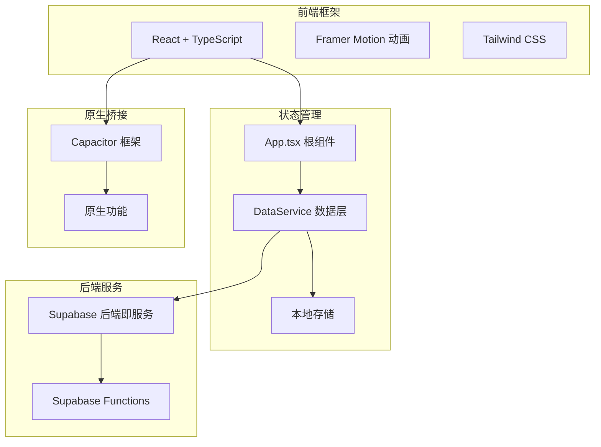

**图表来源**
- [package.json](file://package.json#L1-L50)
- [src/App.tsx](file://src/App.tsx#L1-L20)

### 架构设计理念

项目采用了类 MVVM（Model-View-ViewModel）架构模式，结合单向数据流设计原则：

- **Model 层**：由 Supabase 数据库和本地缓存组成
- **View 层**：React 组件负责 UI 渲染和用户交互
- **ViewModel 层**：DataService 类作为数据访问层，处理业务逻辑
- **单向数据流**：数据从 Supabase -> DataService -> React 组件单向流动

### 关键技术组件

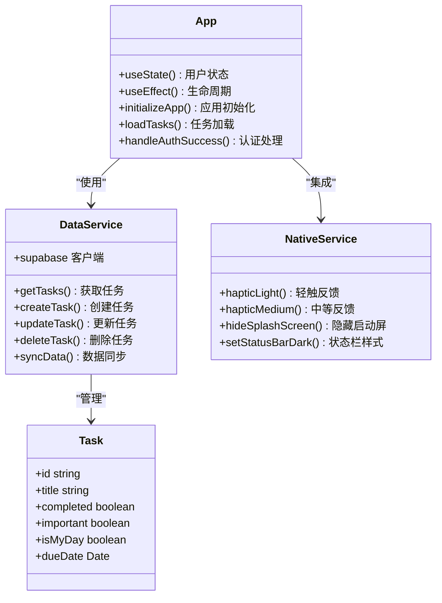

**图表来源**
- [src/App.tsx](file://src/App.tsx#L150-L200)
- [src/utils/dataService.tsx](file://src/utils/dataService.tsx#L30-L80)
- [src/utils/nativeService.ts](file://src/utils/nativeService.ts#L10-L50)

**章节来源**
- [package.json](file://package.json#L1-L81)
- [src/App.tsx](file://src/App.tsx#L1-L100)

## 项目结构分析

### 目录组织结构

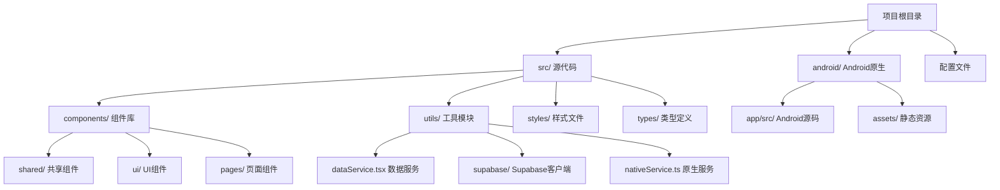

**图表来源**
- [src/App.tsx](file://src/App.tsx#L1-L30)
- [src/utils/dataService.tsx](file://src/utils/dataService.tsx#L1-L30)

### 文件命名规范

项目遵循清晰的文件命名约定：
- **组件文件**：采用 PascalCase 命名，如 `TodayPage.tsx`
- **工具函数**：采用 camelCase 命名，如 `nativeService.ts`
- **类型定义**：采用 PascalCase 命名，如 `Task.ts`
- **样式文件**：采用 kebab-case 命名，如 `globals.css`

### 模块化设计原则

- **单一职责**：每个模块专注于特定功能领域
- **松耦合**：组件间通过明确的接口进行通信
- **可复用性**：共享组件和工具函数可在多个页面中使用

**章节来源**
- [src/App.tsx](file://src/App.tsx#L1-L50)

## 核心组件详解

### App.tsx - 应用根组件

App.tsx 作为整个应用的根组件，承担着协调各个子组件和管理全局状态的重要职责：

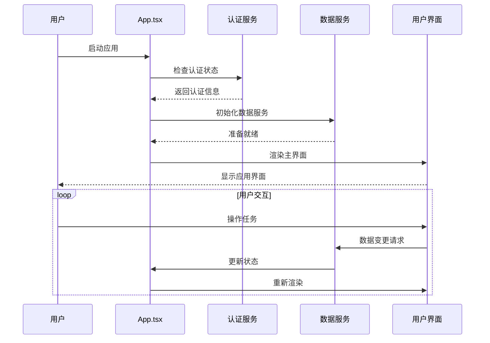

**图表来源**
- [src/App.tsx](file://src/App.tsx#L150-L250)

#### 核心功能实现

1. **认证状态管理**：监听 Supabase 认证状态变化，自动处理登录/登出流程
2. **数据初始化**：在应用启动时异步加载用户数据，确保流畅的用户体验
3. **状态同步**：维护用户、任务、列表等核心状态的统一管理
4. **错误处理**：提供完善的错误捕获和用户友好的错误提示

### TodayPage - 今日视图组件

TodayPage 是应用的核心功能组件，采用时间轴式布局展示用户的今日任务：

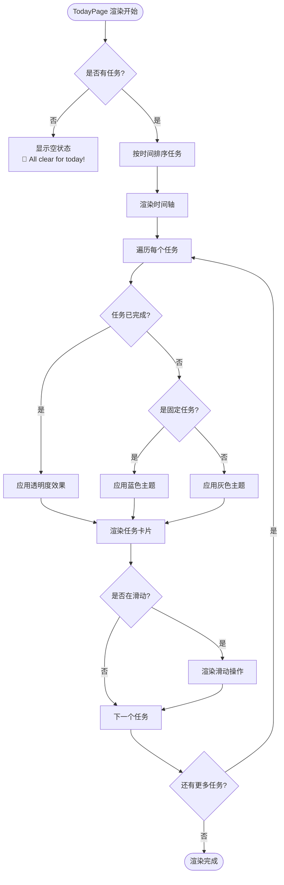

**图表来源**
- [src/components/TodayPage.tsx](file://src/components/TodayPage.tsx#L100-L200)

#### 交互特性

- **长按固定任务**：支持长按任务将其标记为固定任务
- **滑动操作**：左滑删除任务，右滑移除 MyDay 标记
- **智能推荐**：显示推荐任务和逾期任务的数量
- **视觉反馈**：提供丰富的动画和触觉反馈

### BottomNavbar - 底部导航栏

底部导航栏提供了五个核心页面的快速切换功能：

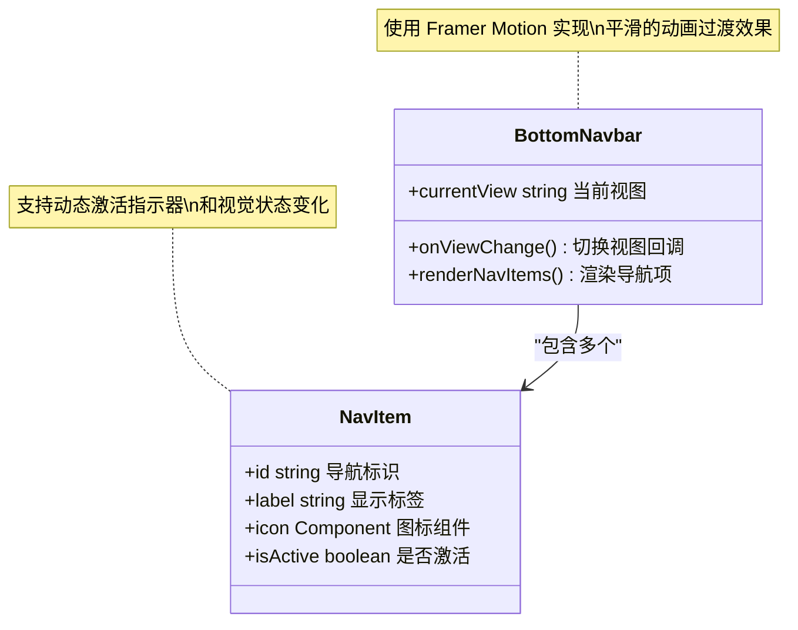

**图表来源**
- [src/components/BottomNavbar.tsx](file://src/components/BottomNavbar.tsx#L10-L30)

**章节来源**
- [src/App.tsx](file://src/App.tsx#L700-L800)
- [src/components/TodayPage.tsx](file://src/components/TodayPage.tsx#L1-L100)
- [src/components/BottomNavbar.tsx](file://src/components/BottomNavbar.tsx#L1-L59)

## 数据流与状态管理

### 数据流向架构

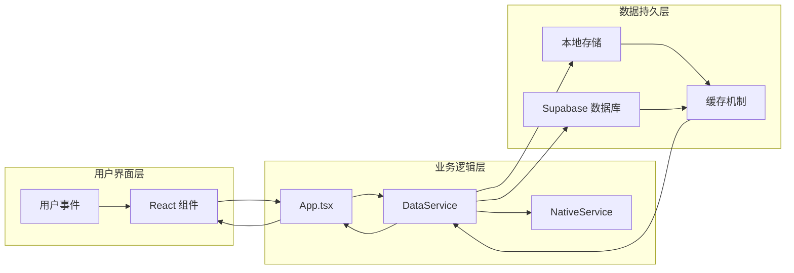

**图表来源**
- [src/utils/dataService.tsx](file://src/utils/dataService.tsx#L50-L100)
- [src/utils/nativeService.ts](file://src/utils/nativeService.ts#L1-L50)

### 状态管理模式

项目采用了分层的状态管理模式：

1. **全局状态**：由 App.tsx 管理用户认证状态、当前视图模式等
2. **组件状态**：各页面组件管理自身的局部状态
3. **数据服务状态**：DataService 管理任务数据的获取和同步
4. **本地缓存状态**：浏览器本地存储管理离线数据

### 数据同步机制

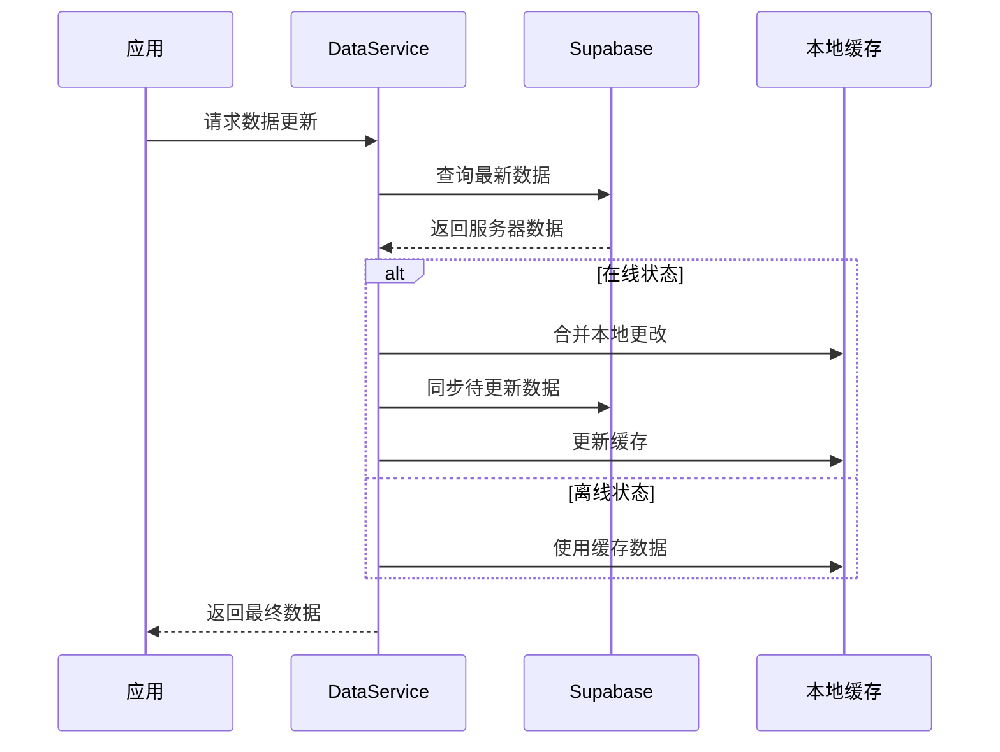

**图表来源**
- [src/utils/dataService.tsx](file://src/utils/dataService.tsx#L200-L300)

**章节来源**
- [src/utils/dataService.tsx](file://src/utils/dataService.tsx#L1-L100)

## 离线优先策略

### 离线数据处理

项目实现了完整的离线优先策略，确保用户在任何网络环境下都能获得完整的应用体验：

#### 离线任务创建

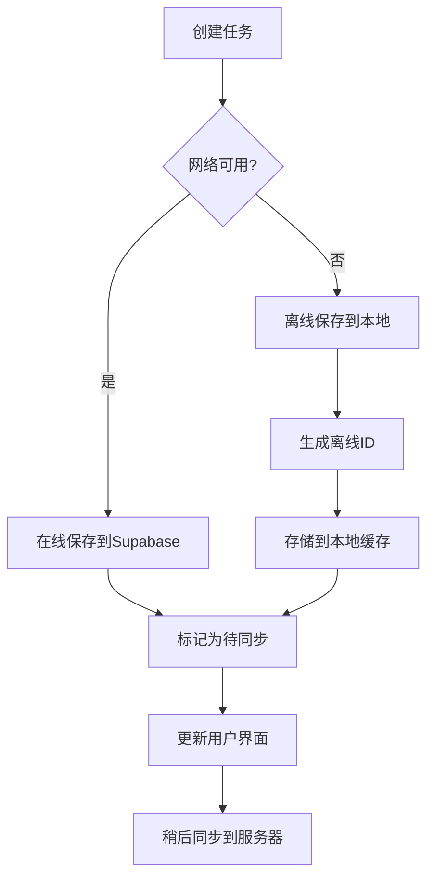

**图表来源**
- [src/utils/dataService.tsx](file://src/utils/dataService.tsx#L400-L500)

#### 智能数据合并

当网络恢复时，系统会智能地合并本地更改和服务器数据：

1. **冲突检测**：识别本地和服务器数据的差异
2. **优先级判断**：根据数据类型和用户行为确定优先级
3. **增量同步**：仅传输必要的数据变更
4. **一致性保证**：确保数据完整性不被破坏

### 缓存策略

- **智能缓存**：根据数据类型和访问频率制定不同的缓存策略
- **版本控制**：支持缓存数据的版本管理和自动清理
- **内存优化**：合理控制缓存大小，避免内存泄漏

**章节来源**
- [src/utils/dataService.tsx](file://src/utils/dataService.tsx#L300-L400)

## Capacitor原生桥接

### 原生功能集成

Capacitor 框架为项目提供了强大的原生功能桥接能力：

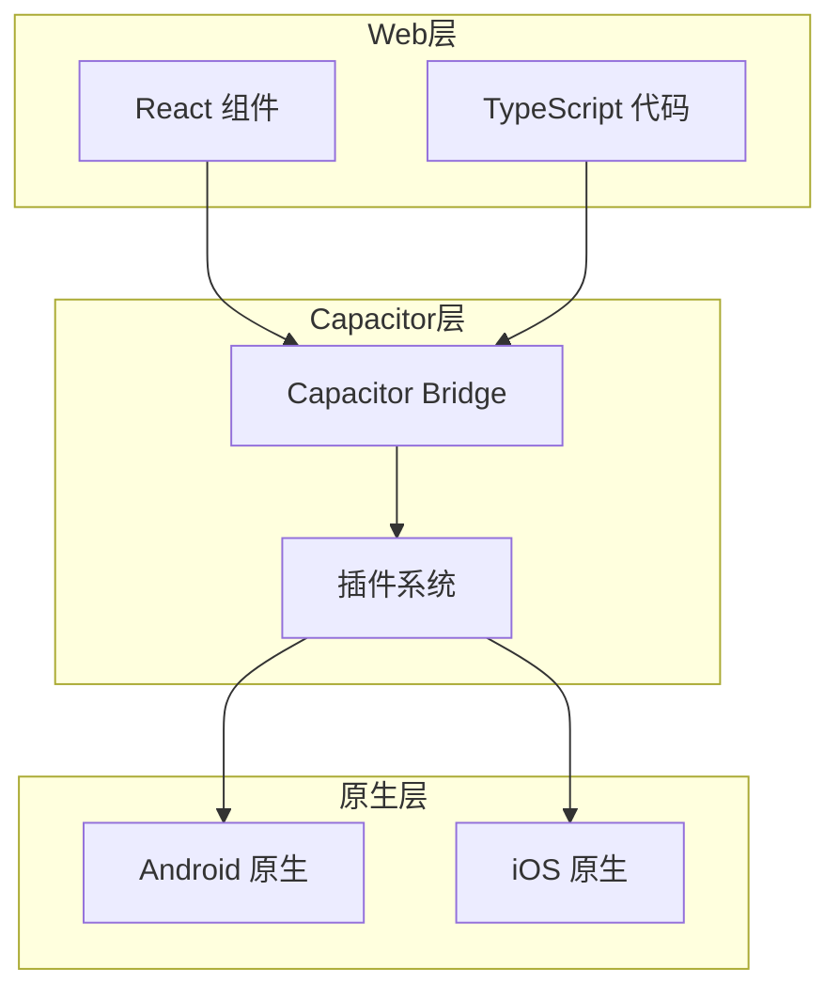

**图表来源**
- [src/utils/nativeService.ts](file://src/utils/nativeService.ts#L1-L30)

### 核心原生功能

#### 触觉反馈系统

NativeService 提供了多层次的触觉反馈机制：

- **轻触反馈**：用于简单的确认操作
- **中等反馈**：用于重要的状态变化
- **重触反馈**：用于关键的操作确认

#### 状态栏控制

- **动态样式**：根据应用状态自动调整状态栏颜色
- **隐藏显示**：支持动态控制状态栏的可见性
- **安全区域适配**：自动适配不同设备的安全区域

#### 启动屏幕管理

- **无缝过渡**：实现启动画面到应用界面的平滑过渡
- **自定义样式**：支持自定义启动屏幕的外观和行为
- **超时保护**：防止启动屏幕无限期显示

### 平台兼容性

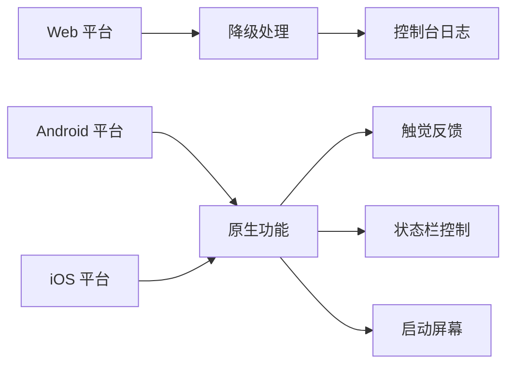

**图表来源**
- [src/utils/nativeService.ts](file://src/utils/nativeService.ts#L100-L150)

**章节来源**
- [src/utils/nativeService.ts](file://src/utils/nativeService.ts#L1-L180)

## 设计系统与UI组件

### 设计原则

项目遵循以下核心设计原则：

- **简洁现代**：去除不必要的装饰元素，专注于核心功能
- **响应式设计**：适配从手机到平板的各种屏幕尺寸
- **一致性**：保持整个应用的视觉和交互一致性
- **无障碍访问**：确保所有用户都能轻松使用应用

### UI组件库

项目构建了一个完整的 UI 组件库，基于 Radix UI 和 Tailwind CSS：

#### 核心组件分类

1. **基础组件**：按钮、输入框、标签等基础 UI 元素
2. **复合组件**：对话框、抽屉、导航菜单等复杂交互组件
3. **表单组件**：表单验证、日期选择器、进度条等
4. **布局组件**：网格系统、弹性盒子、滚动区域等

#### 动画系统

- **Framer Motion**：提供流畅的动画效果和物理模拟
- **自定义动画**：针对特定场景定制的动画效果
- **性能优化**：确保动画的流畅性和性能表现

### 主题系统

- **深色模式**：完整的深色主题支持
- **动态主题**：根据系统设置自动切换主题
- **色彩系统**：基于品牌色彩的完整色彩体系

**章节来源**
- [src/components/FloatingActionButton.tsx](file://src/components/FloatingActionButton.tsx#L1-L88)

## 性能优化与最佳实践

### 渲染性能优化

#### 虚拟化技术

对于大量任务列表，项目采用了虚拟化技术：
- **窗口化渲染**：仅渲染可见区域的任务项
- **懒加载**：按需加载任务详细信息
- **记忆化**：缓存计算结果，避免重复计算

#### 状态更新优化

- **批量更新**：将多个状态更新合并为单次更新
- **条件渲染**：仅在必要时重新渲染组件
- **防抖节流**：控制高频事件的处理频率

### 网络性能优化

#### 请求优化

- **请求合并**：将多个小请求合并为单个大请求
- **缓存策略**：智能缓存减少重复请求
- **超时控制**：设置合理的请求超时时间

#### 数据压缩

- **JSON 压缩**：减少传输数据的大小
- **增量同步**：仅传输变更的数据
- **数据去重**：避免传输重复的数据

### 内存管理

- **垃圾回收**：及时释放不再使用的对象
- **事件监听器**：正确管理事件监听器的生命周期
- **图片优化**：压缩和优化图片资源

## 总结与展望

### 项目优势

Focus_do_Figma2 项目展现了现代 Web 应用开发的最佳实践：

1. **技术先进性**：采用最新的前端技术和架构模式
2. **用户体验**：提供原生级别的应用体验
3. **可靠性**：完善的离线支持和错误处理机制
4. **可扩展性**：模块化的架构便于功能扩展

### 技术创新点

- **离线优先设计**：确保网络不稳定环境下的完整功能
- **Capacitor 原生桥接**：实现 Web 技术与原生功能的完美融合
- **智能数据同步**：平衡实时性和离线可用性的最佳方案
- **动画驱动设计**：通过动画提升用户体验和交互反馈

### 发展方向

1. **功能扩展**：增加更多任务管理功能和个性化选项
2. **性能优化**：进一步提升应用的性能和响应速度
3. **跨平台支持**：扩展到更多平台和设备
4. **AI 集成**：引入人工智能辅助任务规划和建议

### 架构决策分析

#### 为什么选择 Capacitor？

- **开发效率**：使用熟悉的 Web 技术栈
- **性能表现**：接近原生应用的性能水平
- **维护成本**：统一的代码库减少维护工作
- **生态支持**：丰富的插件生态系统

#### 为什么采用离线优先策略？

- **用户体验**：确保在任何网络环境下都能使用
- **可靠性**：减少网络问题对应用的影响
- **数据完整性**：智能合并机制保证数据一致性
- **性能优势**：减少网络请求提升响应速度

Focus_do_Figma2 项目不仅是一个功能完善的任务管理应用，更是现代 Web 应用开发理念的优秀实践案例。它展示了如何通过精心设计的技术架构和用户体验，创造出既美观又实用的跨平台应用。